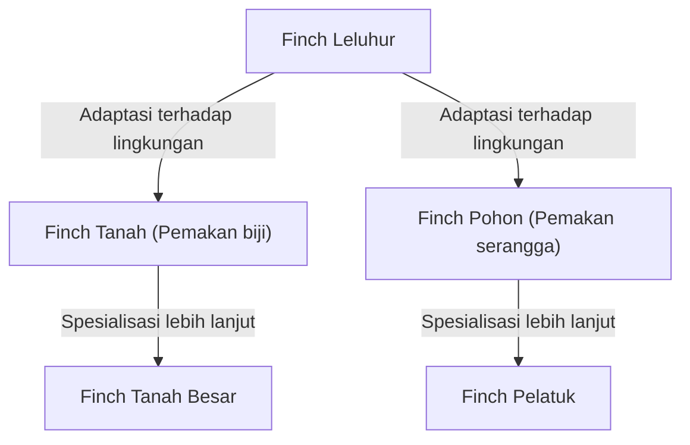

## Pendahuluan: Keanekaragaman Hayati dan Revolusi Darwin

Pada 24 November 1859, Charles Darwin menerbitkan karya bersejarahnya, "On the Origin of Species" (Asal Usul Spesies), yang secara fundamental mengubah tidak hanya biologi, tetapi juga pandangan dunia umat manusia. Bertentangan dengan paradigma kreasionisme pada masa itu bahwa "semua spesies diciptakan secara individu oleh Tuhan dan tidak dapat berubah," Darwin mengusulkan teori evolusi berdasarkan mekanisme "Seleksi Alam" (Natural Selection).

Artikel ini akan menjelaskan secara rinci bagaimana teori evolusi Darwin terbentuk, struktur logis dari teori seleksi alam yang menjadi intinya, posisinya dalam biologi modern, serta dampaknya terhadap masyarakat.

## 1. Latar Belakang Sejarah: Pelayaran HMS Beagle dan Inspirasi

Antara tahun 1831 hingga 1836, Charles Darwin berlayar mengelilingi dunia sebagai naturalis di kapal survei Angkatan Laut Inggris, HMS Beagle. Pelayaran ini, yang meliputi survei pesisir benua Amerika Selatan dan perjalanan ke pulau-pulau di Samudra Pasifik, memberikan pengaruh yang menentukan pada pemikirannya.

### Pengamatan di Kepulauan Galapagos

Inspirasi terbesar diperolehnya dari pengamatan di Kepulauan Galapagos, yang terletak di lepas pantai Ekuador, Amerika Selatan. Kepulauan terpencil ini merupakan rumah bagi banyak flora dan fauna yang telah mengalami evolusi unik.

"Burung Finch Galapagos" (burung kecil yang diklasifikasikan dalam keluarga Thraupidae) yang terkenal memiliki bentuk paruh yang berbeda dari satu pulau ke pulau lainnya. Paruh mereka telah berspesialisasi sesuai dengan makanannya, seperti burung yang memakan kaktus sebagai makanan utama, burung yang memangsa serangga, dan burung yang menghancurkan dan memakan biji-bijian keras.

Darwin percaya bahwa burung-burung finch ini berdiferensiasi dari nenek moyang yang sama yang bermigrasi dari daratan Amerika Selatan, sebagai hasil dari adaptasi terhadap lingkungan masing-masing pulau. Hal ini kemudian mengarah pada konsep "radiasi adaptif".

## 2. Struktur Logis Teori Seleksi Alam

Inti dari teori evolusi Darwin terletak pada penjelasan mekanismenya, yaitu "bagaimana evolusi terjadi". Itulah "Teori Seleksi Alam". Teori ini terutama terdiri dari fakta pengamatan dan inferensi berikut.

### Variasi dan Pewarisan

Bahkan dalam spesies yang sama, terdapat perbedaan morfologi dan sifat antar individu (variasi individu). Kemudian, sebagian dari variasi tersebut diwariskan dari induk kepada keturunannya. Pada saat itu, Darwin tidak mengetahui mekanisme pewarisan (DNA dan gen), tetapi ia menyadari fakta ini sebagai aturan empiris.

### Perjuangan untuk Bertahan Hidup dan Kelulusan yang Paling Sesuai

Makhluk hidup biasanya berusaha menghasilkan lebih banyak keturunan daripada yang dapat didukung oleh lingkungan (reproduksi berlebihan). Namun, karena sumber daya seperti makanan dan habitat terbatas, terjadilah perjuangan untuk bertahan hidup antar individu.

Dalam persaingan ini, individu yang memiliki sifat (variasi) yang lebih menguntungkan dalam lingkungan tertentu cenderung lebih mudah bertahan hidup dan menghasilkan lebih banyak keturunan. Inilah yang disebut "kelulusan yang paling sesuai" (survival of the fittest).

### Perubahan Lintas Generasi

Ketika sifat yang menguntungkan diwariskan melintasi generasi, proporsi individu dengan sifat tersebut dalam suatu populasi secara bertahap meningkat. Darwin percaya bahwa dengan proses ini diulang selama bertahun-tahun, seluruh spesies berubah menuju arah adaptasi dengan lingkungan, dan pada akhirnya spesies baru pun terbentuk.

## 3. Kejutan yang Dibawa oleh "Asal Usul Spesies"

Karya Darwin "Asal Usul Spesies" memberikan kejutan yang tak terukur bagi masyarakat pada saat itu.

### Pergeseran Paradigma Ilmiah

Biologi sebelum itu berpusat pada taksonomi dan berasumsi pada ketidakberubahan spesies. Namun, teori evolusi Darwin menyajikan konsep "Pohon Kehidupan", di mana semua makhluk hidup bercabang dan berevolusi dari nenek moyang yang sama, mengubah biologi menjadi ilmu dinamis dengan perspektif sejarah.

### Dampak pada Agama dan Filsafat

Klaim bahwa "manusia juga merupakan produk evolusi seperti hewan lainnya" bertentangan secara langsung dengan pandangan manusia dalam agama Kristen (doktrin bahwa manusia diciptakan secara khusus menyerupai Tuhan). Karena itu, teori ini mendapat penolakan keras dari kalangan agama, dan perdebatan seputar penerimaan teori evolusi masih berlanjut di beberapa wilayah hingga hari ini.

Di sisi lain, teori ini juga memengaruhi bidang filsafat dan ilmu sosial, melahirkan pemikiran seperti Darwinisme Sosial, yang mencoba menerapkan konsep seleksi alam pada persaingan dan ketidaksetaraan dalam masyarakat manusia (ini berbeda dari niat Darwin sendiri, dan kemudian menerima banyak kritik).

## 4. Perkembangan Menuju Biologi Evolusioner Modern (Neo-Darwinisme)

Mekanisme pewarisan yang tidak diketahui pada zaman Darwin menjadi jelas memasuki abad ke-20 dengan penemuan kembali hukum pewarisan Gregor Mendel dan elusidasi struktur DNA.

### Integrasi Mutasi dan Seleksi Alam

Dalam biologi evolusioner modern (Sintesis Modern, Neo-Darwinisme), proses evolusi dijelaskan sebagai berikut:

1. **Mutasi**: Variasi genetik baru muncul secara kebetulan karena kesalahan replikasi DNA atau lainnya.
2. **Seleksi Alam**: Variasi menguntungkan yang beradaptasi dengan lingkungan berperan menguntungkan dalam kelangsungan hidup dan reproduksi, lalu menyebar di dalam populasi.
3. **Hanyutan Genetik**: Frekuensi gen berfluktuasi karena faktor kebetulan (terutama terlihat pada populasi kecil).
4. **Isolasi**: Pertukaran genetik antar populasi terputus akibat isolasi geografis dan reproduktif, yang mendorong spesiasi.

Dengan cara ini, teori seleksi alam Darwin digabungkan dengan pengetahuan genetika dan biologi molekuler modern, menjadi teori ilmiah yang lebih kuat dan mendasari ilmu kehidupan modern.

## Kesimpulan: Apa yang Diajarkan Teori Evolusi kepada Kita

Teori evolusi Darwin bukan sekadar teori akademis di masa lalu. Bahkan di era modern, perspektif evolusi sangat diperlukan dalam berbagai bidang, seperti munculnya bakteri yang resistan terhadap antibiotik, mutasi virus, pemuliaan selektif tanaman pertanian, dan pemahaman tentang mekanisme proliferasi sel kanker.

"Bukan yang paling kuat yang akan bertahan hidup, bukan pula yang paling cerdas. Yang bertahan hidup adalah yang paling mampu beradaptasi terhadap perubahan" —— Kutipan ini konon bukan perkataan Darwin sendiri, tetapi dikenal luas sebagai ungkapan yang dengan sempurna menangkap esensi teori seleksi alam.

Sejarah kehidupan adalah sejarah adaptasi terhadap perubahan lingkungan yang terus-menerus. Perspektif evolusi yang dirintis Darwin terus menjadi salah satu lensa terkuat bagi kita untuk memahami kompleksitas dan keanekaragaman hayati.
