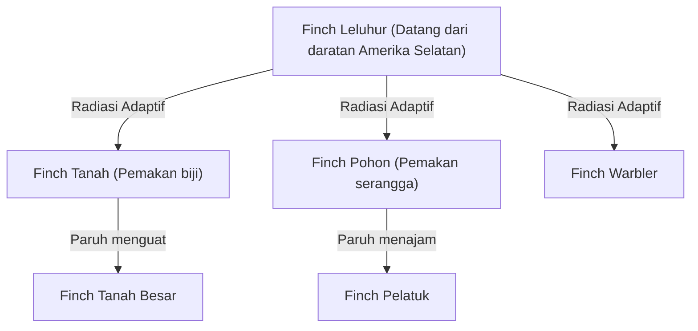
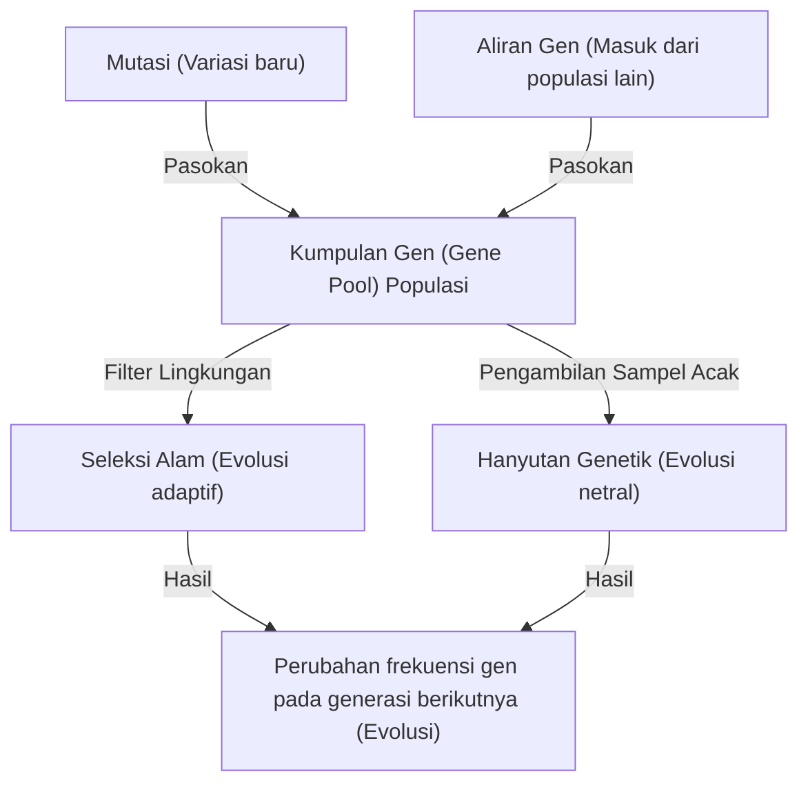

## Pendahuluan: Keanekaragaman Hayati dan Revolusi Darwin

Buku "Asal Usul Spesies" (On the Origin of Species) yang diterbitkan oleh Charles Darwin pada tanggal 24 November 1859, menjadi karya bersejarah yang mengubah secara mendasar tidak hanya biologi, tetapi juga pandangan dunia umat manusia itu sendiri. Melawan paradigma kreasionis pada saat itu bahwa "semua spesies diciptakan secara individu oleh Tuhan dan tidak dapat diubah", Darwin mengusulkan teori evolusi berdasarkan mekanisme "Seleksi Alam" (Natural Selection).

Dalam artikel ini, kita akan menggali secara mendalam bagaimana teori evolusi Darwin terbentuk, struktur logis dari teori seleksi alam yang merupakan intinya, dukungan matematis dari genetika populasi modern (Neo-Darwinisme), dan implementasi algoritma genetika sebagai analogi dari proses evolusi menggunakan Python.

## 1. Latar Belakang Sejarah: Pelayaran Beagle dan Inspirasi

Charles Darwin berlayar mengelilingi dunia dari tahun 1831 hingga 1836 sebagai naturalis di atas kapal survei Angkatan Laut Inggris, HMS Beagle. Pengamatannya di Kepulauan Galapagos, khususnya, memiliki pengaruh yang menentukan pada pemikirannya.

### Keanekaragaman Burung Finch Galapagos

Di Kepulauan Galapagos, hidup burung finch (sekarang diklasifikasikan dalam keluarga Thraupidae) yang memiliki bentuk paruh yang berbeda di setiap pulau. Paruh mereka telah terspesialisasi berdasarkan pola makannya, seperti memakan kaktus, serangga, atau menghancurkan biji-bijian.



Darwin percaya bahwa burung-burung finch ini berdiferensiasi dari nenek moyang yang sama sebagai hasil adaptasi terhadap lingkungan di masing-masing pulau.

## 2. Struktur Logis dari Teori Seleksi Alam

Teori seleksi alam Darwin terdiri dari 3 fakta observasi dan 2 deduksi berikut:

1. **Reproduksi Berlebihan (Overproduction)**: Organisme menghasilkan lebih banyak keturunan daripada yang dapat didukung oleh lingkungan.
2. **Variasi Individu (Variation)**: Bahkan dalam spesies yang sama, terdapat perbedaan (variasi) dalam bentuk dan sifat antar individu.
3. **Pewarisan (Inheritance)**: Beberapa dari variasi ini diwariskan dari orang tua kepada anak-anaknya.

Mekanisme yang diturunkan dari hal ini adalah **Seleksi Alam (Natural Selection)**. Dalam perjuangan untuk bertahan hidup (kompetisi), individu dengan sifat yang lebih beradaptasi dengan lingkungan akan bertahan dan meninggalkan lebih banyak keturunan. Seiring dengan terulangnya proses ini lintas generasi, seluruh spesies akan berubah ke arah adaptasi dengan lingkungan.

### Definisi Matematis dari Kebugaran (Fitness)

Dalam genetika populasi modern, seleksi alam diformulasikan secara matematis dengan konsep "Kebugaran (Fitness)". Kebugaran $W$ didefinisikan sebagai jumlah keturunan relatif yang ditinggalkan oleh suatu genotipe ke generasi berikutnya.

$$ \Delta p = \frac{p q [p(W_{11} - W_{12}) + q(W_{12} - W_{22})]}{\bar{W}} $$

Di sini,
- $p, q$ adalah frekuensi alel $A, a$
- $W_{11}, W_{12}, W_{22}$ adalah kebugaran masing-masing genotipe ($AA, Aa, aa$)
- $\bar{W}$ adalah kebugaran rata-rata dari populasi ($\bar{W} = p^2 W_{11} + 2pq W_{12} + q^2 W_{22}$)

Persamaan ini menunjukkan bahwa frekuensi gen berubah ke arah peningkatan kebugaran rata-rata, yang secara matematis membuktikan teori seleksi alam Darwin.

## 3. Perkembangan ke Sintesis Modern (Neo-Darwinisme)

Pada masa Darwin, "mekanisme pewarisan sifat" tentang bagaimana variasi terjadi dan diwariskan masih belum diketahui (Hukum Mendel baru ditemukan kembali pada tahun 1900).

Dari tahun 1930-an hingga 1940-an, teori seleksi alam Darwin berpadu dengan genetika Mendel, genetika populasi, paleontologi, dan lain-lain, sehingga membentuk "Sintesis Modern (Modern Synthesis)". Ronald Fisher, J.B.S. Haldane, dan Sewall Wright meletakkan dasar-dasar matematisnya.

### 4 Faktor Pendorong Evolusi

Dalam biologi modern, ada 4 faktor penyebab yang memicu evolusi (perubahan frekuensi alel dalam suatu populasi):

1. **Seleksi Alam (Natural Selection)**
2. **Mutasi (Mutation)**: Pasokan alel baru akibat kesalahan replikasi DNA, dll.
3. **Hanyutan Genetik (Genetic Drift)**: Fluktuasi acak dalam frekuensi gen pada populasi terbatas.
4. **Aliran Gen (Gene Flow)**: Percampuran gen akibat perpindahan individu antar populasi.



## 4. Mengalami Seleksi Alam Melalui Pemrograman: Algoritma Genetika

Mekanisme evolusi diaplikasikan dalam teknik sebagai metode perhitungan "Algoritma Genetika (Genetic Algorithm, GA)" untuk memecahkan masalah optimasi. Di sini, mari kita terapkan simulasi sederhana menggunakan Python untuk menghasilkan string "DARWIN" melalui evolusi.

```python
import random
import string

TARGET = "DARWIN"
POP_SIZE = 100
MUTATION_RATE = 0.05

def random_string(length):
    return ''.join(random.choice(string.ascii_uppercase) for _ in range(length))

def calculate_fitness(individual):
    # Jumlah karakter yang cocok dengan string target ditetapkan sebagai kebugaran (fitness)
    return sum(1 for a, b in zip(individual, TARGET) if a == b)

def crossover(parent1, parent2):
    mid = len(TARGET) // 2
    return parent1[:mid] + parent2[mid:]

def mutate(individual):
    res = list(individual)
    for i in range(len(res)):
        if random.random() < MUTATION_RATE:
            res[i] = random.choice(string.ascii_uppercase)
    return "".join(res)

# Membangkitkan populasi awal
population = [random_string(len(TARGET)) for _ in range(POP_SIZE)]

generation = 0
while True:
    population.sort(key=calculate_fitness, reverse=True)
    best = population[0]
    
    print(f"Generation {generation}: {best} (Fitness: {calculate_fitness(best)})")
    
    if best == TARGET:
        print("Evolution complete!")
        break
        
    # Seleksi elit dan pembentukan generasi berikutnya
    next_gen = population[:10]  # Mempertahankan 10 teratas dengan kebugaran tinggi apa adanya
    
    while len(next_gen) < POP_SIZE:
        # Memilih orang tua secara acak lalu melakukan persilangan dan mutasi
        p1, p2 = random.choices(population[:50], k=2)
        child = mutate(crossover(p1, p2))
        next_gen.append(child)
        
    population = next_gen
    generation += 1
```

Kode ini meniru proses yang dimulai dari populasi string acak, individu yang lebih dekat ke target "DARWIN" (kebugaran lebih tinggi) dipilih, dan melalui persilangan dan mutasi untuk membentuk generasi berikutnya. Anda akan dapat mengonfirmasi bahwa string target "berevolusi" dan muncul dalam beberapa generasi.

## 5. Kesimpulan dan Evolusi Saat Ini

Buku "Asal Usul Spesies" karya Darwin menunjukkan bahwa organisme bukanlah entitas yang statis, melainkan berada dalam sejarah yang dinamis dan berkesinambungan. Saat ini, analisis urutan pasangan basa DNA (filogeni molekuler) telah membuktikan bahwa semua bentuk kehidupan bercabang dari satu nenek moyang yang sama (LUCA: Last Universal Common Ancestor).

Teori evolusi bukanlah sekadar "hipotesis", melainkan sebuah paradigma besar yang menyatukan seluruh biologi modern. Seperti yang dinyatakan oleh ahli genetika evolusi Theodosius Dobzhansky, "Tidak ada satupun dalam biologi yang masuk akal kecuali jika dilihat dari sudut pandang evolusi (Nothing in Biology Makes Sense Except in the Light of Evolution)."
