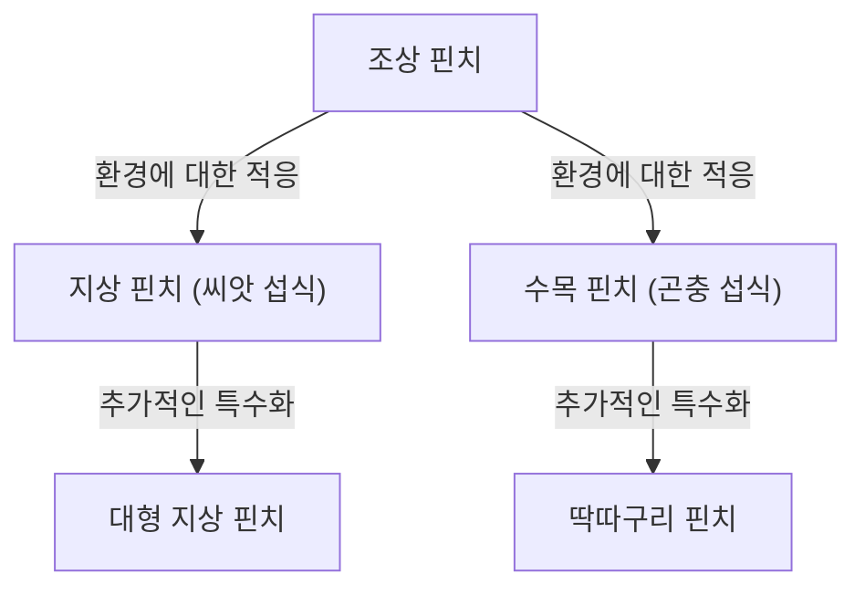

## 서론: 생명의 다양성과 다윈의 혁명

1859년 11월 24일, 찰스 다윈이 발표한 『종의 기원 (On the Origin of Species)』은 생물학뿐만 아니라 인류의 세계관 자체를 근본부터 뒤집은 역사적인 저작이 되었습니다. 그때까지의 "모든 종은 신에 의해 개별적으로 창조되었으며 불변한다"는 창조론적 패러다임에 맞서, 다윈은 "자연선택 (Natural Selection)"이라는 메커니즘에 기반한 진화론을 제창했습니다.

본 기사에서는 다윈의 진화론이 어떻게 형성되었는지, 그 핵심인 자연선택설의 논리 구조, 현대 생물학에서의 위치, 그리고 사회에 미친 영향까지 상세히 해설합니다.

## 1. 역사적 배경: 비글호의 항해와 착상

찰스 다윈은 1831년부터 1836년까지 영국 해군의 측량선 비글호에 박물학자로서 승선하여 세계 일주를 했습니다. 남미 대륙 연안 조사를 비롯해 태평양의 섬들을 순회한 이 항해는 그의 사고에 결정적인 영향을 미쳤습니다.

### 갈라파고스 제도에서의 관찰

특히 큰 착상을 얻은 곳이 남미 에콰도르 앞바다에 위치한 갈라파고스 제도에서의 관찰입니다. 이 고립된 섬들에는 독자적으로 진화한 동식물이 다수 서식하고 있었습니다.

유명한 "갈라파고스 핀치(풍금조과에 분류되는 작은 새)"는 섬마다 다른 모양의 부리를 가지고 있었습니다. 선인장을 주식으로 하는 것, 곤충을 포식하는 것, 단단한 씨앗을 부수어 먹는 것 등 식성에 따라 부리가 특수화되어 있었던 것입니다.

다윈은 이 핀치들이 남미 대륙에서 건너온 공통 조상으로부터 분화하여, 각각의 섬 환경에 적응한 결과라고 생각했습니다. 이것이 훗날 "적응 방산"이라는 개념으로 이어집니다.

## 2. 자연선택설의 논리 구조

다윈 진화론의 핵심은 "어떻게 진화가 일어나는가"라는 메커니즘을 설명한 점에 있습니다. 그것이 "자연선택설"입니다. 이 이론은 주로 다음의 관찰 사실과 추론으로 이루어져 있습니다.

### 변이와 유전

동일한 종이라 할지라도 개체 간에는 형태나 성질의 차이(개체 변이)가 존재합니다. 그리고 그러한 변이 중 일부는 부모에서 자식으로 유전됩니다. 당시의 다윈은 유전의 메커니즘(DNA나 유전자)에 대해서는 알지 못했지만, 경험 법칙으로서 이 사실을 인식하고 있었습니다.

### 생존 경쟁과 적자생존

생물은 통상 환경이 감당할 수 있는 것 이상의 수의 자손을 남기려 합니다(과잉 번식). 그러나 식량이나 서식지 등의 자원에는 한계가 있기 때문에 개체 간에 생존 경쟁이 일어납니다.

이 경쟁 속에서 특정 환경 하에 더 유리한 성질(변이)을 가진 개체가 살아남기 쉽고, 더 많은 자손을 남길 수 있습니다. 이것이 "적자생존"입니다.

### 세대를 뛰어넘는 변화

유리한 성질이 세대를 넘어 이어짐으로써, 그 성질을 가진 개체의 비율이 집단 내에서 서서히 증가해 갑니다. 오랜 세월에 걸쳐 이 과정이 반복됨으로써 종 전체가 환경에 적응하는 방향으로 변화하고, 최종적으로는 새로운 종이 형성된다고 생각했습니다.

## 3. "종의 기원"이 가져온 충격

다윈의 『종의 기원』은 당시 사회에 헤아릴 수 없는 충격을 안겨주었습니다.

### 과학적 패러다임 전환

그때까지의 생물학은 분류학을 중심으로 하였으며, 종의 불변성을 전제로 하고 있었습니다. 그러나 다윈의 진화론은 모든 생물이 공통 조상으로부터 가지치기하여 진화했다는 "생명의 나무" 개념을 제시하며, 생물학을 역사적 관점을 가진 동적 과학으로 변모시켰습니다.

### 종교와 철학에 미친 영향

"인간 또한 다른 동물과 마찬가지로 진화의 산물이다"라는 주장은 기독교적인 인간관(인간은 신을 닮아 특별하게 창조되었다는 교리)과 정면으로 충돌했습니다. 이 때문에 종교계로부터 거센 반발을 샀으며, 진화론 수용을 둘러싼 논쟁은 오늘날에도 일부 지역에서 계속되고 있습니다.

한편으로 철학이나 사회과학 분야에도 영향을 미쳐, 사회다윈주의처럼 자연선택의 개념을 인간 사회의 경쟁이나 불평등에 적용하려는 사상도 생겨났습니다(이는 다윈 자신의 의도와는 다른 것이었으며, 훗날 많은 비판을 받게 됩니다).

## 4. 현대 진화생물학으로의 발전(신다윈주의)

다윈의 시대에는 불명확했던 유전 메커니즘은 20세기에 들어서며 그레고어 멘델의 유전 법칙의 재발견과 DNA 구조 해명에 의해 밝혀졌습니다.

### 돌연변이와 자연선택의 통합

현대의 진화생물학(종합설, 신다윈주의)에서는 진화의 과정을 다음과 같이 설명합니다.

1. **돌연변이**: DNA 복제 실수 등에 의해 우연히 새로운 유전적 변이가 발생한다.
2. **자연선택**: 환경에 적응한 유리한 변이가 생존과 번식에 유리하게 작용하여 집단 내에 퍼진다.
3. **유전적 부동**: 우연한 요인에 의해 유전자 빈도가 변동한다(특히 작은 집단에서 두드러짐).
4. **격리**: 지리적·생식적인 격리에 의해 집단 간의 유전자 교류가 단절되어 종 분화가 촉진된다.

이처럼 다윈의 자연선택설은 현대의 유전학 및 분자생물학의 지식과 융합하여, 보다 확고한 과학적 이론으로서 현대 생명과학의 기반이 되고 있습니다.

## 결론: 진화론이 가르쳐 주는 것

다윈의 진화론은 단순한 과거의 학설이 아닙니다. 현대에 있어서도 항생제에 내성을 가지는 세균의 출현이나 바이러스의 변이, 농작물의 품종 개량, 나아가 암세포의 증식 메커니즘 이해 등 다양한 분야에서 진화의 관점이 필수불가결해지고 있습니다.

"가장 강한 자가 살아남는 것이 아니라, 가장 똑똑한 자가 살아남는 것도 아니다. 유일하게 살아남는 것은 변화할 수 있는 자이다" ——이 말은 다윈 자신의 발언은 아니라고 여겨지지만, 자연선택설의 본질을 훌륭하게 찌른 표현으로서 널리 알려져 있습니다.

생명의 역사는 끊임없는 환경 변화에 대한 적응의 역사입니다. 다윈이 개척한 진화의 관점은 우리가 생명의 다양성과 복잡성을 이해하기 위한, 가장 강력한 렌즈 중 하나로 계속 자리 잡고 있습니다.
