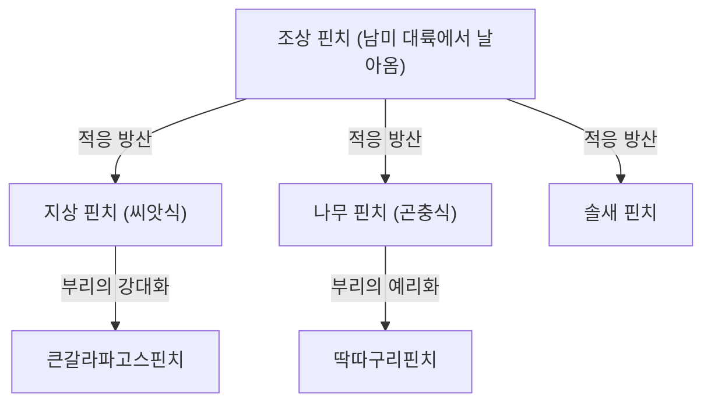
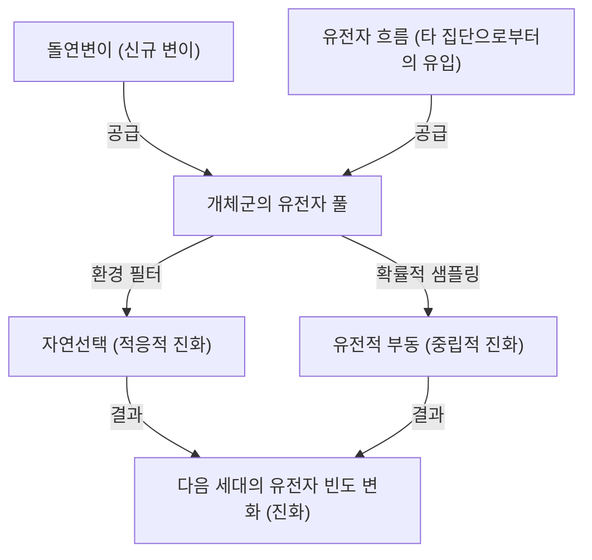

## 서론: 생명의 다양성과 다윈의 혁명

1859년 11월 24일, 찰스 다윈이 발표한 『종의 기원 (On the Origin of Species)』은 생물학뿐만 아니라 인류의 세계관 자체를 근본부터 뒤집은 역사적인 저작이 되었습니다. 이전까지의 "모든 종은 신에 의해 개별적으로 창조되었으며 불변하다"는 창조론적 패러다임에 맞서, 다윈은 "자연선택 (Natural Selection)"이라는 메커니즘에 기반한 진화론을 제창했습니다.

본 기사에서는 다윈의 진화론이 어떻게 형성되었는지, 그 핵심인 자연선택설의 논리 구조, 현대 집단유전학(신다윈주의)에 의한 수학적 뒷받침, 그리고 Python을 사용한 진화 프로세스의 비유로서의 유전 알고리즘 구현까지 아주 상세하게 파헤쳐 보겠습니다.

## 1. 역사적 배경: 비글호의 항해와 착상

찰스 다윈은 1831년부터 1836년까지 영국 해군의 측량선 비글호에 박물학자로 승선하여 세계 일주를 했습니다. 특히 갈라파고스 제도에서의 관찰은 그의 사고에 결정적인 영향을 미쳤습니다.

### 갈라파고스 핀치의 다양성

갈라파고스 제도에는 섬마다 다른 모양의 부리를 가진 핀치(현재는 풍금조과로 분류됨)가 서식하고 있었습니다. 선인장을 먹는 것, 곤충을 먹는 것, 씨앗을 부수는 것 등 식성에 따라 부리가 특수화되어 있었던 것입니다.



다윈은 이 핀치들이 공통 조상으로부터 분화하여 각각의 섬 환경에 적응한 결과라고 생각했습니다.

## 2. 자연선택설의 논리 구조

다윈의 자연선택설은 다음의 3가지 관찰 사실과 2가지 추론으로 이루어져 있습니다.

1. **과잉 번식 (Overproduction)**: 생물은 환경이 지탱할 수 있는 것보다 더 많은 수의 자손을 남긴다.
2. **개체 변이 (Variation)**: 동일한 종이라 하더라도 개체 간에 형태나 성질의 차이(변이)가 존재한다.
3. **유전 (Inheritance)**: 이러한 변이의 일부는 부모에서 자식으로 유전된다.

여기서 도출되는 메커니즘이 **자연선택 (Natural Selection)**입니다. 생존 경쟁(투쟁) 속에서 환경에 더 잘 적응한 형질을 가진 개체가 살아남아 더 많은 자손을 남깁니다. 이것이 세대를 거쳐 반복됨으로써 종 전체가 환경에 적응하는 방향으로 변화해 나갑니다.

### 적합도의 수학적 정의

현대의 집단유전학에서 자연선택은 "적합도 (Fitness)"라는 개념으로 수식화됩니다. 적합도 $W$는 어떤 유전자형이 다음 세대에 남기는 자손의 상대적인 수로 정의됩니다.

$$ \Delta p = \frac{p q [p(W_{11} - W_{12}) + q(W_{12} - W_{22})]}{\bar{W}} $$

여기서,
- $p, q$는 대립유전자 $A, a$의 빈도
- $W_{11}, W_{12}, W_{22}$는 각 유전자형 ($AA, Aa, aa$)의 적합도
- $\bar{W}$는 집단의 평균 적합도 ($\bar{W} = p^2 W_{11} + 2pq W_{12} + q^2 W_{22}$)

이 방정식은 평균 적합도를 높이는 방향으로 유전자 빈도가 변화한다는 것을 보여주며, 다윈의 자연선택을 수학적으로 증명하는 것입니다.

## 3. 종합설(신다윈주의)로의 발전

다윈의 시대에는 변이가 어떻게 발생하고, 어떻게 유전되는지라는 '유전 메커니즘'이 불분명했습니다(멘델의 법칙이 재발견된 것은 1900년).

1930년대부터 40년대에 걸쳐 다윈의 자연선택설과 멘델의 유전학, 나아가 집단유전학, 고생물학 등이 융합되어 "종합설 (Modern Synthesis)"이 확립되었습니다. 로널드 피셔, J.B.S. 홀데인, 슈얼 라이트 등이 수학적 기초를 다졌습니다.

### 진화를 구동하는 4가지 요인

현대 생물학에서는 진화(집단 내 대립유전자 빈도의 변화)를 일으키는 요인으로 다음 4가지를 꼽습니다.

1. **자연선택 (Natural Selection)**
2. **돌연변이 (Mutation)**: DNA 복제 실수 등에 의한 새로운 대립유전자의 공급.
3. **유전적 부동 (Genetic Drift)**: 유한 모집단에서 우연에 의한 유전자 빈도의 변동.
4. **유전자 흐름 (Gene Flow)**: 집단 간 개체의 이동에 의한 유전자의 교잡.



## 4. 프로그래밍으로 체험하는 자연선택: 유전 알고리즘

진화의 메커니즘은 최적화 문제를 풀기 위한 계산 기법인 "유전 알고리즘 (Genetic Algorithm, GA)"으로 공학에 응용되고 있습니다. 여기서는 Python을 사용하여 문자열 "DARWIN"을 진화를 통해 생성하는 간단한 시뮬레이션을 구현해 보겠습니다.

```python
import random
import string

TARGET = "DARWIN"
POP_SIZE = 100
MUTATION_RATE = 0.05

def random_string(length):
    return ''.join(random.choice(string.ascii_uppercase) for _ in range(length))

def calculate_fitness(individual):
    # 목표 문자열과 일치하는 문자 수를 적합도로 함
    return sum(1 for a, b in zip(individual, TARGET) if a == b)

def crossover(parent1, parent2):
    mid = len(TARGET) // 2
    return parent1[:mid] + parent2[mid:]

def mutate(individual):
    res = list(individual)
    for i in range(len(res)):
        if random.random() < MUTATION_RATE:
            res[i] = random.choice(string.ascii_uppercase)
    return "".join(res)

# 초기 집단 생성
population = [random_string(len(TARGET)) for _ in range(POP_SIZE)]

generation = 0
while True:
    population.sort(key=calculate_fitness, reverse=True)
    best = population[0]
    
    print(f"Generation {generation}: {best} (Fitness: {calculate_fitness(best)})")
    
    if best == TARGET:
        print("Evolution complete!")
        break
        
    # 엘리트 선택과 다음 세대 생성
    next_gen = population[:10]  # 적합도가 높은 톱 10을 그대로 남김
    
    while len(next_gen) < POP_SIZE:
        # 무작위로 부모를 선택하여 교차와 돌연변이를 수행
        p1, p2 = random.choices(population[:50], k=2)
        child = mutate(crossover(p1, p2))
        next_gen.append(child)
        
    population = next_gen
    generation += 1
```

이 코드는 무작위 문자열 집단에서 시작하여, 타겟 "DARWIN"에 가까운(적합도가 높은) 개체가 선택되고, 교차와 돌연변이를 거쳐 다음 세대를 형성하는 과정을 모방하고 있습니다. 몇 세대 만에 타겟 문자열이 "진화"하여 나타나는 것을 확인할 수 있을 것입니다.

## 5. 결론과 진화론의 현재

다윈의 『종의 기원』은 생물이 정적인 존재가 아니라, 역동적이고 연속적인 역사 속에 있음을 보여주었습니다. 오늘날에는 DNA 염기서열 분석(분자계통학)을 통해 모든 생명이 공통 조상(LUCA: Last Universal Common Ancestor)으로부터 분기해 왔음이 증명되었습니다.

진화론은 단순한 "가설"이 아니라, 현대 생물학의 모든 것을 통합하는 거대한 패러다임입니다. 진화유전학자 테오도시우스 도브잔스키가 말했듯이, "진화의 빛을 비추지 않고서는 생물학의 그 무엇도 의미가 없는 (Nothing in Biology Makes Sense Except in the Light of Evolution)" 것입니다.
