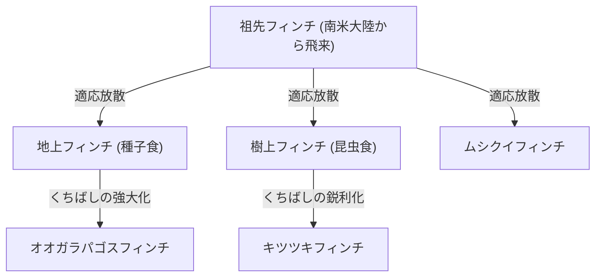
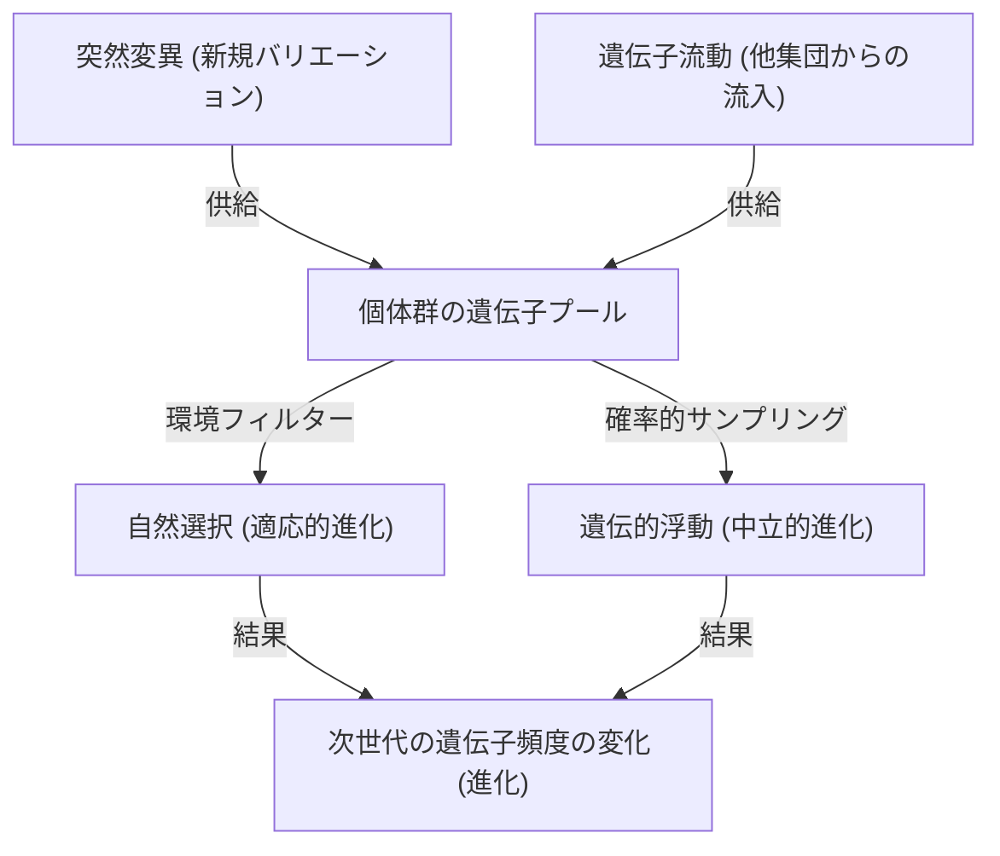

## 序論：生命の多様性とダーウィンの革命

1859年11月24日、チャールズ・ダーウィンが発表した『種の起源 (On the Origin of Species)』は、生物学のみならず、人類の世界観そのものを根本から覆す歴史的な著作となりました。それまでの「すべての種は神によって個別に創造され、不変である」という創造論的パラダイムに対し、ダーウィンは「自然選択 (Natural Selection)」というメカニズムに基づく進化論を提唱しました。

本記事では、ダーウィンの進化論がどのように形成されたのか、その核心である自然選択説の論理構造、現代の集団遺伝学（ネオ・ダーウィニズム）による数学的裏付け、そしてPythonを用いた進化プロセスのアナロジーとしての遺伝的アルゴリズムの実装まで、極めて詳細に深掘りしていきます。

## 1. 歴史的背景：ビーグル号の航海と着想

チャールズ・ダーウィンは1831年から1836年にかけて、イギリス海軍の測量船ビーグル号に博物学者として乗船し、世界周航を行いました。特にガラパゴス諸島での観察は、彼の思考に決定的な影響を与えました。

### ガラパゴスフィンチの多様性

ガラパゴス諸島には、島ごとに異なる形状のくちばしを持つフィンチ（現在ではフウキンチョウ科に分類される）が生息していました。サボテンを食べるもの、昆虫を食べるもの、種子を砕くものなど、食性に応じてくちばしが特殊化していたのです。



ダーウィンは、これらのフィンチが共通の祖先から分化し、それぞれの島の環境に適応した結果であると考えました。

## 2. 自然選択説の論理構造

ダーウィンの自然選択説は、以下の3つの観察事実と2つの推論から成り立っています。

1. **過剰繁殖 (Overproduction)**: 生物は、環境が支えきれる以上の数の子孫を残す。
2. **個体変異 (Variation)**: 同一の種であっても、個体間に形態や性質の違い（変異）が存在する。
3. **遺伝 (Inheritance)**: これらの変異の一部は、親から子へと遺伝する。

ここから導き出されるメカニズムが**自然選択 (Natural Selection)**です。生存競争（闘争）の中で、環境により適応した形質を持つ個体が生き残り、より多くの小孫を残す。これが世代を超えて繰り返されることで、種全体が環境に適応する方向に変化していきます。

### 適応度の数学的定義

現代の集団遺伝学において、自然選択は「適応度 (Fitness)」という概念で数式化されます。適応度 $W$ は、ある遺伝子型が次世代に残す子孫の相対的な数として定義されます。

$$ \Delta p = \frac{p q [p(W_{11} - W_{12}) + q(W_{12} - W_{22})]}{\bar{W}} $$

ここで、
- $p, q$ は対立遺伝子 $A, a$ の頻度
- $W_{11}, W_{12}, W_{22}$ は各遺伝子型 ($AA, Aa, aa$) の適応度
- $\bar{W}$ は集団の平均適応度 ($\bar{W} = p^2 W_{11} + 2pq W_{12} + q^2 W_{22}$)

この方程式は、平均適応度を高める方向に遺伝子頻度が変化することを示しており、ダーウィンの自然選択を数学的に証明するものです。

## 3. 総合説（ネオ・ダーウィニズム）への発展

ダーウィンの時代には、変異がどのように発生し、どのように遺伝するのかという「遺伝のメカニズム」が不明でした（メンデルの法則が再発見されるのは1900年）。

1930年代から40年代にかけて、ダーウィンの自然選択説とメンデルの遺伝学、さらに集団遺伝学、古生物学などが融合し、「総合説 (Modern Synthesis)」が確立されました。ロナルド・フィッシャー、J.B.S. ホールデン、シューアル・ライトらが数学的基礎を築きました。

### 進化を駆動する4つの要因

現代生物学では、進化（集団内の対立遺伝子頻度の変化）を引き起こす要因として以下の4つを挙げます。

1. **自然選択 (Natural Selection)**
2. **突然変異 (Mutation)**: DNAの複製ミス等による新しい対立遺伝子の供給。
3. **遺伝的浮動 (Genetic Drift)**: 有限母集団における偶然による遺伝子頻度の変動。
4. **遺伝子流動 (Gene Flow)**: 集団間の個体の移動による遺伝子の交雑。



## 4. プログラミングで体験する自然選択：遺伝的アルゴリズム

進化のメカニズムは、最適化問題を解くための計算手法「遺伝的アルゴリズム (Genetic Algorithm, GA)」として工学に応用されています。ここでは、Pythonを用いて文字列「DARWIN」を進化によって生成する簡単なシミュレーションを実装してみましょう。

```python
import random
import string

TARGET = "DARWIN"
POP_SIZE = 100
MUTATION_RATE = 0.05

def random_string(length):
    return ''.join(random.choice(string.ascii_uppercase) for _ in range(length))

def calculate_fitness(individual):
    # 目標文字列と一致する文字数を適応度とする
    return sum(1 for a, b in zip(individual, TARGET) if a == b)

def crossover(parent1, parent2):
    mid = len(TARGET) // 2
    return parent1[:mid] + parent2[mid:]

def mutate(individual):
    res = list(individual)
    for i in range(len(res)):
        if random.random() < MUTATION_RATE:
            res[i] = random.choice(string.ascii_uppercase)
    return "".join(res)

# 初期集団の生成
population = [random_string(len(TARGET)) for _ in range(POP_SIZE)]

generation = 0
while True:
    population.sort(key=calculate_fitness, reverse=True)
    best = population[0]
    
    print(f"Generation {generation}: {best} (Fitness: {calculate_fitness(best)})")
    
    if best == TARGET:
        print("Evolution complete!")
        break
        
    # エリート選択と次世代の生成
    next_gen = population[:10]  # 適応度の高いトップ10をそのまま残す
    
    while len(next_gen) < POP_SIZE:
        # ランダムに親を選び交差と突然変異を行う
        p1, p2 = random.choices(population[:50], k=2)
        child = mutate(crossover(p1, p2))
        next_gen.append(child)
        
    population = next_gen
    generation += 1
```

このコードは、ランダムな文字列の集団から始まり、ターゲット「DARWIN」に近い（適応度が高い）個体が選択され、交差と突然変異を経て次世代を形成するプロセスを模倣しています。数世代のうちにターゲット文字列が「進化」して現れることが確認できるはずです。

## 5. 結論と進化論の現在

ダーウィンの『種の起源』は、生物が静的な存在ではなく、動的で連続的な歴史の中にあることを示しました。今日では、DNAの塩基配列解析（分子系統学）により、すべての生命が共通の祖先（LUCA: Last Universal Common Ancestor）から分岐してきたことが証明されています。

進化論は単なる「仮説」ではなく、現代生物学のすべてを統合する巨大なパラダイムです。進化遺伝学者テオドシウス・ドブジャンスキーが述べたように、「進化の光に照らさなければ、生物学の何事も意味を持たない (Nothing in Biology Makes Sense Except in the Light of Evolution)」のです。
