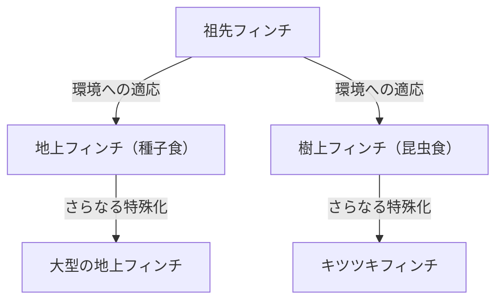

## 序論：生命の多様性とダーウィンの革命

1859年11月24日、チャールズ・ダーウィンが発表した『種の起源 (On the Origin of Species)』は、生物学のみならず、人類の世界観そのものを根本から覆す歴史的な著作となりました。それまでの「すべての種は神によって個別に創造され、不変である」という創造論的パラダイムに対し、ダーウィンは「自然選択 (Natural Selection)」というメカニズムに基づく進化論を提唱しました。

本記事では、ダーウィンの進化論がどのように形成されたのか、その核心である自然選択説の論理構造、現代の生物学における位置づけ、そして社会に与えた影響までを詳細に解説します。

## 1. 歴史的背景：ビーグル号の航海と着想

チャールズ・ダーウィンは1831年から1836年にかけて、イギリス海軍の測量船ビーグル号に博物学者として乗船し、世界周航を行いました。南米大陸の沿岸調査をはじめ、太平洋の島々を巡るこの航海は、彼の思考に決定的な影響を与えました。

### ガラパゴス諸島での観察

特に大きな着想を得たのが、南米エクアドル沖に位置するガラパゴス諸島での観察です。この孤立した島々には、独自の進化を遂げた動植物が多数生息していました。

有名な「ガラパゴスフィンチ（フウキンチョウ科に分類される小鳥）」は、島ごとに異なる形状のくちばしを持っていました。サボテンを主食とするもの、昆虫を捕食するもの、硬い種子を砕いて食べるものなど、食性に応じてくちばしが特殊化していたのです。

ダーウィンは、これらのフィンチが南米大陸から渡ってきた共通の祖先から分化し、それぞれの島の環境に適応した結果であると考えました。これが後の「適応放散」という概念に繋がります。

## 2. 自然選択説の論理構造

ダーウィンの進化論の核心は、「どのようにして進化が起こるのか」というメカニズムを説明した点にあります。それが「自然選択説」です。この理論は、主に以下の観察事実と推論から成り立っています。

### 変異と遺伝

同一の種であっても、個体間には形態や性質の違い（個体変異）が存在します。そして、それらの変異の一部は親から子へと遺伝します。当時のダーウィンは、遺伝のメカニズム（DNAや遺伝子）については知りませんでしたが、経験則としてこの事実を認識していました。

### 生存競争と適者生存

生物は通常、環境が支えきれる以上の数の子孫を残そうとします（過剰繁殖）。しかし、食料や生息場所などの資源には限りがあるため、個体間で生存競争が起こります。

この競争の中で、特定の環境下でより有利な性質（変異）を持つ個体が生き残りやすく、より多くの子孫を残すことができます。これが「適者生存」です。

### 世代を超えた変化

有利な性質が世代を超えて受け継がれることで、その性質を持つ個体の割合が集団内で徐々に増加していきます。長い年月をかけてこのプロセスが繰り返されることで、種全体が環境に適応する方向に変化し、最終的には新しい種が形成されると考えました。

## 3. 「種の起源」がもたらした衝撃

ダーウィンの『種の起源』は、当時の社会に計り知れない衝撃を与えました。

### 科学的パラダイムシフト

それまでの生物学は、分類学を中心とし、種の不変性を前提としていました。しかし、ダーウィンの進化論は、すべての生物が共通の祖先から枝分かれして進化したという「生命の樹」の概念を提示し、生物学を歴史的な視点を持つ動的な科学へと変貌させました。

### 宗教と哲学への影響

「人間もまた他の動物と同じように進化の産物である」という主張は、キリスト教的な人間観（人間は神に似せて特別に創られたという教義）と正面から衝突しました。このため、宗教界からは激しい反発を受け、進化論の受容をめぐる論争は今日でも一部の地域で続いています。

一方で、哲学や社会科学の分野にも影響を与え、社会ダーウィニズムのように、自然選択の概念を人間社会の競争や不平等に当てはめようとする思想も生まれました（これはダーウィン自身の意図とは異なるものであり、後に多くの批判を浴びることになります）。

## 4. 現代進化生物学への発展（ネオ・ダーウィニズム）

ダーウィンの時代には不明だった遺伝のメカニズムは、20世紀に入り、グレゴール・メンデルの遺伝の法則の再発見や、DNAの構造解明によって明らかになりました。

### 突然変異と自然選択の統合

現代の進化生物学（総合説、ネオ・ダーウィニズム）では、進化のプロセスは以下のように説明されます。

1. **突然変異**: DNAの複製ミスなどにより、偶然に新しい遺伝的変異が生じる。
2. **自然選択**: 環境に適応した有利な変異が、生存と繁殖において有利に働き、集団内に広まる。
3. **遺伝的浮動**: 偶然の要因によって、遺伝子の頻度が変動する（特に小さな集団で顕著）。
4. **隔離**: 地理的・生殖的な隔離によって、集団間の遺伝子交流が絶たれ、種分化が促進される。

このように、ダーウィンの自然選択説は、現代の遺伝学や分子生物学の知見と融合し、より強固な科学的理論として現代の生命科学の基盤となっています。

## 結論：進化論が教えてくれること

ダーウィンの進化論は、単なる過去の学説ではありません。現代においても、抗生物質に耐性を持つ細菌の出現や、ウイルスの変異、農作物の品種改良、さらにはがん細胞の増殖メカニズムの理解など、様々な分野で進化の視点が不可欠となっています。

「最も強い者が生き残るのではなく、最も賢い者が生き延びるわけでもない。唯一生き残るのは、変化できる者である」——この言葉はダーウィン自身の発言ではないとされていますが、自然選択説の本質を見事に突いた表現として広く知られています。

生命の歴史は、絶え間ない環境の変化に対する適応の歴史です。ダーウィンが切り拓いた進化の視点は、私たちが生命の多様性と複雑さを理解するための、最も強力なレンズの一つであり続けています。
