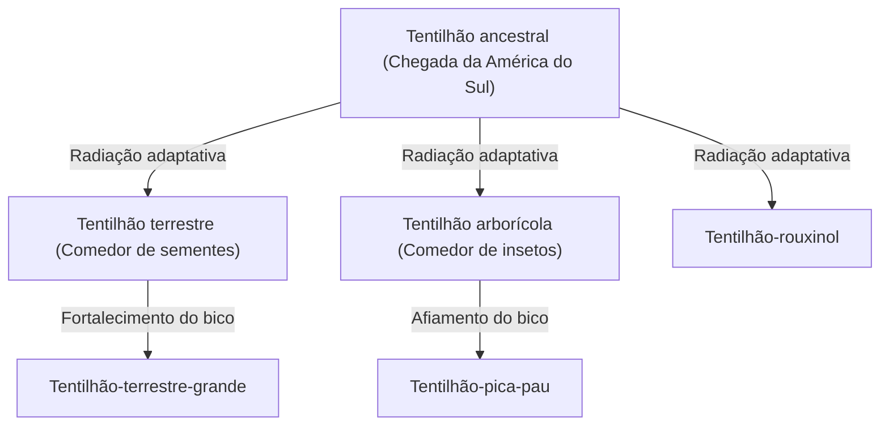
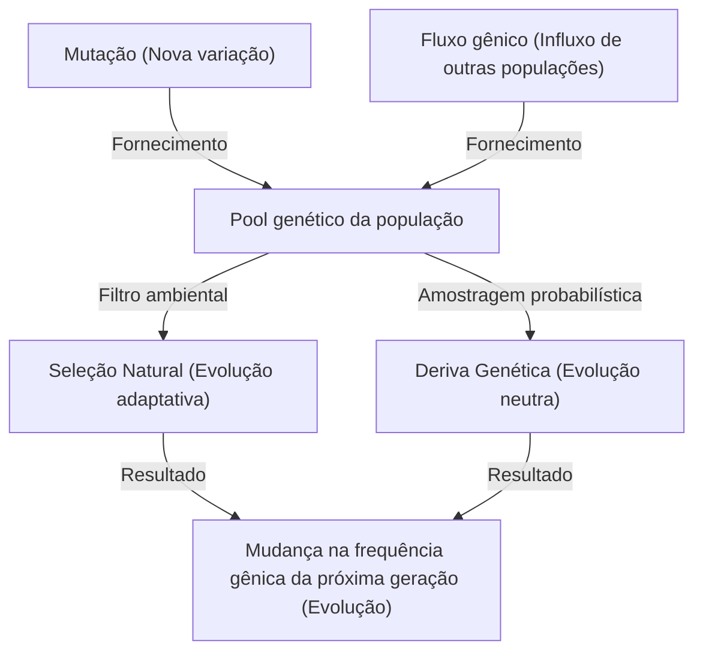

## Introdução: A diversidade da vida e a revolução de Darwin

Em 24 de novembro de 1859, a publicação de "A Origem das Espécies" (On the Origin of Species) por Charles Darwin tornou-se uma obra histórica que mudou fundamentalmente não apenas a biologia, mas a visão de mundo da humanidade. Em contraste com o paradigma criacionista anterior de que "todas as espécies foram criadas individualmente por Deus e são imutáveis", Darwin propôs uma teoria evolutiva baseada no mecanismo de "Seleção Natural" (Natural Selection).

Neste artigo, aprofundaremos detalhadamente como a teoria evolutiva de Darwin foi formada, a estrutura lógica de seu núcleo, a teoria da seleção natural, o suporte matemático pela genética de populações moderna (Neo-Darwinismo), e a implementação de algoritmos genéticos como uma analogia do processo evolutivo usando Python.

## 1. Contexto Histórico: A viagem do HMS Beagle e a inspiração

Entre 1831 e 1836, Charles Darwin navegou ao redor do mundo como naturalista a bordo do navio de pesquisa da Marinha Britânica, HMS Beagle. Em particular, as observações nas Ilhas Galápagos tiveram um impacto decisivo em seu pensamento.

### A diversidade dos tentilhões de Galápagos

Nas Ilhas Galápagos, habitavam tentilhões (agora classificados na família Thraupidae) com bicos de formatos diferentes em cada ilha. Os bicos haviam se especializado de acordo com sua dieta, como aqueles que comiam cactos, insetos ou quebravam sementes.



Darwin pensou que esses tentilhões divergiram de um ancestral comum e foram o resultado da adaptação ao ambiente de cada ilha.

## 2. Estrutura lógica da teoria da seleção natural

A teoria da seleção natural de Darwin consiste nos 3 fatos observados a seguir e em 2 deduções.

1. **Superprodução (Overproduction)**: Os organismos produzem mais descendentes do que o ambiente pode suportar.
2. **Variação individual (Variation)**: Mesmo dentro da mesma espécie, existem diferenças (variações) de forma e natureza entre os indivíduos.
3. **Hereditariedade (Inheritance)**: Algumas dessas variações são herdadas dos pais para os filhos.

O mecanismo derivado disso é a **Seleção Natural (Natural Selection)**. Na luta pela sobrevivência, os indivíduos com características mais bem adaptadas ao ambiente sobrevivem e deixam mais descendentes. À medida que isso se repete através das gerações, toda a espécie muda na direção da adaptação ao ambiente.

### Definição matemática de aptidão

Na genética de populações moderna, a seleção natural é formulada matematicamente pelo conceito de "Aptidão" (Fitness). A aptidão $W$ é definida como o número relativo de descendentes que um genótipo deixa para a próxima geração.

$$ \Delta p = \frac{p q [p(W_{11} - W_{12}) + q(W_{12} - W_{22})]}{\bar{W}} $$

Onde,
- $p, q$ são as frequências dos alelos $A, a$
- $W_{11}, W_{12}, W_{22}$ são as aptidões de cada genótipo ($AA, Aa, aa$)
- $\bar{W}$ é a aptidão média da população ($\bar{W} = p^2 W_{11} + 2pq W_{12} + q^2 W_{22}$)

Esta equação mostra que as frequências dos genes mudam na direção do aumento da aptidão média, provando matematicamente a seleção natural de Darwin.

## 3. Desenvolvimento para a Síntese Moderna (Neo-Darwinismo)

Na época de Darwin, o "mecanismo da hereditariedade" - como as variações ocorrem e como são herdadas - era desconhecido (as leis de Mendel foram redescobertas apenas em 1900).

Entre as décadas de 1930 e 1940, a teoria da seleção natural de Darwin, a genética de Mendel, a genética de populações, a paleontologia, etc., se fundiram para estabelecer a "Síntese Moderna" (Modern Synthesis). Ronald Fisher, J.B.S. Haldane, Sewall Wright e outros construíram as bases matemáticas.

### Os 4 fatores que impulsionam a evolução

Na biologia moderna, os 4 fatores a seguir são citados como causas da evolução (mudança nas frequências alélicas dentro de uma população).

1. **Seleção Natural (Natural Selection)**
2. **Mutação (Mutation)**: Fornecimento de novos alelos devido a erros de replicação de DNA, etc.
3. **Deriva Genética (Genetic Drift)**: Flutuação aleatória nas frequências gênicas devido ao acaso em populações finitas.
4. **Fluxo Gênico (Gene Flow)**: Mistura de genes através do movimento de indivíduos entre populações.



## 4. Experimentando a seleção natural através da programação: Algoritmos Genéticos

O mecanismo da evolução é aplicado na engenharia como um método computacional para resolver problemas de otimização, chamado "Algoritmo Genético" (Genetic Algorithm, GA). Aqui, vamos implementar uma simulação simples usando Python para gerar a string "DARWIN" através da evolução.

```python
import random
import string

TARGET = "DARWIN"
POP_SIZE = 100
MUTATION_RATE = 0.05

def random_string(length):
    return ''.join(random.choice(string.ascii_uppercase) for _ in range(length))

def calculate_fitness(individual):
    # A aptidão é o número de caracteres que coincidem com a string alvo
    return sum(1 for a, b in zip(individual, TARGET) if a == b)

def crossover(parent1, parent2):
    mid = len(TARGET) // 2
    return parent1[:mid] + parent2[mid:]

def mutate(individual):
    res = list(individual)
    for i in range(len(res)):
        if random.random() < MUTATION_RATE:
            res[i] = random.choice(string.ascii_uppercase)
    return "".join(res)

# Geração da população inicial
population = [random_string(len(TARGET)) for _ in range(POP_SIZE)]

generation = 0
while True:
    population.sort(key=calculate_fitness, reverse=True)
    best = population[0]
    
    print(f"Generation {generation}: {best} (Fitness: {calculate_fitness(best)})")
    
    if best == TARGET:
        print("Evolution complete!")
        break
        
    # Seleção de elite e geração da próxima descendência
    next_gen = population[:10]  # Mantém os 10 melhores com alta aptidão como estão
    
    while len(next_gen) < POP_SIZE:
        # Escolhe os pais aleatoriamente e realiza cruzamento e mutação
        p1, p2 = random.choices(population[:50], k=2)
        child = mutate(crossover(p1, p2))
        next_gen.append(child)
        
    population = next_gen
    generation += 1
```

Este código começa com uma população de strings aleatórias, indivíduos mais próximos do alvo "DARWIN" (maior aptidão) são selecionados e passam por cruzamento e mutação para formar a próxima geração. Você deve conseguir ver a string alvo "evoluir" e aparecer dentro de algumas gerações.

## 5. Conclusão e o presente da teoria da evolução

"A Origem das Espécies" de Darwin mostrou que os seres vivos não são estáticos, mas existem dentro de uma história dinâmica e contínua. Hoje, a análise de sequências de DNA (filogenética molecular) provou que toda a vida divergiu de um ancestral comum (LUCA: Last Universal Common Ancestor).

A teoria da evolução não é apenas uma "hipótese", mas um enorme paradigma que integra toda a biologia moderna. Como afirmou o geneticista evolutivo Theodosius Dobzhansky: "Nada em biologia faz sentido exceto à luz da evolução (Nothing in Biology Makes Sense Except in the Light of Evolution)".
