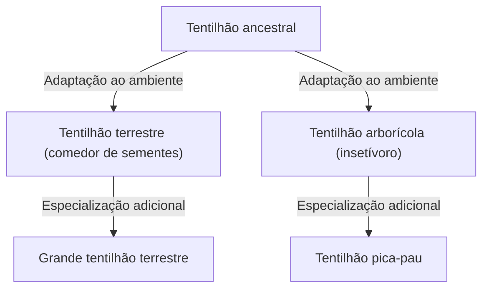

## Introdução: A diversidade da vida e a revolução de Darwin

Publicado em 24 de novembro de 1859, "A Origem das Espécies" (On the Origin of Species) de Charles Darwin tornou-se uma obra histórica que reverteu fundamentalmente não apenas a biologia, mas a própria visão de mundo da humanidade. Em contraste com o paradigma criacionista prevalecente de que "todas as espécies foram criadas individualmente por Deus e são imutáveis", Darwin propôs uma teoria da evolução baseada no mecanismo de "seleção natural" (Natural Selection).

Neste artigo, explicaremos em detalhes como a teoria da evolução de Darwin foi formada, a estrutura lógica de seu núcleo, a teoria da seleção natural, sua posição na biologia moderna e seu impacto na sociedade.

## 1. Contexto histórico: A viagem do HMS Beagle e a inspiração

Entre 1831 e 1836, Charles Darwin embarcou como naturalista no HMS Beagle, um navio de pesquisa da Marinha Britânica, e circunavegou o globo. Esta viagem, que incluiu o levantamento costeiro do continente sul-americano e visitas a ilhas no Oceano Pacífico, teve um impacto decisivo em seu pensamento.

### Observações nas Ilhas Galápagos

Uma inspiração particularmente importante veio de suas observações nas Ilhas Galápagos, localizadas ao largo da costa do Equador, na América do Sul. Essas ilhas isoladas abrigavam uma riqueza de flora e fauna que haviam passado por sua própria evolução única.

Os famosos "tentilhões de Galápagos" (pequenos pássaros classificados na família Thraupidae) tinham bicos de formatos diferentes dependendo da ilha. Os bicos eram especializados de acordo com a dieta: alguns se alimentavam principalmente de cactos, outros caçavam insetos e outros esmagavam sementes duras para comer.

Darwin pensou que esses tentilhões haviam divergido de um ancestral comum que migrou do continente sul-americano, como resultado da adaptação aos ambientes de suas respectivas ilhas. Isso levou ao conceito posterior de "radiação adaptativa".

## 2. Estrutura lógica da teoria da seleção natural

O núcleo da teoria da evolução de Darwin reside em sua explicação do mecanismo de "como a evolução ocorre". Essa é a "teoria da seleção natural". Essa teoria consiste principalmente nos seguintes fatos observacionais e inferências.

### Variação e hereditariedade

Mesmo dentro da mesma espécie, existem diferenças de forma e características (variação individual) entre os indivíduos. Algumas dessas variações são herdadas de pais para filhos. Na época, Darwin não conhecia o mecanismo da hereditariedade (DNA e genes), mas ele reconhecia esse fato como uma regra empírica.

### Luta pela existência e sobrevivência do mais apto

Os organismos geralmente tentam deixar mais descendentes do que o ambiente pode suportar (superprodução). No entanto, como recursos como alimentos e habitats são limitados, ocorre uma luta pela sobrevivência entre os indivíduos.

Nesta competição, indivíduos com características (variações) mais vantajosas em um ambiente específico têm maior probabilidade de sobreviver e deixar mais descendentes. Isso é a "sobrevivência do mais apto".

### Mudanças ao longo das gerações

À medida que características vantajosas são transmitidas ao longo das gerações, a proporção de indivíduos com essas características aumenta gradualmente dentro da população. Ele acreditava que, à medida que esse processo se repetia ao longo de muitos anos, toda a espécie mudaria em uma direção adaptada ao seu ambiente, acabando por formar uma nova espécie.

## 3. O impacto causado por "A Origem das Espécies"

A obra "A Origem das Espécies" de Darwin teve um impacto imensurável na sociedade da época.

### Mudança de paradigma científico

Até então, a biologia estava centrada na taxonomia e baseava-se na premissa da imutabilidade das espécies. No entanto, a teoria da evolução de Darwin apresentou o conceito da "árvore da vida", onde todos os organismos vivos evoluíram divergindo de um ancestral comum, transformando a biologia em uma ciência dinâmica com uma perspectiva histórica.

### Impacto na religião e na filosofia

A afirmação de que "os humanos também são um produto da evolução, assim como outros animais" colidiu de frente com a visão de mundo cristã (a doutrina de que os humanos foram criados especialmente à imagem de Deus). Por esse motivo, enfrentou forte oposição de círculos religiosos e as controvérsias sobre a aceitação da teoria da evolução continuam até hoje em algumas regiões.

Por outro lado, também influenciou os campos da filosofia e das ciências sociais, dando origem a ideias como o darwinismo social, que tentava aplicar o conceito de seleção natural à competição e desigualdade na sociedade humana (embora isso diferisse da própria intenção de Darwin e mais tarde sofresse muitas críticas).

## 4. Desenvolvimento para a biologia evolutiva moderna (Neodarwinismo)

O mecanismo de hereditariedade, que era desconhecido na época de Darwin, tornou-se claro no século XX com a redescoberta das leis da hereditariedade de Gregor Mendel e a elucidação da estrutura do DNA.

### Integração da mutação e seleção natural

Na biologia evolutiva moderna (teoria sintética, neodarwinismo), o processo evolutivo é explicado da seguinte forma:

1. **Mutação**: Novas variações genéticas surgem por acaso, como devido a erros na replicação do DNA.
2. **Seleção natural**: Variações vantajosas adaptadas ao ambiente funcionam de forma benéfica para a sobrevivência e reprodução, espalhando-se dentro da população.
3. **Deriva genética**: As frequências gênicas flutuam devido a fatores fortuitos (especialmente proeminente em populações pequenas).
4. **Isolamento**: O isolamento geográfico e reprodutivo corta o fluxo gênico entre as populações, promovendo a especiação.

Desta forma, a teoria da seleção natural de Darwin fundiu-se com as descobertas da genética moderna e da biologia molecular, e agora serve como a base da ciência moderna da vida como uma teoria científica mais robusta.

## Conclusão: O que a teoria da evolução nos ensina

A teoria da evolução de Darwin não é apenas uma teoria acadêmica do passado. Mesmo nos tempos modernos, uma perspectiva evolutiva é indispensável em vários campos, como o surgimento de bactérias resistentes a antibióticos, mutação viral, reprodução de safras agrícolas e até mesmo a compreensão do mecanismo de proliferação das células cancerígenas.

"Não é a mais forte das espécies que sobrevive, nem a mais inteligente que sobrevive. É a que é mais adaptável à mudança." - Embora se diga que essas palavras não são do próprio Darwin, elas são amplamente conhecidas como uma expressão que capta perfeitamente a essência da teoria da seleção natural.

A história da vida é uma história de adaptação a mudanças ambientais incessantes. A perspectiva evolutiva pioneira de Darwin continua a ser uma das lentes mais poderosas através das quais entendemos a diversidade e a complexidade da vida.
