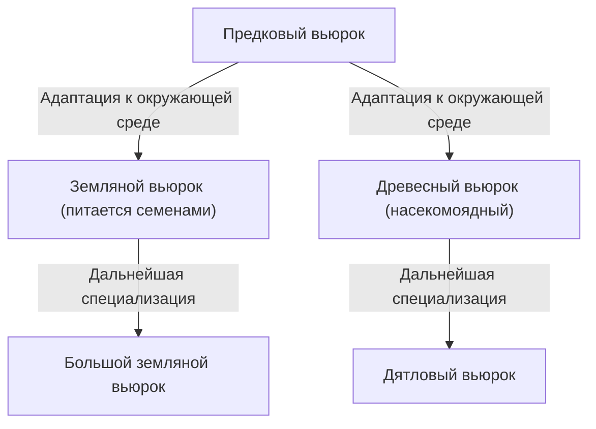

## Введение: Разнообразие жизни и революция Дарвина

24 ноября 1859 года публикация работы Чарльза Дарвина «Происхождение видов» (On the Origin of Species) стала историческим трудом, в корне перевернувшим не только биологию, но и само мировоззрение человечества. В противовес существовавшей до того креационистской парадигме, гласящей, что «все виды были созданы Богом индивидуально и неизменны», Дарвин предложил теорию эволюции, основанную на механизме «естественного отбора» (Natural Selection).

В этой статье мы подробно рассмотрим, как формировалась теория эволюции Дарвина, логическую структуру теории естественного отбора, являющейся ее основой, ее место в современной биологии, а также влияние, которое она оказала на общество.

## 1. Исторический контекст: Плавание на корабле «Бигль» и рождение идеи

Чарльз Дарвин совершил кругосветное путешествие с 1831 по 1836 год, находясь в качестве натуралиста на борту гидрографического судна британского военно-морского флота «Бигль». Это плавание, включавшее исследование побережья Южной Америки и посещение островов Тихого океана, оказало решающее влияние на его мышление.

### Наблюдения на Галапагосских островах

Особое вдохновение он получил благодаря наблюдениям на Галапагосских островах, расположенных у побережья Эквадора в Южной Америке. На этих изолированных островах обитало множество видов животных и растений, прошедших собственный путь эволюции.

Знаменитые «галапагосские вьюрки» (мелкие птицы, относящиеся к семейству танагровых) имели клювы разной формы в зависимости от острова. Клювы специализировались в зависимости от рациона питания: у тех, кто питался в основном кактусами, насекомыми или разбивал твердые семена.

Дарвин предположил, что эти вьюрки произошли от общего предка, прилетевшего с южноамериканского континента, и стали результатом адаптации к условиям каждого отдельного острова. Впоследствии это привело к возникновению концепции «адаптивной радиации».

## 2. Логическая структура теории естественного отбора

Суть теории эволюции Дарвина заключается в том, что она объясняет механизм того, «как происходит эволюция». Это и есть «теория естественного отбора». Эта теория в основном состоит из следующих наблюдаемых фактов и выводов.

### Изменчивость и наследственность

Даже в пределах одного вида между особями существуют различия в форме и свойствах (индивидуальная изменчивость). И часть этих изменений передается по наследству от родителей к детям. В то время Дарвин не знал о механизмах наследственности (ДНК и генах), но он осознавал этот факт эмпирически.

### Борьба за существование и выживание наиболее приспособленных

Живые организмы обычно стремятся оставить больше потомства, чем может выдержать окружающая среда (перепроизводство потомства). Однако, поскольку ресурсы, такие как пища и места обитания, ограничены, между особями возникает борьба за существование.

В этой конкуренции особи, обладающие более выгодными признаками (мутациями) в данных условиях среды, имеют больше шансов выжить и оставить больше потомства. Это и есть «выживание наиболее приспособленных».

### Изменения, передающиеся из поколения в поколение

Благодаря тому, что благоприятные признаки передаются из поколения в поколение, доля особей, обладающих этими признаками, постепенно увеличивается в популяции. Считалось, что по мере того, как этот процесс повторяется на протяжении длительного периода времени, весь вид изменяется в сторону адаптации к окружающей среде, и в конечном итоге формируются новые виды.

## 3. Шок, вызванный «Происхождением видов»

«Происхождение видов» Дарвина оказало неизмеримое влияние на тогдашнее общество.

### Научный сдвиг парадигмы

До этого биология была сосредоточена в основном на систематике и исходила из неизменности видов. Однако теория эволюции Дарвина представила концепцию «древа жизни», согласно которой все живые организмы эволюционировали, ответвившись от общего предка, превратив биологию в динамическую науку с исторической перспективой.

### Влияние на религию и философию

Утверждение о том, что «человек, как и другие животные, является продуктом эволюции», вступило в прямое противоречие с христианским взглядом на человека (догмат о том, что человек был специально создан по образу и подобию Бога). Из-за этого оно встретило сильное сопротивление со стороны религиозных кругов, а споры о принятии теории эволюции в некоторых регионах продолжаются и сегодня.

С другой стороны, оно также оказало влияние на области философии и социальных наук, и возникли такие идеи, как социальный дарвинизм, который пытался применить концепцию естественного отбора к конкуренции и неравенству в человеческом обществе (что отличалось от намерений самого Дарвина и впоследствии подверглось резкой критике).

## 4. Развитие современной эволюционной биологии (Неодарвинизм)

Механизмы наследственности, неизвестные во времена Дарвина, стали понятны в 20 веке благодаря повторному открытию законов наследственности Грегора Менделя и выяснению структуры ДНК.

### Интеграция мутаций и естественного отбора

В современной эволюционной биологии (синтетическая теория эволюции, неодарвинизм) процесс эволюции объясняется следующим образом:

1. **Мутация**: Из-за ошибок репликации ДНК и других причин случайно возникают новые генетические вариации.
2. **Естественный отбор**: Выгодные мутации, адаптированные к окружающей среде, дают преимущество в выживании и размножении, распространяясь в популяции.
3. **Генетический дрейф**: Частота генов колеблется из-за случайных факторов (особенно выражено в небольших популяциях).
4. **Изоляция**: Географическая или репродуктивная изоляция прерывает обмен генами между популяциями, способствуя видообразованию.

Таким образом, теория естественного отбора Дарвина слилась со знаниями современной генетики и молекулярной биологии, став основой современной науки о жизни как более надежная научная теория.

## Заключение: Чему нас учит теория эволюции

Теория эволюции Дарвина — это не просто научная теория прошлого. Даже сегодня эволюционная перспектива незаменима в различных областях, таких как появление бактерий, устойчивых к антибиотикам, мутации вирусов, селекция сельскохозяйственных культур и даже понимание механизмов пролиферации раковых клеток.

«Выживает не самый сильный и не самый умный, а тот, кто лучше всех приспосабливается к изменениям» — считается, что это утверждение не принадлежит самому Дарвину, но оно широко известно как выражение, блестяще отражающее суть теории естественного отбора.

История жизни — это история адаптации к постоянным изменениям окружающей среды. Эволюционная перспектива, открытая Дарвином, продолжает оставаться одним из самых мощных объективов для понимания нами разнообразия и сложности жизни.
