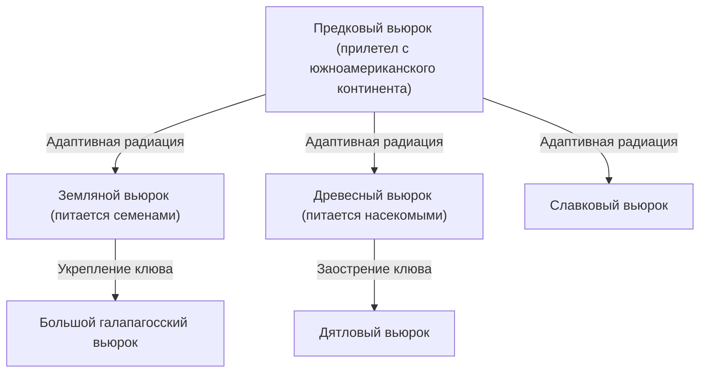
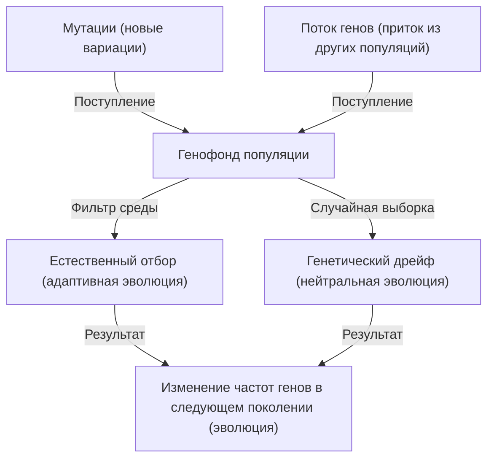

## Введение: Разнообразие жизни и революция Дарвина

Опубликованная Чарльзом Дарвином 24 ноября 1859 года книга «Происхождение видов (On the Origin of Species)» стала историческим трудом, в корне изменившим не только биологию, но и само мировоззрение человечества. В противовес существовавшей до того креационистской парадигме, утверждавшей, что «все виды были созданы Богом индивидуально и неизменны», Дарвин предложил теорию эволюции, основанную на механизме «естественного отбора (Natural Selection)».

В этой статье мы подробно рассмотрим, как формировалась теория эволюции Дарвина, логическую структуру ее ядра — теории естественного отбора, ее математическое обоснование с помощью современной популяционной генетики (неодарвинизм), а также программную реализацию генетических алгоритмов на Python как аналогию эволюционного процесса.

## 1. Исторический контекст: Плавание на «Бигле» и зарождение идеи

С 1831 по 1836 год Чарльз Дарвин совершил кругосветное путешествие в качестве натуралиста на исследовательском корабле британского военно-морского флота «Бигль». Наблюдения, сделанные им, в частности, на Галапагосских островах, оказали решающее влияние на его мышление.

### Разнообразие галапагосских вьюрков

На Галапагосских островах обитали вьюрки (в настоящее время классифицируемые как семейство танагровых) с клювами разной формы в зависимости от острова. Клювы были специализированы в зависимости от рациона питания: одни питались кактусами, другие насекомыми, третьи дробили семена.



Дарвин предположил, что эти вьюрки произошли от общего предка и стали результатом адаптации к условиям среды каждого конкретного острова.

## 2. Логическая структура теории естественного отбора

Теория естественного отбора Дарвина опирается на три факта наблюдений и два вывода.

1. **Избыточное размножение (Overproduction)**: Организмы оставляют больше потомства, чем может прокормить окружающая среда.
2. **Индивидуальная изменчивость (Variation)**: Даже внутри одного вида между особями существуют различия в морфологии и свойствах (изменчивость).
3. **Наследственность (Inheritance)**: Часть этих изменений передается по наследству от родителей к детям.

Из этого вытекает механизм **естественного отбора (Natural Selection)**. В борьбе за существование выживают особи, обладающие признаками, лучше адаптированными к окружающей среде, и они оставляют больше потомства. Повторение этого процесса из поколения в поколение приводит к тому, что весь вид изменяется в направлении адаптации к среде.

### Математическое определение приспособленности

В современной популяционной генетике естественный отбор математически описывается понятием «приспособленность (Fitness)». Приспособленность $W$ определяется как относительное количество потомства, которое данный генотип оставляет следующему поколению.

$$ \Delta p = \frac{p q [p(W_{11} - W_{12}) + q(W_{12} - W_{22})]}{\bar{W}} $$

Где,
- $p, q$ — частоты аллелей $A, a$
- $W_{11}, W_{12}, W_{22}$ — приспособленность каждого генотипа ($AA, Aa, aa$)
- $\bar{W}$ — средняя приспособленность популяции ($\bar{W} = p^2 W_{11} + 2pq W_{12} + q^2 W_{22}$)

Это уравнение показывает, что частота аллелей изменяется в направлении увеличения средней приспособленности, что является математическим доказательством естественного отбора Дарвина.

## 3. Развитие в синтетическую теорию (неодарвинизм)

Во времена Дарвина «механизм наследственности» (то, как возникают изменения и как они наследуются) оставался неизвестным (законы Менделя были переоткрыты только в 1900 году).

В 1930-1940-х годах произошло слияние дарвиновской теории естественного отбора с генетикой Менделя, а также с популяционной генетикой, палеонтологией и другими дисциплинами, что привело к созданию «Синтетической теории эволюции (Modern Synthesis)». Рональд Фишер, Дж. Б. С. Холдейн и Сьюалл Райт заложили её математические основы.

### 4 фактора, движущие эволюцию

В современной биологии выделяют 4 фактора, вызывающих эволюцию (изменение частот аллелей в популяции):

1. **Естественный отбор (Natural Selection)**
2. **Мутации (Mutation)**: Поставка новых аллелей, например, из-за ошибок копирования ДНК.
3. **Генетический дрейф (Genetic Drift)**: Случайные колебания частот генов в конечной популяции.
4. **Поток генов (Gene Flow)**: Смешивание генов из-за миграции особей между популяциями.



## 4. Естественный отбор на практике с помощью программирования: Генетические алгоритмы

Механизм эволюции применяется в инженерии в качестве вычислительного метода для решения задач оптимизации — «Генетического алгоритма (Genetic Algorithm, GA)». Давайте реализуем простую симуляцию на Python, которая путем эволюции генерирует строку "DARWIN".

```python
import random
import string

TARGET = "DARWIN"
POP_SIZE = 100
MUTATION_RATE = 0.05

def random_string(length):
    return ''.join(random.choice(string.ascii_uppercase) for _ in range(length))

def calculate_fitness(individual):
    # Приспособленность — это количество символов, совпадающих с целевой строкой
    return sum(1 for a, b in zip(individual, TARGET) if a == b)

def crossover(parent1, parent2):
    mid = len(TARGET) // 2
    return parent1[:mid] + parent2[mid:]

def mutate(individual):
    res = list(individual)
    for i in range(len(res)):
        if random.random() < MUTATION_RATE:
            res[i] = random.choice(string.ascii_uppercase)
    return "".join(res)

# Генерация начальной популяции
population = [random_string(len(TARGET)) for _ in range(POP_SIZE)]

generation = 0
while True:
    population.sort(key=calculate_fitness, reverse=True)
    best = population[0]
    
    print(f"Generation {generation}: {best} (Fitness: {calculate_fitness(best)})")
    
    if best == TARGET:
        print("Evolution complete!")
        break
        
    # Элитарный отбор и генерация следующего поколения
    next_gen = population[:10]  # Оставляем топ-10 с наибольшей приспособленностью
    
    while len(next_gen) < POP_SIZE:
        # Случайный выбор родителей, кроссовер и мутация
        p1, p2 = random.choices(population[:50], k=2)
        child = mutate(crossover(p1, p2))
        next_gen.append(child)
        
    population = next_gen
    generation += 1
```

Этот код начинается с популяции случайных строк, затем отбираются особи, близкие к цели «DARWIN» (с высокой приспособленностью), которые проходят через кроссовер (скрещивание) и мутацию, формируя следующее поколение. Вы сможете увидеть, как всего за несколько поколений целевая строка «эволюционирует» и появляется.

## 5. Заключение и теория эволюции сегодня

Книга Дарвина «Происхождение видов» показала, что жизнь — это не статичная сущность, а часть динамичной и непрерывной истории. Сегодня анализ последовательностей ДНК (молекулярная филогенетика) доказал, что вся жизнь произошла от одного общего предка (LUCA: Last Universal Common Ancestor).

Теория эволюции — это не просто «гипотеза», а гигантская парадигма, объединяющая всю современную биологию. Как сказал эволюционный генетик Феодосий Добржанский: «Ничто в биологии не имеет смысла, кроме как в свете эволюции (Nothing in Biology Makes Sense Except in the Light of Evolution)».
