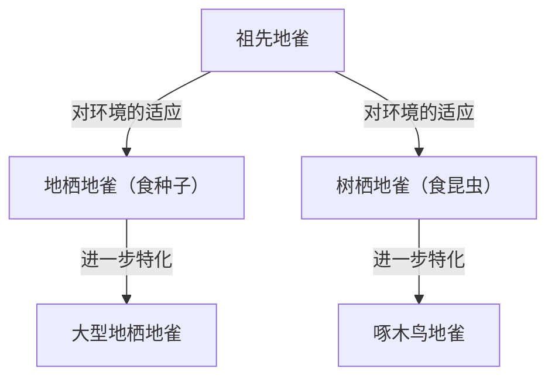

## 导言：生命的多样性与达尔文的革命

1859年11月24日，查尔斯·达尔文发表了《物种起源 (On the Origin of Species)》，这不仅在生物学界，更是从根本上颠覆了人类世界观的历史性巨著。在此之前，人们普遍接受的是“所有物种都是由神个别创造且永恒不变的”神创论范式，而达尔文则提出了基于“自然选择 (Natural Selection)”机制的进化论。

本文将详细探讨达尔文进化论的形成过程、其核心自然选择说的逻辑结构、在现代生物学中的地位，以及它对社会产生的影响。

## 1. 历史背景：小猎犬号的航行与灵感

1831年至1836年，查尔斯·达尔文作为博物学家登上了英国海军测量船小猎犬号（HMS Beagle），进行了环球航行。这次航行包括对南美大陆沿岸的考察以及太平洋岛屿的巡游，对他的思想产生了决定性的影响。

### 加拉帕戈斯群岛的观察

特别让他获得巨大灵感的是在位于南美厄瓜多尔海域的加拉帕戈斯群岛的观察。在这些孤立的岛屿上，栖息着大量经过独特进化的动植物。

著名的“加拉帕戈斯雀（分类为裸鼻雀科的小鸟）”在不同的岛屿上拥有不同形状的喙。有以仙人掌为主食的，有捕食昆虫的，也有咬碎坚硬种子为食的，它们的喙根据食性发生了特化。

达尔文认为，这些地雀是从南美大陆迁徙而来的共同祖先分化而成，是适应各个岛屿环境的结果。这后来演变成了“适应辐射”的概念。

## 2. 自然选择说的逻辑结构

达尔文进化论的核心在于解释“进化是如何发生的”这一机制，即“自然选择说”。这一理论主要由以下观察事实和推论构成。

### 变异与遗传

即使是同一物种，个体之间也存在形态和性质的差异（个体变异）。而且，其中一部分变异会从亲代遗传给子代。当时的达尔文虽然不知道遗传的机制（DNA或基因），但作为经验法则认识到了这一事实。

### 生存竞争与适者生存

生物通常会尝试繁衍出超过环境所能承受数量的后代（过度繁殖）。然而，由于食物和栖息地等资源有限，个体之间会发生生存竞争。

在特定的环境下，拥有更有利性质（变异）的个体更容易在竞争中存活下来，并繁衍更多的后代。这就是“适者生存”。

### 跨世代的变化

有利的性质通过世代相传，使得拥有该性质的个体在种群中所占的比例逐渐增加。经过漫长岁月的反复过程，整个物种会向着适应环境的方向发生改变，最终形成新的物种。

## 3. 《物种起源》带来的冲击

达尔文的《物种起源》给当时的社会带来了无法估量的冲击。

### 科学范式的转变

在此之前的生物学以分类学为中心，并以物种不变性为前提。然而，达尔文的进化论提出了所有生物都是从共同祖先分化进化而来的“生命之树”的概念，将生物学转变为一门具有历史视角的动态科学。

### 对宗教与哲学的影响

“人类也和其他动物一样是进化的产物”这一主张，与基督教的人类观（人类是按照神的形象被特别创造的教义）发生了正面冲突。因此，它遭到了宗教界的强烈反对，关于接受进化论的争论至今仍在一些地区持续。

另一方面，它也影响了哲学和社会科学领域，甚至催生了社会达尔文主义这种试图将自然选择概念应用于人类社会竞争和不平等的思想（这并非达尔文的本意，后来也遭到了诸多批评）。

## 4. 现代进化生物学的发展（新达尔文主义）

达尔文时代未知的遗传机制，在进入20世纪后，随着格雷戈尔·孟德尔遗传定律的重新发现和DNA结构的阐明而逐渐明朗。

### 突变与自然选择的结合

在现代进化生物学（现代综合论、新达尔文主义）中，进化的过程被解释如下：

1. **突变**: 由于DNA复制错误等原因，偶然产生新的遗传变异。
2. **自然选择**: 适应环境的有利变异在生存和繁殖中占据优势，从而在种群中扩散。
3. **遗传漂变**: 由于偶然因素，基因频率发生波动（在小种群中尤为显著）。
4. **隔离**: 地理和生殖上的隔离切断了种群间的基因交流，促进了物种形成。

由此，达尔文的自然选择说与现代遗传学和分子生物学的知识相融合，成为更为坚固的科学理论，奠定了现代生命科学的基础。

## 结论：进化论教给我们的道理

达尔文的进化论绝不仅仅是过去的学说。即使在现代，无论是对抗生素产生抗药性的细菌的出现、病毒的变异、农作物的品种改良，还是对癌细胞增殖机制的理解等，各个领域都离不开进化的视角。

“存活下来的物种，不是那些最强壮的，也不是那些最聪明的，而是那些对变化做出最积极反应的。”——虽然这句话据称并非出自达尔文本人之口，但作为绝妙地点出了自然选择说本质的表达而广为人知。

生命的历史，就是一段不断适应环境变化的历史。达尔文开辟的进化视角，一直是我们理解生命多样性和复杂性的最强大的镜头之一。
