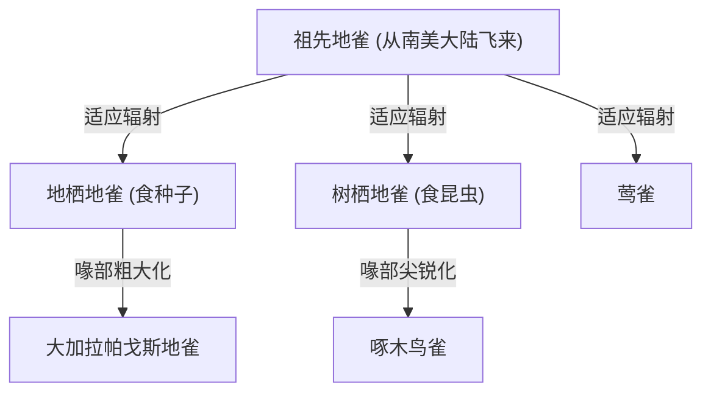
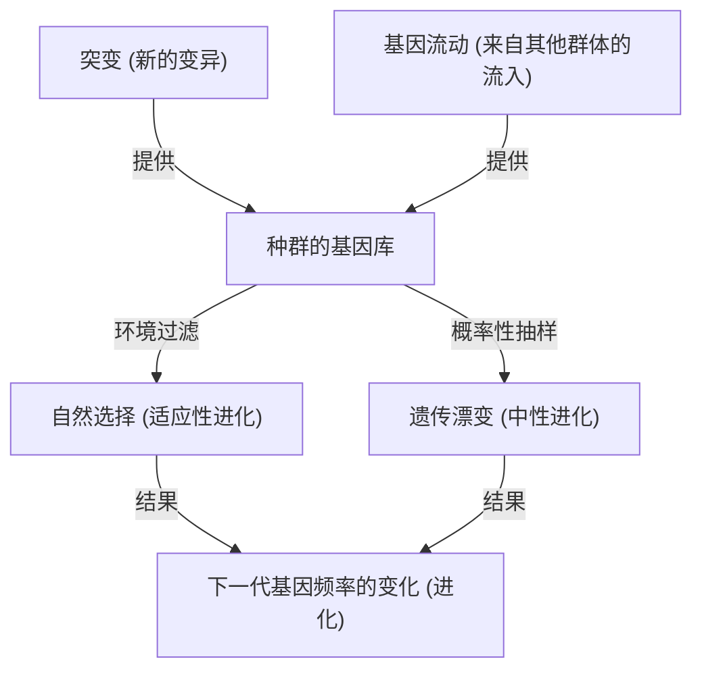

## 引言：生命的多样性与达尔文的革命

1859年11月24日，查尔斯·达尔文发表的《物种起源 (On the Origin of Species)》，不仅在生物学界，更是从根本上颠覆了人类世界观的历史性著作。在此之前，人们普遍接受“所有物种都是由神单独创造且不可改变的”这种神创论范式，而达尔文则提出了基于“自然选择 (Natural Selection)”机制的进化论。

在本文中，我们将极其深入地探讨达尔文的进化论是如何形成的，其核心即自然选择学说的逻辑结构，现代群体遗传学（新达尔文主义）所提供的数学支持，以及如何使用Python将进化过程作为类比进行遗传算法的模拟实现。

## 1. 历史背景：小猎犬号的航行与灵感

1831年至1836年间，查尔斯·达尔文作为博物学家登上了英国海军的测量船小猎犬号（HMS Beagle），进行了环球航行。特别是在加拉帕戈斯群岛的观察，对他的思想产生了决定性的影响。

### 加拉帕戈斯地雀的多样性

在加拉帕戈斯群岛上，栖息着喙形各异的雀类（现在被分类为裸鼻雀科），且不同岛屿上的形态各不相同。根据食性的不同，有吃仙人掌的、吃昆虫的、咬碎种子的等等，它们的喙发生了特化。



达尔文认为，这些地雀从共同的祖先分化而来，是适应各个岛屿环境的结果。

## 2. 自然选择学说的逻辑结构

达尔文的自然选择学说由以下3个观察事实和2个推论构成。

1. **过度繁殖 (Overproduction)**: 生物会繁衍出超过环境所能承载数量的后代。
2. **个体变异 (Variation)**: 即使是同一物种，个体之间也存在形态和性质上的差异（变异）。
3. **遗传 (Inheritance)**: 这些变异中的一部分会从亲代遗传给子代。

由此推导出的机制就是**自然选择 (Natural Selection)**。在生存竞争（斗争）中，拥有更适应环境的性状的个体生存下来，并留下更多的后代。这个过程跨越世代不断重复，使得整个物种朝着适应环境的方向发生改变。

### 适应度的数学定义

在现代群体遗传学中，自然选择通过“适应度 (Fitness)”这一概念被公式化。适应度 $W$ 被定义为某种基因型在下一代中留下的后代的相对数量。

$$ \Delta p = \frac{p q [p(W_{11} - W_{12}) + q(W_{12} - W_{22})]}{\bar{W}} $$

这里，
- $p, q$ 是等位基因 $A, a$ 的频率
- $W_{11}, W_{12}, W_{22}$ 是各种基因型 ($AA, Aa, aa$) 的适应度
- $\bar{W}$ 是群体的平均适应度 ($\bar{W} = p^2 W_{11} + 2pq W_{12} + q^2 W_{22}$)

这个方程式表明，基因频率会朝着提高平均适应度的方向发生改变，这在数学上证明了达尔文的自然选择。

## 3. 向综合学说（新达尔文主义）的发展

在达尔文的时代，关于变异是如何产生以及如何遗传的“遗传机制”尚不明确（孟德尔定律直到1900年才被重新发现）。

在20世纪30年代至40年代，达尔文的自然选择学说与孟德尔的遗传学，再加上群体遗传学、古生物学等学科相融合，确立了“现代综合进化论 (Modern Synthesis)”。罗纳德·费雪（Ronald Fisher）、J.B.S. 霍尔丹（J.B.S. Haldane）和休厄尔·赖特（Sewall Wright）等人奠定了其数学基础。

### 驱动进化的4个因素

在现代生物学中，引起进化（群体内等位基因频率的变化）的因素有以下4个：

1. **自然选择 (Natural Selection)**
2. **突变 (Mutation)**: 由于DNA复制错误等原因提供新的等位基因。
3. **遗传漂变 (Genetic Drift)**: 在有限种群中由于偶然性导致的基因频率波动。
4. **基因流动 (Gene Flow)**: 由于群体间个体的移动导致的基因杂交。



## 4. 通过编程体验自然选择：遗传算法

进化的机制作为解决优化问题的计算方法“遗传算法 (Genetic Algorithm, GA)”，已被应用到工程领域。在这里，我们将使用Python实现一个简单的模拟，通过进化生成字符串“DARWIN”。

```python
import random
import string

TARGET = "DARWIN"
POP_SIZE = 100
MUTATION_RATE = 0.05

def random_string(length):
    return ''.join(random.choice(string.ascii_uppercase) for _ in range(length))

def calculate_fitness(individual):
    # 将与目标字符串一致的字符数作为适应度
    return sum(1 for a, b in zip(individual, TARGET) if a == b)

def crossover(parent1, parent2):
    mid = len(TARGET) // 2
    return parent1[:mid] + parent2[mid:]

def mutate(individual):
    res = list(individual)
    for i in range(len(res)):
        if random.random() < MUTATION_RATE:
            res[i] = random.choice(string.ascii_uppercase)
    return "".join(res)

# 生成初始群体
population = [random_string(len(TARGET)) for _ in range(POP_SIZE)]

generation = 0
while True:
    population.sort(key=calculate_fitness, reverse=True)
    best = population[0]
    
    print(f"Generation {generation}: {best} (Fitness: {calculate_fitness(best)})")
    
    if best == TARGET:
        print("Evolution complete!")
        break
        
    # 精英选择与生成下一代
    next_gen = population[:10]  # 保留适应度最高的前10名
    
    while len(next_gen) < POP_SIZE:
        # 随机选择双亲并进行交叉和突变
        p1, p2 = random.choices(population[:50], k=2)
        child = mutate(crossover(p1, p2))
        next_gen.append(child)
        
    population = next_gen
    generation += 1
```

这段代码从一个由随机字符串组成的群体开始，选择接近目标“DARWIN”（适应度高）的个体，经过交叉和突变形成下一代，模拟了这一过程。你应该能够确认，在几代之内，目标字符串就会“进化”出现。

## 5. 结论与进化论的现状

达尔文的《物种起源》表明，生物并不是静态的存在，而是处于动态、连续的历史之中。今天，通过DNA碱基序列分析（分子系统发生学），已经证明所有生命都是从一个共同祖先（LUCA: Last Universal Common Ancestor）分化而来的。

进化论不仅是一个“假说”，更是整合现代生物学一切领域的巨大范式。正如进化遗传学家狄奥多西·多布然斯基所言：“如果不从进化的角度来看，生物学的一切都将毫无意义 (Nothing in Biology Makes Sense Except in the Light of Evolution)”。
