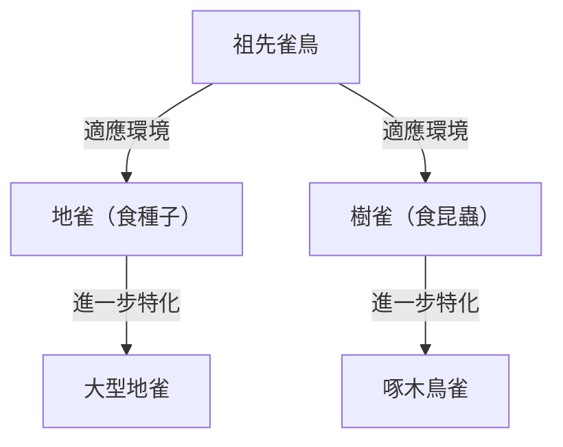

## 導論：生命的多樣性與達爾文的革命

1859年11月24日，查爾斯·達爾文發表的《物種起源 (On the Origin of Species)》，不僅在生物學界，更從根本上顛覆了人類的世界觀，成為一部歷史性的著作。相較於當時「所有物種皆由神個別創造且永恆不變」的神創論典範，達爾文提出了基於「自然選擇 (Natural Selection)」機制的演化論。

本文將詳細解說達爾文演化論的形成過程、其核心的自然選擇說邏輯結構、在現代生物學中的定位，以及對社會所產生的深遠影響。

## 1. 歷史背景：小獵犬號的航行與靈感

查爾斯·達爾文於1831年至1836年間，以博物學家的身分登上英國海軍測量船小獵犬號，進行了環球航行。這趟涵蓋南美洲大陸沿岸調查及巡遊太平洋島嶼的航程，對他的思想產生了決定性的影響。

### 加拉巴哥群島的觀察

其中帶來最大啟發的，是在位於南美洲厄瓜多外海的加拉巴哥群島上的觀察。在這些孤立的島嶼上，棲息著許多獨自演化的動植物。

著名的「達爾文雀（分類為唐納雀科的小鳥）」，在不同島嶼上擁有形狀各異的喙。有些以仙人掌為主食，有些捕食昆蟲，有些則咬碎堅硬的種子來吃，牠們的喙根據食性產生了特化。

達爾文認為，這些雀鳥是從南美洲大陸遷徙而來的共同祖先分化而來，並適應了各個島嶼的環境。這也成為了後來「適應輻射」概念的基礎。

## 2. 自然選擇說的邏輯結構

達爾文演化論的核心在於解釋了「演化是如何發生的」這個機制，即為「自然選擇說」。這個理論主要由以下觀察事實與推論所構成。

### 變異與遺傳

即使是同一物種，個體之間也存在著形態與性質的差異（個體變異）。而且，這些變異有一部分會從親代遺傳給子代。雖然當時的達爾文並不了解遺傳的機制（DNA或基因），但他作為經驗法則認知到了這個事實。

### 生存競爭與適者生存

生物通常會產生超過環境所能負荷數量的後代（過度繁殖）。然而，由於食物、棲息地等資源有限，個體之間便會發生生存競爭。

在這種競爭中，於特定環境下擁有較有利性質（變異）的個體更容易存活下來，並留下更多後代。這就是「適者生存」。

### 跨世代的變化

有利的性質透過世代傳承，擁有該性質的個體在族群中的比例會逐漸增加。達爾文認為，經過漫長歲月重複這個過程，整個物種就會朝著適應環境的方向發生變化，最終形成新的物種。

## 3. 《物種起源》帶來的衝擊

達爾文的《物種起源》對當時的社會造成了無法估量的衝擊。

### 科學典範轉移

當時的生物學以分類學為中心，並以物種的不變性為前提。然而，達爾文的演化論提出了「生命之樹」的概念，認為所有生物皆從共同祖先分支演化而來，將生物學轉變為一門具有歷史視角的動態科學。

### 對宗教與哲學的影響

「人類與其他動物一樣同為演化的產物」這個主張，與基督教的人類觀（人類是神依照自己形象特別創造的教義）發生了正面衝突。因此，演化論遭到了宗教界的強烈反彈，關於接受演化論的爭議在部分地區至今仍然存在。

另一方面，演化論也影響了哲學與社會科學領域，甚至產生了社會達爾文主義，試圖將自然選擇的概念套用於人類社會的競爭與不平等方面（這並非達爾文的本意，後來也受到了許多批評）。

## 4. 現代演化生物學的發展（新達爾文主義）

在達爾文時代尚未明朗的遺傳機制，進入20世紀後，隨著孟德爾遺傳法則的重新發現以及DNA結構的解明，終於真相大白。

### 突變與自然選擇的整合

在現代演化生物學（現代綜合理論、新達爾文主義）中，演化的過程被解釋如下：

1. **突變**: 由於DNA複製錯誤等原因，偶然產生了新的遺傳變異。
2. **自然選擇**: 適應環境的有利變異，在生存與繁殖上發揮優勢，並在族群內擴散。
3. **遺傳漂變**: 由於偶然因素，基因頻率發生變動（在小族群中尤為明顯）。
4. **隔離**: 由於地理或生殖上的隔離，阻斷了族群間的基因交流，進而促進了物種形成。

就這樣，達爾文的自然選擇說與現代遺傳學、分子生物學的知識相結合，成為更堅固的科學理論，奠定了現代生命科學的基礎。

## 結論：演化論告訴我們的事

達爾文的演化論不單單只是一個過去的學說。在現代，無論是具備抗生素抗藥性細菌的出現、病毒的變異、農作物的品種改良，甚至是理解癌細胞增殖機制等各個領域，演化的視角都是不可或缺的。

「存活下來的物種，不是最常強壯的，也不是最聰明的，而是最能適應改變的。」——雖然這句話據說並非出自達爾文之口，但作為精準點出自然選擇說本質的表達方式而被廣為人知。

生命的歷史，是一部不斷適應環境變化的歷史。達爾文所開闢的演化視角，至今依然是我們理解生命多樣性與複雜性最強大的一面透鏡。
