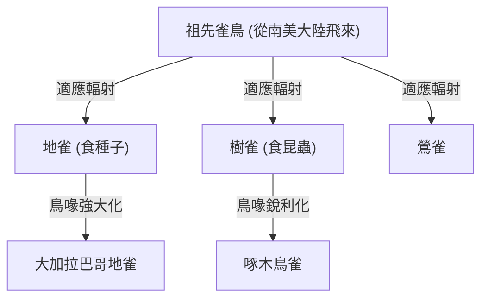
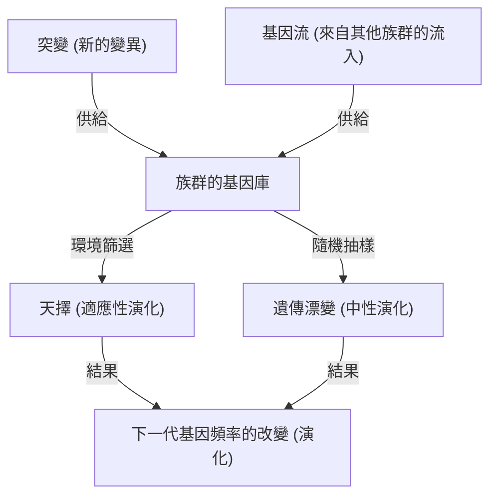

## 導論：生命的多樣性與達爾文的革命

1859年11月24日，查爾斯·達爾文發表的《物種起源 (On the Origin of Species)》，不僅在生物學界，更從根本上顛覆了人類的世界觀，成為一部歷史性的著作。相對於以往「所有物種皆由神個別創造且永恆不變」的神創論典範，達爾文提出了基於「天擇 (Natural Selection)」機制的演化論。

在本文中，我們將極為詳細地深入探討達爾文的演化論是如何形成的，其核心的天擇說邏輯結構，現代族群遺傳學（新達爾文主義）的數學基礎，以及使用 Python 實作遺傳演算法來模擬演化過程。

## 1. 歷史背景：小獵犬號的航海與啟發

查爾斯·達爾文在1831年至1836年期間，以博物學家的身分搭乘英國海軍測量船小獵犬號進行環球航行。特別是在加拉巴哥群島的觀察，對他的思想產生了決定性的影響。

### 加拉巴哥雀的多樣性

加拉巴哥群島上棲息著不同形狀鳥喙的雀鳥（現分類為唐納雀科），牠們在各個島嶼上皆有所不同。有吃仙人掌的、吃昆蟲的、咬碎種子的等等，鳥喙根據食性產生了特化。



達爾文認為，這些雀鳥是由共同的祖先分化而來，是適應各島嶼環境的結果。

## 2. 天擇說的邏輯結構

達爾文的天擇說由以下三個觀察事實和兩個推論組成。

1. **過度繁殖 (Overproduction)**：生物會繁衍出超過環境所能負荷數量的後代。
2. **個體變異 (Variation)**：即使是同一物種，個體之間也存在形態或性質上的差異（變異）。
3. **遺傳 (Inheritance)**：這些變異的一部分會從親代遺傳給子代。

由此推導出的機制就是**天擇 (Natural Selection)**。在生存競爭（鬥爭）中，擁有更適應環境特徵的個體能夠存活下來，並留下更多的後代。這在世代交替中不斷重複，使得整個物種朝著適應環境的方向發生變化。

### 適應度的數學定義

在現代族群遺傳學中，天擇透過「適應度 (Fitness)」的概念被公式化。適應度 $W$ 被定義為某個基因型在下一代留下的相對後代數量。

$$ \Delta p = \frac{p q [p(W_{11} - W_{12}) + q(W_{12} - W_{22})]}{\bar{W}} $$

這裡，
- $p, q$ 是對偶基因 $A, a$ 的頻率
- $W_{11}, W_{12}, W_{22}$ 是各基因型 ($AA, Aa, aa$) 的適應度
- $\bar{W}$ 是族群的平均適應度 ($\bar{W} = p^2 W_{11} + 2pq W_{12} + q^2 W_{22}$)

這個方程式表明，基因頻率會朝著提高平均適應度的方向改變，從而在數學上證明了達爾文的天擇說。

## 3. 現代綜合理論（新達爾文主義）的發展

在達爾文的時代，變異是如何產生以及如何遺傳的「遺傳機制」尚不清楚（孟德爾遺傳定律直到1900年才被重新發現）。

在1930年代到40年代，達爾文的天擇說與孟德爾的遺傳學，加上族群遺傳學、古生物學等相結合，確立了「現代綜合理論 (Modern Synthesis)」。羅納德·費雪 (Ronald Fisher)、J.B.S. 霍爾丹 (J.B.S. Haldane) 與休厄爾·賴特 (Sewall Wright) 等人奠定了其數學基礎。

### 驅動演化的四個因素

在現代生物學中，引發演化（族群內對偶基因頻率改變）的因素主要有以下四個：

1. **天擇 (Natural Selection)**
2. **突變 (Mutation)**：DNA複製錯誤等帶來的新對偶基因供給。
3. **遺傳漂變 (Genetic Drift)**：有限族群中因偶然因素導致的基因頻率變動。
4. **基因流 (Gene Flow)**：族群間個體移動所引起的基因雜交。



## 4. 透過程式設計體驗天擇：遺傳演算法

演化機制已被應用於工程學中，作為解決最佳化問題的計算方法——「遺傳演算法 (Genetic Algorithm, GA)」。在這裡，我們將使用 Python 實作一個簡單的模擬，透過演化來生成字串「DARWIN」。

```python
import random
import string

TARGET = "DARWIN"
POP_SIZE = 100
MUTATION_RATE = 0.05

def random_string(length):
    return ''.join(random.choice(string.ascii_uppercase) for _ in range(length))

def calculate_fitness(individual):
    # 將與目標字串一致的字元數作為適應度
    return sum(1 for a, b in zip(individual, TARGET) if a == b)

def crossover(parent1, parent2):
    mid = len(TARGET) // 2
    return parent1[:mid] + parent2[mid:]

def mutate(individual):
    res = list(individual)
    for i in range(len(res)):
        if random.random() < MUTATION_RATE:
            res[i] = random.choice(string.ascii_uppercase)
    return "".join(res)

# 產生初始族群
population = [random_string(len(TARGET)) for _ in range(POP_SIZE)]

generation = 0
while True:
    population.sort(key=calculate_fitness, reverse=True)
    best = population[0]
    
    print(f"Generation {generation}: {best} (Fitness: {calculate_fitness(best)})")
    
    if best == TARGET:
        print("Evolution complete!")
        break
        
    # 菁英選擇與產生下一代
    next_gen = population[:10]  # 保留適應度最高的前10名
    
    while len(next_gen) < POP_SIZE:
        # 隨機選擇親代進行交配與突變
        p1, p2 = random.choices(population[:50], k=2)
        child = mutate(crossover(p1, p2))
        next_gen.append(child)
        
    population = next_gen
    generation += 1
```

這段程式碼從一個隨機字串族群開始，選擇接近目標「DARWIN」（適應度較高）的個體，並經過交配與突變形成下一代，藉此模擬演化過程。您應該能確認目標字串會在數代之內透過「演化」而出現。

## 5. 結論與演化論的現狀

達爾文的《物種起源》表明了生物並非靜態的存在，而是處於動態且連續的歷史之中。時至今日，透過DNA序列分析（分子系統發生學），已證明所有生命皆是從共同的祖先（LUCA：Last Universal Common Ancestor，最後共同祖先）分化而來的。

演化論不僅僅是一個「假說」，更是統合現代生物學一切的巨大典範。正如演化遺傳學家費奧多西·多布然斯基所言：「若沒有演化之光照耀，生物學中的一切將毫無意義 (Nothing in Biology Makes Sense Except in the Light of Evolution)。」
