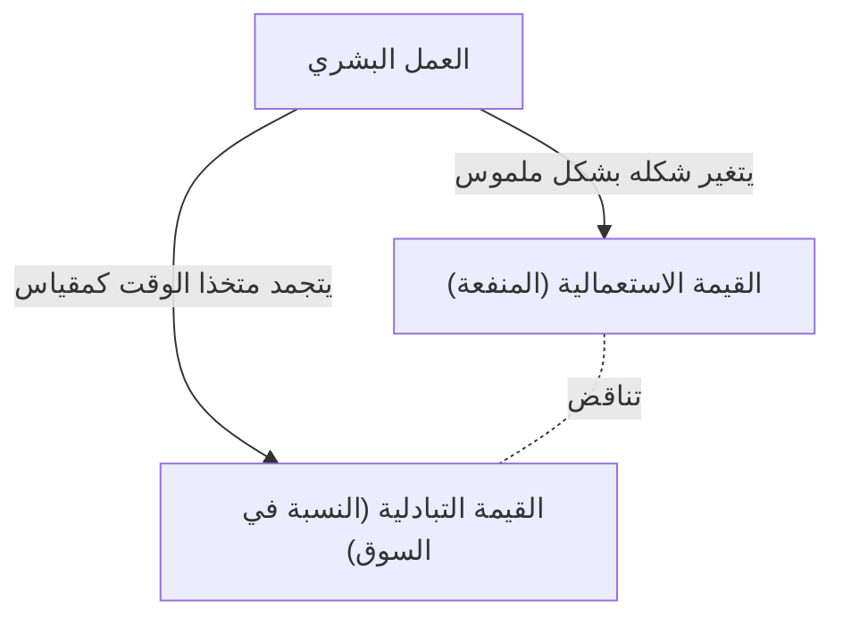

## 1. مقدمة: الثورة الصناعية في القرن التاسع عشر وولادة "رأس المال"

إن كتاب "رأس المال" (Das Kapital)، الذي نُشر مجلده الأول في عام 1867 بقلم كارل ماركس، ليس مجرد كتاب متخصص في الاقتصاد، بل هو منظومة معرفية ضخمة يمكن اعتبارها تاريخًا للبشرية، وفلسفة، وعلم اجتماع، وحتى نوعًا من الفيزياء الاجتماعية. لقد وُلد هذا العمل في منتصف القرن التاسع عشر، حين كانت أوروبا محاطة بحرارة ودخان الثورة الصناعية. أدى اختراع المحرك البخاري إلى ظهور فرع جديد في الفيزياء وهو الديناميكا الحرارية، وفي الوقت نفسه أعاد تشكيل البنية الاجتماعية من جذورها. إن النظرة الهندسية التي سعت إلى رفع كفاءة تحويل الطاقة إلى أقصى حد ممكن، تزامنت في النهاية مع المنطق البارد لنمط الإنتاج الرأسمالي حول كيفية تحويل "العمل البشري" نفسه كمصدر للطاقة بكفاءة إلى ثروة (رأس مال).

لقد حاول ماركس فك شفرة المخطط التصميمي لهذه "الآلة الاجتماعية" الضخمة. لم يتوقف تحليله عند التقلبات السطحية للأسعار أو قوانين العرض والطلب (والتي كانت محور تركيز الاقتصاد الكلاسيكي في ذلك الوقت)، بل كشف للعلن عن "آليات إنتاج القيمة والاستغلال" التي تعمل في أعماقها. في هذا المقال، سنقوم بتفكيك جوهر كتاب "رأس المال" لماركس بالتفصيل من منظور معاصر، مع دمج الخلفيات الفيزيائية والتاريخية والتقنية.

## 2. الطبيعة المزدوجة للسلعة: القيمة الاستعمالية والقيمة التبادلية

يبدأ "رأس المال" بافتتاحية شهيرة تنص على أن "ثروة المجتمعات التي يسود فيها نمط الإنتاج الرأسمالي تظهر كـ'تجمع هائل من السلع'". بدأ ماركس تشريحه بتحليل "السلعة" (Commodity)، التي تعد الخلية الأساسية للرأسمالية.

للسلع وجهان مختلفان.
أولاً، **"القيمة الاستعمالية" (Use-value)**. وتشير إلى الفائدة المادية أو الكيميائية أو النفسية التي يلبي بها الشيء حاجة بشرية معينة. الحديد يصبح مطرقة لأنه صلب، والخبز يسد الجوع لأنه مغذٍ. تعتمد القيمة الاستعمالية على الخصائص الفيزيائية للمادة، وهي صفة عالمية توجد بغض النظر عن التغيرات في التاريخ أو النظم الاجتماعية.

ثانيًا، **"القيمة التبادلية" (Exchange-value)**، أو ببساطة "القيمة". في السوق، يتم تبادل السلع التي لها قيم استعمالية مختلفة تمامًا (على سبيل المثال، معطف واحد وعشرة أمتار من الكتان) على أنها ذات "قيمة متساوية". عندما يتم المساواة بين شيئين يختلفان في الخصائص الفيزيائية والاستخدامات، فلا بد من وجود "مقياس مشترك" ما بينهما. استنتج ماركس ببراعة أن هذا المقياس المشترك هو بالضبط **"العمل البشري المجرد" (Abstract human labor)**.

### 2.1 وقت العمل الضروري اجتماعيًا

يتحدد حجم القيمة بكمية العمل المبذول لإنتاج تلك السلعة، وتحديدًا "وقت العمل". ومع ذلك، هذا لا يعني أن السلعة التي يصنعها شخص كسول ويستغرق فيها وقتًا طويلاً ستكون قيمتها أعلى. لقد عرّف ماركس هذا بـ **"وقت العمل الضروري اجتماعيًا" (Socially necessary labor time)**. وهو "وقت العمل المطلوب لإنتاج قيمة استعمالية معينة في ظل ظروف الإنتاج القياسية، وبمتوسط درجة من مهارة وكثافة العمل".

إذا حدث ابتكار تكنولوجي وتم إدخال آلات ضاعفت الإنتاجية، فإن وقت العمل الضروري اجتماعيًا المتجمد في سلعة واحدة سينخفض إلى النصف، وستصبح قيمة تلك السلعة أيضًا النصف. وهنا يكمن مصدر ديناميكية الرأسمالية التي تسعى بلا توقف نحو الابتكار التكنولوجي.

## 3. التحول إلى النقد و"صنمية السلع"

عندما يصبح تبادل السلع شاملاً، تنفصل سلعة واحدة مميزة لتكون المعادل العام الذي تُقاس به قيمة جميع السلع الأخرى. هذا هو **النقد (Money)**. تاريخياً، لعبت المعادن الثمينة مثل الذهب والفضة هذا الدور.

لقد سهّل ظهور النقد عملية تبادل السلع بشكل كبير، ولكنه في الوقت نفسه أحدث وهماً غريباً في الإدراك البشري. أطلق ماركس على هذا اسم **"صنمية السلع" (Commodity Fetishism)**.
وهي ظاهرة تبدو فيها قيمة السلع وكأنها "علاقة بين الأشياء (العلاقة بين السلعة والنقد)"، رغم أنها في الأصل نتاج "علاقات اجتماعية بين البشر (تقسيم العمل والتبادل)". نحن نتوهم أن الورقة النقدية من فئة العشرة آلاف ين تمتلك قيمة في حد ذاتها، وننسى شبكة العمل التي قام بها عدد لا يحصى من الناس من ورائها. هذا هو نفس الهيكل في سلاسل التوريد المعقدة للغاية اليوم؛ فعندما نمسك بهاتف ذكي، لا ندرك على الإطلاق العمل الشاق في استخراج المعادن النادرة أو عمل التجميع في المصانع.

## 4. صيغة رأس المال ولغز فائض القيمة

الصيغة البسيطة لتداول السلع هي **W - G - W (سلعة - نقد - سلعة)**. على سبيل المثال، يبيع المزارع القمح (W) الذي أنتجه ليحصل على النقد (G)، ثم يشتري به ملابس (W). الغرض هنا هو "الحصول على قيمة استعمالية مختلفة"، وتنتهي العملية عند هذا الحد.

ومع ذلك، فإن حركة رأس المال مختلفة. صيغتها هي **G - W - G' (نقد - سلعة - نقد أكثر)**.
يستثمر الرأسمالي النقد (G) لشراء سلعة (W)، ثم يبيعها ليحصل على نقد (G') أكثر مما بدأ به. هذه القيمة الزائدة (G' - G) هي ما أسماه ماركس **"فائض القيمة" (Surplus Value)**.

هنا ينشأ لغز كبير. إذا تم الالتزام بمبدأ التبادل المتكافئ (البيع والشراء وفقاً للقيمة) في السوق، فمن المستحيل أن تتكاثر القيمة وكأنها تنشأ من العدم. إن الثروة الإجمالية للمجتمع لا تزيد بمجرد الاحتيال (التبادل غير المتكافئ) بشراء شيء بسعر رخيص وبيعه بسعر باهظ. إذن، من أين ينبع فائض القيمة؟

### 4.1 قوة العمل كسلعة خاصة

كانت الإجابة التي اكتشفها ماركس هي وجود سلعة خاصة في السوق تمتلك قيمة استعمالية سحرية تتمثل في "خلق قيمة جديدة عند استخدامها". هذه السلعة هي **"قوة العمل" (Labor power)**.

الرأسمالي لا يشتري العمال كعبيد، بل يشتري "قدرتهم على العمل لفترة معينة (قوة العمل)" كسلعة. وتتحدد قيمة قوة العمل (= الأجر)، شأنها شأن أي سلعة أخرى، بـ "وقت العمل الاجتماعي اللازم لإعادة إنتاجها". بعبارة أخرى، هي تكاليف المعيشة (الطعام، الإيجار، الملابس، إلخ) الضرورية ليتمكن العامل من الذهاب إلى العمل بنشاط غدًا، وإعالة أسرته، وتربية الجيل القادم من العمال.

لنفترض أن قيمة قوة العمل ليوم واحد (تكلفة المعيشة) تعادل القيمة التي يتم إنتاجها في 6 ساعات من العمل. لقد اشترى الرأسمالي قوة العمل هذه ليوم واحد. لكن الرأسمالي لا يسمح للعامل بالعودة إلى منزله بعد 6 ساعات. بل يجعله يعمل لمدة 8 ساعات، أو 10 ساعات.

- **وقت العمل الضروري (6 ساعات)**: الوقت لإعادة إنتاج القيمة المعادلة لأجره.
- **وقت العمل الفائض (4 ساعات)**: الوقت لإنتاج قيمة مجانية لصالح الرأسمالي.

القيمة التي يتم إنتاجها خلال وقت العمل الفائض هذا هي بالضبط حقيقة "فائض القيمة". **الاستغلال (Exploitation)** ليس مصطلحًا للإدانة الأخلاقية، بل هو مفهوم علمي يشير إلى هذه الآلية الاقتصادية الموضوعية حيث "يحصل الرأسمالي على الفرق بين القيمة التي ينتجها العامل والقيمة التي يتلقاها العامل (فائض القيمة)".

## 5. فائض القيمة المطلق وفائض القيمة النسبي

هناك طريقتان رئيسيتان يمكن للرأسمالي من خلالهما زيادة فائض القيمة.

### 5.1 إنتاج فائض القيمة المطلق
هذه طريقة بسيطة للغاية وتتمثل في **"إطالة وقت العمل"**. إذا كان وقت العمل الضروري 6 ساعات، وتم تمديد وقت العمل من 10 إلى 12 ثم إلى 14 ساعة، فإن وقت العمل الفائض سيزداد من 4 إلى 6 ثم إلى 8 ساعات.
في إنجلترا في القرن التاسع عشر، تم تمديد ساعات العمل بلا حدود، وأُجبرت النساء بل وحتى الأطفال على العمل لأكثر من 15 ساعة يوميًا في ظروف مزرية. البشر كائنات بيولوجية لها حدود جسدية، والإرهاق يعني حرفياً "استهلاك" قوة العمل والتخلص منها. من منظور الديناميكا الحرارية، كانت هذه محاولة لاستخراج الطاقة من المحرك العضوي لجسم الإنسان بما يتجاوز حدوده. وبسبب نضال العمال ضد هذا، واللوائح القانونية التي فرضتها الدولة (قوانين المصانع)، تم وضع حد أقصى قانوني ليوم العمل.

### 5.2 إنتاج فائض القيمة النسبي
عندما يواجه الرأسمال قيوداً على إطالة وقت العمل، فإنه يلجأ إلى طريقة أخرى. وهي **"تقليص وقت العمل الضروري"**.
لنفترض أن يوم العمل الإجمالي ثابت عند 10 ساعات. إذا تحسنت إنتاجية المجتمع ككل وأصبح من الممكن إنتاج الغذاء والملابس بتكلفة أقل، فإن تكلفة المعيشة اللازمة للحفاظ على قوة العمل ستنخفض. ونتيجة لذلك، إذا تقلص وقت العمل الضروري من 6 ساعات إلى 4 ساعات، فإن وقت العمل الفائض سيزداد من 4 ساعات إلى 6 ساعات، حتى لو لم يتغير إجمالي وقت العمل.

لتحقيق ذلك، تقوم الرأسمالية باستمرار بالابتكار التكنولوجي، وإدخال الآلات، وتطوير تقسيم العمل. إن السبب الذي جعل الرأسمالية تولد قوى إنتاجية هائلة غير مسبوقة في التاريخ يكمن في هذه القوة الدافعة اللانهائية سعياً وراء "فائض القيمة النسبي".

## 6. الآلة والصناعة الكبرى: إخضاع العمل بواسطة التكنولوجيا

يُعد الفصل الثالث عشر من المجلد الأول من "رأس المال"، المعنون "الآلات والصناعة الكبرى"، نصًا تاريخيًا كلاسيكيًا يناقش العلاقة بين التكنولوجيا والمجتمع. لقد أدرك ماركس أن الانتقال من الأدوات إلى الآلات يحمل معنى أكبر بكثير من مجرد زيادة في الإنتاجية.

في عصر الصناعات اليدوية، كان العامل يتحكم في أدواته بإرادته ومهارته (**الإخضاع الشكلي للعمل**). ومع ذلك، عندما تم إدخال المحرك البخاري ونظام الآلات المعقد، انعكست العلاقة. أصبح نظام الآلات الضخم هو الفاعل الرئيسي في الإنتاج، وانحدر العامل إلى "ملحق واعٍ" يخدم حركات تلك الآلة (**الإخضاع الحقيقي للعمل**).

لم يتم إدخال الآلات لتقليل العبء عن العمال، بل عملت كوسيلة لتبسيط العمل، وجلب قوة العمل الرخيصة للنساء والأطفال إلى المصانع، وإجبار العمال على العمل ليلاً لتسريع استهلاك الآلات. لم يرفض ماركس التكنولوجيا بحد ذاتها، بل انتقد "العلاقات الاجتماعية حيث تُستخدم التكنولوجيا فقط كوسيلة لزيادة رأس المال". وهذا يقدم رؤى ثاقبة للغاية عند التفكير في إدارة العمل اليوم عبر الذكاء الاصطناعي، والروبوتات، والخوارزميات (مثل عمال الوظائف المؤقتة أو Gig workers).

## 7. تراكم رأس المال وفائض السكان النسبي (جيش الاحتياط الصناعي)

لا يستهلك الرأسماليون كل فائض القيمة الذي يحصلون عليه، بل يستثمرون جزءًا منه مرة أخرى كرأس مال جديد. هذا هو **"تراكم رأس المال"**. تتوسع المصانع ويتم إدخال المزيد من الآلات.

مع تقدم تراكم رأس المال، يتطور تكوين رأس المال (نسبة رأس المال الثابت مثل الآلات والمواد الخام، إلى رأس المال المتغير وهو قوة العمل). بعبارة أخرى، يصبح من الممكن تشغيل عدد كبير من الآلات بعدد قليل من العمال. ونتيجة لذلك، حتى لو نما رأس المال، فإن الطلب على العمالة لا يزداد بنفس النسبة.

وبسبب هذا، يتم خلق جيش من العاطلين عن العمل وشبه العاطلين في المجتمع باستمرار. أطلق ماركس على هذا اسم **"فائض السكان النسبي"** أو **"جيش الاحتياط الصناعي" (Reserve army of labor)**.
إن وجود جيش الاحتياط الصناعي ملائم للرأسمالية. لأن وجود حشود من العاطلين المنتظرين في الخارج يشكل دائماً ضغطاً قوياً على العمال العاملين ("يوجد الكثير من البدائل")، مما يقمع ارتفاع الأجور ويجبرهم على تكثيف العمل. في أوقات الازدهار، تمتص الرأسمالية قوة العمل من هذا الجيش الاحتياطي، وفي أوقات الركود، تلقي بهم في الشوارع أولاً.

## 8. التراكم الأولي: الفجر العنيف للرأسمالية

لكي تعمل الرأسمالية، يجب أن يوجد منذ البداية "رأسماليون يمتلكون النقد" و"عمال معدمون (بروليتاريا) لا يملكون شيئاً يبيعونه سوى قوة عملهم". ومع ذلك، هذا الوضع لم ينشأ بشكل طبيعي.

في الفصول الأخيرة من المجلد الأول، في فصل "ما يسمى بالتراكم الأولي"، يصور ماركس ما قبل تاريخ الرأسمالية. وهو تاريخ سلب الأراضي بعنف من الفلاحين ودفعهم كعمال مأجورين إلى مصانع المدن، كما تجلى ذلك في "التسييج" (Enclosure) في إنجلترا. وكذلك الاستيلاء على الثروات من خلال الاستعمار، وتجارة الرقيق، ومذابح السكان الأصليين.
كتب ماركس: "يأتي رأس المال إلى العالم وهو ينزف دماً وقذارة من كل مسامه، من رأسه حتى أخمص قدميه". وراء التبادل السلمي المتكافئ للرأسمالية، يختبئ تاريخ من الاستغلال البدائي بواسطة عنف الدولة.

## 9. أهمية "رأس المال" في العصر الحديث

لقد مر أكثر من 150 عامًا منذ أن أكمل ماركس كتابة "رأس المال". لقد تغير شكل الرأسمالية الحديثة إلى الرأسمالية المالية، والعولمة، ورأسمالية المعلومات الرقمية. وانتقل العديد من العمال من ذوي الياقات الزرقاء إلى ذوي الياقات البيضاء، ثم إلى قطاع الخدمات.

ومع ذلك، فإن رؤى "رأس المال" لم تبْلَ أبدًا.
اليوم، تقوم شركات تكنولوجيا المعلومات العملاقة بامتصاص الوقت وبيانات السلوك التي نقضيها في الفضاء الرقمي (والتي يمكن اعتبارها أيضًا نوعًا من العمل) مجانًا، وتحولها إلى ثروة هائلة (فائض قيمة). كما أن التوسع في العمالة غير المنتظمة واقتصاد العمل الحر يجسد تمامًا تشكيل "جيش الاحتياط الصناعي" الحديث وزعزعة استقرار قوة العمل. إن تدمير البيئة العالمية (تغير المناخ) هو أيضًا نتيجة حتمية لحركة رأس المال التي تستغل الطبيعة كمورد مجاني بلا حدود (وقد حذر ماركس من ذلك بوصفه "صدعًا في الأيض").

إن كتاب "رأس المال" ليس مجرد كتاب يتنبأ بنهاية الرأسمالية، بل هو المخطط النهائي الذي شَرَّح "كيف تعمل". من أجل فهم الأزمات التي نواجهها حاليًا من تفاوت اقتصادي، وشعور بالاغتراب، وأزمة استدامة النظام، ومن أجل تصور نظام اجتماعي جديد بعد ذلك، نحتاج إلى إعادة قراءة هذا الإطار الفكري الذي تركه ماركس بعمق مرة أخرى.
