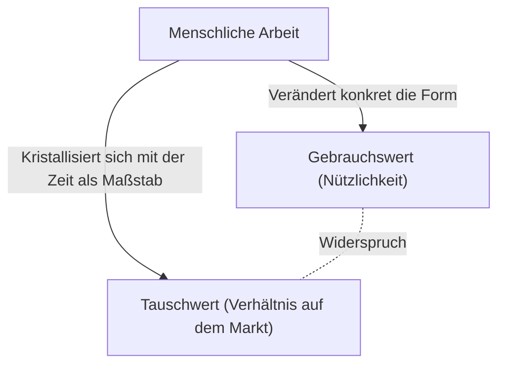
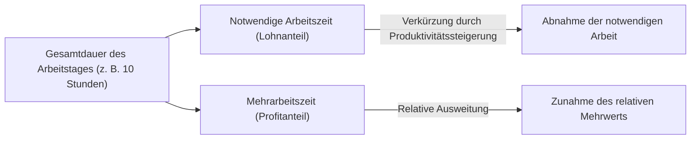

## 1. Einleitung: Die industrielle Revolution des 19. Jahrhunderts und die Entstehung von "Das Kapital"

"Das Kapital", dessen ersten Band Karl Marx 1867 veröffentlichte, ist nicht nur ein ökonomisches Fachbuch, sondern ein grandioses Wissenssystem, das auch als Menschheitsgeschichte, Philosophie, Soziologie und sogar als eine Art Sozialphysik bezeichnet werden kann. Das Europa Mitte des 19. Jahrhunderts, in dem dieses Werk entstand, war von der Hitze und dem schwarzen Rauch der industriellen Revolution eingehüllt. Die Erfindung der Dampfmaschine brachte nicht nur den neuen physikalischen Bereich der Thermodynamik hervor, sondern veränderte auch die Gesellschaftsstruktur von Grund auf. Der ingenieurstechnische Blick, der die Energieumwandlungseffizienz auf das Äußerste steigern wollte, synchronisierte sich bald mit der eiskalten Logik der kapitalistischen Produktionsweise, wie "menschliche Arbeit" als Energiequelle am effizientesten in Reichtum (Kapital) umgewandelt werden kann.

Marx versuchte, den Bauplan dieser gigantischen "Maschine namens Gesellschaft" zu entschlüsseln. Seine Analyse beschränkte sich nicht auf oberflächliche Preisschwankungen oder die Gesetze von Angebot und Nachfrage (worauf sich die damalige klassische Nationalökonomie konzentrierte), sondern brachte den in der Tiefe wirkenden "Mechanismus der Wertschöpfung und Ausbeutung" ans Tageslicht. In diesem Artikel werden wir den Kern von Marx' "Das Kapital" unter Einbeziehung physikalischer, historischer und technologischer Hintergründe aus heutiger Sicht im Detail entschlüsseln.

## 2. Der Doppelcharakter der Ware: Gebrauchswert und Tauschwert

Der Anfang von "Das Kapital" beginnt mit dem berühmten Satz: "Der Reichtum der Gesellschaften, in welchen kapitalistische Produktionsweise herrscht, erscheint als eine 'ungeheure Waresammlung'". Marx begann seine Anatomie mit der Analyse der "Ware", der Zelle des Kapitalismus.

Die Ware hat zwei verschiedene Gesichter.
Erstens den **"Gebrauchswert"**. Dies bezeichnet die physikalische, chemische oder geistige Nützlichkeit des Gegenstandes, ein menschliches Bedürfnis zu befriedigen. Eisen wird zu einem Hammer, weil es hart ist, und Brot stillt den Hunger, weil es nahrhaft ist. Der Gebrauchswert hängt von den physikalischen Eigenschaften der Materie ab und ist eine universelle Eigenschaft, die auch bei Veränderungen von Geschichte und Gesellschaftssystemen bestehen bleibt.

Zweitens den **"Tauschwert"** oder einfach "Wert". Auf dem Markt werden Waren mit völlig unterschiedlichen Gebrauchswerten (zum Beispiel 1 Rock und 10 Meter Leinwand) als "gleicher Wert" ausgetauscht. Wenn zwei Dinge mit unterschiedlichen physikalischen Eigenschaften und Verwendungszwecken gleichgesetzt werden, muss es einen "gemeinsamen Maßstab" geben. Marx erkannte, dass dieser gemeinsame Maßstab die **"abstrakt menschliche Arbeit"** ist.

### 2.1 Gesellschaftlich notwendige Arbeitszeit

Die Größe des Wertes wird durch die Menge der Arbeit bestimmt, die für die Produktion der Ware aufgewendet wurde, konkret durch die "Arbeitszeit". Der Wert einer Ware, die von einem Faulenzer langsam hergestellt wurde, ist jedoch nicht höher. Marx definierte dies als **"gesellschaftlich notwendige Arbeitszeit"**. Dies ist die "Arbeitszeit, die erforderlich ist, um irgendeinen Gebrauchswert unter den vorhandenen gesellschaftlich-normalen Produktionsbedingungen und mit dem gesellschaftlichen Durchschnittsgrad von Geschick und Intensität der Arbeit herzustellen".

Wenn durch technologische Innovationen Maschinen eingeführt und die Produktivität verdoppelt wird, halbiert sich die in einer Ware kristallisierte gesellschaftlich notwendige Arbeitszeit, und auch der Wert dieser Ware halbiert sich. Hier liegt die Quelle der Dynamik des Kapitalismus, der unaufhörlich nach technologischer Innovation strebt.

## 3. Die Verwandlung in Geld und der "Warenfetischismus"

Wenn der Warenaustausch universell wird, trennt sich eine bestimmte Ware als allgemeines Äquivalent ab, das den Wert aller Waren misst. Das ist das **Geld**. Historisch übernahmen Edelmetalle wie Gold und Silber diese Rolle.

Das Aufkommen des Geldes hat den Warenaustausch drastisch erleichtert, führte aber gleichzeitig zu einer seltsamen Täuschung der menschlichen Wahrnehmung. Marx nennt dies den **"Fetischcharakter der Ware"**.
Obwohl der Wert einer Ware eigentlich durch "gesellschaftliche Beziehungen zwischen Menschen (Arbeitsteilung und Austausch)" geschaffen wird, erscheint er als "Verhältnis zwischen Dingen (Verhältnis zwischen Ware und Geld)". Wir unterliegen der Täuschung, als ob ein 10.000-Yen-Schein an sich Wert hätte, und vergessen das Netzwerk der Arbeit zahlloser Menschen, das dahintersteht. Dies ist dieselbe Struktur, als ob wir in den heutigen hochkomplexen Lieferketten beim Halten eines Smartphones überhaupt nicht an die harte Arbeit beim Abbau seltener Erden oder die Fließbandarbeit in der Fabrik denken.

## 4. Die allgemeine Formel des Kapitals und das Rätsel des Mehrwerts

Die Formel für die einfache Warenzirkulation lautet **W - G - W (Ware - Geld - Ware)**. Zum Beispiel verkauft ein Bauer den von ihm angebauten Weizen (W), um Geld (G) zu erhalten, womit er dann Kleidung (W) kauft. Der Zweck ist der "Erwerb verschiedener Gebrauchswerte", und der Prozess ist damit abgeschlossen.

Die Bewegung des Kapitals ist jedoch anders. Ihre Formel lautet **G - W - G' (Geld - Ware - mehr Geld)**.
Der Kapitalist investiert Geld (G), kauft Waren (W) und verkauft sie, um mehr Geld (G') als am Anfang zu erhalten. Diesen zusätzlichen Wert (G' - G) nannte Marx **"Mehrwert"**.

Hier entsteht ein großes Rätsel. Wenn das Prinzip des Äquivalentenaustauschs (Kauf und Verkauf nach Wert) auf dem Markt eingehalten wird, sollte es unmöglich sein, dass sich der Wert vermehrt, als ob etwas aus dem Nichts entstünde. Allein durch die betrügerische Handlung, billig zu kaufen und teuer zu verkaufen (Nichtäquivalentenaustausch), wächst der Reichtum der gesamten Gesellschaft nicht. Woher sprudelt also der Mehrwert?

### 4.1 Die Arbeitskraft als besondere Ware

Die Lösung, die Marx entdeckte, war, dass es auf dem Markt eine besondere Ware mit dem magischen Gebrauchswert gibt, "durch ihre Anwendung neuen Wert zu schaffen". Das ist die **"Arbeitskraft"**.

Der Kapitalist kauft Arbeiter nicht als Sklaven, sondern kauft ihre "Fähigkeit, eine bestimmte Zeit lang zu arbeiten (Arbeitskraft)" als Ware. Der Wert der Arbeitskraft (= Lohn) wird wie bei anderen Waren durch die "gesellschaftliche Arbeitszeit, die zu ihrer Reproduktion notwendig ist" bestimmt. Das sind die Lebenshaltungskosten (Lebensmittel, Miete, Kleidung usw.), die erforderlich sind, damit der Arbeiter morgen wieder gesund zur Arbeit kommt, seine Familie ernährt und die nächste Generation von Arbeitern aufzieht.

Angenommen, der Tageswert der Arbeitskraft (Lebenshaltungskosten) entspricht dem Wert, der in 6 Stunden Arbeit geschaffen wird. Der Kapitalist hat diese Arbeitskraft für einen Tag gekauft. Er wird den Arbeiter jedoch nicht nach 6 Stunden nach Hause schicken. Er lässt ihn 8 oder 10 Stunden arbeiten.

- **Notwendige Arbeitszeit (6 Stunden)**: Zeit zur Reproduktion des Wertes des eigenen Lohns
- **Mehrarbeitszeit (4 Stunden)**: Zeit, in der unentgeltlich Wert für den Kapitalisten geschaffen wird

Der durch diese Mehrarbeitszeit geschaffene Wert ist die wahre Natur des "Mehrwerts". **Ausbeutung** ist kein moralischer Vorwurf, sondern ein wissenschaftlicher Begriff, der diesen objektiven ökonomischen Mechanismus bezeichnet: "Der Kapitalist eignet sich die Differenz zwischen dem vom Arbeiter geschaffenen Wert und dem vom Arbeiter erhaltenen Wert (Mehrwert) an".

## 5. Absoluter Mehrwert und relativer Mehrwert

Es gibt im Wesentlichen zwei Methoden für Kapitalisten, den Mehrwert zu erhöhen.

### 5.1 Produktion des absoluten Mehrwerts
Dies ist sehr einfach: **"Verlängerung der Arbeitszeit"**. Wenn die notwendige Arbeitszeit 6 Stunden beträgt und der Arbeitstag von 10 auf 12 oder 14 Stunden verlängert wird, steigt die Mehrarbeitszeit von 4 auf 6 oder 8 Stunden.
Im England des 19. Jahrhunderts wurde die Arbeitszeit grenzenlos verlängert, und selbst Frauen und Kinder wurden gezwungen, über 15 Stunden am Tag unter miserablen Bedingungen zu arbeiten. Der Mensch ist ein biologisches Wesen mit physischen Grenzen, und Überarbeitung bedeutet buchstäblich, die Arbeitskraft "wegzuwerfen". Thermodynamisch gesehen war dies der Versuch, dem organischen Motor des menschlichen Körpers über seine Grenzen hinaus Energie zu entziehen. Durch den Kampf der Arbeiter dagegen und die staatliche Regulierung (Fabrikgesetze) wurden schließlich gesetzliche Obergrenzen für den Arbeitstag eingeführt.

### 5.2 Produktion des relativen Mehrwerts
Wenn der Verlängerung der Arbeitszeit Grenzen gesetzt sind, wählt das Kapital eine andere Methode. Das ist die **"Verkürzung der notwendigen Arbeitszeit"**.
Angenommen, der gesamte Arbeitstag ist auf 10 Stunden fixiert. Wenn sich die Produktivität der gesamten Gesellschaft verbessert und Lebensmittel sowie Kleidung billiger hergestellt werden können, sinken die Lebenshaltungskosten zur Erhaltung der Arbeitskraft. Wenn dadurch die notwendige Arbeitszeit von 6 auf 4 Stunden verkürzt wird, steigt die Mehrarbeitszeit von 4 auf 6 Stunden, obwohl sich die Gesamtarbeitszeit nicht ändert.

Um dies zu erreichen, führt der Kapitalismus unaufhörlich technologische Innovationen durch, führt Maschinen ein und verfeinert die Arbeitsteilung. Der Grund, warum der Kapitalismus historisch beispiellose, gewaltige Produktivkräfte hervorgebracht hat, liegt in dieser unendlichen Triebkraft nach "relativem Mehrwert".

## 6. Maschinerie und große Industrie: Subsumtion der Arbeit durch Technologie

Das 13. Kapitel des ersten Bandes von "Das Kapital", "Maschinerie und große Industrie", ist ein historisches Meisterwerk, das die Beziehung zwischen Technologie und Gesellschaft diskutiert. Marx erkannte, dass der Übergang vom Werkzeug zur Maschine mehr als nur eine bloße Produktivitätssteigerung bedeutete.

Im Zeitalter des Handwerks lenkte der Arbeiter das Werkzeug mit seinem Willen und seinen Fähigkeiten (**formelle Subsumtion der Arbeit**). Mit der Einführung der Dampfmaschine und komplexer Maschinensysteme kehrt sich das Verhältnis jedoch um. Das gigantische Maschinensystem wird zum Subjekt der Produktion, und der Arbeiter wird zu einem "bewussten Anhängsel" degradiert, das den Bewegungen der Maschine dient (**reelle Subsumtion der Arbeit**).

Maschinen wurden nicht eingeführt, um die Belastung der Arbeiter zu verringern, sondern um die Arbeit zu vereinfachen, billige Arbeitskräfte wie Frauen und Kinder in die Fabriken zu ziehen und als Mittel, um Nachtarbeit zu erzwingen, um die Abschreibung der Maschinen zu beschleunigen. Marx lehnte nicht die Technologie an sich ab, sondern kritisierte "gesellschaftliche Verhältnisse, in denen Technologie ausschließlich als Mittel zur Kapitalvermehrung eingesetzt wird". Dies liefert äußerst scharfsinnige Einsichten, wenn wir über moderne KI, Robotik und algorithmisches Arbeitsmanagement (wie bei Gig-Workern) nachdenken.

## 7. Kapitalakkumulation und relative Übervölkerung (industrielle Reservearmee)

Der Kapitalist konsumiert nicht den gesamten erhaltenen Mehrwert, sondern investiert einen Teil davon wieder als neues Kapital. Das ist die **"Kapitalakkumulation"**. Fabriken werden erweitert und mehr Maschinen eingeführt.

Mit fortschreitender Kapitalakkumulation wird die Zusammensetzung des Kapitals (das Verhältnis von konstantem Kapital wie Maschinen/Rohstoffen zu variablem Kapital als Arbeitskraft) höher. Das heißt, weniger Arbeiter können viele Maschinen bedienen. Folglich wächst die Nachfrage nach Beschäftigung nicht im gleichen Verhältnis wie das Kapital.

Dadurch entsteht in der Gesellschaft stets eine gewisse Masse von Arbeitslosen und Halbarbeitslosen. Marx nannte dies **"relative Übervölkerung"** oder **"industrielle Reservearmee"**.
Die Existenz einer industriellen Reservearmee ist für den Kapitalismus von Vorteil. Denn die Masse an Arbeitslosen, die draußen bereitsteht, übt einen starken Druck auf die beschäftigten Arbeiter aus ("Ihr seid jederzeit ersetzbar"), hält Lohnsteigerungen zurück und erzwingt eine Arbeitsintensivierung. In Zeiten des Booms absorbiert das System Arbeitskräfte aus der Reservearmee, in Krisenzeiten wirft es sie als Erstes auf die Straße.

## 8. Die ursprüngliche Akkumulation: Die gewaltsame Morgendämmerung des Kapitalismus

Damit der Kapitalismus funktionieren kann, müssen von Anfang an "Kapitalisten mit Geld" und "besitzlose Arbeiter (Proletariat), die außer ihrer Arbeitskraft nichts zu verkaufen haben", vorhanden sein. Eine solche Situation ist jedoch nicht auf natürliche Weise entstanden.

Im Kapitel "Die sogenannte ursprüngliche Akkumulation" am Ende des ersten Bandes beschreibt Marx die Vorgeschichte des Kapitalismus. Es ist die Geschichte, in der den Bauern durch die "Einhegungen" (Enclosures) in England gewaltsam das Land geraubt und sie als Lohnarbeiter in die städtischen Fabriken getrieben wurden. Es ist die Ausbeutung von Reichtum durch Kolonialismus, Sklavenhandel und den Völkermord an Indigenen.
Marx schrieb: "Das Kapital kommt von Kopf bis Fuß, aus allen Poren, blut- und schmutztriefend zur Welt". Hinter dem friedlichen Äquivalentenaustausch des Kapitalismus verbirgt sich die Geschichte der ursprünglichen Ausbeutung durch staatliche Gewalt.

## 9. Die Bedeutung von "Das Kapital" in der heutigen Zeit

Mehr als 150 Jahre sind vergangen, seit Marx "Das Kapital" geschrieben hat. Der moderne Kapitalismus hat sich in Finanzkapitalismus, Globalisierung und digitalen Informationskapitalismus verwandelt. Viele Arbeiter sind von Blue-Collar zu White-Collar und in den Dienstleistungssektor gewechselt.

Dennoch sind die Erkenntnisse aus "Das Kapital" keineswegs veraltet.
Heute saugen riesige IT-Konzerne unsere Zeit und Verhaltensdaten im digitalen Raum (was ebenfalls als eine Art Arbeit betrachtet werden kann) kostenlos ab und verwandeln sie in enormen Reichtum (Mehrwert). Die Ausweitung der prekären Beschäftigung und die Gig-Economy verkörpern genau die Bildung der modernen "industriellen Reservearmee" und die Destabilisierung der Arbeitskraft. Auch die Zerstörung der globalen Umwelt (Klimawandel) ist eine unvermeidliche Konsequenz der Kapitalbewegung, die die Natur grenzenlos als kostenlose Ressource ausbeutet (Marx warnte davor als "Riss im Stoffwechsel").

"Das Kapital" ist nicht einfach ein Buch, das das Ende des Kapitalismus prophezeit, sondern der ultimative Bauplan, der anatomisch aufzeigt, "wie er funktioniert". Um die wirtschaftliche Ungleichheit, die Entfremdung und die Krise der Nachhaltigkeit als System, mit denen wir derzeit konfrontiert sind, zu verstehen und ein neues Gesellschaftssystem für die Zukunft zu entwerfen, ist es notwendig, diesen von Marx hinterlassenen intellektuellen Rahmen noch einmal tiefgehend zu entschlüsseln.
