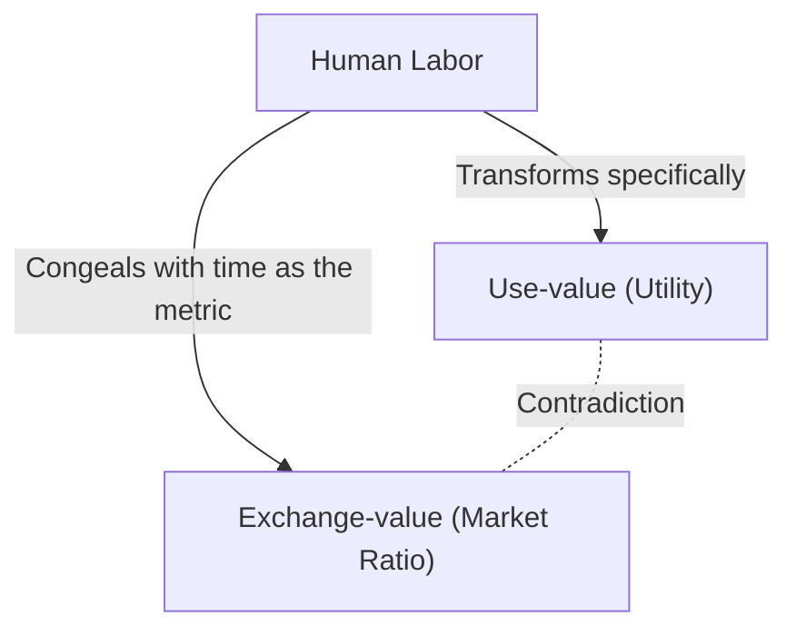
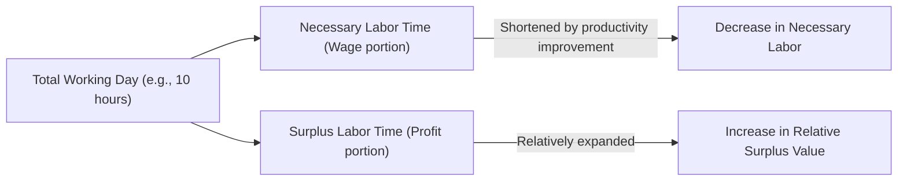

## 1. Introduction: The 19th Century Industrial Revolution and the Birth of "Das Kapital"

"Das Kapital" (Capital), of which Karl Marx published the first volume in 1867, is not merely a specialized book on economics, but a magnificent system of knowledge encompassing human history, philosophy, sociology, and what could be called a kind of social physics. Europe in the mid-19th century, when this work was born, was enveloped in the fervor and black smoke of the Industrial Revolution. The invention of the steam engine gave rise to a new field of physics called thermodynamics, and at the same time fundamentally remade the social structure. The engineering gaze, which sought to maximize the conversion efficiency of energy to its ultimate limit, eventually synchronized with the cold logic of the capitalist mode of production: how to efficiently convert "human labor" itself, as an energy source, into wealth (capital).

Marx attempted to decode the blueprint of this colossal "social machine." His analysis did not stop at superficial price fluctuations or the laws of supply and demand (which were the main focus of classical economics at the time), but brought to light the "mechanism of value production and exploitation" operating in its depths. In this article, intertwining physical, historical, and technological backgrounds, we will elucidate in detail the core of Marx's "Das Kapital" from a contemporary perspective.

## 2. The Dual Character of Commodities: Use-value and Exchange-value

The beginning of "Das Kapital" starts with the famous sentence: "The wealth of those societies in which the capitalist mode of production prevails, presents itself as an immense accumulation of commodities." Marx began his anatomy with an analysis of the "commodity," the cell of capitalism.

A commodity has two different faces.
First is **"Use-value"**. This refers to the physical, chemical, or spiritual utility of the object that satisfies some human desire. Iron becomes a hammer because it is hard, and bread satisfies hunger because it is nutritious. Use-value depends on the physical properties of matter and is a universal characteristic that exists even if history and social systems change.

Second is **"Exchange-value"**, or simply "value." In the market, commodities with completely different use-values (for example, 1 coat and 10 meters of linen) are exchanged as having the "same value." When two things with different physical properties and uses are connected by an equals sign, there must exist some "common metric" between them. Marx declared that this common metric is nothing other than **"Abstract human labor"**.

### 2.1 Socially Necessary Labor Time

The magnitude of value is determined by the amount of labor expended to produce that commodity, specifically by "labor time." However, this does not mean that a commodity made slowly by a lazy person will have a higher value. Marx defined this as **"Socially necessary labor time"**. This is the "labor time required to produce any use-value under the conditions of production normal for a given society and with the average degree of skill and intensity prevalent in that society."

If technological innovation occurs and machinery is introduced, doubling productivity, the socially necessary labor time congealed in a single commodity is halved, and the value of that commodity is also halved. Here lies the source of the dynamism of capitalism, which relentlessly pursues technological innovation.

## 3. The Transformation into Money and "Commodity Fetishism"

When the exchange of commodities becomes universal, one special commodity separates itself as the universal equivalent that measures the value of all commodities. That is **Money**. Historically, precious metals like gold and silver have played this role.

The advent of money dramatically smoothed out commodity exchange, but at the same time brought about a strange illusion in human perception. Marx calls this **"Commodity Fetishism"**.
Originally, the value of commodities is created by the "social relations between people" (the division and exchange of labor), but it is a phenomenon in which this appears as a "relation between things" (the relation between commodities and money). We fall into the illusion that a 10,000 yen note possesses value in itself, forgetting the network of countless people's labor that lies behind it. This is the exact same structure as when we hold a smartphone in today's highly complex supply chain, entirely unaware of the grueling labor of mining rare metals or the assembly labor in factories.

## 4. The Formula of Capital and the Mystery of Surplus Value

The simple formula for the circulation of commodities is **C - M - C (Commodity - Money - Commodity)**. For example, a farmer sells the wheat he grew (C) to obtain money (M), and uses it to buy clothes (C). The goal here is "the acquisition of a different use-value," and the process is complete at this point.

However, the movement of capital is different. Its formula is **M - C - M' (Money - Commodity - More Money)**.
A capitalist invests money (M) to buy commodities (C), and sells them to obtain more money (M') than at the start. Marx called this increased value (M' - M) **"Surplus Value"**.

Here arises a massive mystery. If the principle of equivalent exchange in the market (buying and selling at true value) is maintained, value should not multiply as if something is created from nothing. Fraudulent acts of buying cheap and selling dear (unequal exchange) alone do not increase the wealth of society as a whole. So, where does surplus value spring from?

### 4.1 The Special Commodity called Labor Power

The answer Marx discovered was that there exists a special commodity in the market with a magical use-value of "creating new value by being used." That is exactly **"Labor power"**.

Capitalists do not buy workers as slaves, but buy their "capacity to work for a certain time (labor power)" as a commodity. The value of labor power (= wages) is determined, like any other commodity, by the "socially necessary labor time to reproduce it." In other words, it is the living expenses (food, rent, clothing, etc.) necessary for the worker to report to work healthy the next day, support their family, and raise the next generation of workers.

Suppose that the value of one day's labor power (living expenses) is equal to the value produced by 6 hours of labor. The capitalist has purchased this labor power for one day. However, the capitalist will not let the worker go home after 6 hours. They make them work 8 hours, or 10 hours.

- **Necessary labor time (6 hours)**: The time to reproduce the value of one's own wages
- **Surplus labor time (4 hours)**: The time to create value for the capitalist without compensation

The value created by this surplus labor time is the true identity of "surplus value." **Exploitation** is not a term of moral condemnation, but a scientific concept referring to this objective economic mechanism where "the capitalist acquires the difference between the value produced by the worker and the value received by the worker (surplus value)."

## 5. Absolute and Relative Surplus Value

There are roughly two ways for capitalists to increase surplus value.

### 5.1 The Production of Absolute Surplus Value
This is very simple: **"prolonging the working day."** If necessary labor time is 6 hours, and the working day is extended from 10 hours to 12 or 14 hours, the surplus labor time increases from 4 hours to 6 or 8 hours.
In 19th century Britain, working hours were endlessly prolonged, and even women and children were forced to work in appalling conditions for over 15 hours a day. Humans are biological organisms with physical limits, and overwork literally means "throwing away" labor power. Thermodynamically speaking, it was an attempt to extract energy from the organic engine of the human body beyond its limits. Due to the struggles of workers countering this and legal regulations by the state (the Factory Acts), a legal upper limit was eventually set on the working day.

### 5.2 The Production of Relative Surplus Value
When the prolongation of working hours reaches its limits, capital takes another method. This is the **"curtailment of necessary labor time."**
Assume the total working day is fixed at 10 hours. If the productivity of society as a whole improves and food and clothing can be produced more cheaply, the living costs required to maintain labor power will decrease. As a result, if the necessary labor time is shortened from 6 hours to 4 hours, the surplus labor time increases from 4 hours to 6 hours, even though the total working time remains unchanged.

To realize this, capitalism constantly innovates technologically, introduces machinery, and heightens the division of labor. The reason why capitalism generated the most immense productive forces in history lies in this infinite driving force seeking "relative surplus value."

## 6. Machinery and Modern Industry: The Subsumption of Labor by Technology

Chapter 13 of Volume 1 of "Das Kapital", "Machinery and Modern Industry", is a historical masterpiece discussing the relationship between technology and society. Marx saw through the fact that the transition from tools to machinery meant more than just an improvement in productivity.

In the era of handicrafts, workers manipulated tools with their own will and skills (**Formal subsumption of labor**). However, with the introduction of steam engines and complex machine systems, the relationship reverses. The massive machine system becomes the subject of production, and the worker falls into a "conscious appendage" that serves the movements of the machine (**Real subsumption of labor**).

Machinery was introduced not to reduce the burden on workers, but functioned as a means to simplify labor, draw the cheap labor power of women and children into factories, and even force night work to hasten the depreciation of the machinery. Marx did not reject technology itself, but criticized "the social relations where technology is used solely as a means of valorizing capital." This provides extremely sharp insights when considering modern AI, robotics, and labor management by algorithms (such as gig workers).

## 7. The Accumulation of Capital and the Relative Surplus Population (Industrial Reserve Army)

Capitalists do not consume all the surplus value they have acquired; they invest a portion of it again as new capital. This is the **"Accumulation of Capital"**. Factories expand, and more machinery is introduced.

As the accumulation of capital progresses, the organic composition of capital (the ratio of constant capital such as machinery and raw materials to variable capital, which is labor power) becomes higher. In other words, a small number of workers can operate a large amount of machinery. As a result, even if capital grows, the demand for employment does not increase at the same rate.

Consequently, a certain mass of unemployed and semi-unemployed people is constantly generated in society. Marx called this the **"Relative Surplus Population"** or the **"Reserve army of labor"**.
The existence of the industrial reserve army is convenient for capitalism. This is because the mass of unemployed waiting outside constantly exerts a powerful pressure on employed workers ("there are plenty of replacements"), suppresses wage increases, and can force the intensification of labor. During economic booms, it absorbs labor power from the reserve army, and during depressions, it throws them out onto the streets first.

## 8. Primitive Accumulation: The Violent Dawn of Capitalism

For capitalism to function, "capitalists with money" and "propertyless workers (the proletariat) who have nothing to sell but their labor power" must exist from the very beginning. However, this situation did not arise naturally.

In the final chapters of Volume 1, "The So-Called Primitive Accumulation," Marx depicts the prehistory of capitalism. The history of violently stripping peasants of their land, represented by the "enclosures" in Britain, and driving them into urban factories as wage laborers. And the expropriation of wealth through colonialism, the slave trade, and the massacre of indigenous peoples.
"Capital comes dripping from head to foot, from every pore, with blood and dirt," Marx wrote. Behind the peaceful equivalent exchange of capitalism lies hidden the history of primal expropriation by state violence.

## 9. The Significance of "Das Kapital" in the Modern Age

More than 150 years have passed since Marx wrote "Das Kapital." Modern capitalism has transformed into financial capitalism, globalization, and digital information capitalism. Many workers have transitioned from blue-collar to white-collar, and then to the service industry.

However, the insights of "Das Kapital" have by no means become outdated.
Today, tech giants suck up the time and behavioral data we spend in the digital space (which can also be considered a kind of labor) for free, and convert it into massive wealth (surplus value). Moreover, the expansion of non-regular employment and the gig economy exactly embody the formation of a modern "industrial reserve army" and the destabilization of labor power. The destruction of the global environment (climate change) is also an inevitable consequence of the movement of capital that ruthlessly exploits nature as a free resource (Marx warned of this as a "metabolic rift").

"Das Kapital" is not a book that merely predicted the end of capitalism, but the ultimate blueprint that dissected "how it works." In order to understand the crisis of economic inequality, alienation, and systemic sustainability that we are currently facing, and to envision a new social system beyond it, we need to once again deeply decode this intellectual framework left by Marx.
