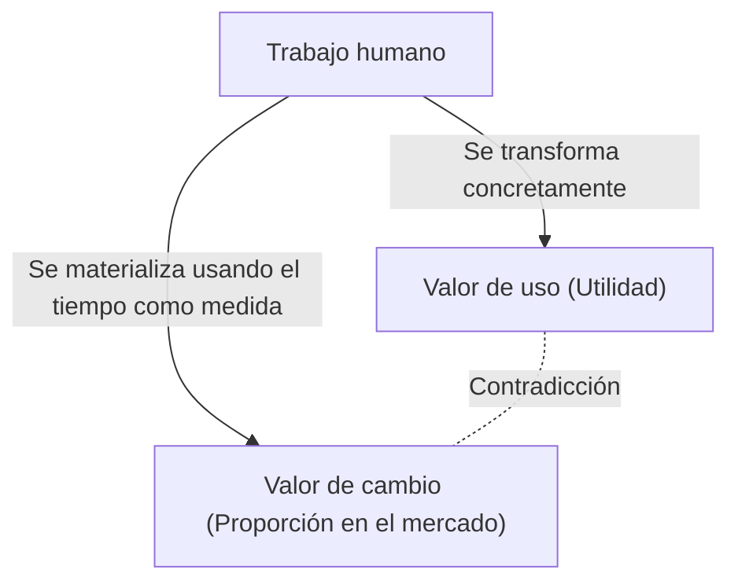
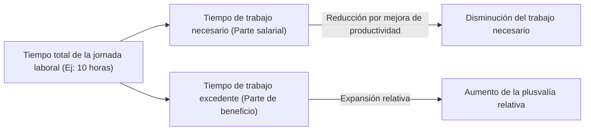

## 1. Introducción: La Revolución Industrial del siglo XIX y el nacimiento de "El Capital"

"El Capital" (Das Kapital), cuyo primer volumen fue publicado por Karl Marx en 1867, no es un mero tratado especializado de economía, sino un grandioso sistema de conocimiento que abarca la historia humana, la filosofía, la sociología y lo que podría llamarse una especie de física social. La Europa de mediados del siglo XIX, de donde surgió esta obra, estaba envuelta en el fervor y el humo negro de la Revolución Industrial. La invención de la máquina de vapor no solo dio lugar a la termodinámica, un nuevo campo de la física, sino que también transformó fundamentalmente la estructura de la sociedad. La mirada ingenieril que buscaba maximizar la eficiencia de la conversión de energía, pronto se sincronizó con la lógica implacable del modo de producción capitalista, que veía al "trabajo humano" en sí mismo como una fuente de energía y buscaba cómo convertirlo de la manera más eficiente en riqueza (capital).

Marx intentó descifrar los planos de esta gigantesca "máquina social". Su análisis no se detuvo en las fluctuaciones superficiales de los precios o en la ley de la oferta y la demanda (que era el enfoque principal de la economía clásica de la época), sino que expuso a la luz del día el "mecanismo de producción y explotación de valor" que operaba en sus profundidades. En este artículo, desentrañaremos en detalle desde una perspectiva contemporánea el núcleo de "El Capital" de Marx, entretejiendo el contexto físico, histórico y tecnológico.

## 2. La dualidad de la mercancía: Valor de uso y valor de cambio

El comienzo de "El Capital" se inicia con la famosa frase: "La riqueza de las sociedades en las que domina el modo de producción capitalista se presenta como un enorme cúmulo de mercancías". Marx comenzó su disección a partir del análisis de la "mercancía" (Commodity), la célula del capitalismo.

La mercancía tiene dos caras diferentes.
Primero, el **"Valor de uso (Use-value)"**. Esto se refiere a la utilidad física, química o espiritual de un objeto para satisfacer alguna necesidad humana. El hierro se convierte en un martillo porque es duro, y el pan satisface el apetito porque es nutritivo. El valor de uso depende de las propiedades físicas de la materia y es una cualidad universal que existe independientemente de los cambios en la historia o los sistemas sociales.

Segundo, el **"Valor de cambio (Exchange-value)"**, o simplemente "valor". En el mercado, mercancías con valores de uso completamente diferentes (por ejemplo, 1 chaqueta y 10 metros de lino) se intercambian como "el mismo valor". Cuando dos objetos con diferentes propiedades físicas y usos se igualan, debe existir allí alguna "medida común". Marx descubrió que esta medida común no es otra que el **"Trabajo humano abstracto (Abstract human labor)"**.

### 2.1 Tiempo de trabajo socialmente necesario

La magnitud del valor está determinada por la cantidad de trabajo, específicamente el "tiempo de trabajo", invertido para producir esa mercancía. Sin embargo, esto no significa que el valor de una mercancía producida por una persona perezosa que tarda mucho tiempo sea mayor. Marx definió esto como el **"Tiempo de trabajo socialmente necesario (Socially necessary labor time)"**. Se trata del "tiempo de trabajo necesario para producir cualquier valor de uso bajo las condiciones normales de producción y con el grado medio de destreza e intensidad de trabajo imperantes en una sociedad".

Si se produce una innovación tecnológica, se introducen máquinas y la productividad se duplica, el tiempo de trabajo socialmente necesario materializado en una mercancía se reduce a la mitad, y el valor de esa mercancía también se reduce a la mitad. Aquí radica la fuente del dinamismo por el cual el capitalismo persigue incesantemente la innovación tecnológica.

## 3. La transformación en dinero y el "Fetichismo de la mercancía"

Cuando el intercambio de mercancías se universaliza, una mercancía especial se separa como el equivalente general que mide el valor de todas las demás mercancías. Ese es el **Dinero (Money)**. Históricamente, metales preciosos como el oro y la plata asumieron ese papel.

La aparición del dinero facilitó dramáticamente el intercambio de mercancías, pero al mismo tiempo trajo una extraña ilusión a la percepción humana. Marx llama a esto el **"Fetichismo de la mercancía (Commodity Fetishism)"**.
Originalmente, aunque el valor de las mercancías es creado por las "relaciones sociales entre personas (división del trabajo e intercambio)", es un fenómeno en el que aparece como una "relación entre cosas (la relación entre mercancía y dinero)". Nos ilusionamos pensando que un billete de 10.000 yenes tiene valor por sí mismo y olvidamos la red del trabajo de innumerables personas que hay detrás de él. En la cadena de suministro altamente compleja de hoy, esta es la misma estructura que cuando tomamos un teléfono inteligente sin ser en absoluto conscientes del duro trabajo de extraer metales raros o el trabajo de ensamblaje en las fábricas.

## 4. La fórmula del capital y el enigma de la plusvalía

La fórmula de la circulación simple de mercancías es **M - D - M (Mercancía - Dinero - Mercancía)**. Por ejemplo, un campesino vende el trigo que ha cultivado (M) para obtener dinero (D), y con él compra ropa (M). El propósito de esto es la "adquisición de diferentes valores de uso", y el proceso concluye aquí.

Sin embargo, el movimiento del capital es diferente. Su fórmula es **D - M - D' (Dinero - Mercancía - Más dinero)**.
El capitalista invierte dinero (D) para comprar mercancías (M), y las vende para obtener más dinero (D') que al principio. Marx llamó a este valor incrementado (D' - D) la **"Plusvalía (Surplus Value)"**.

Aquí surge un enorme enigma. Si se respeta el principio de intercambio de equivalentes (compra y venta según el valor) en el mercado, es imposible que el valor se multiplique como si surgiera de la nada. La riqueza de toda la sociedad no aumenta solo mediante el acto fraudulento de comprar barato y vender caro (intercambio desigual). Entonces, ¿de dónde brota la plusvalía?

### 4.1 La fuerza de trabajo como mercancía especial

La respuesta que descubrió Marx fue que en el mercado existe una mercancía especial que posee el mágico valor de uso de "crear nuevo valor al ser utilizada". Esa es precisamente la **"Fuerza de trabajo (Labor power)"**.

Los capitalistas no compran a los trabajadores como esclavos, sino que compran su "capacidad para trabajar durante un cierto tiempo (fuerza de trabajo)" como una mercancía. El valor de la fuerza de trabajo (= salario) se determina, al igual que cualquier otra mercancía, por "el tiempo de trabajo social necesario para reproducirla". Es decir, el costo de vida (alimentos, alquiler, ropa, etc.) necesario para que el trabajador asista a trabajar con energía mañana, mantenga a su familia y críe a la próxima generación de trabajadores.

Supongamos que el valor de 1 día de fuerza de trabajo (costo de vida) equivale al valor producido por 6 horas de trabajo. El capitalista ha comprado esta fuerza de trabajo por 1 día. Sin embargo, el capitalista no permite que el trabajador se vaya a casa después de 6 horas. Los hace trabajar 8 horas, o 10 horas.

- **Tiempo de trabajo necesario (6 horas)**: El tiempo para reproducir el valor de su propio salario
- **Tiempo de trabajo excedente (4 horas)**: El tiempo para crear valor de forma gratuita para el capitalista

El valor creado por este tiempo de trabajo excedente es la verdadera identidad de la "plusvalía". La **Explotación (Exploitation)** no es una palabra de condena moral, sino un concepto científico que señala este mecanismo económico objetivo mediante el cual "el capitalista se apropia de la diferencia entre el valor creado por el trabajador y el valor que recibe el trabajador (la plusvalía)".

## 5. Plusvalía absoluta y plusvalía relativa

Hay principalmente dos formas en que los capitalistas pueden aumentar la plusvalía.

### 5.1 La producción de plusvalía absoluta
Esta es muy simple, es **"la prolongación del tiempo de trabajo"**. Si el tiempo de trabajo necesario es de 6 horas, al extender el tiempo de trabajo de 10 horas a 12 horas o 14 horas, el tiempo de trabajo excedente aumenta de 4 horas a 6 horas o 8 horas.
En la Inglaterra del siglo XIX, el tiempo de trabajo se prolongó sin límites, e incluso las mujeres y los niños se vieron obligados a trabajar más de 15 horas al día en entornos deplorables. Los seres humanos son organismos con límites físicos, y el exceso de trabajo significa literalmente "desechar" la fuerza de trabajo. Termodinámicamente hablando, era un intento de extraer energía del motor orgánico que es el cuerpo humano más allá de sus límites. A través de la lucha de los trabajadores para oponerse a esto y las regulaciones legales del Estado (Leyes de Fábricas), se estableció un límite legal a la jornada laboral.

### 5.2 La producción de plusvalía relativa
Cuando surge un límite en la prolongación del tiempo de trabajo, el capital adopta otro método. Esto es **"la reducción del tiempo de trabajo necesario"**.
Supongamos que toda la jornada laboral está fijada en 10 horas. Si la productividad de toda la sociedad mejora y los alimentos y la ropa se pueden producir a bajo costo, el costo de vida para mantener la fuerza de trabajo disminuye. Como resultado, si el tiempo de trabajo necesario se reduce de 6 a 4 horas, el tiempo de trabajo excedente aumenta de 4 a 6 horas, incluso si el tiempo total de trabajo no cambia.

Para lograr esto, el capitalismo realiza incesantemente innovaciones tecnológicas, introduce máquinas y avanza en la división del trabajo. La razón por la que el capitalismo generó una fuerza productiva gigantesca sin precedentes en la historia radica en esta fuerza impulsora infinita que busca la "plusvalía relativa".

## 6. La maquinaria y la gran industria: La subsunción del trabajo por la tecnología

El Capítulo 13, "Maquinaria y gran industria", del primer volumen de "El Capital", es un texto histórico que discute la relación entre la tecnología y la sociedad. Marx previó que la transición de las herramientas a la maquinaria tenía un significado mucho más allá de un simple aumento en la productividad.

En la era de la manufactura manual, los trabajadores manejaban las herramientas con su propia voluntad y habilidad (**subsunción formal del trabajo**). Sin embargo, con la introducción de la máquina de vapor y el complejo sistema de maquinaria, la relación se invierte. El gigantesco sistema de maquinaria se convierte en el sujeto de la producción, y el trabajador se ve relegado a un "apéndice consciente" que sirve al movimiento de esa máquina (**subsunción real del trabajo**).

Las máquinas no se introdujeron para reducir la carga de los trabajadores, sino para simplificar el trabajo, atraer la mano de obra barata de mujeres y niños a las fábricas, y además funcionar como un medio para forzar el trabajo nocturno a fin de acelerar la depreciación de las máquinas. Marx no negaba la tecnología en sí, sino que criticaba "las relaciones sociales en las que la tecnología se utiliza únicamente como un medio de valorización del capital". Esto ofrece implicaciones extremadamente agudas al considerar la gestión laboral contemporánea a través de la IA, la robótica y los algoritmos (como en el caso de los trabajadores de la economía colaborativa).

## 7. La acumulación de capital y la superpoblación relativa (el ejército industrial de reserva)

El capitalista no consume toda la plusvalía adquirida, sino que invierte una parte de ella nuevamente como nuevo capital. Esto es la **"Acumulación de capital"**. Las fábricas se expanden y se introducen más máquinas.

A medida que avanza la acumulación de capital, la composición del capital (la proporción entre el capital constante como máquinas y materias primas, y el capital variable que es la fuerza de trabajo) se vuelve más sofisticada. En otras palabras, se puede operar una gran cantidad de máquinas con menos trabajadores. Como resultado, aunque el capital crezca, la demanda de empleo no aumenta en la misma proporción.

De esta manera, en la sociedad se genera constantemente una masa de desempleados y subempleados. Marx llamó a esto la **"Superpoblación relativa"** o el **"Ejército industrial de reserva (Reserve army of labor)"**.
La existencia de este ejército industrial de reserva es conveniente para el capitalismo. Esto se debe a que la masa de desempleados siempre esperando afuera ejerce una fuerte presión sobre los trabajadores empleados ("hay muchos reemplazos"), conteniendo el aumento de los salarios y forzando la intensificación del trabajo. Durante los períodos de prosperidad, absorbe fuerza de trabajo del ejército de reserva, y durante los períodos de recesión, los arroja primero a la calle.

## 8. La acumulación originaria: El amanecer violento del capitalismo

Para que el capitalismo funcione, desde el principio deben existir "capitalistas con dinero" y "trabajadores desposeídos (el proletariado) que no tienen nada que vender excepto su fuerza de trabajo". Sin embargo, tal situación no surgió de forma natural.

Marx, en el capítulo "La llamada acumulación originaria" hacia el final del primer volumen, describe la prehistoria del capitalismo. La historia, representada por los "cercamientos" (enclosures) en Inglaterra, de arrebatar violentamente la tierra a los campesinos y empujarlos como trabajadores asalariados a las fábricas urbanas. Y la expropiación de la riqueza a través del colonialismo, el comercio de esclavos y la masacre de los pueblos indígenas.
"El capital viene al mundo chorreando sangre y lodo por todos los poros, desde la cabeza hasta los pies", escribió Marx. Detrás del intercambio pacífico de equivalentes del capitalismo, se esconde la historia de la expropiación originaria mediante la violencia estatal.

## 9. El significado de "El Capital" en la actualidad

Han pasado más de 150 años desde que Marx terminó de escribir "El Capital". El capitalismo contemporáneo se ha transformado en capitalismo financiero, globalización y capitalismo de la información digital. Muchos trabajadores han pasado del trabajo de cuello azul al cuello blanco, y luego al sector de servicios.

Sin embargo, las perspicacias de "El Capital" no han envejecido en absoluto.
Hoy en día, las gigantescas empresas de tecnología absorben gratuitamente el tiempo que pasamos en el espacio digital y los datos de comportamiento (lo cual también puede considerarse una especie de trabajo), convirtiéndolos en una riqueza gigantesca (plusvalía). Además, la expansión del empleo no regular y la economía colaborativa (gig economy) encarnan precisamente la formación del "ejército industrial de reserva" contemporáneo y la desestabilización de la fuerza de trabajo. La destrucción del medio ambiente global (cambio climático) también es la consecuencia inevitable del movimiento del capital, que explota la naturaleza sin límites como un recurso gratuito (Marx advirtió sobre esto como una "falla metabólica").

"El Capital" no es un libro que simplemente profetizó el fin del capitalismo, sino el plano definitivo que diseccionó "cómo funciona". Para comprender la crisis de desigualdad económica, alienación y sostenibilidad como sistema que enfrentamos en la actualidad, y para concebir un nuevo sistema social más allá de ella, es necesario volver a leer y descifrar profundamente este marco intelectual dejado por Marx.
