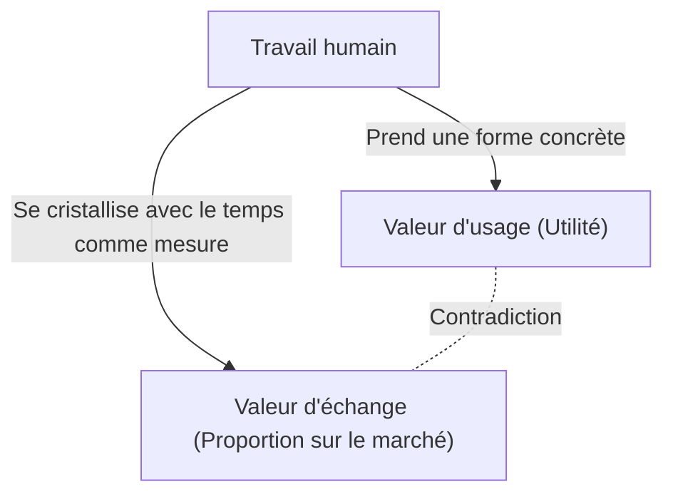
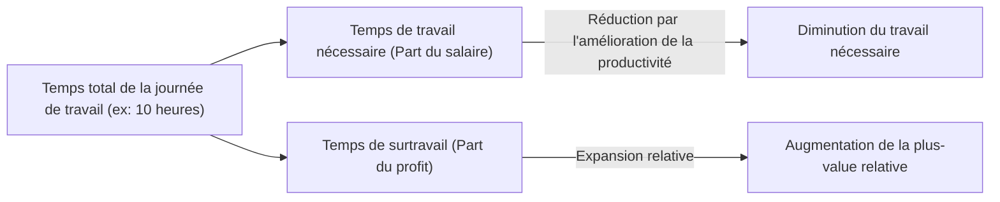

## 1. Introduction : La Révolution industrielle du XIXe siècle et la naissance du "Capital"

Publié pour la première fois en 1867 par Karl Marx, le premier livre du "Capital" (Das Kapital) n'est pas seulement un ouvrage spécialisé en économie, mais un vaste système de connaissances qui englobe l'histoire de l'humanité, la philosophie, la sociologie, et ce que l'on pourrait appeler une sorte de physique sociale. L'Europe du milieu du XIXe siècle, époque à laquelle cette œuvre a vu le jour, était enveloppée de la ferveur et de la fumée noire de la révolution industrielle. L'invention de la machine à vapeur a donné naissance à une nouvelle branche de la physique, la thermodynamique, tout en transformant radicalement la structure de la société. Cette vision ingénierique, cherchant à maximiser l'efficacité de la conversion énergétique, s'est bientôt synchronisée avec la logique froide du mode de production capitaliste : comment transformer le plus efficacement possible le "travail humain" lui-même, en tant que source d'énergie, en richesse (le capital).

Marx a tenté de déchiffrer les plans de cette gigantesque "machine sociale". Son analyse ne s'est pas limitée aux fluctuations superficielles des prix ou à la loi de l'offre et de la demande (sur lesquelles l'économie classique de l'époque se concentrait), mais a mis en lumière "les mécanismes de la production de la valeur et de l'exploitation" fonctionnant dans ses profondeurs. Dans cet article, tout en intégrant le contexte physique, historique et technologique, nous allons détailler et élucider le cœur du "Capital" de Marx d'un point de vue contemporain.

## 2. Le caractère double de la marchandise : Valeur d'usage et valeur d'échange

Le "Capital" s'ouvre sur une phrase célèbre : "La richesse des sociétés dans lesquelles règne le mode de production capitaliste s'annonce comme une 'immense accumulation de marchandises'." Marx a commencé son anatomie par l'analyse de la "marchandise" (Commodity), la cellule du capitalisme.

La marchandise possède deux visages distincts.
Premièrement, la **"valeur d'usage" (Use-value)**. Elle désigne l'utilité physique, chimique ou intellectuelle de la chose qui satisfait un besoin humain quelconque. Le fer devient un marteau parce qu'il est dur, le pain apaise la faim parce qu'il est nutritif. La valeur d'usage dépend des propriétés physiques de la matière et est une qualité universelle qui existe indépendamment des changements de l'histoire ou des institutions sociales.

Deuxièmement, la **"valeur d'échange" (Exchange-value)**, ou simplement la "valeur". Sur le marché, des marchandises ayant des valeurs d'usage totalement différentes (par exemple, un manteau et dix mètres de toile) s'échangent comme ayant "la même valeur". Lorsque deux objets aux propriétés physiques et aux usages différents sont mis sur un pied d'égalité, il doit y exister une "mesure commune". Marx a révélé que cette mesure commune n'est autre que le **"travail humain abstrait" (Abstract human labor)**.

### 2.1 Le temps de travail socialement nécessaire

La grandeur de la valeur est déterminée par la quantité de travail dépensée pour produire la marchandise, plus précisément par le "temps de travail". Cependant, cela ne signifie pas que la valeur d'une marchandise produite par un paresseux prenant son temps sera plus élevée. Marx a défini cela comme le **"temps de travail socialement nécessaire" (Socially necessary labor time)**. C'est "le temps de travail requis pour produire une valeur d'usage quelconque dans les conditions normales de production d'une société donnée, avec le degré moyen d'habileté et d'intensité du travail".

Si une innovation technologique survient, que des machines sont introduites et que la productivité double, le temps de travail socialement nécessaire cristallisé dans une marchandise est réduit de moitié, et la valeur de cette marchandise diminue également de moitié. C'est là que réside la source du dynamisme du capitalisme, qui poursuit sans cesse l'innovation technologique.

## 3. La transformation en monnaie et le "Fétichisme"

Lorsque l'échange de marchandises se généralise, une marchandise particulière se détache en tant qu'équivalent général mesurant la valeur de toutes les autres. C'est la **monnaie (Money)**. Historiquement, des métaux précieux comme l'or et l'argent ont assumé ce rôle.

L'apparition de la monnaie a considérablement fluidifié l'échange des marchandises, mais elle a en même temps provoqué une étrange illusion dans la perception humaine. Marx appelle cela le **"Fétichisme de la marchandise" (Commodity Fetishism)**.
Alors que la valeur d'une marchandise est fondamentalement créée par "les rapports sociaux entre les êtres humains (division et échange du travail)", elle apparaît sous la forme d'un "rapport entre des choses (rapport entre la marchandise et la monnaie)". Nous avons l'illusion qu'un billet de 10 000 yens (ou de 100 euros) possède une valeur en soi, oubliant le réseau du travail d'innombrables personnes qui se trouve derrière. Dans la chaîne d'approvisionnement extrêmement complexe d'aujourd'hui, c'est la même structure : lorsque nous prenons notre smartphone en main, nous ne sommes absolument pas conscients du travail éreintant d'extraction des métaux rares ou du travail d'assemblage dans les usines.

## 4. La formule du capital et l'énigme de la plus-value

La formule de la circulation simple des marchandises est **M - A - M (Marchandise - Argent - Marchandise)**. Par exemple, un paysan vend le blé qu'il a produit (M) pour obtenir de l'argent (A), avec lequel il achète des vêtements (M). Le but est "l'acquisition de différentes valeurs d'usage", et le processus s'achève là.

Cependant, le mouvement du capital est différent. Sa formule est **A - M - A' (Argent - Marchandise - Plus d'argent)**.
Le capitaliste investit de l'argent (A) pour acheter des marchandises (M), les vend et obtient plus d'argent (A') qu'au départ. Marx a appelé cette valeur supplémentaire (A' - A) la **"plus-value" (Surplus Value)**.

Ici surgit une immense énigme. Si le principe de l'échange d'équivalents (achat et vente à la juste valeur) est respecté sur le marché, une multiplication de la valeur comme si elle naissait de rien devrait être impossible. Le seul acte frauduleux d'acheter moins cher et de vendre plus cher (échange d'inéquivalents) ne suffit pas à accroître la richesse globale de la société. Alors, d'où jaillit la plus-value ?

### 4.1 La force de travail comme marchandise particulière

La réponse découverte par Marx est qu'il existe sur le marché une marchandise particulière dotée d'une valeur d'usage magique : "celle de créer de la valeur par son utilisation". Il s'agit de la **"force de travail" (Labor power)**.

Les capitalistes n'achètent pas les travailleurs comme esclaves, ils achètent leur "capacité à travailler pendant un certain temps (force de travail)" comme une marchandise. La valeur de la force de travail (= le salaire) est déterminée, comme pour toute autre marchandise, par le "temps de travail socialement nécessaire à sa reproduction". C'est-à-dire le coût de la vie (nourriture, loyer, vêtements, etc.) nécessaire pour que le travailleur puisse se présenter au travail le lendemain en pleine forme, nourrir sa famille et élever la prochaine génération de travailleurs.

Supposons que la valeur journalière de la force de travail (coût de la vie) soit égale à la valeur produite par 6 heures de travail. Le capitaliste a acheté cette force de travail pour la journée. Cependant, il ne renvoie pas le travailleur chez lui après 6 heures. Il le fait travailler 8 ou 10 heures.

- **Temps de travail nécessaire (6 heures)** : le temps pour reproduire la valeur de son propre salaire
- **Temps de travail surtravail ou extra (4 heures)** : le temps pendant lequel le travailleur crée de la valeur gratuitement pour le capitaliste

La valeur créée par ce temps de surtravail est la véritable nature de la "plus-value". L'**exploitation (Exploitation)** n'est pas un terme de condamnation morale, mais un concept scientifique désignant ce mécanisme économique objectif par lequel "le capitaliste s'approprie la différence (la plus-value) entre la valeur produite par le travailleur et la valeur que celui-ci reçoit".

## 5. Plus-value absolue et plus-value relative

Pour augmenter la plus-value, le capitaliste dispose de deux méthodes principales.

### 5.1 La production de la plus-value absolue
C'est très simple, il s'agit de **"prolonger le temps de travail"**. Si le temps de travail nécessaire est de 6 heures, en prolongeant la journée de travail de 10 heures à 12 ou 14 heures, le temps de surtravail passe de 4 heures à 6 ou 8 heures.
En Angleterre, au XIXe siècle, le temps de travail s'allongeait indéfiniment, et même les femmes et les enfants travaillaient plus de 15 heures par jour dans des conditions épouvantables. L'être humain est une créature biologique aux limites physiques, et le surmenage revient littéralement à "jeter" la force de travail après usage. En termes thermodynamiques, c'était une tentative d'extraire de l'énergie au-delà des limites du moteur organique qu'est le corps humain. Les luttes ouvrières pour y faire face et les réglementations étatiques (lois sur les fabriques) ont permis d'imposer des limites légales à la journée de travail.

### 5.2 La production de la plus-value relative
Lorsque la prolongation du temps de travail atteint ses limites, le capital adopte une autre méthode. C'est la **"réduction du temps de travail nécessaire"**.
Supposons que la journée de travail totale soit fixée à 10 heures. Si la productivité de l'ensemble de la société s'améliore et que la nourriture et les vêtements peuvent être produits à moindre coût, le coût de la vie pour entretenir la force de travail diminue. En conséquence, si le temps de travail nécessaire est réduit de 6 heures à 4 heures, le temps de surtravail passe de 4 heures à 6 heures, sans que le temps de travail total ne change.

Pour y parvenir, le capitalisme innove constamment sur le plan technologique, introduit des machines et perfectionne la division du travail. La raison pour laquelle le capitalisme a généré une force productive colossale, sans précédent dans l'histoire, réside dans cette force motrice infinie en quête de "plus-value relative".

## 6. Machines et grande industrie : Subsomption du travail par la technologie

Le chapitre 15 (souvent numéroté 13 dans certaines éditions) du premier livre du "Capital", "Machinisme et grande industrie", est un texte historique magistral traitant de la relation entre la technologie et la société. Marx avait compris que le passage de l'outil à la machine signifiait bien plus qu'une simple augmentation de la productivité.

À l'époque de l'artisanat, le travailleur maniait ses outils selon sa volonté et ses compétences (**subsomption formelle du travail**). Mais avec l'introduction de la machine à vapeur et des systèmes de machines complexes, la relation s'inverse. Le gigantesque système de machines devient le sujet de la production, et le travailleur est relégué au rang d'"appendice conscient" au service du mouvement de la machine (**subsomption réelle du travail**).

Les machines n'ont pas été introduites pour réduire le fardeau des travailleurs, mais elles ont fonctionné comme un moyen de simplifier le travail, d'attirer la force de travail bon marché des femmes et des enfants dans les usines, et d'imposer le travail de nuit pour accélérer l'amortissement des machines. Marx n'a pas rejeté la technologie en soi, il a critiqué "les rapports sociaux dans lesquels la technologie n'est utilisée que comme moyen de valorisation du capital". Cela offre des pistes de réflexion extrêmement aiguës pour penser aujourd'hui l'IA, la robotique et la gestion algorithmique du travail (comme pour les travailleurs de plateformes ou gig workers).

## 7. Accumulation du capital et surpopulation relative (Armée de réserve industrielle)

Le capitaliste ne consomme pas toute la plus-value acquise, il en réinvestit une partie sous forme de nouveau capital. C'est l'**"accumulation du capital"**. Les usines s'agrandissent et davantage de machines sont introduites.

À mesure que l'accumulation du capital progresse, la composition du capital (le rapport entre le capital constant comme les machines et les matières premières, et le capital variable qu'est la force de travail) s'élève. Autrement dit, un petit nombre de travailleurs peut faire fonctionner un grand nombre de machines. Par conséquent, même si le capital croît, la demande d'emplois n'augmente pas dans les mêmes proportions.

Cela engendre constamment dans la société une masse de chômeurs ou de semi-chômeurs. Marx a appelé cela la **"surpopulation relative"** ou l'**"armée de réserve industrielle" (Reserve army of labor)**.
L'existence de cette armée de réserve est commode pour le capitalisme. En effet, la masse de chômeurs attendant à l'extérieur exerce une forte pression sur les travailleurs employés ("vous êtes facilement remplaçables"), ce qui permet de contenir la hausse des salaires et d'imposer l'intensification du travail. En période de prospérité, la force de travail est absorbée depuis cette armée de réserve, et en période de crise, ce sont eux qui sont jetés à la rue en premier.

## 8. L'accumulation primitive : L'aube violente du capitalisme

Pour que le capitalisme fonctionne, il faut qu'il y ait eu, dès le départ, "des capitalistes possédant de l'argent" et "des travailleurs dépossédés (le prolétariat) n'ayant rien d'autre à vendre que leur force de travail". Or, cette situation n'est pas née naturellement.

Vers la fin du premier livre, dans la section sur "l'accumulation prétendue primitive", Marx décrit la préhistoire du capitalisme. L'histoire où les paysans furent violemment expropriés de leurs terres, comme l'illustre le mouvement des "enclosures" en Angleterre, et repoussés vers les usines urbaines en tant que travailleurs salariés. Et l'extorsion des richesses par le colonialisme, la traite des esclaves et le massacre des populations indigènes.
"Le capital vient au monde suant le sang et la boue par tous ses pores, de la tête aux pieds", écrit Marx. Derrière l'échange pacifique d'équivalents du capitalisme se cache l'histoire de l'expropriation originelle par la violence d'État.

## 9. La pertinence du "Capital" à l'époque contemporaine

Plus de 150 ans se sont écoulés depuis que Marx a achevé "Le Capital". Le capitalisme d'aujourd'hui s'est métamorphosé en capitalisme financier, mondialisation et capitalisme de l'information numérique. La plupart des travailleurs sont passés de cols bleus à cols blancs, puis vers le secteur des services.

Pourtant, les intuitions du "Capital" n'ont pas du tout vieilli.
Aujourd'hui, les géants de la technologie aspirent gratuitement le temps que nous passons dans l'espace numérique et nos données comportementales (que l'on peut aussi considérer comme une forme de travail), pour les transformer en richesses colossales (plus-value). De plus, l'expansion de l'emploi précaire et de l'économie des petits boulots (gig economy) incarne parfaitement la formation de l'"armée de réserve industrielle" moderne et la précarisation de la force de travail. La destruction de l'environnement planétaire (changement climatique) est également la conséquence inévitable du mouvement du capital qui exploite sans limites la nature comme une ressource gratuite (ce contre quoi Marx mettait en garde en parlant d'une "rupture du métabolisme").

"Le Capital" n'est pas simplement un livre qui a prophétisé la fin du capitalisme, c'est le plan ultime qui a disséqué "comment il fonctionne". Pour comprendre la crise des inégalités économiques, de l'aliénation et de la durabilité en tant que système à laquelle nous sommes actuellement confrontés, et pour concevoir un nouveau système social au-delà, il est indispensable de relire et de déchiffrer en profondeur ce cadre intellectuel légué par Marx.
