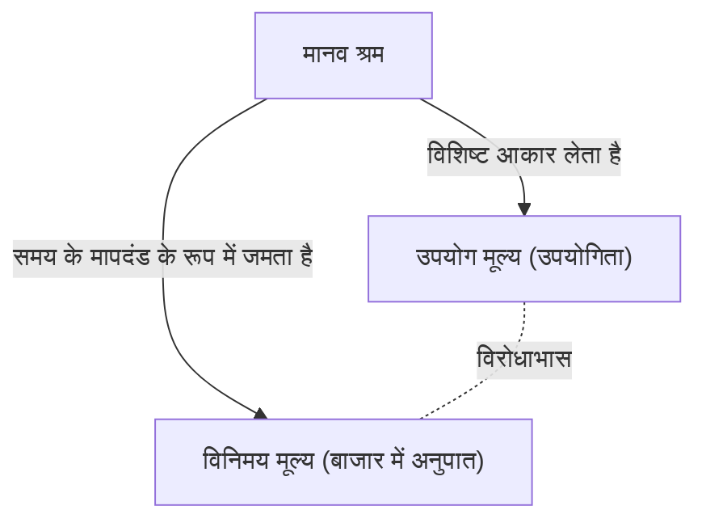
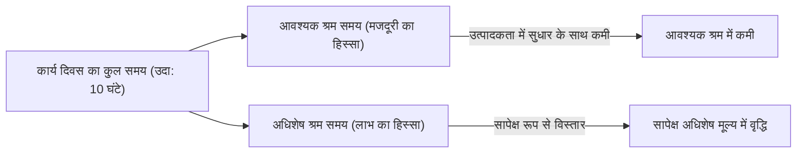

## 1. प्रस्तावना: 19वीं सदी की औद्योगिक क्रांति और 'दास कैपिटल' (पूंजी) का जन्म

कार्ल मार्क्स द्वारा 1867 में प्रकाशित 'दास कैपिटल' (Das Kapital) का पहला खंड केवल अर्थशास्त्र की एक तकनीकी पुस्तक नहीं है, बल्कि यह मानव इतिहास, दर्शन, समाजशास्त्र और यहाँ तक कि एक प्रकार की सामाजिक भौतिकी का भी एक विशाल बौद्धिक तंत्र है। 19वीं सदी के मध्य का यूरोप, जहाँ यह कृति उत्पन्न हुई, औद्योगिक क्रांति की गर्मी और काले धुएं में लिपटा हुआ था। भाप इंजन के आविष्कार ने न केवल ऊष्मागतिकी (thermodynamics) के नए भौतिकी क्षेत्र को जन्म दिया, बल्कि सामाजिक संरचना को भी जड़ से बदल दिया। ऊर्जा रूपांतरण दक्षता को अधिकतम करने के इंजीनियरिंग दृष्टिकोण ने जल्द ही पूंजीवादी उत्पादन के उस ठंडे तर्क के साथ तालमेल बिठा लिया जो "मानव श्रम" को स्वयं एक ऊर्जा स्रोत के रूप में देखता था और इसे सबसे कुशल तरीके से धन (पूंजी) में कैसे बदला जाए, इस पर केंद्रित था।

मार्क्स ने इस विशाल "समाज रूपी मशीन" के ब्लूप्रिंट को समझने का प्रयास किया। उनका विश्लेषण सतही मूल्य में उतार-चढ़ाव या आपूर्ति और मांग के नियमों (जिस पर उस समय के शास्त्रीय अर्थशास्त्र का मुख्य ध्यान था) तक सीमित नहीं रहा, बल्कि उसने उस "मूल्य निर्माण और शोषण के तंत्र" को उजागर किया जो इसकी गहराई में काम कर रहा था। इस लेख में, हम भौतिक, ऐतिहासिक और तकनीकी पृष्ठभूमि को शामिल करते हुए, समकालीन दृष्टिकोण से मार्क्स के 'दास कैपिटल' के मूल भाग को विस्तार से स्पष्ट करेंगे।

## 2. वस्तु की दोहरी प्रकृति: उपयोग मूल्य और विनिमय मूल्य

'दास कैपिटल' की शुरुआत इस प्रसिद्ध वाक्य से होती है: "पूंजीवादी उत्पादन के तरीके से शासित समाजों की संपत्ति वस्तुओं के एक विशाल संग्रह के रूप में प्रकट होती है।" मार्क्स ने अपनी शारीरिक रचना (Anatomy) की शुरुआत पूंजीवाद की कोशिका, "वस्तु (Commodity)" के विश्लेषण से की।

वस्तु के दो अलग-अलग चेहरे होते हैं।
पहला है **"उपयोग मूल्य (Use-value)"**। यह उस वस्तु की भौतिक, रासायनिक या मानसिक उपयोगिता को संदर्भित करता है जो मानवीय इच्छा को संतुष्ट करती है। लोहा कठोर होता है, इसलिए यह हथौड़ा बन जाता है; ब्रेड पौष्टिक होती है, इसलिए यह भूख को मिटाती है। उपयोग मूल्य पदार्थ के भौतिक गुणों पर निर्भर करता है और यह एक सार्वभौमिक गुण है जो इतिहास या सामाजिक व्यवस्था के बदलने पर भी मौजूद रहता है।

दूसरा है **"विनिमय मूल्य (Exchange-value)"**, या केवल "मूल्य"। बाजार में, पूरी तरह से अलग उपयोग मूल्य वाली वस्तुओं (उदाहरण के लिए, 1 कोट और 10 मीटर लिनन) का "समान मूल्य" के रूप में विनिमय किया जाता है। जब दो वस्तुएं, जिनके भौतिक गुण और उपयोग भिन्न होते हैं, एक दूसरे के बराबर रखी जाती हैं, तो वहां कुछ "सामान्य मापदंड" मौजूद होना चाहिए। मार्क्स ने तर्क दिया कि यह सामान्य मापदंड ही **"अमूर्त मानव श्रम (Abstract human labor)"** है।

### 2.1 सामाजिक रूप से आवश्यक श्रम समय

मूल्य का परिमाण उस वस्तु के उत्पादन में खर्च किए गए श्रम की मात्रा, विशेष रूप से "श्रम समय" द्वारा निर्धारित किया जाता है। हालांकि, इसका मतलब यह नहीं है कि एक आलसी व्यक्ति द्वारा लंबा समय लेकर बनाई गई वस्तु का मूल्य अधिक होगा। मार्क्स ने इसे **"सामाजिक रूप से आवश्यक श्रम समय (Socially necessary labor time)"** के रूप में परिभाषित किया। यह "उत्पादन की मानक स्थितियों के तहत, औसत स्तर के कौशल और तीव्रता के साथ किसी दिए गए उपयोग मूल्य का उत्पादन करने के लिए आवश्यक श्रम समय" है।

यदि तकनीकी नवाचार होता है और मशीनों की शुरुआत से उत्पादकता दोगुनी हो जाती है, तो एक वस्तु में निहित सामाजिक रूप से आवश्यक श्रम समय आधा हो जाएगा, और उस वस्तु का मूल्य भी आधा हो जाएगा। यहीं पूंजीवाद की गतिशीलता का स्रोत निहित है जो निरंतर तकनीकी नवाचार को आगे बढ़ाता है।

## 3. धन में परिवर्तन और "वस्तु अंधभक्ति"

जब वस्तुओं का विनिमय सार्वभौमिक हो जाता है, तो एक विशेष वस्तु सभी वस्तुओं के मूल्य को मापने वाले सामान्य समकक्ष के रूप में अलग हो जाती है। वही **धन (Money)** है। ऐतिहासिक रूप से, सोने और चांदी जैसी कीमती धातुओं ने यह भूमिका निभाई।

धन के उद्भव ने वस्तु विनिमय को नाटकीय रूप से आसान बना दिया, लेकिन साथ ही इसने मानवीय धारणा में एक अजीब भ्रम भी पैदा किया। मार्क्स इसे **"वस्तु अंधभक्ति (Commodity Fetishism)"** कहते हैं।
मूल रूप से, वस्तु का मूल्य "मनुष्यों के बीच सामाजिक संबंधों (श्रम और विनिमय के विभाजन)" द्वारा निर्मित होता है, लेकिन यह "वस्तुओं के बीच संबंध (वस्तु और धन के बीच का संबंध)" के रूप में प्रकट होता है। हम यह भ्रम पाल लेते हैं कि 10,000 येन के नोट का अपना एक मूल्य है, और हम इसके पीछे अनगिनत लोगों के श्रम के नेटवर्क को भूल जाते हैं। यह बिल्कुल उसी संरचना के समान है जब हम आधुनिक, अत्यधिक जटिल आपूर्ति श्रृंखला में एक स्मार्टफोन हाथ में लेते हैं, तो हम दुर्लभ धातुओं के खनन के कठोर श्रम या कारखाने में असेंबली लाइन के श्रम से पूरी तरह अनजान होते हैं।

## 4. पूंजी का सूत्र और अधिशेष मूल्य का रहस्य

सरल वस्तु परिसंचरण का सूत्र **W - G - W (वस्तु - धन - वस्तु)** है। उदाहरण के लिए, एक किसान अपना उगाया हुआ गेहूं (W) बेचकर धन (G) प्राप्त करता है, और उससे कपड़े (W) खरीदता है। इसका उद्देश्य "विभिन्न उपयोग मूल्यों की प्राप्ति" है, और प्रक्रिया यहीं पूरी हो जाती है।

हालाँकि, पूंजी की गति अलग है। इसका सूत्र **G - W - G' (धन - वस्तु - अधिक धन)** है।
पूंजीपति धन (G) का निवेश करके वस्तु (W) खरीदता है, और उसे बेचकर शुरुआत से अधिक धन (G') प्राप्त करता है। मूल्य में इस वृद्धि (G' - G) को मार्क्स ने **"अदिशेष मूल्य (Surplus Value)"** कहा है।

यहाँ एक बड़ा रहस्य उत्पन्न होता है। यदि बाजार में समान विनिमय (मूल्य के अनुसार खरीद और बिक्री) का सिद्धांत कायम है, तो शून्य से मूल्य का निर्माण होना असंभव है। केवल सस्ते में खरीदने और महंगे में बेचने (असमान विनिमय) की धोखाधड़ी से पूरे समाज की संपत्ति में वृद्धि नहीं होती है। तो, अधिशेष मूल्य कहाँ से आता है?

### 4.1 श्रम शक्ति नामक विशेष वस्तु

मार्क्स द्वारा खोजा गया उत्तर यह था कि बाजार में एक विशेष वस्तु मौजूद है जिसका उपयोग करने से "नया मूल्य उत्पन्न करने" का जादुई उपयोग मूल्य होता है। वह **"श्रम शक्ति (Labor power)"** है।

पूंजीपति श्रमिकों को गुलामों के रूप में नहीं खरीदते हैं, बल्कि वे उनकी "एक निश्चित अवधि के लिए काम करने की क्षमता (श्रम शक्ति)" को एक वस्तु के रूप में खरीदते हैं। श्रम शक्ति का मूल्य (= मजदूरी), अन्य वस्तुओं की तरह, "इसे पुनः उत्पादित करने के लिए आवश्यक सामाजिक श्रम समय" द्वारा निर्धारित होता है। दूसरे शब्दों में, यह वह जीवन यापन लागत (भोजन, किराया, कपड़े, आदि) है जो एक कार्यकर्ता को कल फिर से काम पर आने, अपने परिवार का भरण-पोषण करने और श्रमिकों की अगली पीढ़ी को पालने के लिए आवश्यक है।

मान लें कि 1 दिन की श्रम शक्ति का मूल्य (जीवन यापन व्यय) 6 घंटे के श्रम द्वारा बनाए गए मूल्य के बराबर है। पूंजीपति ने एक दिन के लिए यह श्रम शक्ति खरीदी है। हालाँकि, पूंजीपति कार्यकर्ता को 6 घंटे के बाद घर नहीं जाने देगा। वे उनसे 8 या 10 घंटे काम करवाएंगे।

- **आवश्यक श्रम समय (6 घंटे)**: अपने स्वयं के मजदूरी के मूल्य को पुनः उत्पादित करने का समय
- **अधिशेष श्रम समय (4 घंटे)**: पूंजीपति के लिए मुफ्त में मूल्य उत्पन्न करने का समय

इस अधिशेष श्रम समय द्वारा उत्पन्न मूल्य ही "अधिशेष मूल्य" का वास्तविक रूप है। **शोषण (Exploitation)** कोई नैतिक निंदा का शब्द नहीं है, बल्कि एक वैज्ञानिक अवधारणा है जो इस वस्तुनिष्ठ आर्थिक तंत्र को संदर्भित करती है जहाँ "पूंजीपति उस मूल्य (अधिशेष मूल्य) को प्राप्त करता है जो कार्यकर्ता द्वारा उत्पादित मूल्य और कार्यकर्ता द्वारा प्राप्त मूल्य के बीच का अंतर है।"

## 5. निरपेक्ष अधिशेष मूल्य और सापेक्ष अधिशेष मूल्य

पूंजीपतियों द्वारा अधिशेष मूल्य बढ़ाने के मुख्य रूप से दो तरीके हैं।

### 5.1 निरपेक्ष अधिशेष मूल्य का उत्पादन
यह बहुत सरल है: **"श्रम समय को बढ़ाना"**। यदि 6 घंटे आवश्यक श्रम समय है, तो श्रम समय को 10 घंटे से 12 घंटे या 14 घंटे तक बढ़ाने पर, अधिशेष श्रम समय 4 घंटे से बढ़कर 6 घंटे या 8 घंटे हो जाएगा।
19वीं सदी के ब्रिटेन में, काम के घंटे अंतहीन रूप से बढ़ा दिए गए, और यहाँ तक कि महिलाओं और बच्चों को भी खराब परिस्थितियों में दिन में 15 घंटे से अधिक काम करने के लिए मजबूर किया गया। मनुष्य शारीरिक सीमाओं वाला एक जैविक प्राणी है, और अत्यधिक काम का सचमुच मतलब है श्रम शक्ति को "इस्तेमाल करके फेंक देना"। थर्मोडायनामिक्स की भाषा में, यह मानव शरीर के जैविक इंजन से उसकी सीमा से परे ऊर्जा निकालने का एक प्रयास था। इसके खिलाफ श्रमिकों के संघर्ष और राज्य के नियमों (फैक्ट्री एक्ट) के परिणामस्वरूप, कार्य दिवस के लिए एक कानूनी सीमा निर्धारित की गई।

### 5.2 सापेक्ष अधिशेष मूल्य का उत्पादन
जब काम के घंटे बढ़ाने की एक सीमा आ जाती है, तो पूंजी दूसरा तरीका अपनाती है। वह है **"आवश्यक श्रम समय को कम करना"**।
मान लीजिए कि कुल कार्य दिवस 10 घंटे पर तय है। यदि समग्र रूप से समाज की उत्पादकता में सुधार होता है और भोजन तथा कपड़े सस्ते में बनाए जा सकते हैं, तो श्रम शक्ति को बनाए रखने की जीवन यापन लागत कम हो जाएगी। परिणामस्वरूप, यदि आवश्यक श्रम समय 6 घंटे से कम होकर 4 घंटे रह जाता है, तो भले ही कुल काम के घंटे न बदलें, अधिशेष श्रम समय 4 घंटे से बढ़कर 6 घंटे हो जाएगा।

इसे प्राप्त करने के लिए, पूंजीवाद लगातार तकनीकी नवाचार करता है, मशीनें पेश करता है और श्रम विभाजन को उन्नत करता है। पूंजीवाद ने इतिहास में इतनी विशाल उत्पादक शक्तियों का निर्माण इसलिए किया क्योंकि इसके पीछे इसी "सापेक्ष अधिशेष मूल्य" की तलाश करने वाली अनंत प्रेरक शक्ति थी।

## 6. मशीनरी और बड़े पैमाने के उद्योग: प्रौद्योगिकी द्वारा श्रम का समावेश

'दास कैपिटल' के पहले खंड का अध्याय 13, "मशीनरी और बड़े पैमाने के उद्योग," एक ऐतिहासिक उत्कृष्ट लेख है जो प्रौद्योगिकी और समाज के बीच के संबंधों पर चर्चा करता है। मार्क्स ने देखा कि उपकरणों से मशीनों में संक्रमण का अर्थ उत्पादकता में साधारण वृद्धि से कहीं अधिक था।

हस्तशिल्प युग में, श्रमिक अपनी इच्छा और कौशल से उपकरणों को नियंत्रित करते थे (**श्रम का औपचारिक समावेश**)। हालाँकि, जब भाप इंजन और जटिल मशीन प्रणालियों को पेश किया गया, तो यह संबंध उलट गया। विशाल मशीन प्रणाली उत्पादन का मुख्य विषय बन जाती है, और श्रमिक "चेतना वाले उपांग (appendages)" बनकर रह जाते हैं जो मशीन की गति के अनुसार उसकी सेवा करते हैं (**श्रम का वास्तविक समावेश**)।

मशीनें श्रमिकों के बोझ को कम करने के लिए नहीं लगाई गई थीं, बल्कि श्रम को सरल बनाने, महिलाओं और बच्चों के सस्ते श्रम को कारखानों में लाने, और मशीनों के मूल्यह्रास को तेज करने के लिए रात की पाली को लागू करने के साधन के रूप में कार्य करती थीं। मार्क्स ने तकनीक को नहीं नकारा, बल्कि "उन सामाजिक संबंधों की आलोचना की जहाँ तकनीक का उपयोग केवल पूंजी वृद्धि के साधन के रूप में किया जाता है।" आधुनिक एआई, रोबोटिक्स, और एल्गोरिदम आधारित श्रम प्रबंधन (जैसे गिग वर्कर्स) पर विचार करते समय यह अत्यंत तीव्र और प्रासंगिक अंतर्दृष्टि प्रदान करता है।

## 7. पूंजी का संचय और सापेक्ष अतिरिक्त जनसंख्या (औद्योगिक रिजर्व सेना)

पूंजीपति प्राप्त अधिशेष मूल्य का पूरा उपभोग नहीं करते हैं, बल्कि इसका एक हिस्सा नई पूंजी के रूप में फिर से निवेश करते हैं। यही **"पूंजी का संचय"** है। कारखानों का विस्तार होता है, और अधिक मशीनें लगाई जाती हैं।

जैसे-जैसे पूंजी का संचय आगे बढ़ता है, पूंजी की संरचना (मशीनों और कच्चे माल जैसी स्थिर पूंजी का श्रम शक्ति जैसी परिवर्तनशील पूंजी के साथ अनुपात) उच्च हो जाती है। दूसरे शब्दों में, बड़ी संख्या में मशीनों को कम श्रमिकों द्वारा संचालित किया जा सकता है। नतीजतन, भले ही पूंजी बढ़ती है, रोजगार की मांग उसी अनुपात में नहीं बढ़ती है।

इससे समाज में हमेशा बेरोजगार और अर्ध-बेरोजगार लोगों का एक समूह बन जाता है। मार्क्स ने इसे **"सापेक्ष अतिरिक्त जनसंख्या"** या **"औद्योगिक रिजर्व सेना (Reserve army of labor)"** कहा।
औद्योगिक रिजर्व सेना का अस्तित्व पूंजीवाद के लिए सुविधाजनक है। क्योंकि बाहर हमेशा बेरोजगारों की फौज खड़ी रहती है, जो काम करने वाले श्रमिकों पर भारी दबाव डालती है ("तुम्हारी जगह लेने वाले बहुत हैं"), जिससे मजदूरी में वृद्धि को रोका जा सके और काम के बोझ को तेज किया जा सके। उछाल के समय, वे रिजर्व सेना से श्रम को अवशोषित करते हैं, और मंदी के समय वे उन्हें सबसे पहले सड़क पर फेंक देते हैं।

## 8. आदिम संचय: पूंजीवाद की हिंसक भोर

पूंजीवाद के कार्य करने के लिए, शुरू से ही "धन वाले पूंजीपति" और "बिना संपत्ति वाले श्रमिक (सर्वहारा), जिनके पास बेचने के लिए श्रम शक्ति के अलावा कुछ नहीं है" मौजूद होने चाहिए। हालांकि, यह स्थिति स्वाभाविक रूप से उत्पन्न नहीं हुई।

मार्क्स ने पहले खंड के अंतिम भाग, "तथाकथित आदिम संचय" (Primitive Accumulation) वाले अध्याय में पूंजीवाद के पूर्व-इतिहास का वर्णन किया है। ब्रिटेन के "एन्क्लोजर (Enclosure)" द्वारा दर्शाया गया इतिहास, जहाँ किसानों से उनकी ज़मीनें हिंसक रूप से छीन ली गईं और उन्हें वेतनभोगी श्रमिकों के रूप में शहरों के कारखानों में धकेल दिया गया। और उपनिवेशवाद, दास व्यापार, और स्वदेशी लोगों के नरसंहार के माध्यम से धन की लूट।
मार्क्स ने लिखा, "पूंजी सिर से लेकर पैर की उंगलियों तक हर छिद्र से खून और गंदगी टपकाते हुए पैदा होती है।" पूंजीवाद के शांतिपूर्ण समान विनिमय के पीछे, राज्य की हिंसा के माध्यम से आदिम लूट का इतिहास छिपा है।

## 9. आधुनिक युग में 'दास कैपिटल' का महत्व

मार्क्स द्वारा 'दास कैपिटल' लिखे हुए 150 से अधिक वर्ष बीत चुके हैं। आधुनिक पूंजीवाद वित्तीय पूंजीवाद, वैश्वीकरण और डिजिटल सूचना पूंजीवाद में बदल गया है। कई श्रमिक ब्लू-कॉलर से व्हाइट-कॉलर और फिर सेवा उद्योग में चले गए हैं।

हालाँकि, 'दास कैपिटल' की अंतर्दृष्टि कभी पुरानी नहीं हुई है।
आज, विशाल आईटी कंपनियाँ मुफ्त में उस समय और व्यवहार संबंधी डेटा (जिसे एक प्रकार का श्रम भी माना जा सकता है) को सोख लेती हैं जो हम डिजिटल स्पेस में बिताते हैं, और इसे विशाल धन (अधिशेष मूल्य) में बदल देती हैं। इसके अलावा, अनियमित रोजगार और गिग-इकोनॉमी का विस्तार आधुनिक "औद्योगिक रिजर्व सेना" के निर्माण और श्रम शक्ति की अस्थिरता का सटीक प्रतीक है। वैश्विक पर्यावरण का विनाश (जलवायु परिवर्तन) भी प्रकृति को मुफ्त संसाधन के रूप में अनवरत शोषित करने वाली पूंजी की गति का अपरिहार्य परिणाम है (मार्क्स ने इसे "मेटाबॉलिक रिफ्ट (Metabolic rift)" के रूप में चेतावनी दी थी)।

'दास कैपिटल' केवल एक किताब नहीं है जिसने पूंजीवाद के अंत की भविष्यवाणी की थी, बल्कि यह एक अंतिम ब्लूप्रिंट है जिसने विश्लेषण किया कि यह "कैसे काम करता है।" हमारे सामने मौजूद आर्थिक असमानता, अलगाव और एक प्रणाली के रूप में स्थिरता के संकट को समझने, और उसके पार एक नई सामाजिक प्रणाली की कल्पना करने के लिए, मार्क्स द्वारा छोड़े गए इस बौद्धिक ढांचे को फिर से गहराई से समझने की आवश्यकता है।
