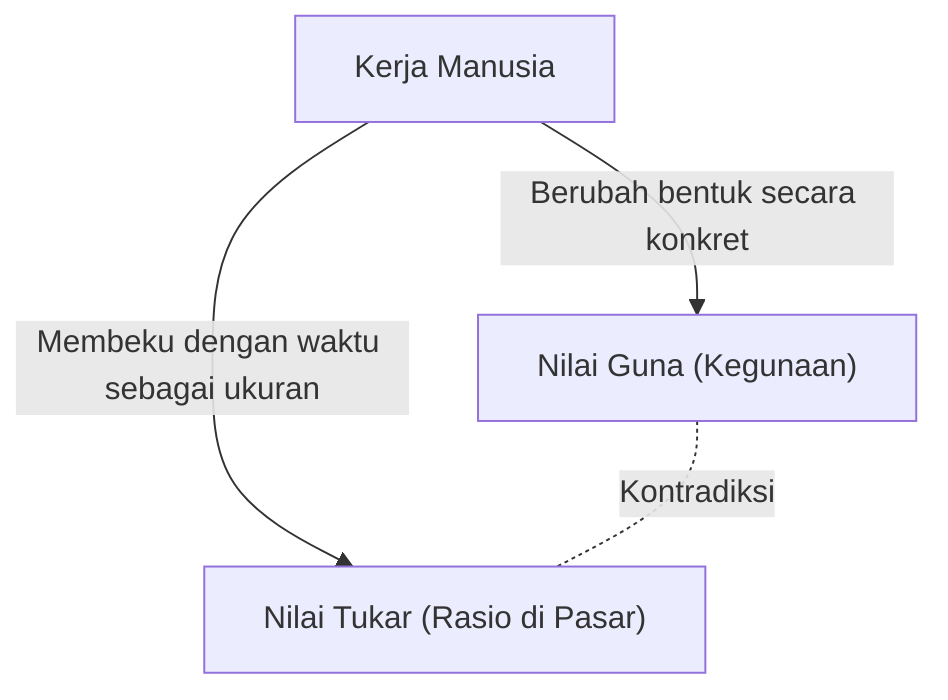
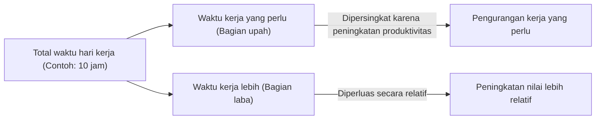

## 1. Pendahuluan: Revolusi Industri Abad ke-19 dan Lahirnya "Das Kapital"

"Das Kapital" (Kapital), yang volume pertamanya diterbitkan oleh Karl Marx pada tahun 1867, bukan sekadar buku teks ekonomi khusus, melainkan sebuah sistem pengetahuan besar yang dapat disebut sebagai sejarah manusia, filsafat, sosiologi, dan semacam fisika sosial. Eropa pada pertengahan abad ke-19, saat karya ini lahir, sedang diselimuti oleh panas dan asap hitam Revolusi Industri. Penemuan mesin uap tidak hanya melahirkan cabang fisika baru yang disebut termodinamika, tetapi juga secara mendasar mengubah struktur sosial. Pandangan rekayasa yang berupaya memaksimalkan efisiensi konversi energi pada akhirnya selaras dengan logika dingin dari cara produksi kapitalis, yakni bagaimana mengubah "kerja manusia" itu sendiri sebagai sebuah sumber energi secara efisien menjadi kekayaan (modal).

Marx berusaha menguraikan cetak biru dari "mesin sosial" raksasa ini. Analisisnya tidak berhenti pada fluktuasi harga superfisial atau hukum penawaran dan permintaan (yang menjadi fokus utama ekonomi klasik pada saat itu), tetapi mengungkap "mekanisme produksi nilai dan eksploitasi" yang beroperasi di lapisan terdalamnya. Dalam artikel ini, kita akan mengungkap secara terperinci bagian inti dari "Das Kapital" Marx dari perspektif modern, dengan memadukan latar belakang fisik, historis, dan teknologinya.

## 2. Dualitas Komoditas: Nilai Guna dan Nilai Tukar

Bagian awal dari "Das Kapital" dimulai dengan kalimat terkenal: "Kekayaan masyarakat-masyarakat di mana cara produksi kapitalis berkuasa, tampil sebagai suatu himpunan komoditas yang luar biasa besarnya." Marx memulai pembedahannya dari analisis tentang "komoditas" (Commodity), yang merupakan sel dari kapitalisme.

Komoditas memiliki dua wajah yang berbeda.
Pertama adalah **"Nilai Guna" (Use-value)**. Hal ini merujuk pada kegunaan fisik, kimia, atau spiritual dari benda tersebut dalam memenuhi kebutuhan manusia. Besi menjadi palu karena keras, roti memuaskan nafsu makan karena bergizi. Nilai guna bergantung pada sifat fisik dari materi tersebut dan merupakan atribut universal yang tetap ada meskipun sejarah atau sistem sosial berubah.

Kedua adalah **"Nilai Tukar" (Exchange-value)**, atau sekadar "nilai". Di pasar, komoditas-komoditas dengan nilai guna yang sama sekali berbeda (misalnya, 1 potong jas dan 10 meter kain linen) dipertukarkan sebagai "nilai yang sama". Ketika dua benda dengan sifat fisik dan kegunaan yang berbeda dihubungkan dengan tanda sama dengan, di sana harus ada semacam "ukuran yang sama". Marx mengungkap bahwa ukuran bersama ini tidak lain adalah **"kerja abstrak manusia" (Abstract human labor)**.

### 2.1 Waktu Kerja Secara Sosial Perlu

Besarnya nilai ditentukan oleh jumlah kerja, secara spesifik "waktu kerja", yang dihabiskan untuk memproduksi komoditas tersebut. Namun, hal ini bukan berarti bahwa komoditas yang dibuat berlama-lama oleh orang yang malas akan memiliki nilai yang lebih tinggi. Marx mendefinisikan ini sebagai **"waktu kerja yang secara sosial perlu" (Socially necessary labor time)**. Ini adalah "waktu kerja yang diperlukan untuk memproduksi suatu nilai guna dalam kondisi produksi yang normal, dengan tingkat keterampilan dan intensitas kerja yang rata-rata".

Jika inovasi teknologi terjadi dan pengenalan mesin melipatgandakan produktivitas, maka waktu kerja yang secara sosial perlu yang terkandung dalam satu komoditas akan berkurang setengahnya, sehingga nilai komoditas tersebut juga akan berkurang setengah. Di sinilah letak sumber dinamisme kapitalisme yang tanpa henti mengejar inovasi teknologi.

## 3. Transformasi menjadi Uang dan "Fetishisme Komoditas"

Ketika pertukaran komoditas menjadi universal, satu komoditas khusus memisahkan diri sebagai ekuivalen umum yang mengukur nilai seluruh komoditas lainnya. Itulah yang disebut **Uang (Money)**. Secara historis, logam mulia seperti emas dan perak mengemban peran ini.

Kemunculan uang memperlancar pertukaran komoditas secara dramatis, tetapi pada saat yang sama membawa ilusi yang aneh pada kognisi manusia. Marx menyebutnya sebagai **"Fetishisme Komoditas" (Commodity Fetishism)**.
Pada dasarnya, meskipun nilai komoditas dihasilkan oleh "hubungan sosial antarmanusia (pembagian kerja dan pertukaran)", fenomena ini muncul sebagai "hubungan antarbenda (hubungan antara komoditas dan uang)". Kita berilusi seolah-olah uang kertas Rp100.000 memiliki nilai pada dirinya sendiri, dan melupakan jaringan kerja dari tak terhitung jumlahnya manusia di baliknya. Ini memiliki struktur yang sama dengan ketika kita memegang ponsel pintar dalam rantai pasokan modern yang sangat kompleks, kita sama sekali tidak menyadari kerja keras menambang logam tanah jarang atau kerja perakitan di pabrik.

## 4. Rumus Modal dan Misteri Nilai Lebih

Rumus peredaran komoditas sederhana adalah **C - M - C (Komoditas - Uang - Komoditas)**. Misalnya, seorang petani menjual gandum hasil panennya (C) untuk mendapatkan uang (M), dan menggunakannya untuk membeli pakaian (C). Tujuannya adalah "memperoleh nilai guna yang berbeda", dan prosesnya selesai di sini.

Namun, pergerakan modal berbeda. Rumusnya adalah **M - C - M' (Uang - Komoditas - Lebih banyak uang)**.
Kapitalis menginvestasikan uang (M) untuk membeli komoditas (C), lalu menjualnya untuk mendapatkan uang yang lebih banyak daripada awalnya (M'). Nilai yang bertambah ini (M' - M), oleh Marx disebut sebagai **"Nilai Lebih" (Surplus Value)**.

Di sinilah muncul misteri besar. Jika prinsip pertukaran ekuivalen (jual beli sesuai nilai) dipertahankan di pasar, seharusnya tidak mungkin nilai berlipat ganda seperti menciptakan sesuatu dari ketiadaan. Tindakan curang membeli murah dan menjual mahal (pertukaran non-ekuivalen) saja tidak akan meningkatkan kekayaan masyarakat secara keseluruhan. Lantas, dari mana nilai lebih itu mengalir?

### 4.1 Tenaga Kerja sebagai Komoditas Khusus

Jawaban yang ditemukan oleh Marx adalah bahwa di pasar terdapat komoditas khusus yang memiliki nilai guna ajaib yaitu "menciptakan nilai baru melalui penggunaannya". Itulah yang disebut **"Tenaga Kerja" (Labor power)**.

Kapitalis tidak membeli pekerja sebagai budak, melainkan membeli "kemampuan mereka untuk bekerja dalam waktu tertentu (tenaga kerja)" sebagai komoditas. Nilai dari tenaga kerja (= upah) ditentukan, seperti halnya komoditas lain, oleh "waktu kerja sosial yang diperlukan untuk memproduksinya kembali". Dengan kata lain, ini adalah biaya hidup (makanan, sewa rumah, pakaian, dll.) yang diperlukan agar pekerja dapat berangkat kerja dengan bugar keesokan harinya, menghidupi keluarga, dan membesarkan generasi pekerja berikutnya.

Misalkan, nilai tenaga kerja untuk 1 hari (biaya hidup) setara dengan nilai yang dihasilkan oleh 6 jam kerja. Kapitalis telah membeli tenaga kerja ini untuk 1 hari. Namun, kapitalis tidak akan membiarkan pekerja pulang dalam 6 jam. Mereka akan mempekerjakan pekerja selama 8 jam, atau 10 jam.

- **Waktu kerja yang perlu (6 jam)**: Waktu untuk mereproduksi nilai upahnya sendiri
- **Waktu kerja lebih (4 jam)**: Waktu untuk menghasilkan nilai secara cuma-cuma bagi kapitalis

Nilai yang dihasilkan oleh waktu kerja lebih inilah yang merupakan wujud asli dari "nilai lebih". **Eksploitasi (Exploitation)** bukanlah kata celaan moral, melainkan sebuah konsep ilmiah yang merujuk pada mekanisme ekonomi objektif di mana "kapitalis mengambil selisih antara nilai yang dihasilkan pekerja dan nilai yang diterima pekerja (nilai lebih)".

## 5. Nilai Lebih Absolut dan Nilai Lebih Relatif

Agar kapitalis dapat meningkatkan nilai lebih, ada dua cara utama yang dapat dilakukan.

### 5.1 Produksi Nilai Lebih Absolut
Cara ini sangat sederhana, yaitu **"memperpanjang waktu kerja"**. Jika 6 jam adalah waktu kerja yang perlu, maka dengan memperpanjang jam kerja dari 10 jam menjadi 12 jam, hingga 14 jam, waktu kerja lebih akan meningkat dari 4 jam menjadi 6 jam, lalu 8 jam.
Di Inggris pada abad ke-19, jam kerja diperpanjang tanpa batas, dan bahkan perempuan dan anak-anak dipaksa bekerja di lingkungan yang buruk selama lebih dari 15 jam sehari. Manusia adalah makhluk biologis yang memiliki batas fisik, dan kerja berlebihan secara harfiah berarti "membuang-buang" tenaga kerja. Dalam istilah termodinamika, ini adalah upaya untuk mengekstraksi energi melampaui batas dari mesin organik yaitu tubuh manusia. Berkat perjuangan kelas pekerja untuk melawan hal ini dan regulasi hukum oleh negara (Undang-Undang Pabrik), batas atas hukum mulai diberlakukan untuk hari kerja.

### 5.2 Produksi Nilai Lebih Relatif
Ketika perpanjangan waktu kerja menemui batasnya, modal mengambil cara lain. Yaitu dengan **"mempersingkat waktu kerja yang perlu"**.
Misalkan total hari kerja tetap pada 10 jam. Jika produktivitas masyarakat secara keseluruhan meningkat dan makanan serta pakaian dapat diproduksi dengan lebih murah, biaya hidup untuk mempertahankan tenaga kerja akan menurun. Sebagai akibatnya, jika waktu kerja yang perlu dipersingkat dari 6 jam menjadi 4 jam, meskipun total jam kerja tidak berubah, waktu kerja lebih akan meningkat dari 4 jam menjadi 6 jam.

Untuk mewujudkan hal ini, kapitalisme terus melakukan inovasi teknologi, memperkenalkan mesin, dan meningkatkan pembagian kerja. Alasan mengapa kapitalisme menghasilkan daya produksi besar yang belum pernah ada dalam sejarah terletak pada daya dorong tak terbatas untuk mencari "nilai lebih relatif" ini.

## 6. Mesin dan Industri Besar: Subsumsi Kerja oleh Teknologi

Bab 13 Volume 1 "Das Kapital", yang berjudul "Mesin dan Industri Besar", adalah teks mahakarya bersejarah yang membahas hubungan antara teknologi dan masyarakat. Marx menyadari bahwa peralihan dari perkakas tangan ke mesin memiliki makna yang lebih dari sekadar peningkatan produktivitas.

Di era industri kerajinan tangan, pekerja mengendalikan peralatan dengan kemauan dan keterampilan mereka sendiri (**Subsumsi formal atas kerja**). Namun, dengan diperkenalkannya mesin uap dan sistem mesin yang kompleks, hubungan ini berbalik. Sistem mesin raksasa menjadi subjek utama produksi, dan pekerja diturunkan derajatnya menjadi "embel-embel yang sadar" yang melayani pergerakan mesin tersebut (**Subsumsi nyata atas kerja**).

Mesin tidak diperkenalkan untuk mengurangi beban pekerja, tetapi berfungsi sebagai sarana untuk menyederhanakan kerja, menarik tenaga kerja murah dari perempuan dan anak-anak ke pabrik, dan bahkan memaksa kerja malam hari demi mempercepat penyusutan nilai mesin. Marx tidak menyangkal teknologi itu sendiri, melainkan mengkritik "hubungan sosial di mana teknologi hanya digunakan sebagai sarana untuk menggandakan modal". Hal ini memberikan wawasan yang sangat tajam bahkan untuk mempertimbangkan kecerdasan buatan (AI) modern, robotika, dan manajemen kerja berbasis algoritma (pekerja gig, dll.).

## 7. Akumulasi Modal dan Populasi Surplus Relatif (Tentara Cadangan Industri)

Kapitalis tidak mengonsumsi seluruh nilai lebih yang diperolehnya, melainkan menginvestasikan sebagian sebagai modal baru. Ini adalah **"Akumulasi Modal"**. Pabrik-pabrik diperluas dan lebih banyak mesin didatangkan.

Seiring berjalannya akumulasi modal, komposisi organik modal (rasio antara modal konstan seperti mesin dan bahan baku, dengan modal variabel yaitu tenaga kerja) menjadi lebih tinggi. Artinya, dibutuhkan lebih sedikit pekerja untuk mengoperasikan sejumlah besar mesin. Akibatnya, meskipun modal tumbuh, permintaan pekerjaan tidak meningkat dengan proporsi yang sama.

Oleh karena itu, selalu tercipta kelompok pengangguran atau setengah pengangguran di dalam masyarakat. Marx menyebut ini sebagai **"Populasi Surplus Relatif"** atau **"Tentara Cadangan Industri" (Reserve army of labor)**.
Keberadaan tentara cadangan industri ini sangat menguntungkan bagi kapitalisme. Sebab, kelompok penganggur yang selalu bersiaga di luar memberikan tekanan kuat kepada pekerja yang sedang bekerja ("Masih banyak yang bisa menggantikanmu"), sehingga dapat menekan kenaikan upah dan memaksa intensifikasi kerja. Pada masa ekonomi makmur, tenaga kerja diserap dari pasukan cadangan, dan pada masa depresi, mereka menjadi yang pertama dilempar ke jalanan.

## 8. Akumulasi Primitif: Fajar Kapitalisme yang Penuh Kekerasan

Agar kapitalisme dapat berfungsi, sejak awal harus ada "kapitalis yang memiliki uang" dan "pekerja tanpa properti (proletariat) yang tidak memiliki apa-apa untuk dijual selain tenaga kerjanya". Namun, kondisi ini tidak muncul secara alamiah.

Dalam bab-bab terakhir dari Volume 1 yang berjudul "Apa yang Disebut Akumulasi Primitif", Marx menggambarkan prasejarah kapitalisme. Sejarah di mana tanah dirampas dengan kekerasan dari para petani, sebagaimana diwakili oleh "pemagaran (Enclosure)" di Inggris, dan mereka diusir ke pabrik-pabrik di kota sebagai pekerja upahan. Kemudian perampasan kekayaan melalui kolonialisme, perdagangan budak, dan pembantaian penduduk asli.
Marx menulis: "Modal lahir, meneteskan darah dan kotoran dari kepala hingga ke ujung kaki, dari setiap pori-porinya." Di balik pertukaran ekuivalen yang damai dalam kapitalisme, tersembunyi sejarah panjang perampasan primordial yang dilakukan melalui kekerasan oleh negara.

## 9. Signifikansi "Das Kapital" di Era Modern

Lebih dari 150 tahun telah berlalu sejak Marx merampungkan "Das Kapital". Kapitalisme modern telah berubah wujud menjadi kapitalisme finansial, globalisasi, dan kapitalisme informasi digital. Mayoritas pekerja telah bergeser dari kerah biru ke kerah putih, dan ke industri jasa.

Namun, wawasan "Das Kapital" sama sekali belum usang.
Saat ini, perusahaan IT raksasa menyedot waktu dan data perilaku yang kita habiskan di ruang digital (yang juga dapat dianggap sebagai bentuk kerja) secara cuma-cuma, dan mengubahnya menjadi kekayaan besar (nilai lebih). Selain itu, ekspansi tenaga kerja tidak tetap dan gig economy merupakan perwujudan nyata dari pembentukan "tentara cadangan industri" modern serta destabilisasi tenaga kerja. Perusakan lingkungan bumi (perubahan iklim) juga merupakan konsekuensi logis dari pergerakan modal yang mengeksploitasi alam tanpa batas sebagai sumber daya gratis (Marx memperingatkan hal ini sebagai "celah dalam metabolisme").

"Das Kapital" bukanlah sekadar buku yang meramalkan akhir dari kapitalisme, melainkan sebuah cetak biru pamungkas yang membedah "bagaimana ia beroperasi". Untuk memahami kesenjangan ekonomi, rasa keterasingan, dan krisis keberlanjutan sebagai sebuah sistem yang kita hadapi saat ini, serta untuk merancang sistem sosial baru setelahnya, kita perlu menelaah dan memahami kembali secara mendalam kerangka intelektual yang diwariskan oleh Marx ini.
