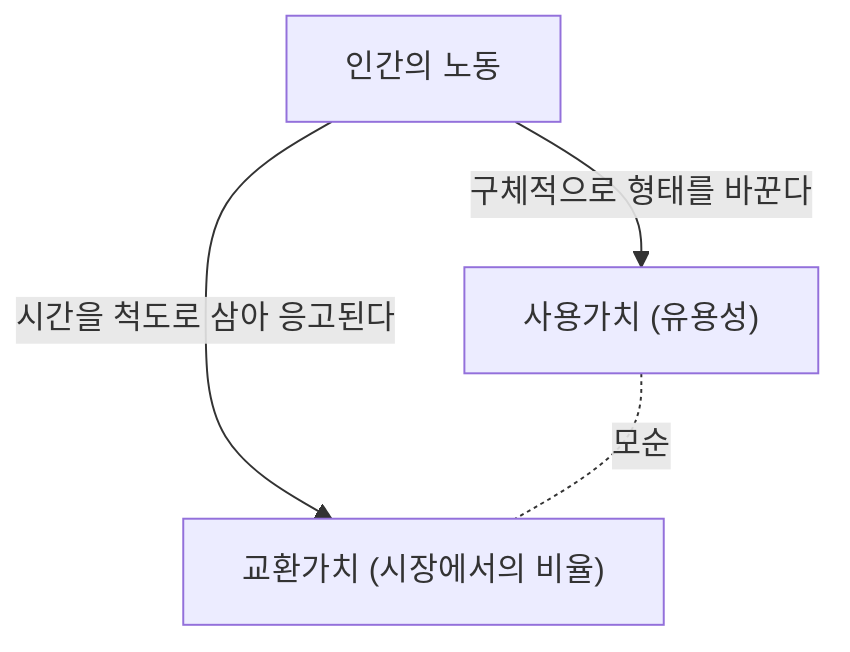

## 1. 서론: 19세기 산업혁명과 『자본론』의 탄생

칼 마르크스가 1867년에 제1권을 출판한 『자본론(Das Kapital)』은 단순한 경제학 전문서가 아니라 인류의 역사, 철학, 사회학, 그리고 일종의 사회물리학이라고도 할 수 있는 장대한 지식의 체계입니다. 이 저작이 탄생한 19세기 중반의 유럽은 산업혁명의 열기와 검은 연기에 휩싸여 있었습니다. 증기기관의 발명은 열역학이라는 새로운 물리학 분야를 탄생시킴과 동시에 사회 구조를 근본적으로 바꾸어 놓았습니다. 에너지의 변환 효율을 극한까지 높이려는 공학적인 시선은 이윽고 '인간의 노동' 그 자체를 하나의 에너지원으로 삼아, 어떻게 효율적으로 부(자본)로 변환할 것인가 하는 자본주의적 생산양식의 냉철한 논리와 동기화되어 갔던 것입니다.

마르크스는 이 거대한 '사회라는 기계'의 설계도를 해독하고자 시도했습니다. 그의 분석은 표면적인 가격의 변동이나 수요와 공급의 법칙(당시의 고전파 경제학이 주안점으로 삼았던 것)에 머무르지 않고, 그 심층에서 가동되고 있는 '가치의 생산과 착취의 메커니즘'을 백일하에 드러냈습니다. 본고에서는 물리학적, 역사적, 기술적인 배경을 곁들여가며, 마르크스의 『자본론』의 핵심 부분을 현대의 시점에서 상세하게 해명해 나갈 것입니다.

## 2. 상품의 이중성: 사용가치와 교환가치

『자본론』의 서두는 "자본주의적 생산양식이 지배하는 사회의 부는 거대한 상품의 집적으로 나타난다"라는 유명한 문장으로 시작됩니다. 마르크스는 자본주의의 세포인 '상품(Commodity)'의 분석으로부터 해부를 시작했습니다.

상품은 두 가지 다른 얼굴을 가지고 있습니다.
첫째로 **'사용가치(Use-value)'**입니다. 이는 그 물건이 인간의 어떠한 욕구를 충족시키는 물리적, 화학적, 정신적인 유용성을 가리킵니다. 철은 단단하기 때문에 해머가 되고, 빵은 영양분이 있기 때문에 식욕을 충족시킵니다. 사용가치는 물질의 물리적 특성에 의존하며, 역사나 사회 제도가 변하더라도 존재하는 보편적인 성질입니다.

둘째로 **'교환가치(Exchange-value)'**, 혹은 단순히 '가치'입니다. 시장에서 전혀 다른 사용가치를 가진 상품(예를 들어, 상의 1벌과 린넨 10미터)이 '같은 가치'로서 교환됩니다. 물리적 성질도 용도도 다른 두 물건이 이퀄(=)로 연결될 때, 거기에는 어떠한 '공통의 척도'가 존재해야만 합니다. 마르크스는 이 공통의 척도야말로 **'인간의 추상적 노동(Abstract human labor)'**이라고 갈파했습니다.

### 2.1 사회적 필요노동시간

가치의 크기는 그 상품을 생산하기 위해 지출된 노동의 양, 구체적으로는 '노동시간'에 의해 결정됩니다. 그러나 게으름뱅이가 시간을 들여 만든 상품의 가치가 높아지는 것은 아닙니다. 마르크스는 이를 **'사회적 필요노동시간(Socially necessary labor time)'**이라고 정의했습니다. 이는 "표준적인 생산 조건 하에서, 평균적인 노동 숙련도와 강도를 가지고 어떤 사용가치를 생산하는 데 필요한 노동시간"을 말합니다.

기술 혁신이 일어나고, 기계가 도입되어 생산성이 배로 증가하면, 하나의 상품에 응고되어 있는 사회적 필요노동시간은 절반이 되고, 그 상품의 가치도 절반이 됩니다. 여기에 자본주의가 끊임없이 기술 혁신을 추구하는 다이너미즘의 원천이 있습니다.

## 3. 화폐로의 전화와 '물신숭배'

상품의 교환이 보편화되면, 하나의 특별한 상품이 모든 상품의 가치를 재는 일반적 등가물로서 분리됩니다. 그것이 **화폐(Money)**입니다. 역사적으로는 금이나 은 같은 귀금속이 그 역할을 담당했습니다.

화폐의 등장은 상품 교환을 극적으로 원활하게 만들었지만, 동시에 인간의 인식에 기묘한 착각을 가져왔습니다. 마르크스는 이를 **'상품의 물신숭배(Commodity Fetishism)'**라고 부릅니다.
본래 상품의 가치는 '인간과 인간의 사회적 관계(노동의 분할과 교환)'에 의해 만들어지고 있음에도 불구하고, 그것이 '물건과 물건과의 관계(상품과 화폐의 관계)'로서 나타나는 현상입니다. 우리는 1만 엔권 지폐가 그 자체로 가치를 지니고 있는 것처럼 착각하여, 그 배후에 있는 무수한 사람들의 노동 네트워크를 망각해 버립니다. 이는 현대의 고도로 복잡해진 서플라이 체인 속에서, 우리가 스마트폰을 손에 쥐었을 때 희귀 금속을 채굴하는 가혹한 노동이나 공장에서의 조립 노동을 전혀 의식하지 않는 것과 같은 구조입니다.

## 4. 자본의 정식과 잉여가치의 수수께끼

단순한 상품 유통의 공식은 **W - G - W(상품 - 화폐 - 상품)**입니다. 예를 들어, 농민이 자신이 생산한 밀(W)을 팔아 화폐(G)를 얻고, 그것으로 옷(W)을 삽니다. 이 목적은 '다른 사용가치의 획득'이며, 과정은 여기서 완결됩니다.

그러나 자본의 운동은 다릅니다. 그 공식은 **G - W - G'(화폐 - 상품 - 더 단 많은 화폐)**입니다.
자본가는 화폐(G)를 투척하여 상품(W)을 사고, 그것을 팔아 처음보다 더 많은 화폐(G')를 얻습니다. 이 늘어난 만큼의 가치(G' - G)를 마르크스는 **'잉여가치(Surplus Value)'**라고 불렀습니다.

여기서 거대한 수수께끼가 생겨납니다. 시장에서의 등가교환의 원칙(가치대로의 매매)이 지켜지고 있다면, 무에서 유가 생겨나듯 가치가 증식하는 일은 있을 수 없을 터입니다. 싸게 사서 비싸게 파는 사기적인 행위(부등가교환)만으로 사회 전체의 부가 늘어나는 것은 아닙니다. 그렇다면 잉여가치는 어디에서 솟아나는 것일까요?

### 4.1 노동력이라는 특별한 상품

마르크스가 발견한 해답은, 시장에 '사용함으로써 새로운 가치를 만들어내는' 마술적인 사용가치를 지닌 특별한 상품이 존재한다는 것이었습니다. 그것이 바로 **'노동력(Labor power)'**입니다.

자본가는 노동자를 노예로서 사는 것이 아니라, 그들의 '일정 시간 일할 수 있는 능력(노동력)'을 상품으로서 삽니다. 노동력의 가치(=임금)는 다른 상품과 마찬가지로 '그것을 재생산하는 데 필요한 사회적 노동시간'에 의해 결정됩니다. 즉, 노동자가 내일도 건강하게 출근하고, 가족을 부양하며, 다음 세대의 노동자를 기르는 데 필요한 생활비(식량, 집세, 의복 등)입니다.

가령, 노동력의 1일분 가치(생활비)가 6시간의 노동으로 만들어지는 가치와 같다고 합시다. 자본가는 이 노동력을 1일분 사들였습니다. 그러나 자본가는 노동자를 6시간 만에 돌려보내지는 않습니다. 그들을 8시간, 혹은 10시간 동안 일하게 합니다.

- **필요노동시간(6시간)**: 자신의 임금만큼의 가치를 재생산하는 시간
- **잉여노동시간(4시간)**: 자본가를 위해 무상으로 가치를 만들어내는 시간

이 잉여노동시간에 의해 만들어진 가치야말로 '잉여가치'의 정체입니다. **착취(Exploitation)**란 도덕적인 비난의 단어가 아니라, 이 '노동자가 만들어낸 가치와 노동자가 받는 가치의 차액(잉여가치)을 자본가가 취득한다'는 객관적인 경제적 메커니즘을 가리키는 과학적 개념인 것입니다.

## 5. 절대적 잉여가치와 상대적 잉여가치

자본가가 잉여가치를 증대시키기 위해서는 크게 나누어 두 가지 방법이 있습니다.

### 5.1 절대적 잉여가치의 생산
이는 매우 단순한데, 바로 **'노동시간을 연장하는 것'**입니다. 6시간이 필요노동시간이라면, 노동시간을 10시간에서 12시간, 14시간으로 늘리면 잉여노동시간은 4시간에서 6시간, 8시간으로 증대됩니다.
19세기 영국에서는 노동시간이 무한정 연장되어, 여성이나 아이들까지도 하루 15시간 이상이나 열악한 환경에서 일해야만 했습니다. 인간은 육체적인 한계를 지닌 생물이기에, 과로는 말 그대로 노동력을 '쓰고 버리는' 것이 됩니다. 열역학적으로 말하자면, 인간의 신체라는 유기적인 엔진으로부터 한계를 넘어 에너지를 추출하려는 시도였습니다. 이에 대항하는 노동자의 투쟁과 국가에 의한 법규제(공장법)에 의해, 노동일에는 법적인 상한이 마련되게 되었습니다.

### 5.2 상대적 잉여가치의 생산
노동시간 연장에 한계가 생기면, 자본은 다른 방법을 취합니다. 그것이 **'필요노동시간의 단축'**입니다.
노동일 전체가 10시간으로 고정되어 있다고 합시다. 만약 사회 전체의 생산성이 향상되어 식량이나 의복을 싸게 만들 수 있게 되면, 노동력을 유지하기 위한 생활비가 내려갑니다. 그 결과 필요노동시간이 6시간에서 4시간으로 단축된다면, 전체 노동시간은 변하지 않더라도 잉여노동시간은 4시간에서 6시간으로 증대됩니다.

이를 실현하기 위해 자본주의는 끊임없이 기술 혁신을 행하고, 기계를 도입하며, 분업을 고도화시킵니다. 자본주의가 역사상 전례 없는 거대한 생산력을 만들어낸 이유는, 이 '상대적 잉여가치'를 추구하는 무한한 추진력에 있습니다.

## 6. 기계와 대공업: 테크놀로지에 의한 노동의 포섭

『자본론』 제1권 제13장 "기계와 대공업"은 기술과 사회의 관계를 논한 역사적 명문입니다. 마르크스는 도구에서 기계로의 이행이 단순한 생산성 향상 이상의 의미를 지니고 있음을 간파하고 있었습니다.

수공업 시대에 노동자는 도구를 자신의 의지와 기능으로 다루었습니다(**노동의 형식적 포섭**). 그러나 증기기관과 복잡한 기계 체계가 도입되자, 관계는 역전됩니다. 거대한 기계 체계가 생산의 주체가 되고, 노동자는 그 기계의 움직임에 맞추어 봉사하는 '의식을 지닌 부속물'로 전락합니다(**노동의 실질적 포섭**).

기계는 노동자의 부담을 줄이기 위해 도입되는 것이 아니라, 노동을 단순화하고 여성이나 아이들의 값싼 노동력을 공장으로 끌어들이며, 나아가 기계의 감가상각을 서두르기 위해 심야 노동을 강제하는 수단으로서 기능했습니다. 마르크스는 테크놀로지 자체를 부정한 것이 아니라, '테크놀로지가 자본의 증식 수단으로만 사용되는 사회 관계'를 비판한 것입니다. 이는 현대의 AI나 로보틱스, 알고리즘에 의한 노동 관리(긱 워커 등)를 생각하는 데 있어서도 지극히 날카로운 시사점을 제공합니다.

## 7. 자본의 축적과 상대적 과잉인구(산업예비군)

자본가는 획득한 잉여가치를 모두 소비하는 것이 아니라, 그 일부를 다시 새로운 자본으로서 투자합니다. 이것이 **'자본의 축적'**입니다. 공장은 확대되고 더 많은 기계가 도입됩니다.

자본의 축적이 진행되면 자본의 구성(기계, 원재료 등의 불변자본과 노동력이라는 가변자본의 비율)이 고도화됩니다. 즉, 적은 노동자로 대량의 기계를 움직일 수 있게 됩니다. 그 결과 자본이 성장하더라도, 그와 같은 비율로는 고용의 수요가 늘어나지 않습니다.

이로 인해 사회에는 항상 일정한 실업자나 반(半)실업자의 무리가 생겨납니다. 마르크스는 이를 **'상대적 과잉인구'** 또는 **'산업예비군(Reserve army of labor)'**이라고 불렀습니다.

산업예비군이 존재하는 것은 자본주의에게 있어 형편이 좋은 일입니다. 왜냐하면, 실업자의 무리가 항상 바깥에 대기하고 있음으로써, 취업해 있는 노동자에게 강력한 압박('대신할 사람은 얼마든지 있다')이 되어 임금 상승을 억제하고 노동 강화를 강제할 수 있기 때문입니다. 호황기에는 예비군으로부터 노동력을 흡수하고, 불황기에는 그들을 가장 먼저 길거리로 내쫓습니다.

## 8. 본원적 축적: 자본주의의 폭력적인 여명

자본주의가 기능하기 위해서는 처음부터 '화폐를 가진 자본가'와 '노동력 이외에 팔 것을 가지지 않은 무산 노동자(프롤레타리아트)'가 존재하고 있어야만 합니다. 그러나 이러한 상황은 자연스럽게 생겨난 것이 아닙니다.

마르크스는 제1권의 종반 "이른바 본원적 축적"의 장에서 자본주의의 전사를 그려냅니다. 영국의 '인클로저(종획 운동)'로 대표되듯, 농민으로부터 폭력적으로 토지를 빼앗아 그들을 임금 노동자로서 도시의 공장으로 내몰았던 역사. 그리고 식민주의, 노예 무역, 선주민 학살에 의한 부의 수탈.

"자본은 머리부터 발끝까지 모든 땀구멍에서 피와 오물을 뚝뚝 흘리며 태어난다"라고 마르크스는 적었습니다. 자본주의의 평화적인 등가교환의 배후에는 국가의 폭력에 의한 원초적인 수탈의 역사가 숨겨져 있는 것입니다.

## 9. 현대에 있어서 『자본론』의 의의

마르크스가 『자본론』을 완성한 지 150년 이상이 경과했습니다. 현대의 자본주의는 금융 자본주의, 세계화(글로벌리제이션), 디지털 정보 자본주의로 모습을 바꾸고 있습니다. 노동자의 대다수는 블루칼라에서 화이트칼라로, 그리고 서비스업으로 이행했습니다.

그러나 『자본론』의 통찰은 결코 낡지 않았습니다.

오늘날 거대 IT 기업은 우리가 디지털 공간에서 소비하는 시간과 행동 데이터(이 역시 일종의 노동으로 간주할 수 있습니다)를 무상으로 빨아들여, 그것을 거대한 부(잉여가치)로 변환하고 있습니다. 또한 비정규직 고용의 확대나 긱 이코노미는 바로 현대의 '산업예비군'의 형성과 노동력의 불안정화를 체현하고 있습니다. 지구 환경의 파괴(기후 변화) 또한 자연을 무상의 자원으로 삼아 끝없이 착취하는 자본 운동의 필연적인 귀결입니다(마르크스는 이를 "물질대사의 균열"로서 경고한 바 있습니다).

『자본론』은 자본주의의 종언을 단순히 예언한 책이 아니라, 그것이 '어떻게 움직이고 있는가'를 해부한 궁극적인 설계도입니다. 우리가 현재 직면하고 있는 경제적 격차, 소외감, 그리고 시스템으로서의 지속 가능성의 위기를 이해하고, 그 너머에 있는 새로운 사회 시스템을 구상하기 위해서는 마르크스가 남긴 이 지적 틀을 다시 한번 깊이 해독할 필요가 있는 것입니다.
