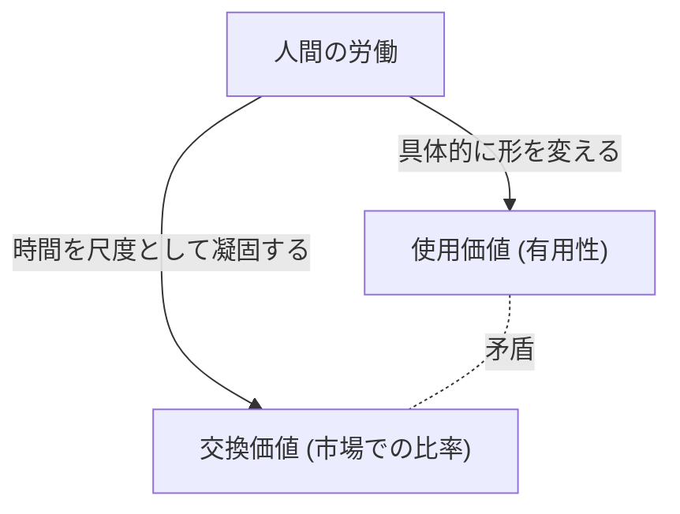

## 1. 序論：19世紀の産業革命と『資本論』の誕生

カール・マルクスが1867年に第一巻を出版した『資本論（Das Kapital）』は、単なる経済学の専門書ではなく、人類の歴史、哲学、社会学、そして一種の社会物理学とも言える壮大な知の体系です。この著作が生まれた19世紀中葉のヨーロッパは、産業革命の熱気と黒煙に包まれていました。蒸気機関の発明は、熱力学という新しい物理学の分野を生み出すと同時に、社会構造を根本から作り変えました。エネルギーの変換効率を極限まで高めようとする工学的な眼差しは、やがて「人間の労働」そのものを一つのエネルギー源として、いかに効率よく富（資本）へと変換するかという資本主義的生産様式の冷徹な論理と同期していったのです。

マルクスは、この巨大な「社会という機械」の設計図を解読しようと試みました。彼の分析は、表面的な価格の変動や需要と供給の法則（当時の古典派経済学が主眼としていたもの）にとどまらず、その深層で稼働している「価値の生産と搾取のメカニズム」を白日の下に晒しました。本稿では、物理学的・歴史的・技術的な背景を交えながら、マルクスの『資本論』の核心部分を現代の視点から詳細に解き明かしていきます。

## 2. 商品の二重性：使用価値と交換価値

『資本論』の冒頭は、「資本主義的生産様式が支配する社会の富は、巨大な商品の集まりとして現れる」という有名な一文から始まります。マルクスは、資本主義の細胞である「商品（Commodity）」の分析から解剖を始めました。

商品は二つの異なる顔を持っています。
第一に**「使用価値（Use-value）」**です。これは、その物が人間の何らかの欲求を満たす物理的・化学的・精神的な有用性を指します。鉄は硬いからハンマーになり、パンは栄養があるから食欲を満たします。使用価値は、物質の物理的特性に依存しており、歴史や社会制度が変わっても存在する普遍的な性質です。

第二に**「交換価値（Exchange-value）」**、あるいは単に「価値」です。市場において、全く異なる使用価値を持つ商品（例えば、1着の上着と10メートルのリンネル）が「同じ価値」として交換されます。物理的性質も用途も異なる二つの物がイコールで結ばれるとき、そこには何らかの「共通の尺度」が存在しなければなりません。マルクスは、この共通の尺度こそが**「人間の抽象的労働（Abstract human labor）」**であると喝破しました。

### 2.1 社会的必要労働時間

価値の大きさは、その商品を生産するために費やされた労働の量、具体的には「労働時間」によって決定されます。しかし、怠け者が時間をかけて作った商品の価値が高くなるわけではありません。マルクスはこれを**「社会的必要労働時間（Socially necessary labor time）」**と定義しました。これは、「標準的な生産条件のもとで、平均的な労働熟練度と強度をもって、ある使用価値を生産するのに必要な労働時間」のことです。

技術革新が起こり、機械が導入されて生産性が倍増すれば、一つの商品に凝固している社会的必要労働時間は半分になり、その商品の価値も半分になります。ここに、資本主義が絶え間なく技術革新を追求するダイナミズムの源泉があります。

## 3. 貨幣への転化と「物神崇拝」

商品の交換が普遍化すると、一つの特別な商品があらゆる商品の価値を測る一般的な等価物として分離します。それが**貨幣（Money）**です。歴史的には金や銀などの貴金属がその役割を担いました。

貨幣の登場は、商品交換を劇的に円滑にしましたが、同時に人間の認識に奇妙な錯覚をもたらしました。マルクスはこれを**「商品の物神崇拝（Commodity Fetishism）」**と呼びます。
本来、商品の価値は「人間と人間の社会的関係（労働の分割と交換）」によって生み出されているにもかかわらず、それが「物と物との関係（商品と貨幣の関係）」として現れる現象です。私たちは、1万円札がそれ自体で価値を持っているかのように錯覚し、背後にある無数の人々の労働のネットワークを忘却してしまいます。これは、現代の高度に複雑化したサプライチェーンにおいて、私たちがスマートフォンを手にしたとき、レアメタルを採掘する過酷な労働や工場での組み立て労働を全く意識しないのと同じ構造です。

## 4. 資本の定式と剰余価値の謎

単純な商品流通の公式は **W - G - W（商品 - 貨幣 - 商品）** です。例えば、農民が自分の作った麦（W）を売って貨幣（G）を得て、それで服（W）を買う。この目的は「異なる使用価値の獲得」であり、プロセスはここで完結します。

しかし、資本の運動は異なります。その公式は **G - W - G'（貨幣 - 商品 - より多くの貨幣）** です。
資本家は貨幣（G）を投じて商品（W）を買い、それを売って最初より多くの貨幣（G'）を得ます。この増えた分の価値（G' - G）を、マルクスは**「剰余価値（Surplus Value）」**と呼びました。

ここで巨大な謎が生じます。市場における等価交換の原則（価値通りの売買）が守られているなら、無から有が生じるように価値が増殖することはあり得ないはずです。安く買って高く売るという詐欺的な行為（不等価交換）だけで社会全体の富が増えるわけではありません。では、剰余価値はどこから湧き出てくるのでしょうか？

### 4.1 労働力という特別な商品

マルクスが発見した解答は、市場に「使用することで新しい価値を生み出す」という魔術的な使用価値を持つ特別な商品が存在する、というものでした。それこそが**「労働力（Labor power）」**です。

資本家は労働者を奴隷として買うのではなく、彼らの「一定時間働く能力（労働力）」を商品として買います。労働力の価値（＝賃金）は、他の商品と同じように「それを再生産するのに必要な社会的労働時間」で決まります。つまり、労働者が明日も元気に出勤し、家族を養い、次世代の労働者を育てるために必要な生活費（食料、家賃、衣服など）です。

仮に、労働力の1日分の価値（生活費）が、6時間の労働で生み出される価値に等しいとします。資本家はこの労働力を1日分買い取りました。しかし、資本家は労働者を6時間で帰らせることはしません。彼らを8時間、あるいは10時間働かせます。

- **必要労働時間（6時間）**：自分の賃金分の価値を再生産する時間
- **剰余労働時間（4時間）**：資本家のために無償で価値を生み出す時間

この剰余労働時間によって生み出された価値こそが「剰余価値」の正体です。**搾取（Exploitation）**とは、道徳的な非難の言葉ではなく、この「労働者が生み出した価値と、労働者が受け取る価値の差額（剰余価値）を資本家が取得する」という客観的な経済的メカニズムを指す科学的概念なのです。

## 5. 絶対的剰余価値と相対的剰余価値

資本家が剰余価値を増大させるには、大きく分けて二つの方法があります。

### 5.1 絶対的剰余価値の生産
これは非常にシンプルで、**「労働時間を延長すること」**です。6時間が必要労働時間なら、労働時間を10時間から12時間、14時間へと延ばせば、剰余労働時間は4時間から6時間、8時間へと増大します。
19世紀のイギリスでは、労働時間が際限なく延長され、女性や子供までもが1日15時間以上も劣悪な環境で働かされました。人間は肉体的な限界を持つ生物であり、過労は文字通り労働力を「使い捨てる」ことになります。熱力学的に言えば、人間の身体という有機的なエンジンから限界を超えてエネルギーを抽出しようとする試みでした。これに対抗する労働者の闘争と、国家による法規制（工場法）によって、労働日には法的な上限が設けられるようになりました。

### 5.2 相対的剰余価値の生産
労働時間の延長に限界が生じると、資本は別の方法をとります。それが**「必要労働時間の短縮」**です。
労働日全体が10時間で固定されているとします。もし、社会全体の生産性が向上し、食料や衣服が安く作れるようになれば、労働力を維持するための生活費が下がります。その結果、必要労働時間が6時間から4時間に短縮されれば、全体の労働時間は変わらなくても、剰余労働時間は4時間から6時間へと増大します。

これを実現するために、資本主義は絶えず技術革新を行い、機械を導入し、分業を高度化させます。資本主義が歴史上かつてないほどの巨大な生産力を生み出した理由は、この「相対的剰余価値」を求める無限の推進力にあります。

## 6. 機械と大工業：テクノロジーによる労働の包摂

『資本論』の第一巻第13章「機械と大工業」は、技術と社会の関係を論じた歴史的名文です。マルクスは、道具から機械への移行が、単なる生産性の向上以上の意味を持つことを見抜いていました。

手工業の時代、労働者は道具を自分の意志と技能で操っていました（**労働の形式的包摂**）。しかし、蒸気機関と複雑な機械体系が導入されると、関係は逆転します。巨大な機械体系が生産の主体となり、労働者はその機械の動きに合わせて奉仕する「意識を持った付属物」へと転落します（**労働の実質的包摂**）。

機械は労働者の負担を減らすために導入されるのではなく、労働を単純化し、女性や子供の安価な労働力を工場に引き入れ、さらには機械の減価償却を急ぐために深夜労働を強制する手段として機能しました。マルクスは、テクノロジー自体を否定したのではなく、「テクノロジーが資本の増殖手段としてのみ用いられる社会関係」を批判したのです。これは現代のAIやロボティクス、アルゴリズムによる労働管理（ギグ・ワーカーなど）を考える上でも、極めて鋭い示唆を与えています。

## 7. 資本の蓄積と相対的過剰人口（産業予備軍）

資本家は獲得した剰余価値をすべて消費するわけではなく、その一部を再び新たな資本として投資します。これが**「資本の蓄積」**です。工場は拡大し、より多くの機械が導入されます。

資本の蓄積が進むと、資本の構成（機械・原材料などの不変資本と、労働力という可変資本の比率）が高度化します。つまり、少ない労働者で大量の機械を動かせるようになります。その結果、資本が成長しても、それと同じ割合では雇用の需要は増えません。

これにより、社会には常に一定の失業者や半失業者の群れが生み出されます。マルクスはこれを**「相対的過剰人口」**または**「産業予備軍（Reserve army of labor）」**と呼びました。
産業予備軍が存在することは、資本主義にとって都合が良いのです。なぜなら、失業者の群れが常に外に控えていることで、就業している労働者への強力な圧力（「代わりはいくらでもいる」）となり、賃金の上昇を抑え込み、労働強化を強制することができるからです。好況期には予備軍から労働力を吸収し、不況期には彼らを真っ先に路上に放り出します。

## 8. 本源的蓄積：資本主義の暴力的な夜明け

資本主義が機能するためには、最初から「貨幣を持つ資本家」と「労働力以外に売るものを持たない無産の労働者（プロレタリアート）」が存在していなければなりません。しかし、このような状況は自然に生まれたわけではありません。

マルクスは第一巻の終盤「いわゆる本源的蓄積」の章で、資本主義の前史を描き出します。イギリスの「囲い込み（エンクロージャー）」に代表されるように、農民から暴力的に土地を奪い、彼らを賃労働者として都市の工場へ追いやった歴史。そして、植民地主義、奴隷貿易、先住民の虐殺による富の収奪。
「資本は、頭から爪先まで、すべての毛穴から血と汚物を滴らせながら生まれてくる」とマルクスは記しました。資本主義の平和的な等価交換の背後には、国家の暴力による原初的な収奪の歴史が隠されているのです。

## 9. 現代における『資本論』の意義

マルクスが『資本論』を書き上げてから150年以上が経過しました。現代の資本主義は、金融資本主義、グローバリゼーション、デジタル情報資本主義へと姿を変えています。労働者の多くはブルーカラーからホワイトカラーへ、そしてサービス業へと移行しました。

しかし、『資本論』の洞察は決して古びていません。
今日、巨大IT企業は私たちがデジタル空間で費やす時間と行動データ（これも一種の労働とみなすことができます）を無償で吸い上げ、それを巨大な富（剰余価値）へと変換しています。また、非正規雇用の拡大やギグ・エコノミーは、まさに現代の「産業予備軍」の形成と労働力の不安定化を体現しています。地球環境の破壊（気候変動）もまた、自然を無償の資源として際限なく搾取する資本の運動の必然的な帰結です（マルクスはこれを「物質代謝の亀裂」として警告していました）。

『資本論』は、資本主義の終焉を単に予言した書ではなく、それが「どのように動いているのか」を解剖した究極の設計図です。私たちが現在直面している経済的格差、疎外感、そしてシステムとしての持続可能性の危機を理解し、その先にある新たな社会システムを構想するためには、マルクスの遺したこの知的枠組みをもう一度深く読み解く必要があるのです。
