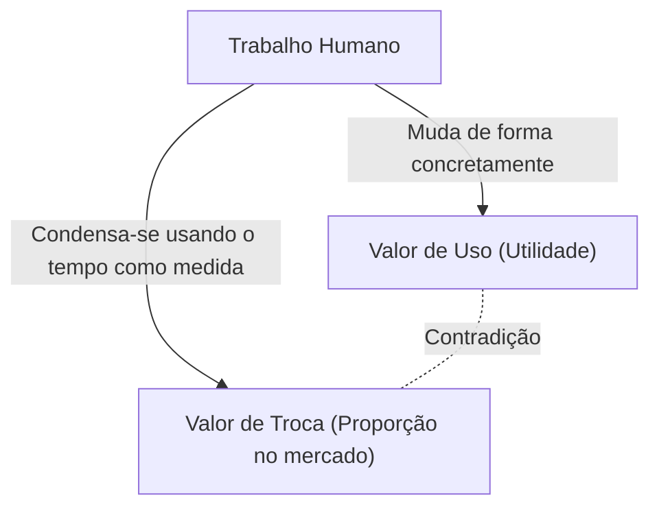
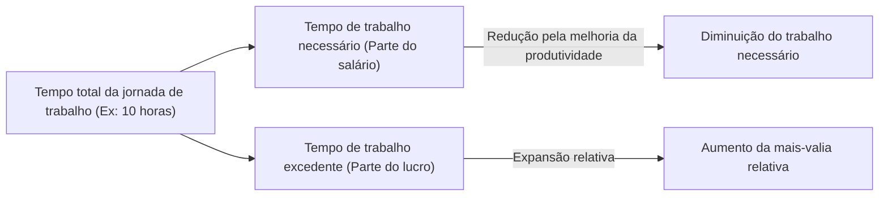

## 1. Introdução: A Revolução Industrial do Século XIX e o Nascimento de "O Capital"

"O Capital" (Das Kapital), cujo primeiro volume foi publicado por Karl Marx em 1867, não é um mero tratado técnico de economia, mas sim um grandioso sistema de conhecimento que abrange a história humana, a filosofia, a sociologia e o que poderia até ser chamado de uma espécie de física social. A Europa de meados do século XIX, quando esta obra nasceu, estava envolta no calor e na fumaça negra da Revolução Industrial. A invenção da máquina a vapor não apenas deu origem a um novo campo da física, a termodinâmica, como também remodelou radicalmente a estrutura social. O olhar da engenharia, que buscava maximizar a eficiência da conversão de energia até o limite extremo, acabou por se sincronizar com a lógica gélida do modo de produção capitalista: como converter de maneira eficiente o "trabalho humano" em si como uma fonte de energia em riqueza (capital).

Marx tentou decifrar a planta de projeto dessa gigantesca "máquina social". A sua análise não se limitou às flutuações superficiais de preços ou às leis de oferta e demanda (nas quais a economia clássica da época se concentrava), mas expôs à luz do dia o "mecanismo de produção e exploração de valor" que operava em suas profundezas. Neste artigo, desvendaremos detalhadamente o cerne de "O Capital" de Marx sob uma perspectiva contemporânea, entrelaçando seu contexto físico, histórico e tecnológico.

## 2. A Dualidade da Mercadoria: Valor de Uso e Valor de Troca

O início de "O Capital" abre com a famosa frase: "A riqueza das sociedades onde domina o modo de produção capitalista aparece como uma 'imensa coleção de mercadorias'". Marx começou a sua dissecação a partir da análise da "Mercadoria" (Commodity), a célula do capitalismo.

A mercadoria possui duas faces distintas.
Primeiro, o **"Valor de Uso" (Use-value)**. Isso se refere à utilidade física, química ou mental daquele objeto em satisfazer alguma necessidade humana. O ferro torna-se um martelo por ser duro, o pão satisfaz a fome por ser nutritivo. O valor de uso depende das propriedades físicas da matéria e é uma característica universal que existe independentemente das mudanças na história ou nos sistemas sociais.

Segundo, o **"Valor de Troca" (Exchange-value)**, ou simplesmente "valor". No mercado, mercadorias com valores de uso completamente diferentes (por exemplo, 1 casaco e 10 metros de linho) são trocadas como "valores iguais". Quando dois objetos com propriedades físicas e usos diferentes são igualados, deve haver alguma "medida comum" entre eles. Marx revelou que essa medida comum é precisamente o **"Trabalho Humano Abstrato" (Abstract human labor)**.

### 2.1 Tempo de Trabalho Socialmente Necessário

A magnitude do valor é determinada pela quantidade de trabalho empregada na produção daquela mercadoria, especificamente, o "tempo de trabalho". No entanto, isso não significa que o valor de uma mercadoria produzida por uma pessoa preguiçosa que leva muito tempo será maior. Marx definiu isso como o **"Tempo de Trabalho Socialmente Necessário" (Socially necessary labor time)**. Trata-se do "tempo de trabalho necessário para produzir um valor de uso nas condições normais de produção e com o grau médio de destreza e intensidade de trabalho".

Se ocorrer uma inovação tecnológica e a introdução de máquinas dobrar a produtividade, o tempo de trabalho socialmente necessário condensado em uma única mercadoria será reduzido à metade, e o valor dessa mercadoria também cairá pela metade. Aqui reside a fonte do dinamismo do capitalismo em sua busca incessante por inovação tecnológica.

## 3. A Transformação em Dinheiro e o "Fetichismo"

À medida que a troca de mercadorias se universaliza, uma mercadoria especial se separa para atuar como o equivalente geral que mede o valor de todas as outras mercadorias. Isso é o **Dinheiro (Money)**. Historicamente, metais preciosos como ouro e prata desempenharam esse papel.

O surgimento do dinheiro facilitou drasticamente a troca de mercadorias, mas ao mesmo tempo trouxe uma estranha ilusão à percepção humana. Marx chama isso de **"Fetichismo da Mercadoria" (Commodity Fetishism)**.
Originalmente, embora o valor de uma mercadoria seja criado pelas "relações sociais entre os seres humanos (divisão do trabalho e troca)", é um fenômeno em que ele aparece como uma "relação entre coisas (a relação entre a mercadoria e o dinheiro)". Temos a ilusão de que uma nota de 10 mil ienes tem valor em si mesma, esquecendo-nos da rede do trabalho de inúmeras pessoas por trás dela. Essa é a mesma estrutura de quando seguramos um smartphone na cadeia de suprimentos altamente complexa de hoje, completamente alheios ao trabalho exaustivo de minerar metais raros ou ao trabalho de montagem nas fábricas.

## 4. A Fórmula do Capital e o Enigma da Mais-Valia

A fórmula simples da circulação de mercadorias é **M - D - M (Mercadoria - Dinheiro - Mercadoria)**. Por exemplo, um agricultor vende o trigo (M) que produziu para obter dinheiro (D) e, em seguida, compra roupas (M) com ele. O objetivo é "a aquisição de diferentes valores de uso", e o processo termina aqui.

No entanto, o movimento do capital é diferente. A sua fórmula é **D - M - D' (Dinheiro - Mercadoria - Mais Dinheiro)**.
O capitalista investe dinheiro (D) para comprar mercadorias (M) e as vende para obter mais dinheiro (D') do que o inicial. A esse valor acrescido (D' - D), Marx chamou de **"Mais-Valia" (Surplus Value)**.

Aqui surge um enorme enigma. Se o princípio da troca de equivalentes (compra e venda de acordo com o valor) no mercado for respeitado, não deveria ser possível que o valor se multiplicasse como se algo surgisse do nada. A riqueza de toda a sociedade não aumenta apenas pela prática enganosa de comprar barato e vender caro (troca não equivalente). Então, de onde brota a mais-valia?

### 4.1 A Mercadoria Especial Chamada Força de Trabalho

A solução descoberta por Marx foi que existe no mercado uma mercadoria especial com o valor de uso mágico de "criar novo valor ao ser consumida". Essa é a **"Força de Trabalho" (Labor power)**.

O capitalista não compra os trabalhadores como escravos, mas compra a sua "capacidade de trabalhar por um determinado tempo (força de trabalho)" como uma mercadoria. O valor da força de trabalho (= salário) é determinado, como qualquer outra mercadoria, pelo "tempo de trabalho socialmente necessário para reproduzi-la". Em outras palavras, o custo de vida (alimentação, aluguel, roupas, etc.) necessário para que o trabalhador se apresente ao trabalho com energia no dia seguinte, sustente a sua família e crie a próxima geração de trabalhadores.

Suponhamos que o valor de 1 dia de força de trabalho (custo de vida) seja equivalente ao valor produzido por 6 horas de trabalho. O capitalista comprou essa força de trabalho por um dia. No entanto, o capitalista não mandará os trabalhadores para casa após 6 horas. Ele os fará trabalhar 8 ou 10 horas.

- **Tempo de trabalho necessário (6 horas)**: Tempo para reproduzir o valor equivalente ao seu salário.
- **Tempo de trabalho excedente (4 horas)**: Tempo para produzir valor gratuitamente para o capitalista.

O valor produzido por esse tempo de trabalho excedente é a verdadeira identidade da "mais-valia". **Exploração (Exploitation)** não é uma palavra de condenação moral, mas um conceito científico que se refere a esse mecanismo econômico objetivo em que "o capitalista se apropria da diferença (mais-valia) entre o valor produzido pelo trabalhador e o valor recebido pelo trabalhador".

## 5. Mais-Valia Absoluta e Mais-Valia Relativa

Existem duas formas principais pelas quais o capitalista pode aumentar a mais-valia.

### 5.1 A Produção de Mais-Valia Absoluta
Esta é muito simples: **"prolongar a jornada de trabalho"**. Se o tempo de trabalho necessário é de 6 horas, prolongar a jornada de trabalho de 10 para 12 ou 14 horas aumentará o tempo de trabalho excedente de 4 para 6 ou 8 horas.
Na Inglaterra do século XIX, as jornadas de trabalho eram prolongadas indefinidamente, e até mesmo mulheres e crianças eram forçadas a trabalhar mais de 15 horas por dia em péssimas condições. Os seres humanos são organismos com limites físicos e, trabalhar em excesso, literalmente significa "descartar" a força de trabalho. Em termos termodinâmicos, era uma tentativa de extrair energia do motor orgânico do corpo humano além dos seus limites. Por causa das lutas dos trabalhadores contra isso e das regulamentações governamentais (Leis das Fábricas), estabeleceram-se limites legais para a jornada de trabalho.

### 5.2 A Produção de Mais-Valia Relativa
Quando o prolongamento da jornada de trabalho atinge seu limite, o capital adota outro método. É a **"redução do tempo de trabalho necessário"**.
Suponhamos que a jornada de trabalho total seja fixada em 10 horas. Se a produtividade geral da sociedade melhorar e os alimentos e roupas puderem ser produzidos de forma mais barata, o custo de vida para manter a força de trabalho diminuirá. Como resultado, se o tempo de trabalho necessário for reduzido de 6 para 4 horas, o tempo de trabalho excedente aumentará de 4 para 6 horas, mesmo que a jornada de trabalho total permaneça a mesma.

Para alcançar isso, o capitalismo inova tecnologicamente de forma incessante, introduz máquinas e aprimora a divisão do trabalho. A razão pela qual o capitalismo criou forças produtivas imensas sem precedentes na história reside nessa força motriz infinita que busca a "mais-valia relativa".

## 6. Maquinaria e Grande Indústria: A Subsunção do Trabalho pela Tecnologia

O Capítulo 13 do Primeiro Volume de "O Capital", "A Maquinaria e a Grande Indústria", é um texto histórico que discute a relação entre tecnologia e sociedade. Marx percebeu que a transição de ferramentas para máquinas significava muito mais do que um mero aumento de produtividade.

Na era do artesanato, o trabalhador manejava as ferramentas com sua própria vontade e habilidade (**subsunção formal do trabalho**). No entanto, com a introdução do motor a vapor e dos complexos sistemas de maquinaria, a relação inverte-se. O gigantesco sistema de maquinaria torna-se o sujeito da produção, e o trabalhador é rebaixado a um "acessório consciente" que serve aos movimentos da máquina (**subsunção real do trabalho**).

As máquinas não foram introduzidas para reduzir o fardo dos trabalhadores, mas funcionaram como um meio para simplificar o trabalho, trazer a mão de obra barata de mulheres e crianças para as fábricas, e até mesmo forçar o trabalho noturno para acelerar a depreciação das máquinas. Marx não negou a tecnologia em si, mas criticou "as relações sociais em que a tecnologia é usada apenas como meio de valorização do capital". Isso nos fornece observações extremamente agudas ao refletir sobre a moderna IA, a robótica e o gerenciamento do trabalho por algoritmos (como trabalhadores gig ou de plataformas).

## 7. Acumulação de Capital e Superpopulação Relativa (Exército Industrial de Reserva)

O capitalista não consome toda a mais-valia que adquire, mas reinveste uma parte dela como novo capital. Isso é a **"Acumulação de Capital"**. As fábricas se expandem e mais máquinas são introduzidas.

À medida que a acumulação de capital avança, a composição do capital (a proporção entre o capital constante, como máquinas e matérias-primas, e o capital variável, que é a força de trabalho) torna-se mais avançada. Em outras palavras, um número menor de trabalhadores pode operar um grande número de máquinas. Como resultado, mesmo que o capital cresça, a demanda por emprego não aumenta na mesma proporção.

Isso cria sempre uma certa massa de pessoas desempregadas ou semidesempregadas na sociedade. Marx chamou isso de **"Superpopulação Relativa"** ou **"Exército Industrial de Reserva" (Reserve army of labor)**.
A existência de um exército industrial de reserva é conveniente para o capitalismo. Pois, o fato de haver sempre uma massa de desempregados à espera do lado de fora exerce uma forte pressão sobre os trabalhadores empregados ("há muitos que podem substituí-los"), mantendo assim os salários baixos e forçando a intensificação do trabalho. Durante períodos de prosperidade econômica, a força de trabalho é absorvida do exército de reserva, e em tempos de crise, eles são os primeiros a serem jogados na rua.

## 8. A Acumulação Primitiva: O Alvorecer Violento do Capitalismo

Para que o capitalismo funcione, devem existir desde o início "capitalistas com dinheiro" e "trabalhadores desprovidos de propriedade (proletariado) que não têm nada a vender além da sua força de trabalho". No entanto, tal situação não surgiu naturalmente.

No final do primeiro volume, no capítulo sobre a "chamada acumulação primitiva", Marx descreve a pré-história do capitalismo. A história em que os camponeses foram violentamente destituídos de suas terras, exemplificado pelos "cercamentos" (enclosures) na Inglaterra, e expulsos para as fábricas urbanas como trabalhadores assalariados. E a expropriação da riqueza através do colonialismo, do comércio de escravos e do massacre das populações indígenas.
Marx escreveu: "o capital nasce escorrendo sangue e sujeira por todos os poros, da cabeça aos pés". Por trás da pacífica troca equivalente do capitalismo, esconde-se uma história de exploração primordial através da violência do Estado.

## 9. O Significado de "O Capital" na Atualidade

Mais de 150 anos se passaram desde que Marx terminou "O Capital". O capitalismo contemporâneo transformou-se no capitalismo financeiro, na globalização e no capitalismo da informação digital. A maioria dos trabalhadores passou dos colarinhos azuis (trabalho manual) para os colarinhos brancos (escritório), e depois para o setor de serviços.

Contudo, as percepções de "O Capital" de forma alguma se tornaram obsoletas.
Hoje, as gigantescas empresas de tecnologia extraem gratuitamente o tempo e os dados comportamentais que passamos no espaço digital (o que também pode ser considerado um tipo de trabalho) e os convertem em uma enorme riqueza (mais-valia). Além disso, a expansão do trabalho precário e a gig economy personificam precisamente a formação do moderno "exército industrial de reserva" e a desestabilização da força de trabalho. A destruição do meio ambiente global (mudanças climáticas) é também uma consequência inevitável do movimento do capital que explora a natureza sem limites como um recurso gratuito (Marx advertiu sobre isso como a "fenda no metabolismo" ou "falha metabólica").

"O Capital" não é meramente um livro que profetizou o fim do capitalismo, mas o projeto arquitetônico definitivo que dissecou "como ele funciona". Para compreender as desigualdades econômicas, a alienação e a crise de sustentabilidade do sistema que enfrentamos atualmente e conceber um novo sistema social para o futuro, precisamos reler profundamente esse quadro intelectual deixado por Marx mais uma vez.
