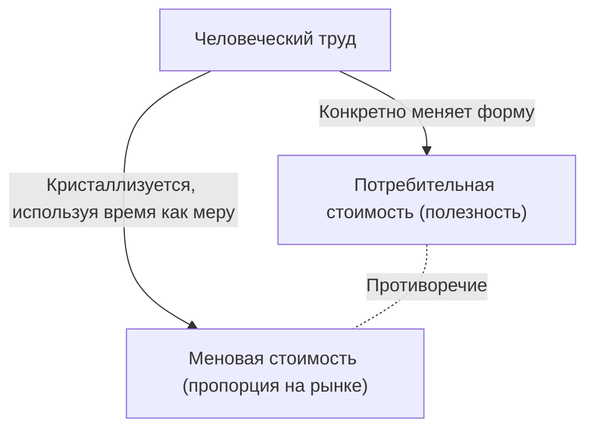
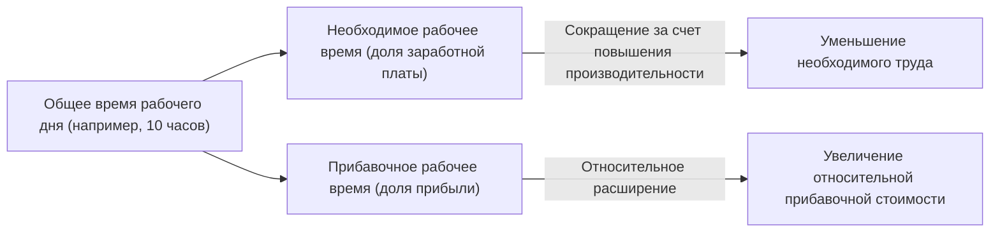

## 1. Введение: Промышленная революция 19-го века и рождение "Капитала"

"Капитал" (Das Kapital), первый том которого Карл Маркс опубликовал в 1867 году, является не просто специализированной книгой по экономике, но и грандиозной системой знаний, которую можно назвать историей человечества, философией, социологией и даже своего рода социальной физикой. Европа середины 19-го века, где родилась эта работа, была окутана жаром и черным дымом промышленной революции. Изобретение паровой машины не только породило новую область физики — термодинамику, но и фундаментально перестроило социальную структуру. Инженерный взгляд, стремившийся максимизировать эффективность преобразования энергии, в конечном итоге синхронизировался с хладнокровной логикой капиталистического способа производства, рассматривающего саму "человеческую деятельность" (труд) как источник энергии и задающегося вопросом, как наиболее эффективно преобразовать ее в богатство (капитал).

Маркс попытался расшифровать чертежи этой гигантской "машины под названием общество". Его анализ не ограничивался поверхностными колебаниями цен или законами спроса и предложения (на чем акцентировала внимание классическая экономика того времени), а вывел на чистую воду скрытые глубоко внутри механизмы "производства стоимости и эксплуатации". В этой статье, учитывая физический, исторический и технологический контекст, мы детально раскроем суть "Капитала" Маркса с современной точки зрения.

## 2. Двойственность товара: потребительная и меновая стоимость

Начало "Капитала" открывается знаменитой фразой: "Богатство обществ, в которых господствует капиталистический способ производства, выступает как огромное скопление товаров". Маркс начал свое препарирование с анализа "товара" (Commodity) — клетки капитализма.

У товара есть два разных лица.
Во-первых, это **"потребительная стоимость (Use-value)"**. Она указывает на физическую, химическую или духовную полезность вещи, удовлетворяющую определенные человеческие потребности. Железо твердое, поэтому из него можно сделать молоток; хлеб питателен, поэтому он удовлетворяет аппетит. Потребительная стоимость зависит от физических характеристик материи и является универсальным свойством, существующим независимо от изменений в истории или социальных институтах.

Во-вторых, это **"меновая стоимость (Exchange-value)"**, или просто "стоимость". На рынке товары с совершенно разной потребительной стоимостью (например, 1 сюртук и 10 метров холста) обмениваются как "равные по стоимости". Когда две вещи, отличающиеся как физическими свойствами, так и назначением, приравниваются друг к другу, между ними должна существовать некая "общая мера". Маркс проницательно заметил, что этой общей мерой является **"абстрактный человеческий труд (Abstract human labor)"**.

### 2.1 Общественно необходимое рабочее время

Величина стоимости определяется количеством труда, затраченного на производство этого товара, а именно "рабочим временем". Однако это не означает, что товар, на создание которого ленивый человек потратил много времени, будет иметь более высокую стоимость. Маркс определил это понятие как **"общественно необходимое рабочее время (Socially necessary labor time)"**. Это "рабочее время, требующееся для изготовления какой-либо потребительной стоимости при наличных общественно нормальных условиях производства и при среднем в данном обществе уровне умелости и интенсивности труда".

Если произойдет технологическая инновация, будут внедрены машины и производительность удвоится, общественно необходимое рабочее время, кристаллизованное в одном товаре, сократится вдвое, и стоимость этого товара также уменьшится вдвое. В этом кроется источник динамизма капитализма, непрерывно стремящегося к технологическим инновациям.

## 3. Превращение в деньги и "товарный фетишизм"

Когда обмен товаров становится всеобщим, один особый товар выделяется в качестве всеобщего эквивалента для измерения стоимости всех других товаров. Это и есть **деньги (Money)**. Исторически эту роль выполняли драгоценные металлы, такие как золото и серебро.

Появление денег радикально упростило обмен товарами, но в то же время вызвало странную иллюзию в человеческом восприятии. Маркс называет это **"товарным фетишизмом (Commodity Fetishism)"**.
По сути, несмотря на то, что стоимость товара создается "социальными отношениями между людьми (разделением труда и обменом)", она проявляется как "отношения между вещами (отношения между товаром и деньгами)". Мы заблуждаемся, полагая, что 10-тысячная купюра имеет ценность сама по себе, и забываем о стоящей за ней сети труда бесчисленного множества людей. Это та же самая структура, что и в современных высокоинтегрированных и сложных цепочках поставок: когда мы берем в руки смартфон, мы совершенно не задумываемся о тяжелом труде по добыче редких металлов или о труде сборщиков на фабриках.

## 4. Формула капитала и загадка прибавочной стоимости

Формула простого товарного обращения — **Т - Д - Т (товар - деньги - товар)**. Например, крестьянин продает выращенную им пшеницу (Т), получает деньги (Д) и покупает на них одежду (Т). Целью этого является "приобретение другой потребительной стоимости", и на этом процесс завершается.

Однако движение капитала иное. Его формула — **Д - Т - Д' (деньги - товар - большее количество денег)**.
Капиталист вкладывает деньги (Д) для покупки товара (Т) и продает его, получая больше денег (Д'), чем было изначально. Эту возросшую часть стоимости (Д' - Д) Маркс назвал **"прибавочной стоимостью (Surplus Value)"**.

Здесь возникает огромная загадка. Если на рынке соблюдается принцип эквивалентного обмена (покупка и продажа по стоимости), стоимость не может увеличиваться так, словно возникает из ничего. Богатство общества в целом не может увеличиться только за счет мошеннических действий вроде покупки подешевле и продажи подороже (неэквивалентный обмен). Откуда же тогда берется прибавочная стоимость?

### 4.1 Особый товар — рабочая сила

Ответ, который нашел Маркс, заключался в том, что на рынке существует особый товар, обладающий магической потребительной стоимостью — "способностью создавать новую стоимость при его использовании". Этим товаром является **"рабочая сила (Labor power)"**.

Капиталист не покупает рабочих как рабов; он покупает их "способность работать в течение определенного времени (рабочую силу)" как товар. Стоимость рабочей силы (= заработная плата) определяется так же, как и у любого другого товара: "общественно необходимым рабочим временем для ее воспроизводства". Другими словами, это стоимость жизни (еда, аренда, одежда и т.д.), необходимая для того, чтобы рабочий мог завтра снова бодро выйти на работу, прокормить свою семью и вырастить следующее поколение рабочих.

Предположим, что стоимость одного дня рабочей силы (расходы на проживание) равна стоимости, создаваемой за 6 часов труда. Капиталист купил эту рабочую силу на один день. Однако капиталист не отпустит рабочих домой через 6 часов. Он заставит их работать 8 или 10 часов.

- **Необходимое рабочее время (6 часов)**: Время, в течение которого воспроизводится стоимость, равная собственной заработной плате.
- **Прибавочное рабочее время (4 часа)**: Время, в течение которого безвозмездно создается стоимость для капиталиста.

Стоимость, созданная в это прибавочное рабочее время, и является истинной природой "прибавочной стоимости". **Эксплуатация (Exploitation)** — это не моральное осуждение, а научная концепция, обозначающая этот объективный экономический механизм, при котором "капиталист присваивает разницу между стоимостью, созданной рабочим, и стоимостью, которую рабочий получает (прибавочную стоимость)".

## 5. Абсолютная и относительная прибавочная стоимость

У капиталиста есть два основных способа увеличить прибавочную стоимость.

### 5.1 Производство абсолютной прибавочной стоимости
Это очень просто: **"удлинение рабочего времени"**. Если необходимое рабочее время составляет 6 часов, то при увеличении рабочего времени с 10 до 12 или 14 часов прибавочное рабочее время увеличится с 4 до 6 или 8 часов.
В Англии 19-го века рабочее время удлинялось безгранично, и даже женщины и дети были вынуждены работать более 15 часов в день в ужасных условиях. Люди — биологические существа с физическими пределами, и переутомление буквально означает "использование на износ" рабочей силы. В терминах термодинамики это была попытка извлечь энергию за пределами возможностей из органического двигателя — человеческого тела. В результате борьбы рабочих против этого, а также законодательного регулирования со стороны государства (фабричное законодательство), был установлен юридический предел рабочего дня.

### 5.2 Производство относительной прибавочной стоимости
Когда удлинение рабочего времени достигает предела, капитал использует другой метод. Это **"сокращение необходимого рабочего времени"**.
Предположим, что весь рабочий день зафиксирован на уровне 10 часов. Если производительность общества в целом повысится, и еду с одеждой можно будет производить дешевле, то расходы на проживание, необходимые для поддержания рабочей силы, снизятся. В результате, если необходимое рабочее время сократится с 6 до 4 часов, то прибавочное рабочее время увеличится с 4 до 6 часов, даже если общее рабочее время останется неизменным.

Для достижения этого капитализм постоянно внедряет технологические инновации, использует машины и углубляет разделение труда. Причина, по которой капитализм создал колоссальные производительные силы, невиданные в истории, кроется в этой бесконечной движущей силе, стремящейся к "относительной прибавочной стоимости".

## 6. Машины и крупная промышленность: подчинение труда технологиям

Глава 13 первого тома "Капитала", "Машины и крупная промышленность", является историческим шедевром, обсуждающим отношения между технологией и обществом. Маркс предвидел, что переход от инструментов к машинам означает нечто большее, чем простое повышение производительности.

В эпоху ремесла рабочие управляли инструментами по своей воле и с помощью своего мастерства (**формальное подчинение труда**). Однако с внедрением паровых машин и сложных машинных систем эти отношения перевернулись. Гигантская машинная система становится субъектом производства, а рабочий низводится до "сознательного придатка", который служит, подстраиваясь под движения этой машины (**реальное подчинение труда**).

Машины внедрялись не для того, чтобы облегчить бремя рабочих, а функционировали как средство упрощения труда, привлечения дешевой рабочей силы женщин и детей на фабрики, а также принуждения к ночному труду для ускорения амортизации машин. Маркс не отрицал саму технологию, он критиковал "социальные отношения, при которых технология используется исключительно как средство возрастания капитала". Это дает чрезвычайно острые идеи и для размышлений о современном управлении трудом с помощью ИИ, робототехники и алгоритмов (например, гиг-работники).

## 7. Накопление капитала и относительное перенаселение (промышленная резервная армия)

Капиталист не потребляет всю полученную прибавочную стоимость, а инвестирует ее часть снова в качестве нового капитала. Это и есть **"накопление капитала"**. Фабрики расширяются, внедряется все больше машин.

По мере накопления капитала строение капитала (отношение постоянного капитала, такого как машины и сырье, к переменному капиталу — рабочей силе) становится все более высоким. То есть меньшее число рабочих может управлять огромным количеством машин. В результате, даже при росте капитала, спрос на занятость не увеличивается в той же пропорции.

Из-за этого в обществе всегда порождается определенная масса безработных и полубезработных. Маркс назвал это **"относительным перенаселением"** или **"промышленная резервная армия (Reserve army of labor)"**.
Существование промышленной резервной армии выгодно для капитализма. Потому что толпа безработных, постоянно ожидающих снаружи, служит мощным средством давления на трудоустроенных работников ("незаменимых людей нет"), позволяя сдерживать рост заработной платы и принуждать к интенсификации труда. Во время экономического бума рабочая сила поглощается из этой резервной армии, а во время спада именно они первыми выбрасываются на улицу.

## 8. Первоначальное накопление: насильственный рассвет капитализма

Для функционирования капитализма с самого начала должны существовать "капиталисты, владеющие деньгами" и "неимущие рабочие (пролетариат), которым нечего продать, кроме своей рабочей силы". Однако такая ситуация не возникла естественным путем.

В конце первого тома, в главе "Так называемое первоначальное накопление", Маркс описывает предысторию капитализма. История насильственного отъема земли у крестьян, примером чего является "огораживание" (enclosure) в Англии, и их вытеснения на городские фабрики в качестве наемных рабочих. А также извлечение богатства посредством колониализма, работорговли и истребления коренных народов.
"Капитал возникает, источая кровь и грязь из всех своих пор, с головы до пят", — писал Маркс. За мирным эквивалентным обменом капитализма скрывается история первоначальной экспроприации, осуществлявшейся посредством государственного насилия.

## 9. Значение "Капитала" в современную эпоху

С тех пор как Маркс написал "Капитал", прошло более 150 лет. Современный капитализм трансформировался в финансовый капитализм, глобализацию и цифровой информационный капитализм. Большинство работников перешли от статуса "синих воротничков" к "белым воротничкам", а затем в сферу услуг.

Однако прозрения "Капитала" ничуть не устарели.
Сегодня гигантские IT-компании безвозмездно выкачивают время и поведенческие данные, которые мы проводим в цифровом пространстве (что также можно рассматривать как вид труда), и превращают их в колоссальное богатство (прибавочную стоимость). Кроме того, расширение нестандартной занятости и гиг-экономика являются прямым воплощением формирования современной "промышленной резервной армии" и дестабилизации рабочей силы. Разрушение глобальной окружающей среды (изменение климата) также является неизбежным следствием движения капитала, который безгранично эксплуатирует природу как бесплатный ресурс (Маркс предупреждал об этом как о "разрыве в обмене веществ").

"Капитал" — это не просто книга, предсказавшая конец капитализма, а ультимативный чертеж, анатомирующий то, "как он работает". Чтобы понять экономическое неравенство, чувство отчуждения и кризис устойчивости как системы, с которыми мы сталкиваемся сегодня, а также чтобы концептуализировать новую социальную систему, которая придет им на смену, необходимо еще раз глубоко вчитаться в эту интеллектуальную структуру, оставленную Марксом.
