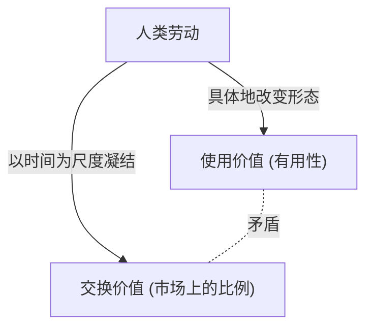
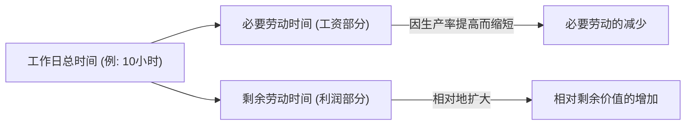

## 1. 导论：19世纪的工业革命与《资本论》的诞生

卡尔·马克思于1867年出版了第一卷的《资本论》（Das Kapital），它不仅仅是一部经济学专业书籍，更是人类历史、哲学、社会学，甚至可以说是某种社会物理学的宏大知识体系。这部著作诞生于19世纪中叶的欧洲，当时正笼罩在工业革命的热浪与黑烟之中。蒸汽机的发明不仅催生了热力学这一新的物理学领域，同时也从根本上重塑了社会结构。这种试图将能量转换效率提高到极限的工程学视角，最终与资本主义生产方式冷酷的逻辑同步，即如何将“人类劳动”本身作为一种能源，最有效地转化为财富（资本）。

马克思试图解读这部巨大的“社会机器”的设计图纸。他的分析并未停留在表面的价格波动或供求规律（这是当时古典经济学关注的重点），而是将深层运转的“价值生产与剥削机制”暴露在光天化日之下。本文将结合物理学、历史学和技术背景，从现代视角详细解读马克思《资本论》的核心部分。

## 2. 商品的二重性：使用价值与交换价值

《资本论》的开篇以一句名言开始：“在资本主义生产方式占统治地位的社会中，财富表现为庞大的商品堆积。”马克思的解剖正是从分析资本主义的细胞——“商品（Commodity）”开始的。

商品具有两副不同的面孔。
第一是**“使用价值（Use-value）”**。它指的是物品满足人类某种物理、化学或精神需求的有用性。铁因为坚硬而能做成锤子，面包因为有营养而能满足食欲。使用价值依赖于物质的物理特性，是即使历史或社会制度发生变化也依然存在的普遍属性。

第二是**“交换价值（Exchange-value）”**，或者简称为“价值”。在市场上，拥有完全不同使用价值的商品（例如一件上衣和10米亚麻布）作为“相同价值”进行交换。当物理性质和用途都不同的两种物品被画上等号时，其中必定存在某种“共同的尺度”。马克思一针见血地指出，这个共同的尺度正是**“人类的抽象劳动（Abstract human labor）”**。

### 2.1 社会必要劳动时间

价值的大小由生产该商品所耗费的劳动量决定，具体来说就是“劳动时间”。但是，这并不意味着懒汉花很长时间做出来的商品价值就会更高。马克思将其定义为**“社会必要劳动时间（Socially necessary labor time）”**。这是指“在现有的社会正常的生产条件下，在社会平均的劳动熟练程度和劳动强度下制造某种使用价值所需要的劳动时间”。

如果发生技术革新，引入了机器使得生产率翻倍，那么凝结在一个商品中的社会必要劳动时间就会减半，该商品的价值也会随之减半。资本主义不断追求技术革新的动力源泉正是在于此。

## 3. 转化为货币与“拜物教”

当商品交换普遍化后，就会有一种特殊的商品分离出来，作为衡量所有商品价值的一般等价物。这就是**货币（Money）**。在历史上，金、银等贵金属承担了这一角色。

货币的出现极大地促进了商品交换的顺利进行，但同时也给人类的认知带来了一种奇怪的错觉。马克思将其称为**“商品拜物教（Commodity Fetishism）”**。
本来，商品的价值是由“人与人之间的社会关系（劳动的分工与交换）”创造的，但它却表现为“物与物之间的关系（商品与货币的关系）”。我们产生了一种错觉，以为1万日元纸币本身就具有价值，从而忘记了其背后无数人劳动的网络。这就如同在现代高度复杂的供应链中，当我们拿起智能手机时，完全意识不到开采稀有金属的残酷劳动以及工厂里的组装劳动一样。

## 4. 资本的总公式与剩余价值之谜

简单的商品流通公式是 **W - G - W（商品 - 货币 - 商品）**。例如，农民卖掉自己种的麦子（W）获得货币（G），然后用它买衣服（W）。其目的是“获得不同的使用价值”，过程到此结束。

但是，资本的运动则不同。它的公式是 **G - W - G'（货币 - 商品 - 更多的货币）**。
资本家投入货币（G）购买商品（W），然后将其卖出以获得比最初更多的货币（G'）。马克思将这部分增加的价值（G' - G）称为**“剩余价值（Surplus Value）”**。

这里出现了一个巨大的谜团。如果在市场上遵守等价交换的原则（按价值买卖），那么价值是不可能像无中生有那样增殖的。仅仅通过低买高卖这种欺诈行为（不等价交换）并不能增加整个社会的财富。那么，剩余价值究竟是从哪里涌现出来的呢？

### 4.1 劳动力这种特殊的商品

马克思发现的答案是，市场上存在一种特殊的商品，它具有“通过使用能够创造出新价值”的魔术般的使用价值。这就是**“劳动力（Labor power）”**。

资本家并不是把工人当作奴隶来购买，而是购买他们“在一定时间内工作的能力（劳动力）”作为商品。劳动力的价值（=工资）与其他商品一样，是由“再生产它所必需的社会劳动时间”决定的。换句话说，也就是工人明天还能精神饱满地去上班、养家糊口以及培养下一代工人所必需的生活费（食物、房租、衣服等）。

假设劳动力一天的价值（生活费）等于6小时劳动所创造的价值。资本家买下了这一天的劳动力。但是，资本家不会让工人在6小时后就回家。他们会让工人工作8小时，甚至10小时。

- **必要劳动时间（6小时）**：再生产自身工资那部分价值的时间
- **剩余劳动时间（4小时）**：无偿为资本家创造价值的时间

这段剩余劳动时间所创造的价值正是“剩余价值”的真面目。**剥削（Exploitation）**并非一个道德谴责的词汇，而是一个科学概念，指的是“资本家无偿占有工人所创造的价值与工人所获得的价值之间的差额（剩余价值）”这一客观的经济机制。

## 5. 绝对剩余价值与相对剩余价值

资本家要想增加剩余价值，主要有两种方法。

### 5.1 绝对剩余价值的生产
这非常简单，即**“延长劳动时间”**。如果必要劳动时间是6小时，把劳动时间从10小时延长到12小时、14小时，剩余劳动时间就会从4小时增加到6小时、8小时。
在19世纪的英国，劳动时间被无休止地延长，甚至妇女和儿童每天也要在恶劣的环境中工作15小时以上。人类作为生物在肉体上是有极限的，过度劳累字面意思上就是把劳动力当作“一次性消耗品”。用热力学的话来说，这是试图从人体这个有机引擎中超越极限地榨取能量。由于工人们的反抗以及国家出台的法律限制（《工厂法》），工作日才最终被设定了法定的上限。

### 5.2 相对剩余价值的生产
当延长劳动时间达到极限时，资本就会采取另一种方法，即**“缩短必要劳动时间”**。
假设整个工作日固定为10小时。如果整个社会的生产率提高，食物和衣服可以制造得更便宜，维持劳动力所需的生活费就会下降。结果就是，如果必要劳动时间从6小时缩短到4小时，那么即使总劳动时间不变，剩余劳动时间也会从4小时增加到6小时。

为了实现这一点，资本主义不断地进行技术革新、引入机器并使分工高度化。资本主义之所以能创造出历史上前所未有的巨大生产力，其原因正是在于这种追求“相对剩余价值”的无限动力。

## 6. 机器与大工业：技术对劳动的包摄

《资本论》第一卷第十三章“机器与大工业”，是论述技术与社会关系的历史名篇。马克思敏锐地看穿了从手工工具到机器的过渡，其意义远不止于单纯的生产率提高。

在手工业时代，工人凭借自己的意志和技能操作工具（**劳动的形式包摄**）。然而，当蒸汽机和复杂的机器体系被引入后，关系发生了逆转。庞大的机器体系成为了生产的主体，而工人则沦落为了配合机器运转而服务的“有意识的附属物”（**劳动的实质包摄**）。

机器的引入并非为了减轻工人的负担，而是作为一种手段，用来简化劳动，将妇女和儿童等廉价劳动力拉进工厂，甚至为了加速机器的折旧而强迫工人进行深夜劳动。马克思并不是否定技术本身，而是批判“技术仅仅被用作资本增殖手段的社会关系”。这对于我们思考现代人工智能、机器人技术以及算法带来的劳动管理（如零工经济工人等）也提供了极其敏锐的启示。

## 7. 资本的积累与相对过剩人口（产业后备军）

资本家并不会将获得的剩余价值全部消费掉，而是将其中的一部分作为新的资本重新投资。这就是**“资本的积累”**。工厂扩大，更多的机器被引入。

随着资本积累的推进，资本构成（机器、原材料等不变资本与劳动力这一可变资本的比例）会不断提高。换言之，只需要很少的工人就能操作大量的机器。结果就是，即使资本增长了，对雇佣的需求也不会以相同的比例增加。

由此，社会上总是会产生一定数量的失业者或半失业者群体。马克思将其称为**“相对过剩人口”**或**“产业后备军（Reserve army of labor）”**。
产业后备军的存在对资本主义是有利的。因为门外随时有一群失业者在等候，这会对在职的工人形成强大的压力（“随时都有人能替代你”），从而压制工资的上涨并强制劳动者加强劳动强度。在繁荣时期，资本会从后备军中吸收劳动力；而在衰退时期，资本又会最先把他们抛到街头。

## 8. 原始积累：资本主义暴力的黎明

为了让资本主义运转起来，从一开始就必须存在“拥有货币的资本家”和“除了劳动力之外一无所有的无产劳动者（无产阶级）”。然而，这种状况并不是自然产生的。

马克思在第一卷末尾的“所谓原始积累”一章中，描绘了资本主义的前史。以英国的“圈地运动（Enclosure）”为代表，这是一段通过暴力将土地从农民手中夺走，并把他们作为雇佣工人驱赶到城市工厂的历史。随后，又通过殖民主义、奴隶贸易以及对原住民的屠杀来进行财富的掠夺。
马克思写道：“资本来到世间，从头到脚，每个毛孔都滴着血和肮脏的东西。”在资本主义和平的等价交换背后，隐藏着国家暴力进行原始掠夺的历史。

## 9. 现代《资本论》的意义

距离马克思写完《资本论》已经过去了150多年。现代资本主义已经演变为金融资本主义、全球化以及数字信息资本主义。大多数工人已经从蓝领转变为白领，并进一步转移到了服务业。

然而，《资本论》的洞见却从未过时。
今天，科技巨头们无偿地榨取我们在数字空间中花费的时间和行为数据（这也可以被视为一种劳动），并将其转化为巨大的财富（剩余价值）。同时，非正式雇佣的扩大和零工经济，正是现代“产业后备军”的形成和劳动力不稳定化的真切体现。地球环境的破坏（气候变化）同样是资本将自然作为免费资源进行无度榨取的必然结果（马克思曾将其警告为“物质代谢的裂缝”）。

《资本论》不仅仅是一部预言资本主义终结的著作，它更是一份解剖资本主义“如何运转”的终极设计图。为了理解我们目前所面临的经济不平等、异化感以及作为系统可持续性的危机，并构想其未来的新社会系统，我们需要再次深入解读马克思所留下的这个知识框架。
