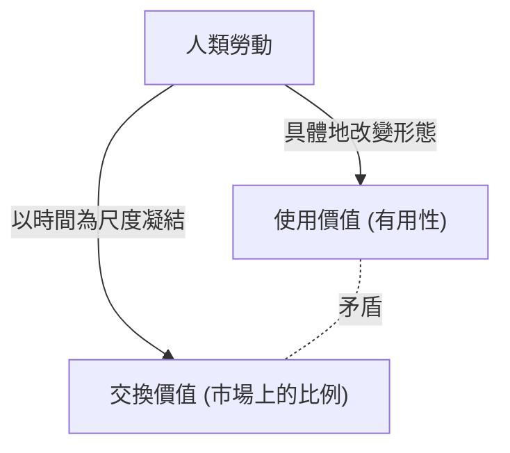

## 1. 導論：19世紀的工業革命與《資本論》的誕生

卡爾·馬克思於1867年出版了《資本論》（Das Kapital）第一卷，這不僅僅是一本經濟學的專業著作，更是一部涵蓋人類歷史、哲學、社會學，甚至可以說是一種社會物理學的宏大知識體系。這部著作誕生的19世紀中葉歐洲，正籠罩在工業革命的熱潮與黑煙之中。蒸汽機的發明不僅催生了熱力學這個新的物理學分支，也從根本上重塑了社會結構。那種試圖將能量轉換效率提升至極限的工程學視角，最終與將「人類勞動」本身視為一種能量來源、思考如何高效地將其轉化為財富（資本）的資本主義生產方式之冷酷邏輯同步了。

馬克思試圖解讀這台巨大的「社會機器」的設計圖。他的分析並未停留在表面的價格波動或供需法則（這是當時古典經濟學的主要關注點），而是將在深層運作的「價值的生產與剝削的機制」公之於世。本文將結合物理學、歷史學與技術性的背景，從現代的視角詳細解讀馬克思《資本論》的核心部分。

## 2. 商品的二重性：使用價值與交換價值

《資本論》的開篇以一句名言開始：「資本主義生產方式占統治地位的社會財富，表現為龐大的商品堆積。」馬克思從分析資本主義的細胞——「商品（Commodity）」開始了他的解剖。

商品具有兩副不同的面孔。
第一是**「使用價值（Use-value）」**。這是指該物品滿足人類某種需求的物理、化學或精神上的有用性。鐵因為堅硬可以做成鐵鎚，麵包因為有營養可以滿足食慾。使用價值依賴於物質的物理特性，是即使歷史或社會制度改變也依然存在的普遍屬性。

第二是**「交換價值（Exchange-value）」**，或者簡稱為「價值」。在市場上，具有完全不同使用價值的商品（例如，1件上衣與10碼亞麻布）作為「同等價值」進行交換。當兩種物理性質與用途都不同的物品被畫上等號時，它們之間必定存在某種「共同的尺度」。馬克思一語道破，這個共同的尺度正是**「人類的抽象勞動（Abstract human labor）」**。

### 2.1 社會必要勞動時間

價值的大小由生產該商品所耗費的勞動量，具體來說就是「勞動時間」來決定。然而，這並不意味著懶惰的人花費更多時間製作的商品價值就更高。馬克思將其定義為**「社會必要勞動時間（Socially necessary labor time）」**。這是指「在現有的社會正常的生產條件下，在社會平均的勞動熟練程度和勞動強度下，製造某種使用價值所需要的勞動時間」。

如果發生技術革新，引入了機器使得生產力倍增，那麼凝結在一個商品中的社會必要勞動時間就會減半，該商品的價值也會減半。這正是資本主義不斷追求技術革新之動力的源泉。

## 3. 轉化為貨幣與「拜物教」

當商品交換普遍化時，一種特殊的商品就會分離出來，作為衡量所有商品價值的一般等價物。那就是**貨幣（Money）**。在歷史上，金、銀等貴金屬承擔了這個角色。

貨幣的出現戲劇性地促進了商品交換的順暢，但同時也給人類的認知帶來了奇妙的錯覺。馬克思稱之為**「商品拜物教（Commodity Fetishism）」**。
本來，商品的價值是由「人與人的社會關係（勞動的分工與交換）」所創造的，但它卻表現為「物與物的關係（商品與貨幣的關係）」。我們產生了一種錯覺，彷彿一張一萬日圓的鈔票本身就具有價值，從而遺忘了其背後無數人的勞動網絡。這與在現代高度複雜的供應鏈中，當我們拿著智慧型手機時，完全不會意識到開採稀有金屬的嚴酷勞動或工廠裡的組裝勞動，是完全相同的結構。

## 4. 資本的公式與剩餘價值之謎

簡單商品流通的公式是 **W - G - W（商品 - 貨幣 - 商品）**。例如，農民賣掉自己種的麥子（W）換取貨幣（G），然後用它去買衣服（W）。這個過程的目的是「獲得不同的使用價值」，並在此完結。

然而，資本的運動則不同。它的公式是 **G - W - G'（貨幣 - 商品 - 更多的貨幣）**。
資本家投入貨幣（G）購買商品（W），然後將其賣出，獲得比最初更多的貨幣（G'）。這增加出來的價值（G' - G），馬克思稱之為**「剩餘價值（Surplus Value）」**。

這裡產生了一個巨大的謎團。如果在市場上遵守等價交換的原則（按價值買賣），那麼價值就不可能像無中生有般地增殖。僅靠低買高賣這種欺詐性行為（不等價交換）並不能增加整個社會的財富。那麼，剩餘價值究竟是從哪裡湧現出來的呢？

### 4.1 勞動力這種特殊的商品

馬克思發現的解答是：市場上存在一種特殊的商品，它具有「透過使用能創造出新價值」這種魔術般的使用價值。這就是**「勞動力（Labor power）」**。

資本家並不是把工人當作奴隸來買，而是購買他們「在一定時間內工作的能力（勞動力）」作為商品。勞動力的價值（即工資），與其他商品一樣，是由「再生產它所必需的社會勞動時間」決定的。也就是說，這是工人為了明天也能精力充沛地去上班、養家餬口、培育下一代工人所必需的生活費（食物、房租、衣服等）。

假設勞動力一天的價值（生活費）等於6小時勞動所創造的價值。資本家買下了這1天的勞動力。但是，資本家不會讓工人在6小時後就回家。他們會讓工人工作8小時，甚至10小時。

- **必要勞動時間（6小時）**：再生產自己工資部分價值的時間
- **剩餘勞動時間（4小時）**：無償為資本家創造價值的時間

這段剩餘勞動時間所創造出的價值，正是「剩餘價值」的真面目。**剝削（Exploitation）**並不是一個道德譴責的詞彙，而是一個科學概念，指的是「資本家佔有工人創造的價值與工人獲得的價值之間的差額（剩餘價值）」這種客觀的經濟機制。

## 5. 絕對剩餘價值與相對剩餘價值

資本家為了增加剩餘價值，主要有兩種方法。

### 5.1 絕對剩餘價值的生產
這非常簡單，就是**「延長勞動時間」**。如果必要勞動時間是6小時，將勞動時間從10小時延長到12小時、14小時，剩餘勞動時間就會從4小時增加到6小時、8小時。
在19世紀的英國，勞動時間被無限制地延長，甚至連婦女和兒童也被迫在惡劣的環境中每天工作15小時以上。人類是具有肉體極限的生物，過勞字面意義上就是對勞動力的「用完即棄」。用熱力學的話來說，這就是試圖超越極限從人類身體這個有機引擎中榨取能量的嘗試。面對這種情況，由於工人的抗爭與國家透過法律（工廠法）的管制，工作日終於被設定了法定的上限。

### 5.2 相對剩餘價值的生產
當勞動時間的延長達到極限時，資本會採取另一種方法。這就是**「縮短必要勞動時間」**。
假設整個工作日固定為10小時。如果整個社會的生產力提升，食物和衣服能被更便宜地製造出來，那麼維持勞動力所需的生活費就會下降。結果，如果必要勞動時間從6小時縮短為4小時，即使總勞動時間不變，剩餘勞動時間也會從4小時增加到6小時。

為了實現這一點，資本主義不斷進行技術革新，引進機器，深化分工。資本主義之所以能創造出歷史上空前的巨大生產力，其原因就在於這種追求「相對剩餘價值」的無限推動力。

## 6. 機器與大工業：科技對勞動的包攝

《資本論》第一卷第13章「機器與大工業」是一篇論述技術與社會關係的歷史名篇。馬克思洞察到，從工具到機器的過渡，不僅僅意味著生產力的提升。

在手工業時代，工人憑藉自己的意志和技能操作工具（**勞動的形式上的包攝**）。然而，當蒸汽機和複雜的機器體系被引進後，關係就逆轉了。巨大的機器體系成為生產的主體，而工人則淪為配合機器運作的「有意識的附屬物」（**勞動的實質上的包攝**）。

機器的引進並不是為了減輕工人的負擔，而是簡化了勞動，將婦女和兒童廉價的勞動力拉進工廠，甚至為了加速機器的折舊而成為強迫深夜勞動的手段。馬克思並非否定科技本身，而是批判了「科技僅被用作資本增殖手段的社會關係」。這對我們思考現代的人工智慧（AI）、機器人技術以及演算法主導的勞動管理（如零工經濟勞動者等），也提供了極為敏銳的啟發。

## 7. 資本的積累與相對過剩人口（產業後備軍）

資本家並不會消費掉獲得的所有剩餘價值，而是將其中一部分再次作為新資本進行投資。這就是**「資本的積累」**。工廠擴大，更多的機器被引進。

隨著資本積累的推進，資本的構成（機器、原材料等不變資本與勞動力這種可變資本的比例）會高度化。也就是說，只需較少的工人就能運作大量的機器。結果，即使資本成長，就業需求的增加也不會與之成正比。

因此，社會中總是會產生一定數量的失業者或半失業群體。馬克思稱之為**「相對過剩人口」**或**「產業後備軍（Reserve army of labor）」**。
產業後備軍的存在對資本主義來說是方便的。因為隨時在外面等候的失業群體，會對在職工人構成強大的壓力（「替代你的人多的是」），從而抑制工資的上漲，並能強制加強勞動強度。在繁榮時期，資本從後備軍中吸收勞動力；而在蕭條時期，則將他們首當其衝地拋向街頭。

## 8. 原始積累：資本主義暴力的黎明

為了讓資本主義運作，從一開始就必須存在「擁有貨幣的資本家」和「除了勞動力以外無物可賣的無產工人（無產階級）」。然而，這種情況並非自然產生。

馬克思在第一卷末尾的「所謂原始積累」一章中，描繪了資本主義的前史。以英國的「圈地運動（Enclosure）」為代表，暴力地剝奪農民的土地，將他們作為雇傭工人趕入城市的工廠的歷史。此外，還有透過殖民主義、奴隸貿易和屠殺原住民來掠奪財富。
馬克思寫道：「資本來到世間，從頭到腳，每個毛孔都滴著血和骯髒的東西。」資本主義和平的等價交換背後，隱藏著國家暴力進行原始掠奪的歷史。

## 9. 現代《資本論》的意義

距離馬克思寫成《資本論》已經過去了150多年。現代的資本主義已經轉變為金融資本主義、全球化和數位資訊資本主義。大多數工人也從藍領轉向了白領，並進入了服務業。

然而，《資本論》的洞察力絲毫沒有過時。
今天，大型科技巨頭無償地吸取我們在數位空間花費的時間和行為數據（這也可以被視為一種勞動），並將其轉化為巨大的財富（剩餘價值）。此外，非典型就業的擴大和零工經濟，正是現代「產業後備軍」形成和勞動力不穩定的具體體現。地球環境的破壞（氣候變遷），也是將自然作為無償資源無限制剝削的資本運動的必然結果（馬克思曾將此警告為「物質代謝的斷裂」）。

《資本論》並不僅僅是一本預言資本主義終結的書，它是解剖了資本主義「如何運作」的終極設計圖。為了理解我們目前面臨的經濟不平等、異化感以及作為一個系統的永續性危機，並構想在此之後的嶄新社會系統，我們有必要再次深入解讀馬克思留下的這一知識框架。
