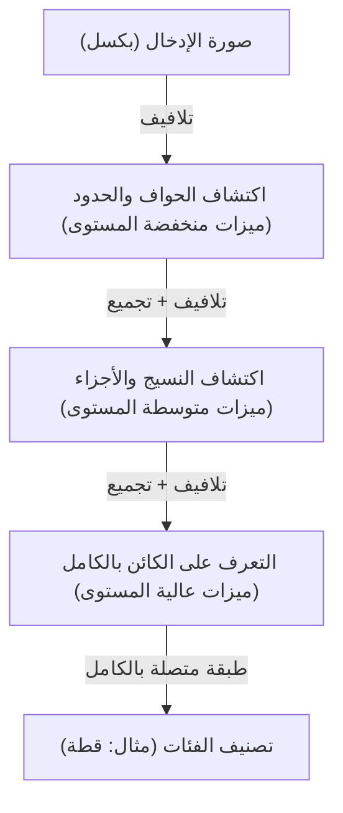

## مقدمة: التفسير الميكانيكي للذكاء

عمليات الإدراك اليومية التي نقوم بها مثل "الرؤية"، "السمع"، و"الفهم" كانت لفترة طويلة واحدة من أكبر الألغاز في العلوم. يوجد في الدماغ البشري حوالي 86 مليار خلية عصبية، والتي تتبادل إشارات كهربائية معقدة من خلال تريليونات من الروابط المشبكية (synapses)، مما يخلق ظواهر منبثقة تُعرف بالوعي والذكاء. بدأ التعلم العميق (Deep Learning) كمحاولة لإعادة بناء هذه العملية البيولوجية المعقدة للغاية كمشكلة تحسين رياضية ومحاكاتها على أجهزة الكمبيوتر.

في هذه المقالة، سنشرح بالتفصيل كيف يتعرف الذكاء الاصطناعي على العالم ويتعلم، بدءًا من البيرسبترون البسيط وصولاً إلى نماذج المحولات (Transformer) التي تقود ثورة الذكاء الاصطناعي الحديثة، وذلك من منظور الفيزياء والتاريخ والخلفيات التقنية والاقتصادية.

## الفصل الأول: الخلفية التاريخية وفجر الشبكات العصبية

### ولادة البيرسبترون وحدوده

يعود تاريخ الشبكات العصبية الاصطناعية إلى "البيرسبترون" (Perceptron) الذي اقترحه فرانك روزنبلات في عام 1957. كان البيرسبترون عبارة عن مصنف خطي بسيط للغاية يقوم بتعيين أوزان لمدخلات متعددة، ولا ينشط (أي يصبح الناتج 1) إلا إذا تجاوز المجموع عتبة معينة. كان هذا أول نموذج رياضي يحاكي سلوك الخلايا العصبية البيولوجية، وكان متوقعًا في ذلك الوقت أنه "سيتعلم بنفسه، وسيمشي، ويتحدث، ويستنسخ نفسه في النهاية".

ومع ذلك، في عام 1969، أثبت كتاب "البيرسبترون" لمارفن مينسكي وسيمور بابيرت، الحدود الرياضية للبيرسبترون أحادي الطبقة، حيث لا يمكنه حل المشكلات غير الخطية مثل "XOR" (الاستبعاد المنطقي). أدى هذا النقد إلى دخول أبحاث الشبكات العصبية في فترة ركود تُعرف بأول "شتاء للذكاء الاصطناعي".

### انتشار الانتشار الخلفي واختراق الطبقات المتعددة

ما كسر شتاء الذكاء الاصطناعي هو "الانتشار الخلفي" (Backpropagation) الذي أعيد اكتشافه وانتشر في الثمانينيات. أسس هذا الخوارزمية، التي صاغها جيفري هينتون وآخرون، طريقة فعالة لتحديث أوزان كل اتصال في الشبكات العصبية متعددة الطبقات (التي تحتوي على طبقات مخفية) عن طريق نشر خطأ المخرجات العكسي نحو جانب المدخلات.

بفضل هذا، اكتسبت الشبكات قدرة تمثيل غير خطية، وأصبح التعرف المعقد على الأنماط ممكنًا. ومع ذلك، وبسبب قوة الحوسبة في ذلك الوقت ومشكلة تلاشي التدرج (ظاهرة تضاؤل إشارة التعلم عند زيادة عمق الطبقات)، تطلب الأمر الانتظار لعقود أخرى وتطور الأجهزة لتحقيق تعلم "عميق" (Deep) حقيقي.

## الفصل الثاني: الأسس الرياضية والفيزيائية للتعلم العميق

### دوال التنشيط وإدخال اللاخطية

السبب الجوهري الذي يسمح للشبكات العصبية بنمذجة العالم المعقد يكمن في "اللاخطية" (Non-linearity). معظم البيانات الموجودة في العالم (الصور، الصوت، اللغة، إلخ) غير قابلة للفصل الخطي. ما يحل هذه المشكلة هو "دالة التنشيط" (Activation Function).

في الماضي، كانت دوال السنجمويد (Sigmoid) و tanh هي السائدة، لكن كانت تعاني من عيب التسبب في مشكلة تلاشي التدرج. في التعلم العميق الحديث، يتم استخدام ReLU (وحدة التنشيط الخطي المصححة) ومشتقاتها بشكل أساسي.

$$ f(x) = \max(0, x) $$

على الرغم من بساطة حسابات ReLU، إلا أنها توفر لاخطية قوية للشبكة، وتسمح للتدرج بالانتشار دون أن يضيع حتى في الطبقات العميقة.

### دالة الخسارة والنزول المتدرج: استكشاف تضاريس الطاقة

تعلم النموذج في جوهره هو مشكلة تحسين للعثور على المعلمات (الأوزان والانحيازات) التي تقلل "دالة الخسارة" (Loss Function). بالنظر إلى ذلك من منظور فيزيائي، يمكن تشبيهه بعملية تدحرج كرة نحو قاع أعمق وادٍ (الحل الأمثل) في "تضاريس طاقة" (Energy Landscape) واسعة وعالية الأبعاد.

ما يوجه عملية النزول هذه هو "النزول المتدرج" (Gradient Descent). حاليًا، يتم استخدام خوارزميات تحسين معدل التعلم التكيفية مثل Adam و RMSprop بشكل قياسي، والتي تتنقل بكفاءة عبر الوديان شديدة الانحناء أو الهضاب المسطحة.

### نظرية المعلومات وفرضية المتشعب (Manifold Hypothesis)

لماذا يمكن للتعلم العميق التعامل مع البيانات عالية الأبعاد مثل الصور واللغات بشكل جيد؟ تكمن وراء ذلك "فرضية المتشعب". وفقًا لهذه الفرضية، فإن البيانات عالية الأبعاد في العالم الحقيقي (مثل: صورة بملايين البكسلات) لا تتوزع بشكل عشوائي، بل تتوزع بكثافة على مساحة طوبولوجية (متشعب) منخفضة الأبعاد بشكل كبير.

تقوم كل طبقة في الشبكة العصبية بتشويه وطي وتمديد الفضاء لفك تشابك هذا المتشعب المعقد تدريجياً، وتحويله في النهاية إلى حالة قابلة للفصل الخطي (تعلم التمثيل).

## الفصل الثالث: تطور البنى وطرق التعرف على العالم

طور التعلم العميق بنيات متخصصة بناءً على طبيعة البيانات التي يتعامل معها.

### CNN (الشبكات العصبية التلافيفية): التعرف المكاني

أحدثت CNN ثورة في التعرف على الصور. هذا النموذج، المستوحى من المجال المستقبل المحلي للقشرة البصرية للكائنات الحية، يستخرج الميزات من الصور من خلال تكرار "الطبقة التلافيفية" (Convolutional Layer) و "طبقة التجميع" (Pooling Layer).

تتميز CNN بـ "ثبات الانتقال" (خصائص تمكن من التعرف على الكائن بغض النظر عن مكانه)، والفوز الساحق الذي حققه AlexNet في مسابقة ImageNet لعام 2012 كان الشرارة التي أشعلت طفرة الذكاء الاصطناعي الحالية.

### RNN و LSTM: إدراك الزمن

تم تصميم RNN (الشبكات العصبية المتكررة) لمعالجة "البيانات المتسلسلة" حيث يكون للترتيب معنى، مثل الصوت أو النص. تحتفظ RNN بالمعلومات السابقة كحالة داخلية، ولكن كان هناك "مشكلة الاعتماد طويل المدى" حيث تتلاشى الذكريات السابقة في السلاسل الطويلة. ما حل هذه المشكلة هو LSTM (الذاكرة طويلة قصيرة المدى). من خلال إدخال آليات البوابات (بوابة النسيان، بوابة الإدخال، بوابة الإخراج)، يتعلم النموذج ما إذا كان يجب الاحتفاظ بالمعلومات لفترة طويلة أو التخلص منها، مما أدى إلى تحسين دقة الترجمة الآلية والتعرف على الكلام بشكل كبير.

### Transformer: آلية الانتباه الذاتي (Self-Attention) والفهم الكامل للسياق

وفي عام 2017، تغير العالم تمامًا من خلال الورقة البحثية "Attention Is All You Need" التي نشرها باحثون من Google. كان ذلك ظهور نموذج المحولات (Transformer).

بدلاً من معالجة البيانات بالترتيب مثل RNN، يستخدم Transformer "آلية الانتباه الذاتي" (Self-Attention) لحساب العلاقات بين جميع البيانات المدخلة (مثل الكلمات) في وقت واحد. أتاح ذلك فهم التبعيات طويلة المدى في السياق بدقة، مع إجراء عمليات حسابية متوازية باستخدام وحدات معالجة الرسومات (GPU) بكفاءة عالية جدًا.

اليوم، تم بناء جميع النماذج المتطورة تقريبًا، بما في ذلك سلسلة GPT التي تدعم ChatGPT، والتكنولوجيا الأساسية لإنشاء الصور بالذكاء الاصطناعي، على بنية Transformer هذه.

## الفصل الرابع: الأسس الاقتصادية والفيزيائية التي تدعم التعلم العميق

### قوانين القياس (Scaling Laws)

القاعدة التجريبية الأكثر أهمية في تطوير الذكاء الاصطناعي الحديث هي "قوانين القياس". وهو قانون ينص على أنه كلما زاد عدد معلمات النموذج وحجم مجموعة بيانات التدريب وكمية الحسابات (Compute) المستخدمة بشكل أسي، استمر أداء النموذج في التحسن بطريقة يمكن التنبؤ بها. مع اكتشاف هذا القانون، تحول تطوير الذكاء الاصطناعي من "البحث عن خوارزميات أكثر تطوراً" إلى منافسة رأسمالية صناعية "لتأمين موارد حاسوبية ضخمة".

### معمارية الكمبيوتر وفيزياء الطاقة

لا يمكن فصل تقدم التعلم العميق عن تطور الأجهزة، بما في ذلك وحدات معالجة الرسومات من NVIDIA. يتطلب تدريب النماذج التي تحتوي على مئات المليارات من المعلمات مراكز بيانات ضخمة وطاقة كهربائية هائلة. في مواجهة القيود الفيزيائية للحوسبة (نهاية قانون مور ومشاكل توليد الحرارة)، أصبح الانتقال إلى نماذج الأجهزة من الجيل التالي، مثل أجهزة الكمبيوتر الكمومية ورقائق الحوسبة العصبية (Neuromorphic chips)، ضرورة اقتصادية وتقنية قصوى.

## الخلاصة: الذكاء الاصطناعي ومستقبلنا

تطور الذكاء الاصطناعي، الذي بدأ من المعادلة البسيطة للبيرسبترون، إلى درجة أصبح قادراً فيها على فهم لغة البشر، وخلق الفن، وتسريع الاكتشافات العلمية. التعلم العميق ليس مجرد خوارزمية برمجية، بل هو بنية تحتية ضخمة للحضارة الحديثة حيث تتقاطع البيانات والرياضيات والفيزياء ورأس المال الاقتصادي الهائل.

كيف يتعرف الذكاء الاصطناعي على العالم؟ إن فهم هذه الآلية لا يعني فتح الصندوق الأسود للآلة فحسب، بل يعني أيضًا مواجهة السؤال الأساسي حول ماهية "الذكاء" لدينا نحن البشر. لا يتوقف التطور التكنولوجي، ونحن نقف الآن على جبهة معرفية جديدة في تاريخ البشرية.
