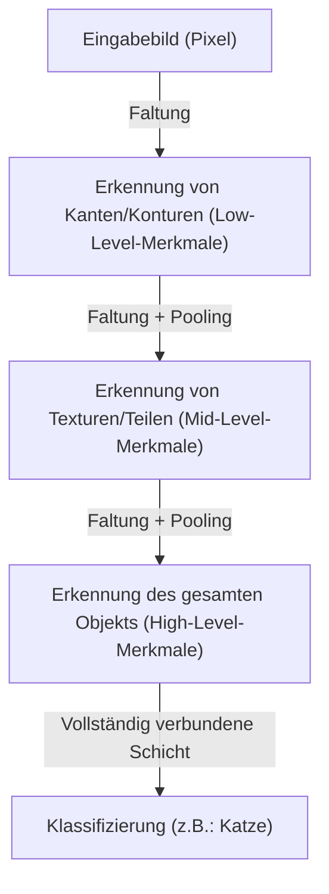

## Einleitung: Die mechanistische Interpretation von Intelligenz

Die kognitiven Prozesse wie "Sehen", "Hören" und "Verstehen", die wir im Alltag ausführen, waren lange Zeit eines der größten Rätsel der Wissenschaft. Im menschlichen Gehirn gibt es etwa 86 Milliarden Neuronen, die über Billionen von synaptischen Verbindungen komplexe elektrische Signale austauschen und so emergente Phänomene wie Bewusstsein und Intelligenz erzeugen. Deep Learning begann als Versuch, diesen extrem komplexen biologischen Prozess als mathematisches Optimierungsproblem zu rekonstruieren und auf einem Computer zu simulieren.

In diesem Artikel werden wir vom einfachen Perzeptron bis zum Transformer-Modell, das die moderne KI-Revolution antreibt, detailliert erläutern, wie künstliche Intelligenz die Welt wahrnimmt und lernt, und ihre Mechanismen aus physikalischer, historischer sowie technologisch-wirtschaftlicher Perspektive beleuchten.

## Kapitel 1: Historischer Hintergrund und die Anfänge der neuronalen Netze

### Die Geburt und die Grenzen des Perzeptrons

Die Geschichte der künstlichen neuronalen Netze reicht bis zum "Perzeptron" zurück, das 1957 von Frank Rosenblatt vorgeschlagen wurde. Das Perzeptron war ein sehr einfacher linearer Klassifikator, der mehrere Eingaben gewichtete und nur feuerte (Ausgabe 1), wenn die Summe einen bestimmten Schwellenwert überschritt. Es war das erste mathematische Modell, das das Verhalten biologischer Neuronen nachahmte, und man erwartete damals, dass es "selbst lernen und schließlich gehen, sprechen und sich selbst reproduzieren würde".

Im Jahr 1969 jedoch bewiesen Marvin Minsky und Seymour Papert in ihrem Buch "Perceptrons" die mathematische Grenze, dass einlagige Perzeptrons nichtlineare Probleme wie "XOR (exklusives ODER)" nicht lösen können. Aufgrund dieser Erkenntnis trat die Forschung an neuronalen Netzen in eine Phase der Stagnation ein, die als der erste "KI-Winter" bekannt ist.

### Der Durchbruch durch Backpropagation und Multilayering

Der KI-Winter wurde durch die "Backpropagation" (Fehlerrückführung) durchbrochen, die in den 1980er Jahren wiederentdeckt und populär wurde. Dieser Algorithmus, der unter anderem von Geoffrey Hinton formuliert wurde, etablierte eine Methode, um in mehrschichtigen (mit verborgenen Schichten) neuronalen Netzen den Ausgabefehler rückwärts zur Eingabeseite zu propagieren und die Gewichte jeder Verbindung effizient zu aktualisieren.

Dadurch gewannen die Netze an nichtlinearer Ausdruckskraft, und komplexe Mustererkennung wurde möglich. Jedoch wurde die Realisierung von wahrhaftigem "Deep" Learning durch Hürden wie die damalige Rechenleistung von Computern und das Problem des verschwindenden Gradienten (ein Phänomen, bei dem das Lernsignal abnimmt, wenn die Schichten tiefer werden) behindert, und man musste auf weitere Jahrzehnte und die Weiterentwicklung der Hardware warten.

## Kapitel 2: Die mathematischen und physikalischen Grundlagen von Deep Learning

### Aktivierungsfunktionen und die Einführung von Nichtlinearität

Der Hauptgrund, warum neuronale Netze eine komplexe Welt modellieren können, liegt in der "Nichtlinearität". Die meisten in der Welt existierenden Daten (Bilder, Audio, Sprache usw.) sind nicht linear separierbar. Die Lösung hierfür ist die "Aktivierungsfunktion" (Activation Function).

In der Vergangenheit waren Sigmoid- und tanh-Funktionen vorherrschend, aber sie hatten den Nachteil, dass sie das Problem des verschwindenden Gradienten leicht verursachen konnten. Im modernen Deep Learning werden hauptsächlich ReLU (Rectified Linear Unit) und seine Derivate verwendet.

$$ f(x) = \max(0, x) $$

ReLU ist in der Berechnung extrem einfach, verleiht dem Netzwerk jedoch eine starke Nichtlinearität und ermöglicht es, Gradienten selbst in tiefen Schichten ohne Verlust zu propagieren.

### Verlustfunktion und Gradientenabstieg: Die Erkundung der Energielandschaft

Das Training eines Modells ist im Wesentlichen ein Optimierungsproblem, um die Parameter (Gewichte und Bias) zu finden, die die "Verlustfunktion" (Loss Function) minimieren. Aus einer physikalischen Perspektive betrachtet, kann man dies mit dem Prozess vergleichen, bei dem ein Ball in einer weiten, hochdimensionalen "Energielandschaft" (Energy Landscape) in das tiefste Tal (die optimale Lösung) rollt.

Dieser Abstiegsprozess wird durch den "Gradientenabstieg" (Gradient Descent) gesteuert. Heute werden standardmäßig Optimierungsalgorithmen mit adaptiver Lernrate wie Adam oder RMSprop verwendet, um steile Täler und flache Plateaus effizient zu navigieren.

### Informationstheorie und die Mannigfaltigkeitshypothese (Manifold Hypothesis)

Warum kann Deep Learning so gut mit hochdimensionalen Daten wie Bildern oder Sprache umgehen? Der Hintergrund dafür ist die "Mannigfaltigkeitshypothese" (Manifold Hypothesis). Nach dieser Hypothese sind hochdimensionale Daten der realen Welt (z. B. Bilder mit Millionen von Pixeln) nicht zufällig verteilt, sondern vielmehr dicht auf einem viel niederdimensionaleren topologischen Raum (Mannigfaltigkeit) konzentriert.

Jede Schicht des neuronalen Netzes verzerrt, faltet und dehnt den Raum, entwirrt allmählich diese komplex verschlungene Mannigfaltigkeit und wandelt sie schließlich in einen linear separierbaren Zustand um (Repräsentationslernen).

## Kapitel 3: Die Evolution von Architekturen und wie die Welt wahrgenommen wird

Deep Learning hat spezialisierte Architekturen entwickelt, die an die Eigenschaften der zu verarbeitenden Daten angepasst sind.

### CNN (Convolutional Neural Networks): Räumliche Wahrnehmung

Das CNN hat in der Bilderkennung eine Revolution herbeigeführt. Dieses Modell, inspiriert von den lokalen rezeptiven Feldern im visuellen Kortex von Lebewesen, extrahiert Merkmale aus Bildern durch das Wiederholen von "Faltungsschichten" (Convolutional Layer) und "Pooling-Schichten" (Pooling Layer).

CNNs besitzen "Translationsinvarianz" (die Eigenschaft, ein Objekt unabhängig von seiner Position zu erkennen), und der überwältigende Sieg von AlexNet beim ImageNet-Wettbewerb 2012 zündete den aktuellen KI-Boom.

### RNN und LSTM: Zeitliche Wahrnehmung

Das RNN (Recurrent Neural Network) wurde entwickelt, um "sequentielle Daten" wie Audio oder Text zu verarbeiten, bei denen die Reihenfolge eine Bedeutung hat. Das RNN behält vergangene Informationen als internen Zustand bei, hatte jedoch das Problem der "langfristigen Abhängigkeit", bei dem die Erinnerung an die Vergangenheit in langen Sequenzen verblasst. Dies wurde durch LSTM (Long Short-Term Memory) gelöst. Durch die Einführung von Gating-Mechanismen (Vergessens-Gate, Eingabe-Gate, Ausgabe-Gate) lernte es, ob Informationen über einen langen Zeitraum behalten oder verworfen werden sollen, was die Genauigkeit von maschineller Übersetzung und Spracherkennung drastisch verbesserte.

### Transformer: Self-Attention und das vollständige Verstehen von Kontext

Und dann, im Jahr 2017, veränderte sich die Welt mit dem von Google-Forschern veröffentlichten Paper "Attention Is All You Need". Es war das Erscheinen des Transformer-Modells.

Anstatt Daten wie RNNs sequentiell zu verarbeiten, nutzt der Transformer einen "Selbstaufmerksamkeitsmechanismus" (Self-Attention), um die Beziehungen zwischen allen eingegebenen Daten (wie Wörtern) gleichzeitig zu berechnen. Dadurch wurde es möglich, langfristige kontextuelle Abhängigkeiten genau zu erfassen und gleichzeitig parallele Berechnungen auf GPUs äußerst effizient durchzuführen.

Heute basieren fast alle hochmodernen Modelle, wie die GPT-Serie, die ChatGPT antreibt, und die grundlegenden Technologien für bildgenerierende KI, auf dieser Transformer-Architektur.

## Kapitel 4: Die wirtschaftlichen und physikalischen Grundlagen von Deep Learning

### Skalierungsgesetze (Scaling Laws)

Die wichtigste Faustregel in der modernen KI-Entwicklung sind die "Skalierungsgesetze" (Scaling Laws). Es ist das Gesetz, dass die Leistung eines Modells vorhersehbar weiter steigt, je mehr man die Anzahl der Modellparameter, die Größe des Trainingsdatensatzes und den investierten Rechenaufwand (Compute) exponentiell erhöht. Mit der Entdeckung dieses Gesetzes verlagerte sich die KI-Entwicklung von der "Suche nach ausgefeilteren Algorithmen" zu einem industriellen Kapitalwettbewerb um die "Sicherung gigantischerer Rechenressourcen".

### Computerarchitektur und die Physik der Energie

Der Fortschritt im Bereich Deep Learning ist untrennbar mit der Entwicklung von Hardware wie den GPUs von NVIDIA verbunden. Das Training von Modellen mit Hunderten von Milliarden Parametern erfordert riesige Rechenzentren und enorme Mengen an Strom. Angesichts der physikalischen Grenzen des Rechnens (das Ende des Mooreschen Gesetzes und Probleme mit der Wärmeentwicklung) ist der Übergang zu Hardware-Paradigmen der nächsten Generation, wie Quantencomputern und neuromorphen Chips (gehirnähnlichen Computern), zu einer wirtschaftlichen und technologischen Priorität geworden.

## Fazit: KI und unsere Zukunft

Künstliche Intelligenz, die mit der einfachen mathematischen Formel des Perzeptrons begann, hat sich nun so weit entwickelt, dass sie menschliche Sprache verstehen, Kunst erschaffen und wissenschaftliche Entdeckungen beschleunigen kann. Deep Learning ist nicht nur ein reiner Software-Algorithmus, sondern eine gewaltige Infrastruktur der modernen Zivilisation, in der Daten, Mathematik, Physik und enormes wirtschaftliches Kapital zusammenlaufen.

Wie nimmt KI die Welt wahr? Den Mechanismus dahinter zu verstehen bedeutet, die Blackbox der Maschine zu öffnen, und gleichzeitig uns der grundlegenden Frage zu stellen, was die "Intelligenz" von uns Menschen selbst eigentlich ist. Die technologische Entwicklung bleibt nicht stehen, und wir stehen heute an einer neuen Grenze der Wahrnehmung in der Geschichte der Menschheit.
