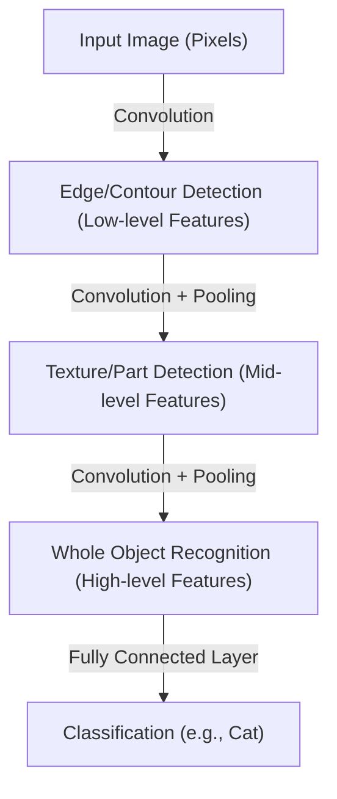

## Introduction: A Mechanistic Interpretation of Intelligence

The cognitive processes we perform daily—"seeing," "hearing," and "understanding"—have long been one of science's greatest mysteries. Inside the human brain, there are approximately 86 billion neurons, and the complex electrical signals they exchange through trillions of synaptic connections give rise to the emergent phenomena called consciousness and intelligence. Deep learning began as an attempt to reconstruct this extremely complex biological process as a mathematical optimization problem and simulate it on a computer.

In this article, we will detail the mechanisms by which artificial intelligence perceives and learns about the world, from the simple perceptron to the Transformer models driving the modern AI revolution, exploring its physics, history, and technical and economic backgrounds.

## Chapter 1: Historical Background and the Dawn of Neural Networks

### The Birth and Limits of the Perceptron

The history of artificial neural networks dates back to the "perceptron" proposed by Frank Rosenblatt in 1957. The perceptron was a very simple linear classifier that weighted multiple inputs and fired (output became 1) only when their sum exceeded a certain threshold. This was the first mathematical model to mimic the behavior of biological neurons, and at the time, it was expected that it would "learn by itself, and eventually walk, talk, and self-reproduce."

However, in 1969, Marvin Minsky and Seymour Papert's book "Perceptrons" mathematically proved the limitations of single-layer perceptrons, showing they could not solve non-linear problems like "XOR (exclusive OR)." This critique plunged neural network research into its first period of stagnation, known as the "AI winter."

### Breakthroughs with Backpropagation and Multi-layering

Breaking through the AI winter was "backpropagation," which was rediscovered and popularized in the 1980s. Formalized by Geoffrey Hinton and others, this algorithm established an efficient method for updating the weights of each connection in multi-layer (having hidden layers) neural networks by propagating the output error backward toward the input side.

This allowed networks to acquire non-linear expressiveness, making complex pattern recognition possible. However, due to the computational limits of computers at the time and hurdles like the vanishing gradient problem (a phenomenon where the learning signal decays as layers get deeper), true "deep" learning had to wait several more decades and the evolution of hardware to become a reality.

## Chapter 2: The Mathematical and Physical Foundations of Deep Learning

### Activation Functions and the Introduction of Non-linearity

The core reason neural networks can model the complex world lies in "non-linearity." Most of the data that exists in the world (images, audio, language, etc.) is not linearly separable. This is solved by the "Activation Function."

In the past, sigmoid and tanh functions were mainstream, but they had the drawback of easily causing the vanishing gradient problem. In modern deep learning, ReLU (Rectified Linear Unit) and its derivatives are primarily used.

$$ f(x) = \max(0, x) $$

While its computation is extremely simple, ReLU brings powerful non-linearity to the network, making it possible to propagate gradients without losing them even in deep layers.

### Loss Functions and Gradient Descent: Exploring the Energy Landscape

Model learning is essentially an optimization problem of finding the parameters (weights and biases) that minimize the "Loss Function." From a physics perspective, this can be likened to a process where a ball rolls down toward the lowest valley (optimal solution) in a vast, high-dimensional "Energy Landscape."

Guiding this descent process is "Gradient Descent." Today, adaptive learning rate optimization algorithms like Adam and RMSprop are standardly used, efficiently navigating steep valleys and flat plateaus.

### Information Theory and the Manifold Hypothesis

Why is deep learning so good at handling high-dimensional data like images and language? Behind this lies the "Manifold Hypothesis." According to this hypothesis, real-world high-dimensional data (e.g., images with millions of pixels) are not randomly distributed, but are actually densely distributed on a much lower-dimensional topological space (manifold).

Each layer of a neural network gradually untangles this complexly intertwined manifold by distorting, folding, and stretching space, ultimately transforming it into a linearly separable state (representation learning).

## Chapter 3: Evolution of Architectures and How They Perceive the World

Deep learning has developed specialized architectures according to the nature of the data it handles.

### CNN (Convolutional Neural Networks): Perceiving Space

CNNs brought a revolution in image recognition. Inspired by the local receptive fields in the biological visual cortex, this model extracts features from images by repeating "Convolutional Layers" and "Pooling Layers."

CNNs possess "translation invariance" (the property of being able to recognize an object no matter where it is), and AlexNet's overwhelming victory in the 2012 ImageNet competition ignited the current AI boom.

### RNN and LSTM: Perceiving Time

RNNs (Recurrent Neural Networks) were designed to process "sequential data" where order has meaning, such as audio and text. While RNNs maintain past information as an internal state, they suffered from the "long-term dependency problem" where past memories faded in long sequences. LSTM (Long Short-Term Memory) solved this. By introducing gate mechanisms (forget gate, input gate, output gate), it learns whether to retain information for a long time or discard it, dramatically improving the accuracy of machine translation and speech recognition.

### Transformer: Self-Attention and Complete Contextual Understanding

Then, in 2017, the world was completely transformed by the paper "Attention Is All You Need" published by Google researchers. The Transformer model had arrived.

Instead of processing data sequentially like RNNs, Transformers use "Self-Attention" to simultaneously calculate the relationships between all input data (e.g., words). This made it possible to accurately grasp long-term dependencies in context while performing parallel computation on GPUs extremely efficiently.

Today, almost all state-of-the-art models, including the GPT series underpinning ChatGPT and the foundational technologies for image generation AI, are built on this Transformer architecture.

## Chapter 4: The Economic and Physical Infrastructure Supporting Deep Learning

### Scaling Laws

The most important empirical rule in modern AI development is "Scaling Laws." This law states that as the number of model parameters, the size of the training dataset, and the injected computational power (Compute) increase exponentially, the model's performance continues to improve in a predictable manner. The discovery of this law shifted AI development from "the quest for more sophisticated algorithms" to an industrial capital competition of "securing more massive computational resources."

### Computer Architecture and the Physics of Power

The progress of deep learning is inseparable from the evolution of hardware, particularly NVIDIA's GPUs. Training models with hundreds of billions of parameters requires massive data centers and enormous electrical power. As we face the physical limits of computation (the end of Moore's Law and heat generation issues), transitioning to next-generation hardware paradigms like quantum computers and neuromorphic chips (brain-inspired computers) has become an absolute economic and technological imperative.

## Conclusion: AI and Our Future

Artificial intelligence, which started from the simple mathematical formula of the perceptron, has now evolved to the point where it understands human language, creates art, and accelerates scientific discoveries. Deep learning is not merely a software algorithm; it is a massive infrastructure of modern civilization where data, mathematics, physics, and immense economic capital intersect.

How does AI perceive the world? Understanding its mechanisms is not only opening the black box of machines but also confronting the fundamental question of what human "intelligence" itself is. The evolution of technology will not stop, and we now stand on a new frontier of perception in human history.
