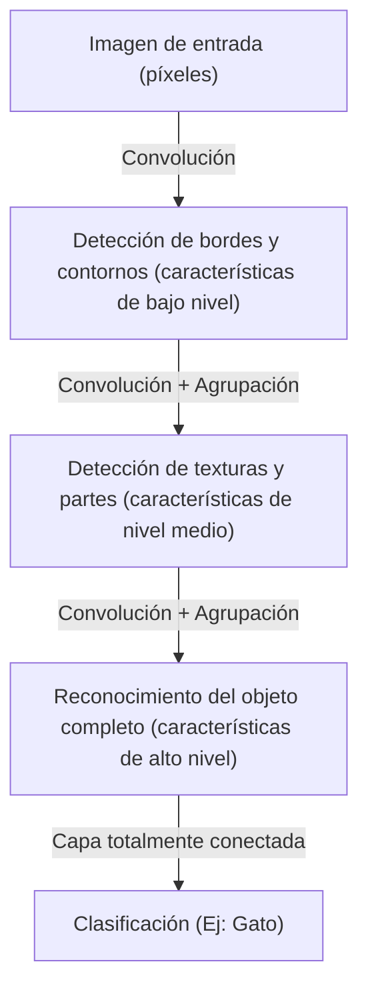

## Introducción: Una interpretación mecanicista de la inteligencia

El proceso cognitivo que realizamos a diario de "ver", "escuchar" y "comprender" ha sido durante mucho tiempo uno de los mayores misterios de la ciencia. Existen alrededor de 86 mil millones de neuronas en el cerebro humano, y mediante el intercambio de señales eléctricas complejas a través de billones de conexiones sinápticas, se generan fenómenos emergentes conocidos como conciencia e inteligencia. El aprendizaje profundo (deep learning) comenzó como un intento de reconstruir este proceso biológico extremadamente complejo como un problema de optimización matemática y simularlo en una computadora.

En este artículo, desentrañaremos en detalle desde la física, la historia y el contexto tecnológico y económico el mecanismo de cómo la inteligencia artificial reconoce y aprende del mundo, desde el simple perceptrón hasta los modelos Transformer que impulsan la revolución actual de la IA.

## Capítulo 1: Antecedentes históricos y el amanecer de las redes neuronales

### El nacimiento del perceptrón y sus límites

La historia de las redes neuronales artificiales se remonta al "perceptrón" propuesto por Frank Rosenblatt en 1957. El perceptrón era un clasificador lineal muy simple que aplicaba pesos a múltiples entradas y se activaba (la salida era 1) solo si la suma superaba un cierto umbral. Este fue el primer modelo matemático que imitó el comportamiento de las neuronas biológicas, y en aquel entonces se esperaba que "aprendiera por sí mismo y eventualmente caminara, hablara y se reprodujera".

Sin embargo, en 1969, el libro "Perceptrons" de Marvin Minsky y Seymour Papert demostró matemáticamente que los perceptrones de una sola capa no podían resolver problemas no lineales como el "XOR (O exclusivo)". Debido a este señalamiento, la investigación de redes neuronales entró en un período de estancamiento conocido como el primer "invierno de la IA".

### El avance de la retropropagación y la multicapa

Lo que rompió el invierno de la IA fue la "retropropagación" (backpropagation), redescubierta y popularizada en la década de 1980. Este algoritmo, formulado por Geoffrey Hinton y otros, estableció un método para propagar el error de salida hacia atrás hacia el lado de la entrada en redes neuronales multicapa (con capas ocultas), actualizando eficientemente el peso de cada conexión.

Con esto, la red adquirió un poder expresivo no lineal y se hizo posible el reconocimiento de patrones complejos. Sin embargo, bloqueado por barreras como la capacidad de cálculo de las computadoras de la época y el problema del desvanecimiento del gradiente (un fenómeno donde la señal de aprendizaje se atenúa al profundizar las capas), fue necesario esperar varias décadas más y la evolución del hardware para que se lograra un verdadero aprendizaje "profundo" (deep).

## Capítulo 2: Fundamentos matemáticos y físicos del aprendizaje profundo

### Función de activación y la introducción de la no linealidad

La razón central por la que las redes neuronales pueden modelar un mundo complejo radica en la "no linealidad". La mayoría de los datos que existen en el mundo (imágenes, sonido, lenguaje, etc.) no son linealmente separables. Lo que resuelve esto es la "función de activación" (Activation Function).

En el pasado, la función sigmoide y la función tanh eran las principales, pero tenían el inconveniente de causar fácilmente el problema del desvanecimiento del gradiente. En el aprendizaje profundo moderno, se utiliza principalmente ReLU (Rectified Linear Unit) y sus derivados.

$$ f(x) = \max(0, x) $$

Aunque el cálculo de ReLU es extremadamente simple, aporta una potente no linealidad a la red y permite que el gradiente se propague sin perderse, incluso en capas profundas.

### Función de pérdida y descenso de gradiente: Exploración del paisaje energético

El aprendizaje del modelo es esencialmente un problema de optimización para encontrar los parámetros (pesos y sesgos) que minimizan la "función de pérdida" (Loss Function). Visto desde una perspectiva física, se puede comparar con el proceso de una pelota rodando hacia el fondo del valle más profundo (la solución óptima) en un vasto y de alta dimensión "paisaje energético" (Energy Landscape).

El proceso que guía este descenso es el "descenso de gradiente" (Gradient Descent). Actualmente, algoritmos de optimización de tasa de aprendizaje adaptativo como Adam y RMSprop se utilizan de forma estándar, navegando eficientemente por valles empinados de curvatura y mesetas planas.

### Teoría de la información y la hipótesis de la variedad (Manifold Hypothesis)

¿Por qué el aprendizaje profundo puede manejar tan bien datos de alta dimensión como imágenes o lenguaje? Detrás de esto se encuentra la "hipótesis de la variedad". Según esta hipótesis, los datos de alta dimensión del mundo real (por ejemplo, imágenes de millones de píxeles) no se distribuyen aleatoriamente, sino que de hecho están densamente distribuidos en un espacio topológico (variedad) de dimensión mucho menor.

Cada capa de la red neuronal distorsiona, pliega y estira el espacio, desenredando gradualmente esta variedad intrincadamente entrelazada y finalmente transformándola a un estado linealmente separable (aprendizaje de representación).

## Capítulo 3: Evolución de la arquitectura y métodos de percepción del mundo

El aprendizaje profundo ha desarrollado arquitecturas especializadas según la naturaleza de los datos que maneja.

### CNN (Redes Neuronales Convolucionales): Reconocimiento del espacio

Lo que trajo una revolución en el reconocimiento de imágenes fue la CNN. Inspirado en los campos receptivos locales del córtex visual biológico, este modelo extrae características de las imágenes repitiendo la "capa convolucional" (Convolutional Layer) y la "capa de agrupación" (Pooling Layer).

La CNN tiene "invarianza traslacional" (la propiedad de poder reconocer un objeto sin importar dónde se encuentre), y la abrumadora victoria de AlexNet en la competencia ImageNet de 2012 encendió el actual auge de la IA.

### RNN y LSTM: Reconocimiento del tiempo

La RNN (Red Neuronal Recurrente) fue diseñada para procesar "datos secuenciales", como voz o texto, donde el orden tiene significado. La RNN mantiene la información pasada como estado interno, pero tenía el "problema de dependencia a largo plazo" donde los recuerdos pasados se desvanecen en secuencias largas. Lo que resolvió esto fue la LSTM (Long Short-Term Memory). Al introducir mecanismos de puertas (puerta de olvido, puerta de entrada, puerta de salida), aprende si mantener la información durante un largo período de tiempo o descartarla, mejorando dramáticamente la precisión de la traducción automática y el reconocimiento de voz.

### Transformer: Mecanismo de autoatención (Self-Attention) y comprensión completa del contexto

Y en 2017, el mundo cambió drásticamente con la publicación del documento "Attention Is All You Need" por investigadores de Google. Fue la llegada del modelo Transformer.

El Transformer no procesa datos secuencialmente como la RNN, sino que utiliza el "mecanismo de autoatención" (Self-Attention) para calcular simultáneamente la relevancia entre todos los datos de entrada (como palabras). Esto hizo posible captar con precisión las dependencias a largo plazo del contexto y realizar cálculos en paralelo mediante GPU de manera extremadamente eficiente.

Hoy en día, casi todos los modelos de vanguardia, como la serie GPT que impulsa ChatGPT o la tecnología subyacente a la IA de generación de imágenes, se construyen sobre esta arquitectura Transformer.

## Capítulo 4: Base económica y física que sustenta el aprendizaje profundo

### Leyes de escala (Scaling Laws)

La regla empírica más importante en el desarrollo de la IA moderna son las "Leyes de escala". Esta ley dicta que a medida que aumenta exponencialmente el número de parámetros del modelo, el tamaño del conjunto de datos de entrenamiento y la cantidad de cálculo inyectado (Compute), el rendimiento del modelo continúa mejorando de manera predecible. El descubrimiento de esta ley desplazó el desarrollo de la IA de "la búsqueda de algoritmos más refinados" a una competencia capitalista industrial por "asegurar recursos computacionales más gigantescos".

### Arquitectura de computadoras y la física de la energía

El progreso del aprendizaje profundo es inseparable de la evolución del hardware, incluyendo las GPU de NVIDIA. Entrenar modelos con cientos de miles de millones de parámetros requiere enormes centros de datos y enormes cantidades de energía eléctrica. Enfrentando los límites físicos de la computación (el fin de la ley de Moore y el problema de generación de calor), la transición hacia paradigmas de hardware de próxima generación, como las computadoras cuánticas o los chips neuromórficos (computadoras similares al cerebro), se ha convertido en el imperativo económico y tecnológico supremo.

## Conclusión: La IA y nuestro futuro

La inteligencia artificial, que comenzó con la simple fórmula matemática del perceptrón, ahora ha evolucionado para comprender el lenguaje humano, crear arte y acelerar descubrimientos científicos. El aprendizaje profundo no es solo un algoritmo de software, sino una enorme infraestructura de la civilización moderna donde los datos, las matemáticas, la física y enormes cantidades de capital económico se cruzan.

¿Cómo percibe el mundo la IA? Comprender sus mecanismos es abrir la caja negra de las máquinas, y al mismo tiempo, es enfrentar la pregunta fundamental de qué es nuestra propia "inteligencia" humana. La evolución de la tecnología no se detendrá, y ahora estamos en la frontera de una nueva percepción en la historia de la humanidad.
