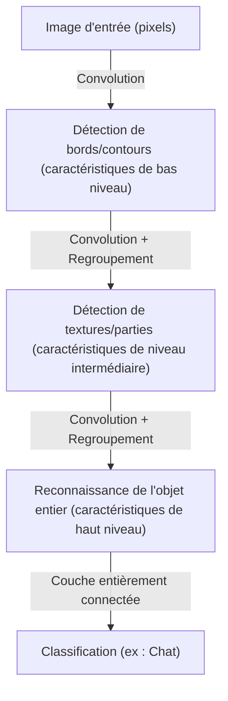

## Introduction : Interprétation mécaniste de l'intelligence

Les processus cognitifs que nous effectuons quotidiennement, tels que « voir », « entendre » et « comprendre », ont longtemps été l'un des plus grands mystères de la science. Le cerveau humain contient environ 86 milliards de neurones, qui échangent des signaux électriques complexes à travers des billions de connexions synaptiques, créant ainsi les phénomènes émergents connus sous le nom de conscience et d'intelligence. L'apprentissage profond (Deep Learning) a commencé comme une tentative de restructurer ce processus biologique extrêmement complexe sous la forme d'un problème d'optimisation mathématique et de le simuler sur un ordinateur.

Dans cet article, nous explorerons en détail le mécanisme par lequel l'intelligence artificielle perçoit le monde et apprend, du simple Perceptron aux modèles Transformer qui mènent la révolution de l'IA moderne, sous l'angle de la physique, de l'histoire et du contexte technologique et économique.

## Chapitre 1 : Contexte historique et aube des réseaux de neurones

### La naissance et les limites du Perceptron

L'histoire des réseaux de neurones artificiels remonte au « Perceptron » proposé par Frank Rosenblatt en 1957. Le Perceptron était un classificateur linéaire très simple qui pondérait plusieurs entrées et ne s'activait (sortie de 1) que lorsque leur somme dépassait un certain seuil. Il s'agissait du premier modèle mathématique imitant le comportement d'un neurone biologique, et à l'époque, on s'attendait même à ce qu'il « apprenne par lui-même, et un jour, marche, parle et se reproduise ».

Cependant, en 1969, Marvin Minsky et Seymour Papert ont prouvé dans leur livre *Perceptrons* qu'un Perceptron monocouche avait des limites mathématiques et ne pouvait pas résoudre des problèmes non linéaires tels que le « XOR (OU exclusif) ». À la suite de cette observation, la recherche sur les réseaux de neurones est entrée dans une période de stagnation connue sous le nom de premier « Hiver de l'IA ».

### La rétropropagation et la percée du multicouche

L'Hiver de l'IA a été brisé par la « Rétropropagation (Backpropagation) », redécouverte et popularisée dans les années 1980. Cet algorithme, formalisé par Geoffrey Hinton et d'autres, a établi une méthode pour propager efficacement l'erreur de la sortie vers les entrées dans les réseaux de neurones multicouches (ayant des couches cachées), mettant à jour efficacement les poids de chaque connexion.

Grâce à cela, les réseaux ont acquis une puissance d'expression non linéaire, rendant possible la reconnaissance de formes complexes. Cependant, en raison de la puissance de calcul des ordinateurs de l'époque et d'obstacles tels que le problème de la disparition du gradient (un phénomène où le signal d'apprentissage s'atténue lorsque les couches s'approfondissent), il a fallu attendre plusieurs décennies et l'évolution du matériel pour réaliser un véritable apprentissage « profond » (Deep).

## Chapitre 2 : Fondements mathématiques et physiques de l'apprentissage profond

### Fonctions d'activation et introduction de la non-linéarité

La raison principale pour laquelle les réseaux de neurones peuvent modéliser notre monde complexe réside dans la « non-linéarité ». La plupart des données du monde réel (images, audio, langage, etc.) sont linéairement inséparables. La « Fonction d'activation (Activation Function) » résout ce problème.

Dans le passé, les fonctions sigmoïde et tanh étaient dominantes, mais elles avaient l'inconvénient de provoquer facilement le problème de la disparition du gradient. Dans l'apprentissage profond moderne, la ReLU (Rectified Linear Unit) et ses variantes sont principalement utilisées.

$$ f(x) = \max(0, x) $$

Bien que le calcul de la ReLU soit extrêmement simple, il apporte une forte non-linéarité au réseau, permettant au gradient de se propager sans se perdre même dans les couches profondes.

### Fonction de perte et descente de gradient : Exploration du paysage énergétique

L'entraînement d'un modèle est essentiellement un problème d'optimisation consistant à trouver les paramètres (poids et biais) qui minimisent la « Fonction de perte (Loss Function) ». D'un point de vue physique, cela peut être comparé au processus d'une balle dévalant vers la vallée la plus basse (solution optimale) dans un « Paysage énergétique (Energy Landscape) » vaste et multidimensionnel.

Ce processus de descente est guidé par la « Descente de gradient (Gradient Descent) ». Actuellement, des algorithmes d'optimisation du taux d'apprentissage adaptatif tels qu'Adam et RMSprop sont couramment utilisés, naviguant efficacement dans des vallées à forte courbure ou sur des plateaux plats.

### Théorie de l'information et hypothèse de la variété (Manifold Hypothesis)

Pourquoi l'apprentissage profond gère-t-il si bien les données de haute dimension telles que les images ou le langage ? L'« Hypothèse de la variété » se cache derrière cela. Selon cette hypothèse, les données de haute dimension du monde réel (par exemple, une image de plusieurs millions de pixels) ne sont pas distribuées de manière aléatoire, mais sont en réalité densément réparties sur un espace topologique de dimension beaucoup plus faible (une variété).

Chaque couche du réseau de neurones déforme, plie et étire l'espace, démêlant progressivement cette variété complexe et intriquée pour la transformer finalement en un état linéairement séparable (apprentissage de représentation).

## Chapitre 3 : Évolution de l'architecture et méthodes de perception du monde

L'apprentissage profond a développé des architectures spécialisées en fonction de la nature des données traitées.

### CNN (Réseau de neurones convolutifs) : Reconnaissance spatiale

Les CNN ont révolutionné la reconnaissance d'images. Ce modèle, inspiré des champs récepteurs locaux du cortex visuel biologique, extrait des caractéristiques des images en répétant des « Couches de convolution (Convolutional Layer) » et des « Couches de regroupement (Pooling Layer) ».

Le CNN possède une « invariance de translation (la propriété de pouvoir reconnaître un objet peu importe où il se trouve) », et la victoire écrasante d'AlexNet au concours ImageNet de 2012 a été le déclencheur du boom actuel de l'IA.

### RNN et LSTM : Reconnaissance temporelle

Le RNN (Réseau de neurones récurrents) a été conçu pour traiter des « données séquentielles » où l'ordre a un sens, comme l'audio ou le texte. Le RNN conserve les informations passées sous forme d'état interne, mais souffrait du « problème de dépendance à long terme » où les mémoires passées s'estompent à mesure que la séquence s'allonge. Le LSTM (Long Short-Term Memory) a résolu ce problème. En introduisant des mécanismes de portes (porte d'oubli, porte d'entrée, porte de sortie), il apprend s'il faut conserver les informations à long terme ou les rejeter, améliorant considérablement la précision de la traduction automatique et de la reconnaissance vocale.

### Transformer : Mécanisme d'auto-attention (Self-Attention) et compréhension complète du contexte

Et puis, en 2017, le monde a été bouleversé par l'article « Attention Is All You Need » publié par des chercheurs de Google. C'était l'apparition du modèle Transformer.

Au lieu de traiter les données de manière séquentielle comme un RNN, le Transformer utilise un « Mécanisme d'auto-attention (Self-Attention) » pour calculer simultanément les relations entre toutes les données d'entrée (telles que les mots). Cela a permis de saisir précisément les dépendances à long terme du contexte tout en effectuant un calcul parallèle extrêmement efficace à l'aide de GPU.

Aujourd'hui, presque tous les modèles de pointe, de la série GPT qui sous-tend ChatGPT à la technologie de base de l'IA générative d'images, sont construits sur cette architecture Transformer.

## Chapitre 4 : Les fondements économiques et physiques qui soutiennent l'apprentissage profond

### Lois de mise à l'échelle (Scaling Laws)

La règle empirique la plus importante dans le développement moderne de l'IA est la « Loi de mise à l'échelle ». C'est le principe selon lequel plus vous augmentez de manière exponentielle le nombre de paramètres d'un modèle, la taille du jeu de données d'apprentissage et la quantité de calcul (Compute) investie, plus les performances du modèle continuent de s'améliorer de manière prévisible. La découverte de cette loi a fait passer le développement de l'IA de « l'exploration d'algorithmes plus sophistiqués » à une compétition de capitaux industriels visant à « garantir des ressources de calcul plus massives ».

### Architecture informatique et physique de l'énergie électrique

Les progrès de l'apprentissage profond sont inséparables de l'évolution du matériel, notamment des GPU de NVIDIA. L'entraînement de modèles comportant des centaines de milliards de paramètres nécessite d'immenses centres de données et de gigantesques quantités d'énergie électrique. Face aux limites physiques du calcul (la fin de la loi de Moore et les problèmes de dégagement de chaleur), la transition vers des paradigmes matériels de nouvelle génération tels que les ordinateurs quantiques et les puces neuromorphiques (ordinateurs de type cerveau) est devenue un impératif économique et technologique.

## Conclusion : L'IA et notre avenir

L'intelligence artificielle, qui a commencé avec les simples formules mathématiques du Perceptron, a maintenant évolué au point de comprendre le langage humain, de créer de l'art et d'accélérer les découvertes scientifiques. L'apprentissage profond n'est pas seulement un algorithme logiciel, c'est une énorme infrastructure de la civilisation moderne où convergent les données, les mathématiques, la physique et un vaste capital économique.

Comment l'IA perçoit-elle le monde ? Comprendre ce mécanisme ne consiste pas seulement à ouvrir la boîte noire d'une machine, c'est aussi affronter la question fondamentale de ce qu'est notre propre « intelligence » humaine. L'évolution de la technologie ne s'arrêtera pas, et nous nous tenons aujourd'hui à une nouvelle frontière de la cognition dans l'histoire de l'humanité.
