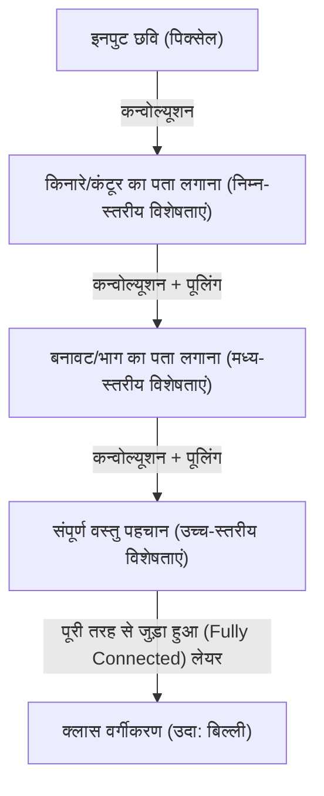

## परिचय: बुद्धिमत्ता की यंत्रवादी व्याख्या

जिन संज्ञान प्रक्रियाओं को हम रोजमर्रा में करते हैं, जैसे "देखना", "सुनना" और "समझना", वे लंबे समय से विज्ञान में सबसे बड़े रहस्यों में से एक रहे हैं। मानव मस्तिष्क में लगभग 86 अरब न्यूरॉन्स होते हैं, जो खरबों सिनैप्टिक कनेक्शनों के माध्यम से जटिल विद्युत संकेतों का आदान-प्रदान करते हैं, जिससे चेतना और बुद्धिमत्ता जैसी उभरती हुई घटनाएँ जन्म लेती हैं। डीप लर्निंग की शुरुआत इस अत्यधिक जटिल जैविक प्रक्रिया को एक गणितीय अनुकूलन समस्या के रूप में फिर से बनाने और कंप्यूटर पर इसका अनुकरण करने के प्रयास से हुई।

इस लेख में, हम एक साधारण परसेप्ट्रॉन से लेकर आधुनिक AI क्रांति का नेतृत्व करने वाले ट्रांसफॉर्मर मॉडल तक, कृत्रिम बुद्धिमत्ता दुनिया को कैसे समझती और सीखती है, इसके तंत्र को भौतिकी, इतिहास, और तकनीकी एवं आर्थिक पृष्ठभूमि के संदर्भ में विस्तार से स्पष्ट करेंगे।

## अध्याय 1: ऐतिहासिक पृष्ठभूमि और न्यूरल नेटवर्क की शुरुआत

### परसेप्ट्रॉन का जन्म और सीमाएँ

आर्टिफिशियल न्यूरल नेटवर्क का इतिहास 1957 में फ्रैंक रोसेनब्लैट द्वारा प्रस्तावित "परसेप्ट्रॉन" से जुड़ा है। परसेप्ट्रॉन एक बहुत ही सरल रैखिक क्लासिफायर था, जो कई इनपुट को वजन देता था और केवल तभी फायर करता था (आउटपुट 1 हो जाता था) जब उनका योग एक निश्चित सीमा (थ्रेशोल्ड) से अधिक हो जाता था। यह जैविक न्यूरॉन्स के व्यवहार की नकल करने वाला पहला गणितीय मॉडल था, और उस समय यह उम्मीद की जाती थी कि यह "खुद सीखेगा, और अंततः चलेगा, बात करेगा, और खुद की नकल करेगा।"

हालाँकि, 1969 में मार्विन मिंस्की और सीमोर पेपर्ट की किताब "परसेप्ट्रॉन" में, यह गणितीय रूप से साबित कर दिया गया था कि एकल-परत परसेप्ट्रॉन "XOR (एक्सक्लूसिव OR)" जैसी गैर-रैखिक समस्याओं को हल नहीं कर सकते हैं। इस आलोचना के कारण, न्यूरल नेटवर्क अनुसंधान ठहराव की अवधि में प्रवेश कर गया जिसे पहली "AI सर्दी (AI Winter)" के रूप में जाना जाता है।

### बैकप्रोपेगेशन और मल्टीलेयरिंग की सफलता

AI सर्दी को तोड़ने वाला "बैकप्रोपेगेशन (एरर बैकप्रोपेगेशन)" था, जिसे 1980 के दशक में फिर से खोजा गया और लोकप्रिय बनाया गया। जेफ्री हिंटन और अन्य द्वारा तैयार किए गए इस एल्गोरिथम ने एक ऐसी विधि स्थापित की जो मल्टीलेयर (छिपी हुई परतों के साथ) न्यूरल नेटवर्क में इनपुट की ओर आउटपुट की त्रुटि को वापस प्रचारित करके प्रत्येक कनेक्शन के वजन को कुशलतापूर्वक अपडेट करती है।

इसके परिणामस्वरूप, नेटवर्क ने गैर-रैखिक अभिव्यक्ति शक्ति प्राप्त की, जिससे जटिल पैटर्न मान्यता संभव हो गई। हालाँकि, उस समय कंप्यूटर की गणना शक्ति और लुप्त होती ढाल की समस्या (वैनिशिंग ग्रेडिएंट प्रॉब्लम - जहाँ परतों के गहरे होने पर सीखने के संकेत क्षीण हो जाते हैं) जैसी बाधाओं के कारण, सच्ची "गहरी (डीप)" लर्निंग के साकार होने के लिए कई दशकों और हार्डवेयर के विकास का इंतजार करना पड़ा।

## अध्याय 2: डीप लर्निंग का गणितीय और भौतिक आधार

### सक्रियण फलन (Activation Function) और गैर-रैखिकता (Non-linearity) का परिचय

न्यूरल नेटवर्क जटिल दुनिया का मॉडल बनाने में सक्षम होने का मुख्य कारण "गैर-रैखिकता" है। दुनिया में मौजूद अधिकांश डेटा (छवियां, ऑडियो, भाषा आदि) रैखिक रूप से वियोज्य नहीं हैं। इसे "सक्रियण फलन (एक्टिवेशन फंक्शन)" द्वारा हल किया जाता है।

अतीत में, सिग्मॉइड फ़ंक्शन और tanh फ़ंक्शन मुख्यधारा थे, लेकिन उनमें लुप्त होती ढाल समस्या पैदा करने की प्रवृत्ति थी। आधुनिक डीप लर्निंग में, ReLU (रेक्टिफाइड लीनियर यूनिट) और इसके डेरिवेटिव मुख्य रूप से उपयोग किए जाते हैं।

$$ f(x) = \max(0, x) $$

ReLU गणना में अत्यंत सरल है, फिर भी यह नेटवर्क में मजबूत गैर-रैखिकता लाता है और गहरी परतों में भी ढाल (ग्रेडिएंट) को खोए बिना प्रसारित होने देता है।

### हानि फलन (Loss Function) और ग्रेडिएंट डिसेंट: ऊर्जा परिदृश्य की खोज

मॉडल का प्रशिक्षण अनिवार्य रूप से एक अनुकूलन समस्या है जो मापदंडों (वजन और पूर्वाग्रह) को खोजने के लिए "हानि फलन (लॉस फंक्शन)" को कम करता है। भौतिक विज्ञान के दृष्टिकोण से, इसकी तुलना एक विशाल, उच्च-आयामी "ऊर्जा परिदृश्य (एनर्जी लैंडस्केप)" में सबसे कम घाटी के तल (इष्टतम समाधान) की ओर लुढ़कती हुई गेंद से की जा सकती है।

इस अवरोहण प्रक्रिया का मार्गदर्शन "ग्रेडिएंट डिसेंट" द्वारा किया जाता है। वर्तमान में, एडम और आरएमएसपीप्रॉप जैसे अनुकूली शिक्षण दर अनुकूलन एल्गोरिदम मानक के रूप में उपयोग किए जाते हैं, जो तेज वक्रता वाली घाटियों और सपाट पठारों को कुशलतापूर्वक नेविगेट करते हैं।

### सूचना सिद्धांत और मैनिफोल्ड परिकल्पना (Manifold Hypothesis)

डीप लर्निंग छवियों और भाषा जैसे उच्च-आयामी डेटा को इतनी अच्छी तरह से संभालने में क्यों सक्षम है? इसके पीछे "मैनिफोल्ड परिकल्पना" मौजूद है। इस परिकल्पना के अनुसार, वास्तविक दुनिया के उच्च-आयामी डेटा (उदाहरण के लिए, लाखों पिक्सेल की छवियां) यादृच्छिक रूप से वितरित नहीं होते हैं, बल्कि वास्तव में बहुत कम-आयामी टोपोलॉजिकल स्पेस (मैनिफोल्ड) पर सघन रूप से वितरित होते हैं।

न्यूरल नेटवर्क की प्रत्येक परत अंतरिक्ष को विकृत, मोड़ और खींचकर इस जटिल रूप से उलझे हुए मैनिफोल्ड को धीरे-धीरे सुलझाती है, और अंततः इसे रैखिक रूप से वियोज्य अवस्था (प्रतिनिधित्व शिक्षा) में बदल देती है।

## अध्याय 3: आर्किटेक्चर का विकास और दुनिया को समझने का तरीका

डीप लर्निंग ने उन डेटा की प्रकृति के अनुसार विशेष आर्किटेक्चर विकसित किए हैं जिन्हें यह संभालता है।

### CNN (कन्वोल्यूशनल न्यूरल नेटवर्क): स्थानिक धारणा

छवि पहचान में क्रांति लाने वाला CNN था। जैविक दृश्य कॉर्टेक्स के स्थानीय रिसेप्टिव फील्ड से प्रेरित यह मॉडल "कन्वोल्यूशनल लेयर" और "पूलिंग लेयर" को दोहराकर छवियों से विशेषताएं निकालता है।

CNN में "ट्रांसलेशनल इनवेरिएंस (विषय कहीं भी होने पर उसे पहचानने की क्षमता)" होती है, और 2012 के इमेजनेट प्रतियोगिता में एलेक्सनेट (AlexNet) की शानदार जीत ने वर्तमान AI बूम को प्रज्वलित किया।

### RNN और LSTM: समय की धारणा

ऑडियो और टेक्स्ट जैसे "अनुक्रमिक डेटा" को प्रोसेस करने के लिए डिज़ाइन किया गया, जहां क्रम का अर्थ होता है, वह RNN (रिकरंट न्यूरल नेटवर्क) है। RNN पिछली जानकारी को आंतरिक स्थिति के रूप में बनाए रखता है, लेकिन इसमें "दीर्घकालिक निर्भरता समस्या" थी जहां लंबे अनुक्रमों के लिए पिछली यादें फीकी पड़ जाती थीं। इसे LSTM (लॉन्ग शॉर्ट-टर्म मेमोरी) द्वारा हल किया गया था। गेट तंत्र (फॉरगेट गेट, इनपुट गेट, आउटपुट गेट) पेश करके, इसने सीखा कि जानकारी को लंबे समय तक रखना है backward या छोड़ना है, जिससे मशीन अनुवाद और वाक् पहचान की सटीकता में नाटकीय रूप से सुधार हुआ है।

### ट्रांसफॉर्मर: सेल्फ-अटेंशन और संदर्भ की पूर्ण समझ

और फिर 2017 में, Google शोधकर्ताओं द्वारा प्रकाशित पेपर "Attention Is All You Need" ने दुनिया को बदल दिया। यह ट्रांसफॉर्मर मॉडल का आगमन था।

RNN की तरह डेटा को क्रमिक रूप से संसाधित करने के बजाय, ट्रांसफॉर्मर "सेल्फ-अटेंशन" तंत्र का उपयोग करके एक ही समय में सभी इनपुट डेटा (जैसे शब्द) के बीच संबंधों की गणना करता है। इसने GPU के साथ समानांतर गणना को अत्यधिक कुशलता से करते हुए संदर्भ की दीर्घकालिक निर्भरता को सटीक रूप से समझना संभव बना दिया।

आज, लगभग सभी अत्याधुनिक मॉडल, जैसे कि ChatGPT को शक्ति प्रदान करने वाली GPT श्रृंखला और छवि निर्माण AI की आधारभूत तकनीक, इसी ट्रांसफॉर्मर आर्किटेक्चर पर बनाए गए हैं।

## अध्याय 4: डीप लर्निंग को सहारा देने वाली आर्थिक और भौतिक नींव

### स्केलिंग कानून (Scaling Laws)

आधुनिक एआई विकास में सबसे महत्वपूर्ण अंगूठे का नियम "स्केलिंग कानून" है। यह नियम कहता है कि यदि मॉडल के मापदंडों की संख्या, प्रशिक्षण डेटासेट का आकार और गणना (कंप्यूट) में निवेश तेजी से बढ़ाया जाता है, तो मॉडल का प्रदर्शन एक अनुमानित तरीके से सुधारना जारी रखता है। इस कानून की खोज ने एआई विकास को "अधिक परिष्कृत एल्गोरिदम की खोज" से "विशाल कंप्यूटिंग संसाधनों को सुरक्षित करने" की औद्योगिक पूंजी प्रतियोगिता में बदल दिया।

### कंप्यूटर आर्किटेक्चर और शक्ति की भौतिकी

डीप लर्निंग की प्रगति NVIDIA के GPU सहित हार्डवेयर के विकास से अविभाज्य है। सैकड़ों अरबों मापदंडों वाले मॉडल के प्रशिक्षण के लिए विशाल डेटा केंद्रों और भारी मात्रा में बिजली की आवश्यकता होती है। गणना की भौतिक सीमाओं (मूर के नियम का अंत और गर्मी के मुद्दों) का सामना करते हुए, क्वांटम कंप्यूटर और न्यूरोमॉर्फिक चिप्स (मस्तिष्क-प्रकार के कंप्यूटर) जैसे अगली पीढ़ी के हार्डवेयर प्रतिमानों में संक्रमण एक आर्थिक और तकनीकी अनिवार्यता बन गया है।

## निष्कर्ष: AI और हमारा भविष्य

परसेप्ट्रॉन के सरल सूत्र से शुरू हुई कृत्रिम बुद्धिमत्ता अब मानव भाषा को समझने, कला बनाने और वैज्ञानिक खोजों में तेजी लाने के लिए विकसित हुई है। डीप लर्निंग केवल एक सॉफ्टवेयर एल्गोरिदम नहीं है, बल्कि आधुनिक सभ्यता का एक विशाल बुनियादी ढांचा है जहां डेटा, गणित, भौतिकी और भारी आर्थिक पूंजी एक साथ आते हैं।

AI दुनिया को कैसे समझता है? इस तंत्र को समझना मशीनों के ब्लैक बॉक्स को खोलने के साथ-साथ इस मौलिक प्रश्न का सामना करना है कि हम इंसानों के लिए "बुद्धिमत्ता" का क्या अर्थ है। तकनीकी प्रगति बिना रुके जारी है, और हम अब मानव इतिहास में ज्ञान के एक नए मोर्चे पर खड़े हैं。
