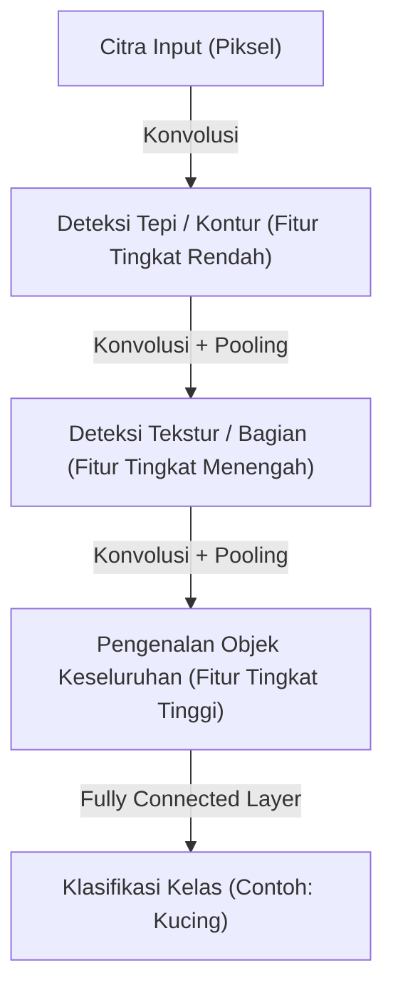

## Pengantar: Interpretasi Mekanistik tentang Kecerdasan

Proses kognitif yang kita lakukan sehari-hari seperti "melihat", "mendengar", dan "memahami" telah lama menjadi salah satu misteri terbesar dalam sains. Di dalam otak manusia terdapat sekitar 86 miliar neuron, yang saling bertukar sinyal listrik kompleks melalui triliunan koneksi sinapsis, menghasilkan fenomena emergen yang disebut kesadaran dan kecerdasan. Deep learning berawal dari upaya untuk merekonstruksi proses biologis yang sangat kompleks ini menjadi masalah optimisasi matematis, dan mensimulasikannya di dalam komputer.

Artikel ini akan menguraikan secara rinci bagaimana kecerdasan buatan mengenali dan mempelajari dunia, mulai dari perceptron sederhana hingga model Transformer yang mendorong revolusi AI modern, melalui perspektif fisika, sejarah, serta latar belakang teknologi dan ekonomi.

## Bab 1: Latar Belakang Sejarah dan Fajar Jaringan Saraf Tiruan

### Kelahiran dan Keterbatasan Perceptron

Sejarah jaringan saraf tiruan kembali ke "perceptron" yang diusulkan oleh Frank Rosenblatt pada tahun 1957. Perceptron adalah pengklasifikasi linear yang sangat sederhana, yang memberikan bobot pada beberapa input, dan hanya "menembak" (output menjadi 1) jika jumlah totalnya melebihi ambang batas tertentu. Ini adalah model matematis pertama yang meniru perilaku neuron biologis, dan pada saat itu bahkan diharapkan bahwa ia akan "belajar sendiri, dan akhirnya akan berjalan, berbicara, serta mereplikasi diri".

Namun, pada tahun 1969, dalam buku "Perceptrons" oleh Marvin Minsky dan Seymour Papert, terbukti secara matematis batasan bahwa perceptron lapis tunggal tidak dapat memecahkan masalah non-linear seperti "XOR (exclusive OR)". Akibat kritik ini, penelitian jaringan saraf tiruan memasuki masa stagnasi pertama yang dikenal sebagai "Musim Dingin AI".

### Terobosan Backpropagation dan Multilayering

Yang memecahkan Musim Dingin AI adalah "backpropagation" yang ditemukan kembali dan dipopulerkan pada tahun 1980-an. Algoritma yang diformulasikan oleh Geoffrey Hinton dan rekan-rekannya ini menetapkan metode untuk secara efisien memperbarui bobot setiap koneksi dengan merambat-balikkan kesalahan output ke arah input dalam jaringan saraf tiruan berlapis banyak (yang memiliki lapisan tersembunyi).

Dengan ini, jaringan tersebut memperoleh kemampuan representasi non-linear dan memungkinkan pengenalan pola yang kompleks. Namun, terhambat oleh keterbatasan kekuatan komputasi pada masa itu dan masalah gradien hilang (fenomena di mana sinyal pembelajaran melemah ketika lapisan semakin dalam), pembelajaran "mendalam (deep)" yang sebenarnya masih harus menunggu puluhan tahun lagi serta evolusi perangkat keras.

## Bab 2: Fondasi Matematis dan Fisik Deep Learning

### Pengenalan Fungsi Aktivasi dan Non-linearitas

Alasan inti mengapa jaringan saraf tiruan dapat memodelkan dunia yang kompleks terletak pada "non-linearitas". Sebagian besar data yang ada di dunia (gambar, suara, bahasa, dll.) tidak dapat dipisahkan secara linear. Hal ini diselesaikan dengan "Fungsi Aktivasi (Activation Function)".

Di masa lalu, fungsi sigmoid dan tanh adalah arus utama, tetapi mereka memiliki kelemahan yaitu mudah menyebabkan masalah gradien hilang. Dalam deep learning modern, ReLU (Rectified Linear Unit) dan variannya adalah yang paling banyak digunakan.

$$ f(x) = \max(0, x) $$

ReLU sangat sederhana dalam perhitungan, namun memberikan non-linearitas yang kuat pada jaringan, dan memungkinkannya merambat tanpa kehilangan gradien bahkan di lapisan yang dalam.

### Fungsi Kerugian dan Gradient Descent: Eksplorasi Lanskap Energi

Pembelajaran model pada dasarnya adalah masalah optimisasi untuk menemukan parameter (bobot dan bias) yang meminimalkan "Fungsi Kerugian (Loss Function)". Dari sudut pandang fisika, hal ini dapat diibaratkan seperti sebuah bola yang menggelinding ke dasar lembah terendah (solusi optimal) di dalam "Lanskap Energi (Energy Landscape)" yang luas dan berdimensi tinggi.

Proses penurunan ini dipandu oleh "Gradient Descent". Saat ini, algoritma optimisasi laju pembelajaran adaptif seperti Adam dan RMSprop secara standar digunakan untuk secara efisien menavigasi lembah yang curam atau dataran tinggi (plateau) yang datar.

### Teori Informasi dan Hipotesis Manifold (Manifold Hypothesis)

Mengapa deep learning dapat menangani data berdimensi tinggi seperti gambar dan bahasa dengan baik? Di baliknya terdapat "Hipotesis Manifold". Menurut hipotesis ini, data berdimensi tinggi di dunia nyata (contoh: gambar jutaan piksel) tidak terdistribusi secara acak, melainkan sebenarnya terdistribusi rapat di ruang topologi berdimensi jauh lebih rendah (manifold).

Setiap lapisan dalam jaringan saraf tiruan membengkokkan, melipat, dan meregangkan ruang untuk secara bertahap mengurai manifold yang saling terkait kompleks ini, dan akhirnya mengubahnya menjadi keadaan yang dapat dipisahkan secara linear (pembelajaran representasi).

## Bab 3: Evolusi Arsitektur dan Cara Mengenali Dunia

Deep learning telah mengembangkan arsitektur khusus sesuai dengan sifat data yang ditanganinya.

### CNN (Convolutional Neural Network): Pengenalan Ruang

Yang membawa revolusi dalam pengenalan gambar adalah CNN. Terinspirasi oleh bidang reseptif lokal pada korteks visual biologis, model ini mengekstraksi fitur dari gambar dengan mengulangi "Lapisan Konvolusional (Convolutional Layer)" dan "Lapisan Pooling (Pooling Layer)".

CNN memiliki "invariansi translasi (sifat dapat mengenali objek di mana pun letaknya)", dan kemenangan mutlak AlexNet dalam kompetisi ImageNet pada tahun 2012 memicu ledakan AI saat ini.

### RNN dan LSTM: Pengenalan Waktu

RNN (Recurrent Neural Network) dirancang untuk memproses "data berurutan" di mana urutan memiliki arti, seperti suara atau teks. RNN menyimpan informasi masa lalu sebagai keadaan internal, tetapi memiliki "masalah ketergantungan jangka panjang" di mana memori masa lalu memudar dalam urutan yang panjang. LSTM (Long Short-Term Memory) memecahkan masalah ini. Dengan memperkenalkan mekanisme gerbang (gerbang lupa, gerbang input, gerbang output), model belajar apakah akan menyimpan informasi untuk waktu yang lama atau membuangnya, yang secara dramatis meningkatkan akurasi terjemahan mesin dan pengenalan suara.

### Transformer: Mekanisme Self-Attention dan Pemahaman Konteks Secara Menyeluruh

Lalu pada tahun 2017, dunia berubah secara drastis melalui makalah "Attention Is All You Need" yang diterbitkan oleh para peneliti Google. Ini adalah kemunculan model Transformer.

Alih-alih memproses data secara berurutan seperti RNN, Transformer menggunakan mekanisme "Self-Attention" untuk secara bersamaan menghitung hubungan antara semua data (kata-kata, dll.) yang dimasukkan. Hal ini memungkinkan pemahaman yang akurat tentang ketergantungan konteks jangka panjang sambil melakukan komputasi paralel menggunakan GPU dengan sangat efisien.

Saat ini, hampir semua model mutakhir dibangun di atas arsitektur Transformer ini, termasuk seri GPT yang mendasari ChatGPT dan teknologi dasar AI pembuat gambar.

## Bab 4: Fondasi Ekonomi dan Fisik yang Mendukung Deep Learning

### Hukum Penskalaan (Scaling Laws)

Aturan empiris paling penting dalam pengembangan AI modern adalah "Hukum Penskalaan (Scaling Laws)". Hukum ini menyatakan bahwa semakin banyak jumlah parameter model, ukuran dataset pembelajaran, dan daya komputasi (Compute) yang ditingkatkan secara eksponensial, maka kinerja model akan terus meningkat dengan cara yang dapat diprediksi. Penemuan hukum ini menggeser pengembangan AI dari "eksplorasi algoritma yang lebih canggih" menjadi persaingan modal industri untuk "mengamankan sumber daya komputasi yang lebih masif".

### Arsitektur Komputer dan Fisika Tenaga Listrik

Kemajuan deep learning tidak dapat dipisahkan dari evolusi perangkat keras seperti GPU NVIDIA. Melatih model dengan ratusan miliar parameter membutuhkan pusat data raksasa dan tenaga listrik dalam jumlah besar. Di tengah menghadapi batas fisik komputasi (akhir dari Hukum Moore dan masalah panas), transisi ke paradigma perangkat keras generasi berikutnya, seperti komputer kuantum dan chip neuromorfik (komputer terinspirasi otak), telah menjadi prioritas ekonomi dan teknologi tertinggi.

## Kesimpulan: AI dan Masa Depan Kita

Kecerdasan buatan, yang dimulai dari rumus matematis sederhana perceptron, kini telah berevolusi hingga dapat memahami bahasa manusia, menciptakan seni, dan mempercepat penemuan ilmiah. Deep learning bukan sekadar algoritma perangkat lunak, melainkan infrastruktur raksasa peradaban modern di mana data, matematika, fisika, dan modal ekonomi yang sangat besar bertemu.

Bagaimana AI mengenali dunia? Memahami mekanismenya sama dengan membuka kotak hitam mesin, sekaligus menghadapi pertanyaan mendasar tentang apa itu "kecerdasan" kita sendiri sebagai manusia. Evolusi teknologi tidak akan berhenti, dan kita sekarang berdiri di batas pengetahuan baru dalam sejarah umat manusia.
