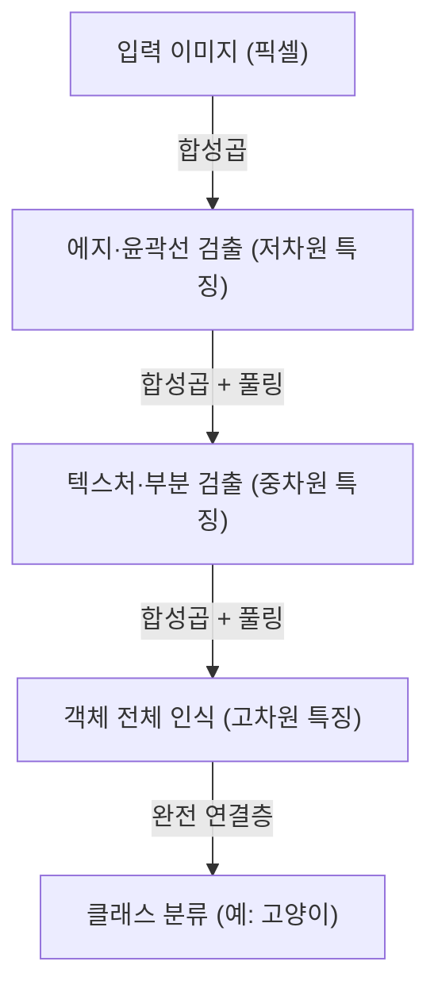

## 도입: 지능의 기계론적 해석

우리가 '보고', '듣고', '이해하는' 일상적인 인식 과정은 오랫동안 과학에서 가장 큰 미스터리 중 하나였습니다. 인간의 뇌에는 약 860억 개의 뉴런이 존재하며, 이들이 수조 개의 시냅스 연결을 통해 복잡한 전기 신호를 주고받음으로써 의식이나 지능이라고 불리는 창발적인 현상이 생겨납니다. 딥러닝(심층 학습)은 이 극도로 복잡한 생물학적 과정을 수학적 최적화 문제로 재구성하여 컴퓨터 상에서 시뮬레이션하려는 시도에서 시작되었습니다.

이 글에서는 단순한 퍼셉트론부터 현대의 AI 혁명을 이끄는 Transformer 모델에 이르기까지, 인공지능이 어떻게 세상을 인식하고 학습하는지 그 원리를 물리학, 역사, 그리고 기술적·경제적 배경에서 자세히 풀어냅니다.

## 제1장: 역사적 배경과 신경망의 여명

### 퍼셉트론의 탄생과 한계

인공 신경망의 역사는 1957년 프랭크 로젠블랫(Frank Rosenblatt)이 제안한 '퍼셉트론(Perceptron)'으로 거슬러 올라갑니다. 퍼셉트론은 여러 입력에 가중치를 부여하고, 그 총합이 임계값을 넘을 때만 활성화되는(출력이 1이 되는) 매우 단순한 선형 분류기였습니다. 이는 생물학적 뉴런의 동작을 모방한 최초의 수학적 모델로, 당시에는 "스스로 학습하고, 결국에는 걷고, 말하며, 자가 복제를 할 것이다"라는 기대까지 받았습니다.

하지만 1969년, 마빈 민스키(Marvin Minsky)와 시모어 페퍼트(Seymour Papert)의 저서 『퍼셉트론』에서 단층 퍼셉트론으로는 'XOR(배타적 논리합)'과 같은 비선형 문제를 풀 수 없다는 수학적 한계가 증명되었습니다. 이 지적으로 인해 신경망 연구는 첫 번째 'AI의 겨울'이라 불리는 침체기에 접어들게 됩니다.

### 오차역전파와 다층화의 돌파구

AI의 겨울을 깬 것은 1980년대에 재발견되어 보급된 '오차역전파(Backpropagation)'입니다. 제프리 힌튼(Geoffrey Hinton) 등에 의해 정식화된 이 알고리즘은 다층(은닉층을 가진) 신경망에서 출력의 오차를 입력 측으로 역전파하여 각 연결의 가중치를 효율적으로 업데이트하는 방법을 확립했습니다.

이를 통해 신경망은 비선형적인 표현력을 얻게 되었고 복잡한 패턴 인식이 가능해졌습니다. 하지만 당시 컴퓨터의 계산 능력이나 기울기 소실 문제(층을 깊게 하면 학습 신호가 감소하는 현상) 등의 벽에 부딪혀, 진정한 의미의 '심층(Deep)' 학습이 실현되기까지는 수십 년의 세월과 하드웨어의 발전이 필요했습니다.

## 제2장: 딥러닝의 수학적·물리적 기반

### 활성화 함수와 비선형성의 도입

신경망이 복잡한 세상을 모델링할 수 있는 핵심 이유는 '비선형성'에 있습니다. 세상에 존재하는 데이터의 대부분(이미지, 음성, 언어 등)은 선형적으로 분리할 수 없습니다. 이를 해결하는 것이 '활성화 함수(Activation Function)'입니다.

과거에는 시그모이드 함수나 tanh 함수가 주류였으나, 기울기 소실 문제를 일으키기 쉽다는 단점이 있었습니다. 현대의 딥러닝에서는 주로 ReLU(Rectified Linear Unit)와 그 파생형이 사용됩니다.

$$ f(x) = \max(0, x) $$

ReLU는 계산이 매우 단순하면서도 네트워크에 강력한 비선형성을 제공하며, 깊은 층에서도 기울기를 잃지 않고 전파할 수 있게 해줍니다.

### 손실 함수와 경사 하강법: 에너지 지형 탐색

모델의 학습이란 본질적으로 '손실 함수(Loss Function)'를 최소화하는 파라미터(가중치와 편향)를 찾는 최적화 문제입니다. 이를 물리학적 관점에서 보면, 광활하고 고차원적인 '에너지 지형(Energy Landscape)' 속을 가장 낮은 계곡(최적해)을 향해 공이 굴러가는 과정에 비유할 수 있습니다.

이 하강 과정을 이끄는 것이 '경사 하강법(Gradient Descent)'입니다. 현재는 Adam이나 RMSprop과 같은 적응형 학습률 최적화 알고리즘이 표준으로 사용되며, 곡률이 가파른 계곡이나 평탄한 고원지대를 효율적으로 탐색합니다.

### 정보 이론과 다양체 가설(Manifold Hypothesis)

왜 딥러닝은 이미지나 언어와 같은 고차원 데이터를 잘 다룰 수 있을까요? 그 배경에는 '다양체 가설'이 존재합니다. 이 가설에 따르면, 현실 세계의 고차원 데이터(예: 수백만 픽셀의 이미지)는 무작위로 분포되어 있는 것이 아니라, 사실 훨씬 낮은 차원의 위상 공간(다양체) 위에 밀집되어 분포한다고 합니다.

신경망의 각 층은 공간을 왜곡하고, 접고, 늘림으로써 이 복잡하게 얽힌 다양체를 서서히 풀어내어 최종적으로 선형 분리가 가능한 상태로 변환(표현 학습)하는 것입니다.

## 제3장: 아키텍처의 진화와 세상 인식 방법

딥러닝은 다루는 데이터의 특성에 맞춰 특화된 아키텍처를 발전시켜 왔습니다.

### CNN(합성곱 신경망): 공간의 인식

이미지 인식에 혁명을 가져온 것이 CNN입니다. 생물의 시각 피질의 국소 수용장(local receptive field)에서 영감을 얻은 이 모델은 '합성곱층(Convolutional Layer)'과 '풀링층(Pooling Layer)'을 반복하여 이미지에서 특징을 추출합니다.

CNN은 '이동 불변성(대상이 어디에 있든 인식할 수 있는 성질)'을 가지며, 2012년 ImageNet 대회에서 AlexNet이 압도적인 승리를 거두면서 현재 AI 붐의 기폭제가 되었습니다.

### RNN과 LSTM: 시간의 인식

음성이나 텍스트 등 순서에 의미가 있는 '시계열 데이터'를 처리하기 위해 설계된 것이 RNN(순환 신경망)입니다. RNN은 과거의 정보를 내부 상태로 유지하지만, 긴 시계열이 되면 과거의 기억이 희미해지는 '장기 의존성 문제'가 있었습니다. 이를 해결한 것이 LSTM(Long Short-Term Memory)입니다. 게이트 구조(망각 게이트, 입력 게이트, 출력 게이트)를 도입하여 정보를 장기간 유지할지 혹은 버릴지를 학습함으로써 기계 번역이나 음성 인식의 정확도를 획기적으로 향상시켰습니다.

### Transformer: 자기 주의 메커니즘(Self-Attention)과 문맥의 완전한 이해

그리고 2017년, 구글 연구원들이 발표한 논문 "Attention Is All You Need"를 통해 세상은 완전히 달라집니다. Transformer 모델의 등장입니다.

Transformer는 RNN처럼 데이터를 순서대로 처리하는 대신 '자기 주의 메커니즘(Self-Attention)'을 사용하여 입력된 모든 데이터(단어 등) 간의 연관성을 동시에 계산합니다. 이를 통해 문맥의 장기적인 의존 관계를 정확히 파악하면서도 GPU를 통한 병렬 계산을 매우 효율적으로 수행할 수 있게 되었습니다.

오늘날 ChatGPT를 구동하는 GPT 시리즈나 이미지 생성 AI의 기반 기술 등, 거의 모든 최첨단 모델이 이 Transformer 아키텍처 위에 구축되어 있습니다.

## 제4장: 딥러닝을 지탱하는 경제적·물리적 기반

### 스케일링 법칙(Scaling Laws)

현대 AI 개발에서 가장 중요한 경험 법칙이 '스케일링 법칙'입니다. 모델의 파라미터 수, 학습 데이터 세트의 크기, 그리고 투입하는 계산량(Compute)을 기하급수적으로 늘리면 늘릴수록 모델의 성능은 예측 가능한 형태로 계속 향상된다는 법칙입니다. 이 법칙의 발견으로 AI 개발은 '더 정교한 알고리즘의 탐구'에서 '더 거대한 계산 자원의 확보'라는 산업적인 자본 경쟁으로 이동했습니다.

### 컴퓨터 아키텍처와 전력의 물리학

딥러닝의 진보는 NVIDIA의 GPU를 비롯한 하드웨어의 발전과 불가분의 관계에 있습니다. 수천억 개의 파라미터를 가진 모델을 학습하려면 거대한 데이터 센터와 막대한 전력이 필요합니다. 계산의 물리적 한계(무어의 법칙의 종말과 발열 문제)에 직면한 가운데, 양자 컴퓨터나 뉴로모픽 칩(뇌 모방 컴퓨터) 등 차세대 하드웨어 패러다임으로의 전환이 경제적·기술적 지상 과제가 되고 있습니다.

## 결론: AI와 우리의 미래

퍼셉트론의 단순한 수식에서 시작된 인공지능은 이제 인간의 언어를 이해하고, 예술을 창조하며, 과학적 발견을 가속화하는 데까지 진화했습니다. 딥러닝은 단순한 소프트웨어 알고리즘이 아니라 데이터, 수학, 물리학, 그리고 막대한 경제 자본이 결합된 현대 문명의 거대한 인프라입니다.

AI가 어떻게 세상을 인식하는가. 그 메커니즘을 이해하는 것은 기계의 블랙박스를 여는 것인 동시에 우리 인간 자신의 '지능'이란 무엇인가라는 근원적인 질문에 마주하는 것이기도 합니다. 기술의 진화는 멈추지 않으며, 우리는 지금 인류 역사상 새로운 인식의 프론티어에 서 있습니다.
