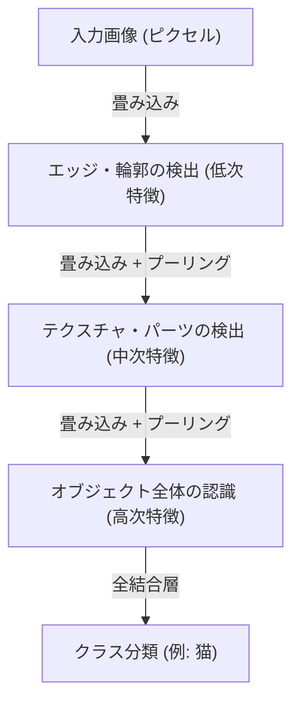

## はじめに：知能の機械論的解釈

私たちが「見る」「聞く」「理解する」といった日常的に行っている認識プロセスは、長い間、科学における最大の謎の一つでした。人間の脳内には約860億個のニューロンが存在し、それらが数兆ものシナプス結合を通じて複雑な電気信号を交わすことで、意識や知能と呼ばれる創発的な現象が生み出されています。深層学習（ディープラーニング）は、この極めて複雑な生物学的プロセスを、数学的な最適化問題として再構築し、コンピュータ上でシミュレートする試みから始まりました。

本記事では、単純なパーセプトロンから現代のAI革命を牽引するTransformerモデルに至るまで、人工知能がいかにして世界を認識し、学習するのか、そのメカニズムを物理学、歴史、そして技術的・経済的背景から詳細に解き明かします。

## 第1章：歴史的背景とニューラルネットワークの黎明

### パーセプトロンの誕生と限界

人工ニューラルネットワークの歴史は、1957年にフランク・ローゼンブラットによって提案された「パーセプトロン」に遡ります。パーセプトロンは、複数の入力に対して重み付けを行い、その総和がある閾値を超えた場合にのみ発火する（出力が1になる）という、非常にシンプルな線形識別器でした。これは生物学的なニューロンの挙動を模倣した最初の数理モデルであり、当時は「自ら学習し、いずれは歩き、話し、自己複製するだろう」とまで期待されました。

しかし、1969年、マービン・ミンスキーとシーモア・パパートによる著書『パーセプトロン』において、単層のパーセプトロンでは「XOR（排他的論理和）」などの非線形な問題を解くことができないという数学的な限界が証明されました。この指摘により、ニューラルネットワーク研究は最初の「AIの冬」と呼ばれる停滞期に突入することになります。

### バックプロパゲーションと多層化のブレイクスルー

AIの冬を打破したのが、1980年代に再発見され普及した「バックプロパゲーション（誤差逆伝播法）」です。ジェフリー・ヒントンらによって定式化されたこのアルゴリズムは、多層（隠れ層を持つ）ニューラルネットワークにおいて、出力の誤差を入力側に向かって逆伝播させ、各結合の重みを効率的に更新する手法を確立しました。

これにより、ネットワークは非線形な表現力を獲得し、複雑なパターン認識が可能となりました。しかし、当時のコンピュータの計算能力や、勾配消失問題（層を深くすると学習信号が減衰してしまう現象）などの壁に阻まれ、真の「深層（ディープ）」な学習が実現するには、さらに数十年の歳月とハードウェアの進化を待つ必要がありました。

## 第2章：深層学習の数学的・物理的基盤

### 活性化関数と非線形性の導入

ニューラルネットワークが複雑な世界をモデル化できる核心的な理由は、「非線形性」にあります。世界に存在するデータのほとんど（画像、音声、言語など）は線形分離不可能です。これを解決するのが「活性化関数（Activation Function）」です。

過去にはシグモイド関数やtanh関数が主流でしたが、勾配消失問題を引き起こしやすいという欠点がありました。現代の深層学習では、主にReLU（Rectified Linear Unit）とその派生型が使用されています。

$$ f(x) = \max(0, x) $$

ReLUは計算が極めて単純でありながら、ネットワークに強力な非線形性をもたらし、深い層でも勾配を失わずに伝播させることを可能にしました。

### 損失関数と勾配降下法：エネルギー地形の探索

モデルの学習とは、本質的には「損失関数（Loss Function）」を最小化するパラメータ（重みとバイアス）を見つけ出す最適化問題です。これを物理学的な視点から見ると、広大で高次元な「エネルギー地形（Energy Landscape）」の中を、最も低い谷底（最適解）に向かってボールが転がり落ちていく過程に例えることができます。

この降下プロセスを導くのが「勾配降下法（Gradient Descent）」です。現在では、AdamやRMSpropなどの適応的学習率最適化アルゴリズムが標準的に用いられており、曲率の急な谷や平坦なプラトーを効率的にナビゲートします。

### 情報理論と多様体仮説（Manifold Hypothesis）

なぜ深層学習は、画像や言語といった高次元データをうまく扱えるのでしょうか。その背景には「多様体仮説」が存在します。この仮説によれば、現実世界の高次元データ（例：数百万ピクセルの画像）は、ランダムに分布しているのではなく、実ははるかに低次元のトポロジー空間（多様体）上に密に分布しているとされます。

ニューラルネットワークの各層は、空間を歪め、折りたたみ、引き伸ばすことで、この複雑に絡み合った多様体を徐々に解きほぐし、最終的に線形分離可能な状態へと変換（表現学習）しているのです。

## 第3章：アーキテクチャの進化と世界の認識方法

深層学習は、扱うデータの性質に応じて特化したアーキテクチャを発展させてきました。

### CNN（畳み込みニューラルネットワーク）：空間の認識

画像認識において革命をもたらしたのがCNNです。生物の視覚野の局所受容野からインスピレーションを得たこのモデルは、「畳み込み層（Convolutional Layer）」と「プーリング層（Pooling Layer）」を繰り返すことで、画像から特徴を抽出します。

CNNは「並進不変性（対象がどこにあっても認識できる性質）」を持ち、2012年のImageNetコンペティションにおいてAlexNetが圧倒的な勝利を収めたことで、現在のAIブームの火付け役となりました。

### RNNとLSTM：時間の認識

音声やテキストなど、順序に意味がある「系列データ」を処理するために設計されたのがRNN（再帰型ニューラルネットワーク）です。RNNは過去の情報を内部状態として保持しますが、長い系列になると過去の記憶が薄れる「長期依存性の問題」がありました。これを解決したのがLSTM（Long Short-Term Memory）です。ゲート機構（忘却ゲート、入力ゲート、出力ゲート）を導入することで、情報を長期間保持するか、あるいは捨てるかを学習し、機械翻訳や音声認識の精度を飛躍的に向上させました。

### Transformer：自己注意機構（Self-Attention）と文脈の完全理解

そして2017年、Googleの研究者らによって発表された論文「Attention Is All You Need」により、世界は一変します。Transformerモデルの登場です。

Transformerは、RNNのようにデータを順番に処理するのではなく、「自己注意機構（Self-Attention）」を用いて、入力された全てのデータ（単語など）同士の関連性を同時に計算します。これにより、文脈の長期的な依存関係を正確に把握しつつ、GPUによる並列計算を極めて効率的に行うことが可能になりました。

今日、ChatGPTを支えるGPTシリーズや、画像生成AIの基盤技術など、ほぼすべての最先端モデルがこのTransformerアーキテクチャの上に構築されています。

## 第4章：深層学習を支える経済的・物理的基盤

### スケーリング則（Scaling Laws）

現代のAI開発において最も重要な経験則が「スケーリング則」です。モデルのパラメータ数、学習データセットのサイズ、そして投入する計算量（Compute）を指数関数的に増やせば増やすほど、モデルの性能は予測可能な形で向上し続けるという法則です。この法則の発見により、AI開発は「より洗練されたアルゴリズムの探求」から、「より巨大な計算資源の確保」という産業的な資本競争へとシフトしました。

### 計算機アーキテクチャと電力の物理学

深層学習の進歩は、NVIDIAのGPUをはじめとするハードウェアの進化と不可分です。何千億ものパラメータを持つモデルの学習には、巨大なデータセンターと莫大な電力が必要となります。計算の物理的限界（ムーアの法則の終焉や発熱問題）に直面する中、量子コンピュータやニューロモルフィック・チップ（脳型コンピュータ）など、次世代のハードウェアパラダイムへの移行が経済的・技術的な至上命題となっています。

## 結論：AIと私たちの未来

パーセプトロンの単純な数式から始まった人工知能は、今や人間の言語を理解し、芸術を創造し、科学的発見を加速させるまでに進化しました。深層学習は単なるソフトウェアのアルゴリズムではなく、データ、数学、物理学、そして莫大な経済資本が結節する現代文明の巨大なインフラストラクチャです。

AIがいかにして世界を認識するのか。そのメカニズムを理解することは、機械のブラックボックスを開けることであると同時に、私たち人間自身の「知性」とは何かという根源的な問いに向き合うことでもあります。技術の進化は止まることなく、私たちは今、人類史上の新たな認識のフロンティアに立っているのです。
