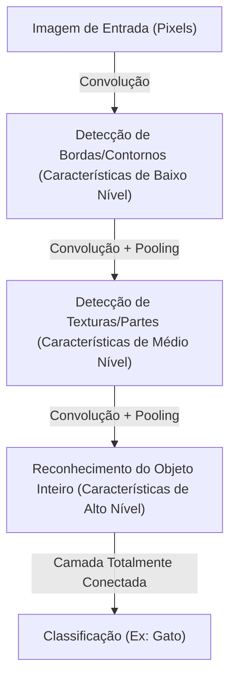

## Introdução: Uma Interpretação Mecanicista da Inteligência

Os processos cognitivos que realizamos cotidianamente, como "ver", "ouvir" e "entender", têm sido um dos maiores mistérios da ciência por muito tempo. Existem cerca de 86 bilhões de neurônios no cérebro humano e, através de trilhões de conexões sinápticas, eles trocam sinais elétricos complexos para produzir os fenômenos emergentes conhecidos como consciência e inteligência. O Deep Learning (Aprendizado Profundo) começou como uma tentativa de reconstruir esse processo biológico extremamente complexo como um problema de otimização matemática e simulá-lo em um computador.

Neste artigo, desvendaremos os mecanismos de como a inteligência artificial reconhece o mundo e aprende, desde o simples Perceptron até os modelos Transformer que impulsionam a revolução atual da IA, detalhando sua física, história e contexto técnico-econômico.

## Capítulo 1: Contexto Histórico e a Aurora das Redes Neurais

### O Nascimento e os Limites do Perceptron

A história das redes neurais artificiais remonta ao "Perceptron", proposto por Frank Rosenblatt em 1957. O Perceptron era um classificador linear muito simples que ponderava múltiplas entradas e só "disparava" (produzindo uma saída de 1) quando a soma excedia um certo limiar. Este foi o primeiro modelo matemático a imitar o comportamento dos neurônios biológicos e, na época, esperava-se que "aprendesse por si só, e em breve andaria, falaria e se reproduziria".

No entanto, em 1969, Marvin Minsky e Seymour Papert provaram matematicamente em seu livro "Perceptrons" que perceptrons de camada única não poderiam resolver problemas não lineares, como "XOR" (OU Exclusivo). Com essa constatação, a pesquisa em redes neurais entrou em um período de estagnação conhecido como o primeiro "Inverno da IA".

### O Avanço do Backpropagation e as Múltiplas Camadas

O que quebrou o Inverno da IA foi o "Backpropagation" (Propagação Retroativa de Erro), redescoberto e popularizado na década de 1980. Esse algoritmo, formulado por Geoffrey Hinton e outros, estabeleceu um método para atualizar eficientemente os pesos de cada conexão, propagando o erro de saída de volta para a entrada em redes neurais multicamadas (com camadas ocultas).

Isso permitiu que as redes adquirissem poder de representação não linear, tornando possível o reconhecimento de padrões complexos. No entanto, o verdadeiro aprendizado "profundo" (deep) exigiria mais algumas décadas e avanços em hardware para superar barreiras como a capacidade computacional da época e o problema do desaparecimento do gradiente (onde o sinal de aprendizado atenua à medida que a rede se torna mais profunda).

## Capítulo 2: A Base Matemática e Física do Deep Learning

### Funções de Ativação e a Introdução da Não-linearidade

A principal razão pela qual as redes neurais podem modelar nosso mundo complexo é a "não-linearidade". A maioria dos dados do mundo real (como imagens, áudio e linguagem) não é linearmente separável. Isso é resolvido pela "Função de Ativação" (Activation Function).

No passado, as funções Sigmoid e tanh eram predominantes, mas apresentavam o defeito de frequentemente causar o problema do desaparecimento do gradiente. No Deep Learning moderno, o ReLU (Rectified Linear Unit) e suas variantes são os mais utilizados.

$$ f(x) = \max(0, x) $$

Apesar de ser extremamente simples de calcular, o ReLU introduz uma forte não-linearidade na rede, permitindo a propagação sem perda de gradiente mesmo em camadas profundas.

### Função de Perda e Gradient Descent: Explorando a Paisagem de Energia

O treinamento de um modelo é, essencialmente, um problema de otimização para encontrar os parâmetros (pesos e vieses) que minimizam a "Função de Perda" (Loss Function). Sob uma perspectiva física, esse processo pode ser comparado a uma bola rolando em direção ao vale mais baixo (solução ideal) dentro de uma vasta e altamente dimensional "Paisagem de Energia" (Energy Landscape).

Este processo de descida é guiado pelo "Gradient Descent" (Descida do Gradiente). Atualmente, algoritmos de otimização de taxa de aprendizado adaptativa, como Adam e RMSprop, são o padrão, navegando eficientemente por vales íngremes ou platôs planos.

### Teoria da Informação e a Hipótese da Variedade (Manifold Hypothesis)

Por que o Deep Learning lida tão bem com dados de alta dimensionalidade, como imagens e linguagem? Por trás disso, está a "Hipótese da Variedade". De acordo com essa hipótese, dados de alta dimensionalidade do mundo real (por exemplo, imagens com milhões de pixels) não são distribuídos aleatoriamente, mas, na verdade, estão densamente distribuídos em um espaço topológico de dimensões muito mais baixas (variedade/manifold).

As camadas de uma rede neural distorcem, dobram e esticam o espaço, gradualmente desembaraçando essas variedades complexas, e finalmente as transformando (aprendizado de representação) em um estado que é linearmente separável.

## Capítulo 3: Evolução da Arquitetura e Formas de Reconhecer o Mundo

O Deep Learning desenvolveu arquiteturas especializadas dependendo da natureza dos dados manipulados.

### CNN (Rede Neural Convolucional): Reconhecimento Espacial

As CNNs trouxeram uma revolução no reconhecimento de imagens. Inspirado nos campos receptivos locais do córtex visual biológico, este modelo extrai características de imagens através da repetição de "Camadas Convolucionais" (Convolutional Layers) e "Camadas de Pooling" (Pooling Layers).

As CNNs possuem "invariância à translação" (a capacidade de reconhecer um objeto, não importa onde ele esteja na imagem) e sua vitória esmagadora na competição ImageNet de 2012 com a AlexNet foi o catalisador do boom atual da IA.

### RNN e LSTM: Reconhecimento de Tempo

As RNNs (Redes Neurais Recorrentes) foram projetadas para processar "dados sequenciais" onde a ordem é importante, como áudio ou texto. Embora a RNN mantenha informações passadas como um estado interno, ela sofre com o "problema de dependência de longo prazo", onde a memória se desvanece à medida que a sequência se alonga. Isso foi resolvido pela LSTM (Long Short-Term Memory). Ao introduzir mecanismos de portas (porta de esquecimento, porta de entrada, porta de saída), ela aprende se deve manter informações por longos períodos ou descartá-las, melhorando drasticamente a precisão da tradução automática e do reconhecimento de fala.

### Transformer: Mecanismo de Autoatenção (Self-Attention) e Compreensão Completa do Contexto

Então, em 2017, o mundo mudou com o artigo "Attention Is All You Need" publicado por pesquisadores do Google. O modelo Transformer havia chegado.

Em vez de processar os dados sequencialmente como as RNNs, o Transformer usa um mecanismo de "Autoatenção" (Self-Attention) para calcular simultaneamente a relação entre todos os dados de entrada (como palavras). Isso permite que a rede compreenda as dependências de longo prazo no contexto com precisão, ao mesmo tempo que executa cálculos paralelos de forma extremamente eficiente nas GPUs.

Hoje, quase todos os modelos de ponta, como a série GPT que impulsiona o ChatGPT e as tecnologias subjacentes à IA geradora de imagens, são construídos sobre essa arquitetura Transformer.

## Capítulo 4: A Base Econômica e Física Sustentando o Deep Learning

### Leis de Escala (Scaling Laws)

A regra empírica mais importante no desenvolvimento de IA moderno são as "Leis de Escala". É o princípio de que, quanto mais aumentamos exponencialmente o número de parâmetros do modelo, o tamanho do conjunto de dados de treinamento e o poder computacional investido (Compute), o desempenho do modelo continuará a melhorar de maneira previsível. A descoberta dessa lei deslocou o desenvolvimento da IA da "busca por algoritmos mais sofisticados" para a "competição de capital industrial visando garantir recursos computacionais mais massivos".

### Arquitetura de Computadores e a Física da Eletricidade

Os avanços no Deep Learning são inseparáveis da evolução do hardware, incluindo as GPUs da NVIDIA. O treinamento de modelos com centenas de bilhões de parâmetros requer enormes data centers e vastas quantidades de energia elétrica. Ao enfrentar os limites físicos da computação (o fim da Lei de Moore e problemas de geração de calor), a transição para paradigmas de hardware de próxima geração, como computadores quânticos e chips neuromórficos (computadores inspirados no cérebro), tornou-se um imperativo econômico e técnico máximo.

## Conclusão: A IA e o Nosso Futuro

Começando pelas simples equações matemáticas do Perceptron, a inteligência artificial agora evoluiu a ponto de compreender as línguas humanas, criar arte e acelerar as descobertas científicas. O Deep Learning não é apenas um algoritmo de software; é uma infraestrutura colossal da civilização moderna onde dados, matemática, física e capital econômico maciço convergem.

Como a IA reconhece o mundo? Entender seus mecanismos é, simultaneamente, abrir a caixa preta das máquinas e enfrentar a questão fundamental de nossa própria "inteligência" humana. A evolução tecnológica não para, e nós estamos agora nas novas fronteiras da cognição na história humana.
