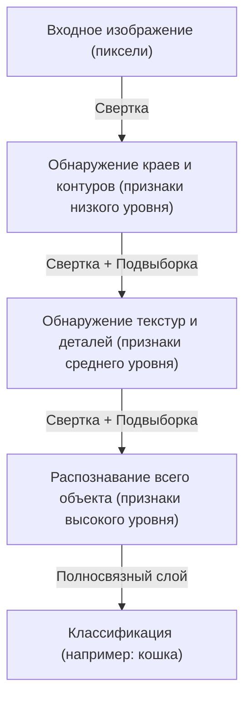

## Введение: Механистическая интерпретация интеллекта

Наши повседневные когнитивные процессы, такие как «зрение», «слух» и «понимание», долгое время оставались одной из величайших загадок в науке. В человеческом мозге насчитывается около 86 миллиардов нейронов, которые обмениваются сложными электрическими сигналами через триллионы синаптических связей, порождая эмерджентные явления, называемые сознанием и интеллектом. Глубокое обучение (Deep Learning) началось с попытки реконструировать этот чрезвычайно сложный биологический процесс в виде математической задачи оптимизации и смоделировать его на компьютере.

В этой статье подробно рассматривается механизм того, как искусственный интеллект распознает мир и обучается — от простого перцептрона до моделей Transformer, которые движут современной революцией ИИ, сквозь призму физики, истории, а также технологического и экономического контекста.

## Глава 1: Исторический контекст и зарождение нейронных сетей

### Рождение перцептрона и его ограничения

История искусственных нейронных сетей восходит к «перцептрону», предложенному Фрэнком Розенблаттом в 1957 году. Перцептрон представлял собой очень простой линейный классификатор, который взвешивал несколько входов и активировался (выдавал 1) только в том случае, если их сумма превышала определенный порог. Это была первая математическая модель, имитирующая поведение биологических нейронов, и в то время от нее даже ожидали, что она «сможет обучаться сама, а со временем начнет ходить, говорить и воспроизводить саму себя».

Однако в 1969 году Марвин Мински и Сеймур Паперт в своей книге «Перцептроны» математически доказали, что однослойные перцептроны не могут решать нелинейные задачи, такие как «XOR» (исключающее ИЛИ). В результате этого замечания исследования нейронных сетей вступили в первый период застоя, известный как «зима ИИ».

### Прорыв: обратное распространение ошибки и многослойность

«Зиму ИИ» удалось преодолеть благодаря алгоритму «обратного распространения ошибки» (Backpropagation), который был заново открыт и популяризирован в 1980-х годах. Этот алгоритм, формализованный Джеффри Хинтоном и другими, установил метод эффективного обновления весов каждой связи в многослойных (имеющих скрытые слои) нейронных сетях путем распространения ошибки выхода обратно к входу.

Благодаря этому сети приобрели нелинейную выразительность, что сделало возможным распознавание сложных паттернов. Однако из-за вычислительных мощностей компьютеров того времени и проблемы затухания градиента (явления, при котором обучающий сигнал ослабевает по мере увеличения глубины слоев), потребовались еще десятилетия и развитие аппаратного обеспечения для реализации по-настоящему «глубокого» (deep) обучения.

## Глава 2: Математические и физические основы глубокого обучения

### Функции активации и введение нелинейности

Ключевая причина, по которой нейронные сети могут моделировать сложный мир, заключается в «нелинейности». Большинство данных, существующих в мире (изображения, звук, язык и т. д.), линейно неразделимы. Эту проблему решает «функция активации» (Activation Function).

В прошлом преобладали сигмоидная функция и функция tanh, но они имели недостаток, заключающийся в высокой вероятности возникновения проблемы затухания градиента. В современном глубоком обучении в основном используется ReLU (Rectified Linear Unit) и ее производные.

$$ f(x) = \max(0, x) $$

Несмотря на крайнюю простоту вычислений, ReLU привносит в сеть сильную нелинейность, позволяя градиенту распространяться даже в глубоких слоях без затухания.

### Функция потерь и градиентный спуск: исследование энергетического ландшафта

Обучение модели по своей сути является задачей оптимизации, направленной на поиск параметров (весов и смещений), которые минимизируют «функцию потерь» (Loss Function). С точки зрения физики этот процесс можно сравнить с мячом, который катится вниз к самой низкой точке (оптимальному решению) в обширном многомерном «энергетическом ландшафте» (Energy Landscape).

Этим процессом спуска управляет «градиентный спуск» (Gradient Descent). Сегодня стандартно используются алгоритмы оптимизации с адаптивной скоростью обучения, такие как Adam и RMSprop, которые эффективно справляются с крутыми долинами и плоскими плато.

### Теория информации и гипотеза многообразий (Manifold Hypothesis)

Почему глубокое обучение так успешно справляется с многомерными данными, такими как изображения или языки? В основе этого лежит «гипотеза многообразий». Согласно этой гипотезе, многомерные данные реального мира (например, изображения, состоящие из миллионов пикселей) не распределены случайным образом, а плотно сосредоточены на топологическом пространстве (многообразии) гораздо меньшей размерности.

Каждый слой нейронной сети, искажая, складывая и растягивая пространство, постепенно распутывает это сложно переплетенное многообразие, в конечном итоге преобразуя его в линейно разделимое состояние (репрезентативное обучение).

## Глава 3: Эволюция архитектуры и способы познания мира

Глубокое обучение развило специализированные архитектуры в зависимости от природы обрабатываемых данных.

### CNN (Сверточные нейронные сети): Распознавание пространства

CNN произвела революцию в распознавании изображений. Вдохновленная локальными рецептивными полями зрительной коры биологических организмов, эта модель извлекает признаки из изображений путем чередования «сверточных слоев» (Convolutional Layer) и «слоев подвыборки» (Pooling Layer).

CNN обладает «трансляционной инвариантностью» (способностью распознавать объект независимо от его местоположения), и подавляющая победа AlexNet на конкурсе ImageNet в 2012 году послужила катализатором текущего бума ИИ.

### RNN и LSTM: Распознавание времени

Для обработки «последовательных данных», в которых важен порядок (таких как звук или текст), была разработана RNN (Рекуррентная нейронная сеть). RNN сохраняет прошлую информацию в виде внутреннего состояния, но при длинных последовательностях она сталкивалась с «проблемой долговременной зависимости», когда прошлые воспоминания стирались. Эта проблема была решена с помощью LSTM (Long Short-Term Memory). Внедрение механизма вентилей (вентиль забывания, вентиль входа, вентиль выхода) позволило сети обучаться тому, какую информацию следует хранить долго, а какую — отбрасывать, что значительно повысило точность машинного перевода и распознавания речи.

### Transformer: Механизм самовнимания (Self-Attention) и полное понимание контекста

Затем, в 2017 году, публикация статьи «Attention Is All You Need» исследователями из Google полностью изменила мир. Появление модели Transformer.

Вместо того чтобы обрабатывать данные последовательно, как RNN, Transformer использует «механизм самовнимания» (Self-Attention) для одновременного вычисления взаимосвязей между всеми входными данными (например, словами). Это позволило точно улавливать долгосрочные зависимости в контексте, выполняя параллельные вычисления на графических процессорах (GPU) с исключительной эффективностью.

Сегодня практически все передовые модели, включая серию GPT, на которой работает ChatGPT, и базовые технологии ИИ для генерации изображений, построены на этой архитектуре Transformer.

## Глава 4: Экономический и физический фундамент, поддерживающий глубокое обучение

### Законы масштабирования (Scaling Laws)

Важнейшим эмпирическим правилом в современной разработке ИИ являются «законы масштабирования». Согласно этому правилу, при экспоненциальном увеличении количества параметров модели, размера обучающего набора данных и используемых вычислительных ресурсов (Compute), производительность модели продолжает предсказуемо улучшаться. Открытие этого закона сместило фокус разработки ИИ с «поиска более сложных алгоритмов» на индустриальную капитальную конкуренцию за «обеспечение огромных вычислительных ресурсов».

### Компьютерная архитектура и физика электроэнергии

Прогресс в глубоком обучении неразрывно связан с развитием аппаратного обеспечения, прежде всего графических процессоров (GPU) NVIDIA. Обучение моделей с сотнями миллиардов параметров требует огромных центров обработки данных и колоссальных объемов электроэнергии. Столкнувшись с физическими ограничениями вычислений (конец закона Мура и проблемы тепловыделения), переход на парадигмы аппаратного обеспечения следующего поколения, такие как квантовые компьютеры и нейроморфные чипы (компьютеры, подобные мозгу), стал важнейшим экономическим и технологическим императивом.

## Заключение: ИИ и наше будущее

Искусственный интеллект, зародившийся из простых математических формул перцептрона, теперь эволюционировал до такой степени, что может понимать человеческий язык, создавать произведения искусства и ускорять научные открытия. Глубокое обучение — это не просто программный алгоритм, а гигантская инфраструктура современной цивилизации, где пересекаются данные, математика, физика и огромный экономический капитал.

Как ИИ воспринимает мир? Понимание этого механизма означает не только открытие «черного ящика» машин, но и столкновение с фундаментальным вопросом о том, что такое наш собственный, человеческий «интеллект». Эволюция технологий не останавливается, и сейчас мы стоим на новом рубеже познания в истории человечества.
