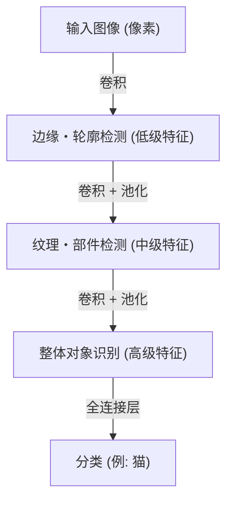

## 引言：智能的机械论解释

我们日常进行的“看”、“听”、“理解”等认知过程，长期以来一直是科学界最大的谜团之一。人类大脑中存在约860亿个神经元，它们通过数以万亿计的突触连接交换复杂的电信号，从而产生了被称为意识或智能的涌现现象。深度学习（Deep Learning）正是始于试图将这一极其复杂的生物学过程重构为数学优化问题，并在计算机上进行模拟的尝试。

本文将从简单的感知机到引领现代AI革命的Transformer模型，从物理学、历史以及技术和经济背景等多方面，详细解析人工智能是如何认知和学习这个世界的机制。

## 第一章：历史背景与神经网络的黎明

### 感知机的诞生与局限

人工神经网络的历史可以追溯到1957年弗兰克·罗森布拉特（Frank Rosenblatt）提出的“感知机（Perceptron）”。感知机对多个输入进行加权求和，只有当总和超过某个阈值时才会激活（输出为1），这是一个非常简单的线性分类器。它是第一个模仿生物神经元行为的数学模型，在当时甚至被寄予厚望：“能够自我学习，最终能够行走、说话甚至自我复制”。

然而，在1969年，马文·明斯基（Marvin Minsky）和西摩·派普特（Seymour Papert）在《感知机》一书中，从数学上证明了单层感知机无法解决“XOR（异或）”等非线性问题。这一指代导致神经网络研究陷入了被称为第一次“AI之冬”的停滞期。

### 反向传播与多层化的突破

打破AI之冬的是在20世纪80年代被重新发现并普及的“反向传播（Backpropagation）”算法。由杰弗里·辛顿（Geoffrey Hinton）等人形式化的该算法，确立了在多层（包含隐藏层）神经网络中，将输出的误差向输入端反向传播，从而高效更新各个连接权重的计算方法。

由此，神经网络获得了非线性表达能力，复杂的模式识别成为可能。然而，受限于当时计算机的计算能力，以及梯度消失问题（随着层数加深，学习信号衰减的现象）等障碍，真正实现“深度（Deep）”学习，还需要等待数十年的岁月和硬件的进化。

## 第二章：深度学习的数学与物理基础

### 激活函数与非线性的引入

神经网络能够对复杂世界进行建模的核心原因在于“非线性”。世界上存在的大多数数据（图像、声音、语言等）都是线性不可分的。解决这一问题的是“激活函数（Activation Function）”。

过去主流使用的是Sigmoid函数和tanh函数，但它们容易引发梯度消失问题。在现代深度学习中，主要使用ReLU（Rectified Linear Unit）及其衍生形式。

$$ f(x) = \max(0, x) $$

ReLU虽然计算极其简单，但为网络带来了强大的非线性，使得即使在深层网络中也能在不丢失梯度的情况下进行传播。

### 损失函数与梯度下降法：能量地形的探索

模型的学习本质上是一个寻找使“损失函数（Loss Function）”最小化的参数（权重和偏置）的优化问题。从物理学的视角来看，这可以比作一个球在广阔而高维的“能量地形（Energy Landscape）”中，向着最低的谷底（最优解）滚落的过程。

引导这一滚落过程的是“梯度下降法（Gradient Descent）”。目前，标准使用的是Adam或RMSprop等自适应学习率优化算法，它们能够高效地在陡峭的峡谷或平坦的高原中导航。

### 信息论与流形假设（Manifold Hypothesis）

为什么深度学习能够很好地处理图像和语言等高维数据呢？其背后存在着“流形假设”。根据这一假设，现实世界的高维数据（如数百万像素的图像）并不是随机分布的，而是密集分布在一个维度低得多的拓扑空间（流形）上的。

神经网络的各个层通过扭曲、折叠和拉伸空间，逐渐解开这些复杂交织的流形，最终将其转换为线性可分的状态（表示学习）。

## 第三章：架构的演进与世界的认知方式

深度学习根据处理数据的性质，发展出了专门化的架构。

### CNN（卷积神经网络）：空间的认知

在图像识别领域带来革命的是CNN。受生物视觉皮层局部感受野启发的这一模型，通过交替堆叠“卷积层（Convolutional Layer）”和“池化层（Pooling Layer）”来从图像中提取特征。

CNN具有“平移不变性（无论目标在何处都能被识别的特性）”，在2012年的ImageNet竞赛中，AlexNet取得了压倒性的胜利，成为了引发当前AI热潮的导火索。

### RNN与LSTM：时间的认知

为了处理声音或文本等顺序具有意义的“序列数据”，设计出了RNN（循环神经网络）。RNN将过去的信息作为内部状态保存，但当序列过长时，会产生过去记忆淡忘的“长期依赖问题”。解决这一问题的是LSTM（Long Short-Term Memory）。通过引入门控机制（遗忘门、输入门、输出门），它学会了是长期保留信息还是将其丢弃，从而飞跃性地提高了机器翻译和语音识别的精度。

### Transformer：自注意力机制（Self-Attention）与上下文的完全理解

2017年，Google研究人员发表的论文《Attention Is All You Need》彻底改变了世界。这就是Transformer模型的诞生。

Transformer不像RNN那样按顺序处理数据，而是利用“自注意力机制（Self-Attention）”，同时计算输入的所有数据（如单词）之间的相关性。这使得它不仅能准确把握上下文的长期依赖关系，还能极其高效地利用GPU进行并行计算。

今天，无论是支撑ChatGPT的GPT系列，还是图像生成AI的基础技术，几乎所有最先进的模型都是建立在这一Transformer架构之上的。

## 第四章：支撑深度学习的经济与物理基础

### 缩放定律（Scaling Laws）

在现代AI开发中，最重要的经验法则是“缩放定律”。这一法则指出，如果呈指数级增加模型的参数数量、训练数据集的规模以及投入的计算量（Compute），模型的性能将以可预测的方式持续提升。由于这一发现，AI开发从“探索更精密的算法”转变为“确保更庞大的计算资源”的产业化资本竞争。

### 计算机架构与电力的物理学

深度学习的进步与以NVIDIA GPU为首的硬件进化密不可分。训练拥有数千亿参数的模型需要庞大的数据中心和惊人的电力。在面临计算物理极限（摩尔定律的终结和发热问题）的当下，向量子计算机和神经形态芯片（类脑计算机）等下一代硬件范式的过渡，已成为经济和技术上的最高命题。

## 结论：AI与我们的未来

始于感知机简单数学公式的人工智能，如今已经进化到能够理解人类语言、创造艺术并加速科学发现的地步。深度学习不仅是软件算法，更是数据、数学、物理学以及庞大经济资本交汇的现代文明的巨大基础设施。

AI是如何认知世界的？理解这一机制不仅是打开机器黑盒，同时也是面对我们人类自身的“智能”究竟为何物这一根本性问题。技术的进化不会停止，我们如今正站在人类历史上新的认知前沿。
