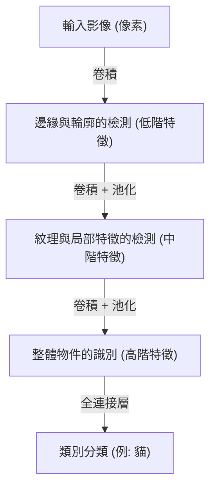

## 前言：智能的機械論解釋

我們日常進行的「看」、「聽」、「理解」等認知過程，長期以來一直是科學界最大的謎團之一。人類大腦中大約有860億個神經元，它們透過數兆個突觸連接進行複雜的電子訊號交換，從而產生了被稱為意識和智能的湧現現象。深度學習（Deep Learning）正是始於將這種極其複雜的生物學過程重構為數學最佳化問題，並試圖在電腦上進行模擬。

本文將從簡單的感知器，到引領現代AI革命的Transformer模型，詳細剖析人工智慧是如何認知並學習這個世界的，並從物理學、歷史以及技術與經濟背景等角度解開其機制。

## 第1章：歷史背景與神經網路的黎明

### 感知器的誕生與極限

人工神經網路的歷史可以追溯到1957年由弗蘭克·羅森布拉特（Frank Rosenblatt）提出的「感知器（Perceptron）」。感知器對多個輸入進行加權，只有當總和超過某個閾值時才會觸發（輸出為1），這是一個非常簡單的線性分類器。這是第一個模仿生物神經元行為的數學模型，當時甚至被期望「它將學會自我學習，最終能夠行走、說話和自我複製」。

然而，在1969年，馬文·明斯基（Marvin Minsky）和西摩·派普特（Seymour Papert）在《感知器》一書中從數學上證明了單層感知器無法解決「XOR（互斥或）」等非線性問題。這一指出使得神經網路研究進入了被稱為「AI之冬」的停滯期。

### 反向傳播與多層化的突破

打破AI之冬的，是1980年代被重新發現並普及的「反向傳播演算法（Backpropagation）」。由傑弗里·辛頓（Geoffrey Hinton）等人形式化的這個演算法，在多層（具有隱藏層）神經網路中，將輸出的誤差向輸入側反向傳播，確立了有效更新各個連接權重的方法。

這使得網路獲得了非線性的表達能力，並實現了複雜的模式識別。然而，受限於當時電腦的運算能力以及梯度消失問題（網路層數加深導致學習訊號衰減的現象）等障礙，真正實現「深度（Deep）」學習，還需要等待幾十年的時間和硬體的進步。

## 第2章：深度學習的數學與物理基礎

### 激勵函數與非線性的引入

神經網路能夠為複雜世界建模的核心原因在於「非線性」。世界上存在的大多數數據（影像、聲音、語言等）都是線性不可分的。解決這個問題的就是「激勵函數（Activation Function）」。

過去主流使用的是Sigmoid函數和tanh函數，但它們有容易引起梯度消失問題的缺點。現代的深度學習主要使用ReLU（Rectified Linear Unit）及其衍生型。

$$ f(x) = \max(0, x) $$

ReLU雖然計算極為簡單，卻為網路帶來了強大的非線性，並使得梯度即使在很深的網路層中也不會消失而能繼續傳播。

### 損失函數與梯度下降法：能量地景的探索

模型的學習，本質上是一個尋找最小化「損失函數（Loss Function）」的參數（權重和偏差）的最佳化問題。從物理學的角度來看，這可以比喻為一顆球在廣闊且高維的「能量地景（Energy Landscape）」中，朝向最低的谷底（最佳解）滾落的過程。

引導這個下降過程的就是「梯度下降法（Gradient Descent）」。目前，Adam和RMSprop等自適應學習率最佳化演算法已被標準化使用，它們能有效地在曲率陡峭的山谷或平坦的高原中導航。

### 資訊理論與流形假說（Manifold Hypothesis）

為什麼深度學習能如此出色地處理影像或語言等高維度數據呢？其背景存在著「流形假說」。根據這個假說，現實世界的高維度數據（例如：數百萬像素的影像）並非隨機分佈，而是密集分佈在一個維度低得多的拓撲空間（流形）上。

神經網路的各個層透過扭曲、摺疊、拉伸空間，逐漸將這個交錯複雜的流形解開，最終將其轉換為線性可分的狀態（表徵學習）。

## 第3章：架構的演進與世界的認知方式

深度學習根據所處理數據的性質，發展出了各種專門的架構。

### CNN（卷積神經網路）：空間的認知

在影像辨識領域帶來革命的是CNN。這個模型的靈感來自生物視覺皮層的局部感受野，透過不斷重複「卷積層（Convolutional Layer）」和「池化層（Pooling Layer）」來提取影像的特徵。

CNN具有「平移不變性（無論目標在哪裡都能識別的特性）」，在2012年的ImageNet競賽中，AlexNet取得了壓倒性的勝利，成為引爆目前AI熱潮的導火線。

### RNN與LSTM：時間的認知

為了處理語音、文字等順序具有意義的「序列數據」，RNN（循環神經網路）被設計出來。RNN將過去的資訊作為內部狀態保留，但在序列變長時，會出現過去記憶淡化的「長期依賴問題」。解決這個問題的是LSTM（長短期記憶網路）。透過引入閘門機制（遺忘閘、輸入閘、輸出閘），讓模型學習保留或丟棄長期的資訊，使得機器翻譯和語音辨識的精確度有了飛躍性的提升。

### Transformer：自我注意力機制（Self-Attention）與上下文的完全理解

到了2017年，Google研究人員發表的論文《Attention Is All You Need》徹底改變了世界。這就是Transformer模型的登場。

Transformer不像RNN那樣依序處理數據，而是使用「自我注意力機制（Self-Attention）」，同時計算所有輸入數據（如單詞）之間的關聯性。這使得模型在精確掌握上下文長期依賴關係的同時，能夠極高效率地利用GPU進行平行運算。

時至今日，支撐ChatGPT的GPT系列，以及圖像生成AI的基礎技術，幾乎所有最先進的模型都建立在這個Transformer架構之上。

## 第4章：支撐深度學習的經濟與物理基礎

### 縮放定律（Scaling Laws）

在現代AI開發中，最重要的經驗法則是「縮放定律」。該定律指出，只要呈指數級地增加模型的參數數量、訓練數據集的大小以及投入的運算量（Compute），模型的效能就會以可預測的方式持續提升。這個定律的發現，將AI開發從「探索更精妙的演算法」轉向了「獲取更龐大的運算資源」這種產業性的資本競爭。

### 運算架構與電力的物理學

深度學習的進步與以NVIDIA GPU為首的硬體發展密不可分。訓練擁有數千億參數的模型，需要巨大的資料中心和龐大的電力。在面臨運算的物理極限（摩爾定律的終結和散熱問題）時，向量子電腦或神經形態晶片（類腦電腦）等次世代硬體範式轉移，已成為經濟與技術上的最高使命。

## 結論：AI與我們的未來

從感知器簡單的數學公式開始，人工智慧如今已進化到能夠理解人類語言、創造藝術，甚至加速科學發現的地步。深度學習不僅僅是軟體演算法，更是數據、數學、物理學與龐大經濟資本交匯的現代文明巨大基礎設施。

AI是如何認知世界的？理解其機制，不僅是打開機器的黑盒子，同時也是我們人類直面「究竟什麼是智慧」這個根本性問題的過程。技術的演進不會停止，我們現在正站在人類歷史上新的認知邊疆。
