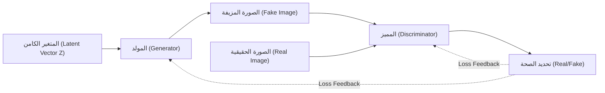
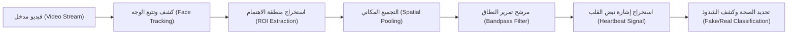
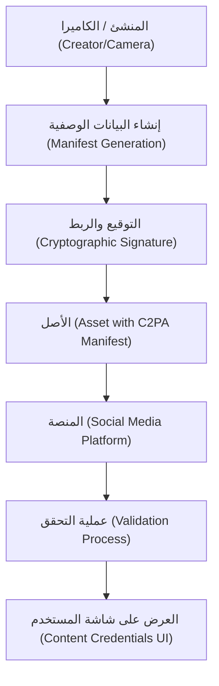

# مقدمة: عصر تتلاشى فيه الحدود بين الواقع والخيال

مع دخولنا العشرينيات من القرن الحادي والعشرين، يتقدم تطور الذكاء الاصطناعي التوليدي (Generative AI) بسرعة غير مسبوقة. أصبح من الممكن الآن في غضون ثوانٍ قليلة إنشاء محتوى من نصوص، وصوت، وصور، وحتى مقاطع فيديو لا يمكن تمييزها عن تلك التي يصنعها البشر. وبينما تجلب هذه الطفرة التقنية فوائد هائلة للمجالات الإبداعية، فإنها تخلق أيضًا تهديدًا اجتماعيًا خطيرًا يتمثل في فيضان المحتوى المزيف المتقن المعروف باسم "التزييف العميق" (Deepfake).

يهدد التزييف العميق المجتمع بأشكال مختلفة، مثل الخطب المزيفة للسياسيين، والاحتيال بانتحال صفة الرؤساء التنفيذيين للشركات (تطور لعمليات الاحتيال عبر البريد الإلكتروني للشركات BEC)، أو المواد الإباحية التي تشوه سمعة المشاهير. خاصة خلال فترات الانتخابات، يتطور انتشار الأخبار المزيفة عبر التزييف العميق إلى حد يهز أسس الديمقراطية.

في مثل هذا العصر، ما يطلب منا هو تحديث "محو الأمية المعلوماتية" (Information Literacy). لم يعد الحس السليم القائل "أصدق ما أراه بعيني" صالحًا. في هذا المقال، بدءًا من الخلفية التقنية لكيفية إنشاء التزييف العميق، سنشرح بعمق كبير باستخدام المعادلات البرمجية والرياضية، أحدث أساليب الطب الشرعي الرقمي لاكتشافه "تقنيًا"، والإطار العام (مثل C2PA) للمجتمع بأسره لمكافحة المعلومات المضللة.

---

# 1. آلية الذكاء الاصطناعي التوليدي التي تدعم التزييف العميق

لفهم التزييف العميق، من الضروري أولاً معرفة آلية الذكاء الاصطناعي التوليدي التي يرتكز عليها. حاليًا، الهيكلان الرئيسيان المستخدمان لتوليد صور ومقاطع فيديو عالية الدقة هما "شبكات التوليد التنافسية" (GAN: Generative Adversarial Networks) و"نماذج الانتشار" (Diffusion Models).

## 1.1 شبكات التوليد التنافسية (GAN)

كانت شبكات GAN، التي اقترحها إيان جودفيلو (Ian Goodfellow) وزملاؤه في عام 2014، هي الشرارة التي أطلقت تقنية التزييف العميق. في شبكات GAN، تلعب شبكتان عصبيتان أدوارًا تشبه "المزور" و"الشرطي"، ومن خلال التنافس مع بعضهما البعض (التعلم التنافسي)، تقومان بتوليد بيانات واقعية للغاية.

- **المولد (Generator, $G$)**: يستقبل ضوضاء عشوائية (المتغير الكامن $z$) كمدخل، ويقوم بتوليد بيانات (مثل الصور) تبدو حقيقية تمامًا.
- **المميز (Discriminator, $D$)**: يحدد ما إذا كانت البيانات المدخلة "حقيقية (Real)" قادمة من مجموعة البيانات الفعلية، أم "مزيفة (Fake)" من صنع المولد.

تستمر هاتان الشبكتان في التعلم لتحسين دالة الخسارة المصاغة على شكل لعبة "ميني ماكس" (Minimax) التالية:

$$
\min_G \max_D V(D, G) = \mathbb{E}_{x \sim p_{data}(x)}[\log D(x)] + \mathbb{E}_{z \sim p_{z}(z)}[\log(1 - D(G(z)))]
$$

هنا، $x$ هي البيانات الحقيقية، و $z$ هو المتغير الكامن (الضوضاء). يحاول المميز $D$ تعظيم هذه المعادلة (للتمييز بدقة بين الحقيقي والمزيف)، بينما يحاول المولد $G$ تقليلها (لخداع المميز). عندما يصل هذا التعلم إلى حالة التوازن (توازن ناش)، يصبح المولد قادرًا على توليد بيانات لا يمكن تمييزها عن البيانات الحقيقية.



## 1.2 نماذج الانتشار (Diffusion Models)

في السنوات الأخيرة، أصبحت "نماذج الانتشار" هي التكنولوجيا الأساسية وراء Midjourney و Stable Diffusion، متباهية بجودة صورة واستقرار يتجاوزان شبكات GAN. تتكون نماذج الانتشار من "عملية انتشار أمامية" حيث تتم إضافة الضوضاء تدريجياً إلى البيانات، و"عملية انتشار عكسية" تستعيد البيانات الأصلية من الضوضاء.

في **عملية الانتشار الأمامية (Forward Process)** ، يتم إضافة ضوضاء جاوس (Gaussian noise) إلى صورة نظيفة $x_0$ في كل خطوة زمنية $t$. يتم التعبير عن هذه العملية كسلسلة ماركوف بالمعادلة التالية:

$$
q(x_t | x_{t-1}) = \mathcal{N}(x_t; \sqrt{1 - \beta_t} x_{t-1}, \beta_t \mathbf{I})
$$

هنا، $\beta_t$ هو معلمة جدول زمني تتحكم في تباين الضوضاء. بعد المرور بعدد كافٍ من الخطوات $T$، تصبح $x_T$ ضوضاء عشوائية تمامًا.

في **عملية الانتشار العكسية (Reverse Process)** ، تتعلم شبكة عصبية (عادةً بهيكلية U-Net) التنبؤ بالضوضاء من الصورة المشوشة $x_t$ واستعادة الخطوة السابقة $x_{t-1}$. من خلال دمج هذه العملية مع التكييف (مثل الأوامر النصية Text Prompts)، يصبح من الممكن توليد أي صورة من الصفر (الضوضاء).

---

# 2. الطب الشرعي الرقمي: تقنيات للبحث عن آثار المخرجات المولدة

بغض النظر عن مدى تقدم النماذج التوليدية، فإن البيانات التي يولدها الذكاء الاصطناعي تترك دائمًا "آثارًا رياضية وإحصائية (Artifacts)" غير مرئية للبشر. تلتقط تقنيات الكشف (كاشفات التزييف العميق) هذه الآثار الدقيقة باستخدام مناهج مختلفة.

## 2.1 تحليل مجال التردد وتحويل جيب التمام المتقطع (DCT)

العين البشرية حساسة للتغيرات المكانية في ألوان الصورة وسطوعها (المجال المكاني)، ولكنها غير حساسة للتغيرات في التردد (مجال التردد). حتى لو بدت الصور التي تم إنشاؤها بواسطة GAN أو نماذج الانتشار مثالية للوهلة الأولى، فإنها تُنتج أنماط تردد مميزة (مثل آثار رقعة الشطرنج Checkerboard Artifacts) أثناء عملية زيادة العينات (التكبير من دقة منخفضة إلى دقة عالية).

لاكتشاف ذلك، غالبًا ما يُستخدم **تحويل جيب التمام المتقطع (Discrete Cosine Transform, DCT)**. يعبر DCT عن الصورة كمجموع لموجات جيب التمام بترددات مختلفة. معادلة DCT ثنائية الأبعاد هي كما يلي:

$$
X_{k_1, k_2} = \sum_{n_1=0}^{N_1-1} \sum_{n_2=0}^{N_2-1} x_{n_1, n_2} \cos\left[\frac{\pi}{N_1}\left(n_1 + \frac{1}{2}\right)k_1\right] \cos\left[\frac{\pi}{N_2}\left(n_2 + \frac{1}{2}\right)k_2\right]
$$

تميل الصور المولدة إلى أن يكون لها توزيع طاقة غير طبيعي في **مكونات التردد العالي (مثل الضوضاء الدقيقة والتغيرات الحادة في الحواف)** مقارنة بالصور الطبيعية. كود Python أدناه هو مثال بسيط لاستخراج طاقة مكونات التردد العالي من صورة باستخدام DCT.

```python
import cv2
import numpy as np
import scipy.fftpack

def extract_high_frequency_features(image_path):
    # قراءة الصورة وتحويلها إلى التدرج الرمادي
    img = cv2.imread(image_path, cv2.IMREAD_GRAYSCALE)
    if img is None:
        raise ValueError("Image not found")
    
    # تطبيق تحويل جيب التمام المتقطع ثنائي الأبعاد (DCT)
    # أولاً تطبيق DCT أحادي الأبعاد على الصفوف، ثم على الأعمدة
    dct_result = scipy.fftpack.dct(scipy.fftpack.dct(img.T, norm='ortho').T, norm='ortho')
    
    # استخراج مكونات التردد العالي (تغطية مكونات التردد المنخفض في أعلى اليسار وجعلها صفراً)
    rows, cols = dct_result.shape
    mask = np.ones((rows, cols))
    
    # تغطية منطقة التردد المنخفض (10% من الإجمالي)
    mask[:int(rows*0.1), :int(cols*0.1)] = 0
    
    high_freq_features = dct_result * mask
    
    # حساب مقدار الطاقة في منطقة التردد العالي
    energy = np.sum(np.abs(high_freq_features))
    
    return energy

# عند مقارنة الصور الطبيعية بالصور المولدة، غالباً ما يكون هناك فرق ذو دلالة إحصائية في قيمة energy
```

ينشأ هذا عدم التناسق في مجال التردد لأن الذكاء الاصطناعي يمكنه تعلم "الاتساق المحلي على مستوى البكسل"، ولكن من الصعب عليه تقليد "خصائص التردد العالمية للصورة ككل" بشكل كامل.

---

# 3. كشف الإشارات الحيوية: تأكيد "نبض الحياة" عبر rPPG

بالإضافة إلى تقنيات الكشف للصور (الصور الثابتة)، يعد **استخراج الإشارات الحيوية (Biological [Signals](https://kenji.blog/ar/p/state-management-history-future/))** نهجًا ثوريًا للكشف عن التزييف العميق في مقاطع الفيديو.

طالما أن الإنسان حي، يدور الدم في جسمه بالتزامن مع نبضات قلبه. يمتص الهيموجلوبين في الدم أطوالاً موجية معينة بشكل جيد (خاصة الضوء الأخضر، حوالي 530 نانومتر)، لذا يتغير لون بشرة الوجه بشكل طفيف جدًا (بمستوى غير مرئي للعين البشرية) بالتزامن مع نبض القلب. تُسمى التقنية التي تستخدم هذا المبدأ لتقدير معدل ضربات القلب بدون تلامس من فيديو كاميرا RGB عادية **rPPG (تخطيط التحجم الضوئي عن بُعد، remote Photoplethysmography)**.

يتم التعبير عن النموذج الأساسي لـ rPPG القائم على امتصاص الضوء وانعكاسه وفقًا لقانون لامبرت-بير (Beer-Lambert law) كما يلي:

$$
I(t) = I_0(t) e^{-\left( \mu_{dc} + \mu_{ac}(t) \right) d}
$$

هنا، $I(t)$ هو شدة الضوء المرصودة بالكاميرا، و $I_0(t)$ هو شدة مصدر الضوء، و $\mu_{dc}$ هو معامل امتصاص الضوء الثابت بواسطة الأنسجة، و $\mu_{ac}(t)$ هو معامل امتصاص الضوء الديناميكي الناتج عن تقلبات تدفق الدم (نبض القلب)، و $d$ هو طول مسار الضوء.

تسعى مقاطع فيديو التزييف العميق (مثل FaceSwap الذي يبدل الوجوه، أو Lip-sync الذي يزامن حركة الشفاه مع الصوت) إلى الواقعية البصرية إطارًا بإطار، **ولكنها لا تستطيع إعادة إنتاج التغيرات الدقيقة في تدفق الدم (إشارة نبض القلب) على طول المحور الزمني.** لذلك، عند محاولة استخراج إشارة rPPG من فيديو تزييف عميق، يتم الحصول على إشارة غير طبيعية مليئة بالضوضاء، تختلف عن معدل ضربات القلب البشري الطبيعي (والذي عادة ما يكون دورة منتظمة في نطاق 60 إلى 100 نبضة في الدقيقة).



فيما يلي مثال مفاهيمي لتنفيذ خط أنابيب ([Pipeline](https://kenji.blog/ar/p/cicd-pipeline-github-actions-best-practices/)) لاستخراج إشارة rPPG من فيديو باستخدام Python.

```python
import cv2
import numpy as np
from scipy import signal

def extract_rppg_signal(video_path):
    cap = cv2.VideoCapture(video_path)
    green_signals = []
    
    while cap.isOpened():
        ret, frame = cap.read()
        if not ret:
            break
            
        # 1. كشف الوجه واستخراج ROI (منطقة الاهتمام: الجبهة أو الخدين مثلاً)
        # roi = detect_face_and_extract_roi(frame)
        # للتبسيط هنا، سنجعل الجزء الأوسط من الإطار بأكمله هو منطقة الاهتمام (ROI)
        h, w = frame.shape[:2]
        roi = frame[int(h*0.3):int(h*0.6), int(w*0.4):int(w*0.6)]
        
        # 2. استخراج القناة الخضراء (Green) من مساحة RGB
        # لأن الهيموجلوبين في الدم يمتص الضوء الأخضر أكثر من غيره
        g_channel = roi[:, :, 1]
        
        # 3. التجميع المكاني (حساب المتوسط)
        mean_g = np.mean(g_channel)
        green_signals.append(mean_g)
        
    cap.release()
    
    if len(green_signals) == 0:
        return None
        
    # 4. مرشح تمرير النطاق لإزالة الضوضاء
    # استخراج النطاق الترددي لنبض قلب الإنسان (مثال: 0.7Hz إلى 2.5Hz = 42 إلى 150 نبضة في الدقيقة)
    fps = 30.0 # معدل إطارات افتراضي
    nyquist = 0.5 * fps
    low = 0.7 / nyquist
    high = 2.5 / nyquist
    b, a = signal.butter(3, [low, high], btype='bandpass')
    filtered_signal = signal.filtfilt(b, a, green_signals)
    
    return filtered_signal

# من خلال تحليل الطيف الترددي للإشارة filtered_signal المستخرجة،
# إذا لم يكن هناك ذروة واضحة (نبض قلب)، فمن المحتمل جداً أن يكون التزييف عميقاً.
```

---

# 4. "لعبة القط والفأر" التي لا تنتهي: التعلم التنافسي وتقنيات التهرب

كما تم تقديمه حتى الآن، توجد تقنيات متقدمة للطب الشرعي مثل تحليل التردد والإشارات الحيوية (rPPG). ومع ذلك، في عالم الذكاء الاصطناعي، لا يوجد "حاجز دفاعي مطلق". بمجرد نشر تقنية الكشف في ورقة بحثية، يقوم المهاجمون (صناع التزييف العميق) على الفور بتحسين النماذج التوليدية لتفادي هذا الكاشف.

على سبيل المثال، لنفترض أن الكاشف يكتشف التزييف العميق من خلال رصد "شذوذ في مجال التردد". يقوم المهاجمون بـ **دمج هذا الكاشف نفسه كـ "مميز (Discriminator)" في شبكة GAN جديدة** وإعادة تدريب المولد (Generator). نتيجة لذلك، يتطور المولد ليخرج "صورًا لا يمكن تمييزها عن الصور الطبيعية حتى في مجال التردد".

علاوة على ذلك، تم بالفعل الإبلاغ عن أبحاث (مكافحة الطب الشرعي Anti-Forensics) تحاول خداع أنظمة الكشف القائمة على rPPG عن طريق إضافة "تقلبات لونية طفيفة (إشارة نبض قلب مزيفة)" مصطنعة إلى الفيديو بشكل متعمد من خلال المعالجة اللاحقة.

إن الاكتشاف والتوليد ينخرطان حقًا في لعبة لا نهائية من "القط والفأر" (أو درع ورمح). ولهذا السبب، يُشار إلى أن النهج الذي يحدد الأصالة من خلال التحليل اللاحق للبيانات الناتجة (الصور ومقاطع الفيديو) فقط (الكشف السلبي) سيصل في النهاية إلى طريق مسدود.

---

# 5. الحل الجذري: إثبات المصدر وإطار عمل C2PA

مع وصول الكشف البعدي إلى حدوده، يتم الآن الدفع بسرعة على مستوى العالم نحو نهج دفاعي نشط يضمن "مصدر (Provenance)" البيانات باستخدام التشفير. التحالف الذي يبني هذا الإطار القياسي العالمي هو **C2PA (تحالف من أجل مصدر المحتوى وأصالته)**.

C2PA هو كونسورتيوم تأسس بمشاركة شركات كبرى مثل Adobe و Microsoft و Intel و BBC و Sony، وهو يضع مواصفات تقنية لتضمين تاريخ المحتوى الرقمي (من صوره، ومتى، وبأي كاميرا، وما التعديلات التي أجريت عليه) في المحتوى نفسه بطريقة غير قابلة للتلاعب.

## 5.1 آلية عمل C2PA

التقنية الأساسية لـ C2PA هي التوقيع الرقمي باستخدام البنية التحتية للمفتاح العام (PKI)، وربط هاش المحتوى (Content Hash).

1. **إنشاء البيانات الوصفية (Manifest)**: في اللحظة التي يتم فيها التقاط صورة بالكاميرا أو تحريرها بواسطة برنامج، يتم إنشاء بيانات وصفية تسمى "البيان (Manifest)" تتضمن سجل العمليات ومعلومات الجهاز ومعلومات المنشئ.
2. **التوقيع المشفر (Digital Signature)**: يتم تطبيق توقيع رقمي على البيان وقيمة الهاش الخاصة بالصورة نفسها (ملخص لبيانات البكسل) باستخدام مفتاح خاص للأجهزة أو البرامج.
3. **التضمين في الأصل**: يتم تضمين البيان الموقع (بيانات اعتماد C2PA) في معلومات رأسية (Header) لصيغ الملفات مثل JPEG أو MP4.

حتى لو حاول المهاجم التلاعب بجزء من الصورة أو إرفاق بيانات وصفية مزيفة بصورة مولدة بالذكاء الاصطناعي، فإن قيمة الهاش للصورة نفسها ستتغير، وبالتالي سيفشل التحقق من التوقيع الرقمي، وسيتم اكتشاف التلاعب على الفور.



## 5.2 التجسيد المرئي عبر أيقونة "بيانات اعتماد المحتوى (Content Credentials)"

في الأنظمة المتوافقة مع معيار C2PA، عندما يرى المستخدم صورة على وسائل التواصل الاجتماعي أو المواقع الإخبارية، ستظهر أيقونة "CR (Content Credentials)" في زاوية الصورة. من خلال النقر عليها، يمكن لأي شخص التحقق بشفافية من تاريخ تلك الصورة، وما إذا كانت "مولدة بالذكاء الاصطناعي"، أو "ملتقطة بكاميرا فعلية"، أو "تم تصحيح ألوانها في Photoshop".

حاليًا، بدأ بائعو الذكاء الاصطناعي الرئيسيون مثل OpenAI (مع DALL-E 3) و Google أيضًا في إضافة بيانات C2PA الوصفية إلى الصور المولدة، كما تعمل شركات تصنيع الكاميرات مثل Leica و Sony على تنفيذ وظائف توقيع C2PA على مستوى الأجهزة (Hardware). إن النموذج المجتمعي يتحول من "اكتشاف المزيف" إلى "إثبات الحقيقي (نهج الثقة الصفرية Zero-Trust)".

---

# 6. محو الأمية المعلوماتية للجيل القادم: ما يمكننا القيام به

إن التدابير التقنية (مثل كاشفات التزييف العميق وإثبات المصدر كـ C2PA) هي في النهاية مجرد بنية تحتية لحماية المجتمع. في النهاية، دماغنا البشري هو الذي يقرر استهلاك المعلومات ونشرها أم لا.

تتمثل "محو الأمية المعلوماتية" للجيل القادم في عصر الذكاء الاصطناعي في تبني المواقف التالية:

1. **تجنب النشر الانعكاسي (توقف وفكر - Stop and Think)**
   عند التعرض لمقاطع فيديو صادمة أو محتوى يثير الغضب (معلومات تروق للعواطف)، يجب عليك التوقف للحظة والامتناع عن إعادة النشر أو المشاركة. الهدف الرئيسي لصناع التزييف العميق هو اختراق المشاعر البشرية لنشر المعلومات.
2. **التحقق من "مصدر" المعلومات (Verify the Source)**
   هل تم نشر هذه المعلومات من قبل مؤسسة إخبارية موثوقة؟ هل ترفق بها إثباتات المصدر مثل C2PA (بيانات اعتماد المحتوى)؟ من المهم بناء عادة التحقق المتقاطع (Cross-check) من مصادر المعلومات.
3. **شك صحي بأن "كل شيء قد يكون مزيفًا" (Healthy Skepticism)**
   ليس هناك حاجة للتشاؤم، ولكن يجب التخلص من الحس السليم السابق القائل بأن "الفيديو = حقيقة". من الضروري استهلاك المعلومات على افتراض أننا في عصر يمكن فيه تزوير الصوت والفيديو والنصوص بسهولة.

# خاتمة

لقد فتح تطور تقنية الذكاء الاصطناعي صندوق باندورا. لم يعد من الممكن محو التقنية التي تنتج التزييف العميق.

ومع ذلك، كما وضحنا في هذا المقال، يواجه المهندسون تهديد الأخبار المزيفة من خلال مناهج متنوعة مثل تحليل التردد، وكشف الإشارات الحيوية، وإثبات المصدر باستخدام التشفير (C2PA). من خلال الجمع بين هذه الدروع التقنية (التدابير الوقائية) والدرع الاجتماعي المتمثل في "محو الأمية المعلوماتية" لكل واحد منا، يجب أن نكون قادرين على ركوب موجة الخيال التي يجلبها الذكاء الاصطناعي وحماية قيمة الحقيقة.

ولأننا في عصر تتلاشى فيه الحدود بين الواقع والخيال، أصبحت "إرادة" الإنسان في السعي وراء الحقيقة أهم من أي وقت مضى.


