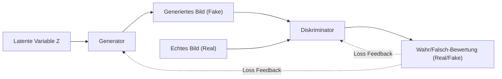
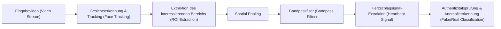
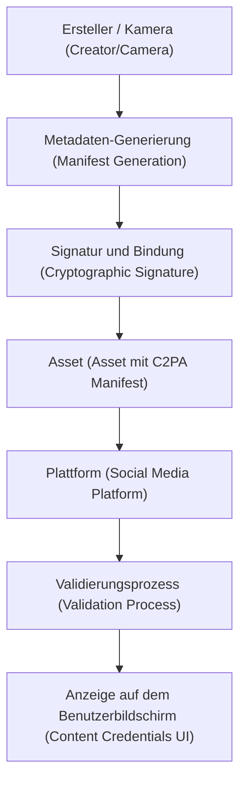

# Einleitung: Eine Ära, in der die Grenzen zwischen Realität und Fiktion verschwimmen

In den 2020er Jahren schreitet die Entwicklung der generativen KI (Generative AI) mit beispielloser Geschwindigkeit voran. Texte, Audios, Bilder und sogar Videos, die von menschlich erstellten Inhalten nicht mehr zu unterscheiden sind, können nun in nur wenigen Sekunden generiert werden. Während dieser technologische Sprung der kreativen Branche enorme Vorteile bringt, schafft er gleichzeitig eine ernsthafte gesellschaftliche Bedrohung: die Flut von raffinierten, gefälschten Inhalten, bekannt als "Deepfakes".

Deepfakes bedrohen die Gesellschaft in verschiedenen Formen, wie zum Beispiel durch gefälschte Reden von Politikern, Betrug durch die Nachahmung von Unternehmens-CEOs (eine Weiterentwicklung von BEC-Betrug) oder Pornografie, die den Ruf von Prominenten schädigt. Insbesondere während Wahlkampfzeiten hat sich die Verbreitung von Fake News durch Deepfakes zu einer Situation entwickelt, die die Grundlagen der Demokratie erschüttert.

In einer solchen Zeit wird von uns ein Update unserer "Informationskompetenz (Information Literacy)" gefordert. Der gesunde Menschenverstand, "zu glauben, was man mit eigenen Augen sieht", gilt nicht mehr. Dieser Artikel beginnt mit dem technischen Hintergrund, wie Deepfakes generiert werden, und erklärt auf sehr tiefgreifender Ebene, unter Einbeziehung von mathematischen Formeln und Code, modernste digitale Forensik-Methoden, um sie "technisch" zu entlarven, sowie Frameworks für die gesamte Gesellschaft (wie C2PA), um Desinformation zu bekämpfen.

---

# 1. Der Mechanismus der generativen KI, der Deepfakes antreibt

Um Deepfakes zu verstehen, muss man zunächst die Mechanismen der generativen KI kennen, auf der sie basieren. Derzeit sind die beiden repräsentativen Architekturen zur Generierung von hochauflösenden Bildern und Videos "GAN (Generative Adversarial Networks)" und "Diffusion Models (Diffusionsmodelle)".

## 1.1 Generative Adversarial Networks (GAN)

GAN, das 2014 von Ian Goodfellow und anderen vorgeschlagen wurde, war der Auslöser der Deepfake-Technologie. Bei GAN übernehmen zwei neuronale Netze die Rollen eines "Fälschers" und eines "Polizisten", und indem sie miteinander konkurrieren (Adversarial Learning), generieren sie extrem realistische Daten.

- **Generator ($G$)**: Nimmt zufälliges Rauschen (latente Variable $z$) als Eingabe auf und generiert täuschend echte Daten (wie Bilder).
- **Diskriminator ($D$)**: Bestimmt, ob die eingegebenen Daten "echt (Real)" aus einem tatsächlichen Datensatz stammen oder "falsch (Fake)", also vom Generator erstellt wurden.

Diese beiden Netzwerke lernen durch die Optimierung einer Verlustfunktion, die als folgendes Minimax-Spiel formuliert ist:

$$
\min_G \max_D V(D, G) = \mathbb{E}_{x \sim p_{data}(x)}[\log D(x)] + \mathbb{E}_{z \sim p_{z}(z)}[\log(1 - D(G(z)))]
$$

Hier ist $x$ ein echtes Datum und $z$ eine latente Variable (Rauschen). Der Diskriminator $D$ versucht, diese Formel zu maximieren (echt und falsch genau zu unterscheiden), und der Generator $G$ versucht sie zu minimieren (den Diskriminator zu täuschen). Wenn dieses Lernen einen Gleichgewichtszustand (Nash-Gleichgewicht) erreicht, kann der Generator Daten erzeugen, die von den echten nicht zu unterscheiden sind.



## 1.2 Diffusionsmodelle (Diffusion Models)

In den letzten Jahren sind "Diffusionsmodelle", die eine Bildqualität und Stabilität aufweisen, die GANs übertreffen, zur Basistechnologie von Midjourney und Stable Diffusion geworden. Diffusionsmodelle bestehen aus einem "Vorwärts-Diffusionsprozess", der den Daten schrittweise Rauschen hinzufügt, und einem "Rückwärts-Diffusionsprozess", der die ursprünglichen Daten aus dem Rauschen wiederherstellt.

Im **Vorwärts-Diffusionsprozess (Forward Process)** wird einem sauberen Bild $x_0$ in jedem Zeitschritt $t$ Gaußsches Rauschen hinzugefügt. Dieser Prozess wird als Markov-Kette durch die folgende Formel ausgedrückt:

$$
q(x_t | x_{t-1}) = \mathcal{N}(x_t; \sqrt{1 - \beta_t} x_{t-1}, \beta_t \mathbf{I})
$$

Hier ist $\beta_t$ ein Planparameter, der die Varianz des Rauschens steuert. Nach ausreichend vielen Schritten $T$ wird $x_T$ zu völlig zufälligem Rauschen.

Im **Rückwärts-Diffusionsprozess (Reverse Process)** lernt ein neuronales Netzwerk (üblicherweise eine U-Net-Architektur), das Rauschen aus dem verrauschten Bild $x_t$ vorherzusagen und den vorherigen Schritt $x_{t-1}$ wiederherzustellen. Durch Kombination dieses Prozesses mit einer Konditionierung (wie einem Text-Prompt) wird es möglich, beliebige Bilder von Null (Rauschen) an zu generieren.

---

# 2. Digitale Forensik: Techniken zur Suche nach Spuren von generierten Inhalten

Egal wie fortschrittlich generative Modelle werden, Daten, die von KI generiert wurden, hinterlassen immer "mathematische und statistische Spuren (Artefakte)", die für den Menschen unsichtbar sind. Erkennungstechnologien (Deepfake-Detektoren) erfassen diese subtilen Spuren mit verschiedenen Ansätzen.

## 2.1 Frequenzbereichsanalyse und DCT (Diskrete Kosinustransformation)

Das menschliche Auge reagiert empfindlich auf räumliche Veränderungen von Farbe und Helligkeit in Bildern (räumliche Domäne), ist aber unempfindlich gegenüber Veränderungen in der Frequenz (Frequenzbereich). Bilder, die von GANs oder Diffusionsmodellen generiert wurden, können auf den ersten Blick perfekt aussehen, erzeugen aber während des Upsamplings (Vergrößerung von niedriger auf hohe Auflösung) spezifische Frequenzmuster (wie Checkerboard-Artefakte).

Häufig wird die **Diskrete Kosinustransformation (Discrete Cosine Transform, DCT)** verwendet, um dies zu erkennen. Die DCT stellt Bilder als Addition von Kosinuswellen unterschiedlicher Frequenzen dar. Die Formel für die 2D-DCT lautet wie folgt:

$$
X_{k_1, k_2} = \sum_{n_1=0}^{N_1-1} \sum_{n_2=0}^{N_2-1} x_{n_1, n_2} \cos\left[\frac{\pi}{N_1}\left(n_1 + \frac{1}{2}\right)k_1\right] \cos\left[\frac{\pi}{N_2}\left(n_2 + \frac{1}{2}\right)k_2\right]
$$

Generierte Bilder neigen im Vergleich zu natürlichen Bildern zu einer abnormalen Energieverteilung in **hochfrequenten Komponenten (feines Rauschen und scharfe Kantenveränderungen)**. Der folgende Python-Code ist ein einfaches Beispiel für die Extraktion der Energie hochfrequenter Komponenten aus einem Bild mithilfe von DCT:

```python
import cv2
import numpy as np
import scipy.fftpack

def extract_high_frequency_features(image_path):
    # Bild laden und in Graustufen umwandeln
    img = cv2.imread(image_path, cv2.IMREAD_GRAYSCALE)
    if img is None:
        raise ValueError("Image not found")
    
    # 2D Diskrete Kosinustransformation (DCT) anwenden
    # Zuerst 1D-DCT auf die Zeilen, dann 1D-DCT auf die Spalten anwenden
    dct_result = scipy.fftpack.dct(scipy.fftpack.dct(img.T, norm='ortho').T, norm='ortho')
    
    # Hochfrequente Komponenten extrahieren (niederfrequente Komponenten oben links maskieren und nullen)
    rows, cols = dct_result.shape
    mask = np.ones((rows, cols))
    
    # Niederfrequenzbereich (10% der Gesamtfläche) maskieren
    mask[:int(rows*0.1), :int(cols*0.1)] = 0
    
    high_freq_features = dct_result * mask
    
    # Energiemenge des Hochfrequenzbereichs berechnen
    energy = np.sum(np.abs(high_freq_features))
    
    return energy

# Beim Vergleich von natürlichen Bildern mit generierten Bildern gibt es oft signifikante statistische Unterschiede im energy-Wert
```

Diese Unnatürlichkeit im Frequenzbereich entsteht, weil die KI zwar "lokale Konsistenz auf Pixelebene" lernen kann, es ihr aber schwerfällt, die "globalen Frequenzeigenschaften des gesamten Bildes" perfekt zu imitieren.

---

# 3. Erkennung biologischer Signale: Bestätigung des "Lebenspulses" durch rPPG

Zusätzlich zu den Erkennungstechnologien für Bilder (Standbilder) ist die **Extraktion biologischer Signale (Biological Signals)** ein bahnbrechender Ansatz zur Erkennung von Deepfakes in Videos.

Solange ein Mensch lebt, zirkuliert Blut im Takt des Herzschlags durch den Körper. Da Hämoglobin im Blut bestimmte Wellenlängen (insbesondere grünes Licht, etwa 530 nm) gut absorbiert, verändert sich die Farbe der Gesichtshaut leicht (auf einem für das menschliche Auge unsichtbaren Niveau) im Rhythmus des Herzschlags. Die Technologie, die dieses Prinzip nutzt, um die Herzfrequenz berührungslos aus normalen RGB-Kameravideos zu schätzen, wird **rPPG (remote Photoplethysmography)** genannt.

Das Grundmodell der rPPG, basierend auf Lichtabsorption und -reflexion, wird durch das Beer-Lambert-Gesetz wie folgt ausgedrückt:

$$
I(t) = I_0(t) e^{-\left( \mu_{dc} + \mu_{ac}(t) \right) d}
$$

Hier ist $I(t)$ die von der Kamera beobachtete Lichtintensität, $I_0(t)$ die Lichtquellenintensität, $\mu_{dc}$ der Lichtabsorptionskoeffizient aufgrund des statischen Gewebes, $\mu_{ac}(t)$ der dynamische Lichtabsorptionskoeffizient aufgrund von Blutflussänderungen (Herzschlag) und $d$ die optische Weglänge.

Deepfake-Videos (z. B. FaceSwap zum Ersetzen von Gesichtern oder Lip-Sync zur Synchronisation von Lippenbewegungen mit Audio) streben auf Frame-Ebene nach visueller Realität, **können jedoch die feinen Blutflussänderungen (Herzschlagsignale) entlang der Zeitachse nicht reproduzieren.** Versucht man daher, das rPPG-Signal aus einem Deepfake-Video zu extrahieren, erhält man ein verrauschtes, unnatürliches Signal, das sich von einer natürlichen menschlichen Herzfrequenz (ein regelmäßiger Zyklus normalerweise im Bereich von 60 bis 100 bpm) unterscheidet.



Im Folgenden finden Sie ein konzeptionelles Implementierungsbeispiel einer Pipeline zur Extraktion von rPPG-Signalen aus Videos mit Python:

```python
import cv2
import numpy as np
from scipy import signal

def extract_rppg_signal(video_path):
    cap = cv2.VideoCapture(video_path)
    green_signals = []
    
    while cap.isOpened():
        ret, frame = cap.read()
        if not ret:
            break
            
        # 1. Gesichtserkennung und ROI (Region of Interest: z. B. Stirn oder Wangen) extrahieren
        # roi = detect_face_and_extract_roi(frame)
        # Zur Vereinfachung verwenden wir hier den mittleren Teil des gesamten Frames als ROI
        h, w = frame.shape[:2]
        roi = frame[int(h*0.3):int(h*0.6), int(w*0.4):int(w*0.6)]
        
        # 2. Den grünen Kanal aus dem RGB-Raum extrahieren
        # Da Hämoglobin im Blut grünes Licht am meisten absorbiert
        g_channel = roi[:, :, 1]
        
        # 3. Spatial Pooling (Berechnung des Mittelwerts)
        mean_g = np.mean(g_channel)
        green_signals.append(mean_g)
        
    cap.release()
    
    if len(green_signals) == 0:
        return None
        
    # 4. Rauschunterdrückung durch Bandpassfilter
    # Das menschliche Herzfrequenzband (z.B. 0,7 Hz - 2,5 Hz = 42 - 150 bpm) extrahieren
    fps = 30.0 # Angenommene Bildrate
    nyquist = 0.5 * fps
    low = 0.7 / nyquist
    high = 2.5 / nyquist
    b, a = signal.butter(3, [low, high], btype='bandpass')
    filtered_signal = signal.filtfilt(b, a, green_signals)
    
    return filtered_signal

# Das Frequenzspektrum des extrahierten filtered_signal analysieren,
# wenn kein klarer Peak (Herzschlag) vorhanden ist, besteht eine hohe Wahrscheinlichkeit für einen Deepfake.
```

---

# 4. Das endlose Katz-und-Maus-Spiel: Adversarial Learning und Umgehungstechniken

Wie bisher vorgestellt, existieren fortschrittliche forensische Technologien wie Frequenzanalyse und biologische Signale (rPPG). In der KI-Welt gibt es jedoch keine "absoluten Barrieren". Sobald Erkennungstechnologien als Forschungsarbeiten veröffentlicht werden, verbessern Angreifer (Deepfake-Ersteller) sofort ihre generativen Modelle, um diese Detektoren zu umgehen.

Angenommen, ein Detektor erkennt eine "Anomalie im Frequenzbereich" und entlarvt einen Deepfake. Der Angreifer **integriert diesen Detektor selbst als "Diskriminator" eines neuen GAN** und trainiert den Generator neu. Dadurch entwickelt sich der Generator so weiter, dass er "Bilder ausgibt, die auch im Frequenzbereich von natürlichen Bildern nicht zu unterscheiden sind".

Darüber hinaus gibt es bereits Berichte über Forschungen (Anti-Forensik), die versuchen, rPPG-basierte Erkennungssysteme zu täuschen, indem sie den Videos im Post-Processing künstliche "leichte Farbschwankungen (gefälschte Herzschlagsignale)" absichtlich hinzufügen.

Erkennung und Generierung liefern sich ein endloses Katz-und-Maus-Spiel wie "Schild und Speer". Daher wird darauf hingewiesen, dass der Ansatz, die Echtheit nur durch nachträgliche Analyse der ausgegebenen Daten (Bilder oder Videos) zu bestimmen (passive Erkennung), irgendwann an seine Grenzen stoßen wird.

---

# 5. Die grundlegende Maßnahme: Herkunftsnachweis und das C2PA-Framework

Während die nachträgliche Erkennung an ihre Grenzen stößt, ist ein aktiver Verteidigungsansatz, der die kryptografische Garantie der "Herkunft (Provenance)" der Daten bietet, derzeit weltweit auf dem Vormarsch. Die Institution, die dieses globale Standard-Framework aufbaut, ist die **C2PA (Coalition for Content Provenance and Authenticity)**.

C2PA ist ein Konsortium, das unter Beteiligung großer Unternehmen wie Adobe, Microsoft, Intel, BBC und Sony gegründet wurde. Es entwickelt technische Spezifikationen, um die Herkunft digitaler Inhalte (wer, wann, mit welcher Kamera aufgenommen und welche Bearbeitungen vorgenommen wurden) fälschungssicher in den Inhalt selbst einzubetten.

## 5.1 Wie C2PA funktioniert

Die Kerntechnologie von C2PA sind digitale Signaturen unter Verwendung einer Public-Key-Infrastruktur (PKI) sowie die Bindung von Inhalts-Hashes.

1. **Metadaten-Generierung (Manifest)**: In dem Moment, in dem ein Foto mit einer Kamera aufgenommen oder mit Software bearbeitet wird, werden Metadaten, genannt "Manifest", generiert, die den Betriebsverlauf, Geräteinformationen und Erstellerinformationen enthalten.
2. **Kryptografische Signatur (Digital Signature)**: Das Manifest und der Hashwert des Bildes selbst (eine Zusammenfassung der Pixeldaten) werden mit einem privaten Hardware- oder Software-Schlüssel digital signiert.
3. **Einbettung in das Asset**: Das signierte Manifest (C2PA Credential) wird in die Header-Informationen von Dateiformaten wie JPEG oder MP4 eingebettet.

Selbst wenn ein Angreifer einen Teil eines Bildes verfälscht oder versucht, gefälschte Metadaten an ein KI-generiertes Bild anzuhängen, ändert sich der Hashwert des Bildes selbst, was dazu führt, dass die Überprüfung der digitalen Signatur fehlschlägt und die Manipulation sofort erkannt wird.



## 5.2 Visualisierung durch das Icon "Content Credentials"

In Systemen, die dem C2PA-Standard entsprechen, wird ein Icon namens "CR (Content Credentials)" in der Ecke eines Bildes angezeigt, wenn Benutzer es in sozialen Netzwerken oder auf Nachrichtenseiten sehen. Ein Klick darauf ermöglicht es jedem transparent zu überprüfen, ob das Bild "durch KI generiert" oder "mit einer echten Kamera aufgenommen" wurde oder ob "Farbkorrekturen in Photoshop vorgenommen wurden".

Derzeit beginnen auch große KI-Anbieter wie OpenAI (DALL-E 3) und Google mit der Zuweisung von C2PA-Metadaten zu generierten Bildern, und Kamerahersteller wie Leica und Sony arbeiten an der Implementierung von C2PA-Signaturfunktionen auf Hardwareebene. Das Paradigma der Gesellschaft verschiebt sich vom "Entlarven von Fälschungen" hin zum "Beweisen der Echtheit (Zero-Trust-Ansatz)".

---

# 6. Informationskompetenz der nächsten Generation: Was wir tun können

Technische Maßnahmen (wie Deepfake-Detektoren und Herkunftsnachweise wie C2PA) sind lediglich eine Infrastruktur zum Schutz der Gesellschaft. Letztendlich sind es unsere menschlichen Gehirne, die entscheiden, ob wir Informationen konsumieren und verbreiten.

Die "Informationskompetenz" der nächsten Generation im KI-Zeitalter bedeutet, die folgende Einstellung einzunehmen:

1. **Vermeiden reflexartiger Verbreitung (Stop and Think)**
   Gerade wenn Sie auf schockierende Bilder oder Wut erregende Inhalte (Informationen, die an Emotionen appellieren) stoßen, sollten Sie innehalten und das Reposten oder Teilen stoppen. Das Hauptziel der Deepfake-Ersteller ist es, menschliche Emotionen zu hacken und Informationen zu verbreiten.
2. **Überprüfen der "Quelle" der Information (Verify the Source)**
   Stammt die Information von einer vertrauenswürdigen Nachrichtenorganisation? Sind Herkunftsnachweise wie C2PA (Content Credentials) angehängt? Es ist wichtig, sich die Gewohnheit anzueignen, Informationsquellen gegenzuprüfen.
3. **Eine gesunde Skepsis, dass "alles eine Fälschung sein könnte" (Healthy Skepticism)**
   Man muss nicht pessimistisch sein, aber man muss den früheren gesunden Menschenverstand "Video = Tatsache" ablegen. Wir müssen Informationen unter der Prämisse konsumieren, dass wir uns in einer Ära befinden, in der Audio, Video und Text leicht gefälscht werden können.

# Fazit

Die Evolution der KI-Technologie hat die Büchse der Pandora geöffnet. Es ist nicht mehr möglich, die Technologie zur Erstellung von Deepfakes selbst auszulöschen.

Wie jedoch in diesem Artikel erklärt wurde, begegnen Ingenieure der Bedrohung durch Fake News mit verschiedenen Ansätzen wie Frequenzanalyse, der Erkennung biologischer Signale und Herkunftsnachweisen mittels Kryptografie (C2PA). Durch die Kombination dieser technischen Schilde (Schutzmaßnahmen) mit dem gesellschaftlichen Schild der "Informationskompetenz" jedes Einzelnen von uns sollten wir in der Lage sein, die Welle der Fiktion, die durch KI entsteht, zu überwinden und den Wert der Wahrheit zu schützen.

Gerade in einer Zeit, in der die Grenzen zwischen Realität und Fiktion verschwimmen, ist der menschliche "Wille", die Wahrheit zu erkennen, wichtiger denn je.

