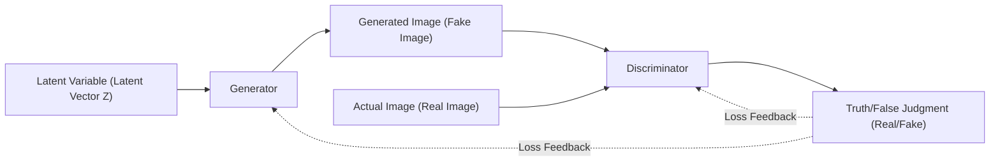
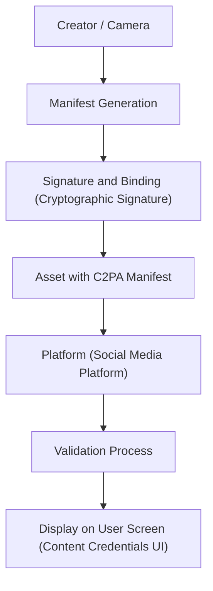

# Introduction: The Era Where the Boundary Between Reality and Fiction Melts

In the 2020s, the evolution of Generative AI has been progressing at an unprecedented speed. It is now possible to generate content—text, audio, images, and even videos—that is indistinguishable from what humans create, in just a few seconds. While this technological leap brings tremendous benefits to creative fields, it has also created a serious social threat: the flood of sophisticated forged content known as "Deepfakes."

Deepfakes threaten society in various forms, such as fake speeches by politicians, scams impersonating corporate CEOs (an evolution of BEC scams), and pornography that defames celebrities. Especially during election periods, the spread of fake news via deepfakes has escalated to a point where it shakes the very foundation of democracy.

In such an era, what is required of us is an update to our "information literacy." The common sense of "believing what you see with your own eyes" is no longer valid. In this article, starting from the technical background of how deepfakes are generated, we will explain at a very deep level—incorporating mathematical formulas and code—the cutting-edge digital forensic techniques to "technically" detect them, and the frameworks (such as C2PA) for society as a whole to counter fake information.

---

# 1. The Mechanisms of Generative AI Supporting Deepfakes

To understand deepfakes, you must first know the mechanisms of the generative AI that forms their foundation. Currently, the two representative architectures used for generating high-definition images and videos are "GAN (Generative Adversarial Networks)" and "Diffusion Models."

## 1.1 Generative Adversarial Networks (GAN)

Proposed by Ian Goodfellow and others in 2014, GANs ignited the deepfake technology trend. In a GAN, two neural networks take on roles like a "forger" and a "police officer," and by competing with each other (adversarial training), they generate extremely realistic data.

- **Generator ($G$)**: Takes random noise (latent variable $z$) as input and generates data (such as images) that looks exactly like the real thing.
- **Discriminator ($D$)**: Determines whether the inputted data is "Real" coming from an actual dataset or "Fake" created by the generator.

These two networks proceed with training to optimize a loss function formulated as the following Minimax game:

$$
\min_G \max_D V(D, G) = \mathbb{E}_{x \sim p_{data}(x)}[\log D(x)] + \mathbb{E}_{z \sim p_{z}(z)}[\log(1 - D(G(z)))]
$$

Here, $x$ is real data, and $z$ is a latent variable (noise). The discriminator $D$ tries to maximize this formula (accurately distinguishing between real and fake), and the generator $G$ tries to minimize it (fooling the discriminator). When this training reaches an equilibrium state (Nash equilibrium), the generator becomes able to generate data indistinguishable from the real thing.



## 1.2 Diffusion Models

In recent years, "Diffusion Models" have emerged as the foundational technology for Midjourney and Stable Diffusion, boasting image quality and stability that surpass GANs. A diffusion model consists of a "forward diffusion process," which gradually adds noise to data, and a "reverse diffusion process," which restores the original data from noise.

In the **Forward Process**, Gaussian noise is added step by step over time $t$ to a clean image $x_0$. This process is expressed as a Markov chain with the following formula:

$$
q(x_t | x_{t-1}) = \mathcal{N}(x_t; \sqrt{1 - \beta_t} x_{t-1}, \beta_t \mathbf{I})
$$

Here, $\beta_t$ is a schedule parameter that controls the variance of the noise. After a sufficient number of steps $T$, $x_T$ becomes complete random noise.

In the **Reverse Process**, a neural network (usually a U-Net architecture) learns to predict the noise from the noisy image $x_t$ and restore the previous step $x_{t-1}$. By combining this process with conditioning (such as text prompts), it becomes possible to generate any image from zero (noise).

---

# 2. Digital Forensics: Techniques to Search for Traces of Generated Artifacts

No matter how advanced generative models become, "mathematical and statistical traces (artifacts)" invisible to humans always remain in AI-generated data. Detection technologies (deepfake detectors) capture these subtle traces through various approaches.

## 2.1 Frequency Domain Analysis and DCT (Discrete Cosine Transform)

Human eyes are sensitive to spatial changes (spatial domain) in an image's color and brightness, but insensitive to frequency changes (frequency domain). Images generated by GANs or diffusion models, even if they look perfect at first glance, produce peculiar frequency patterns (such as checkerboard artifacts) during the upsampling process (enlargement from low to high resolution).

To detect this, the **Discrete Cosine Transform (DCT)** is often used. DCT represents an image as a sum of cosine waves of different frequencies. The formula for the 2D DCT is as follows:

$$
X_{k_1, k_2} = \sum_{n_1=0}^{N_1-1} \sum_{n_2=0}^{N_2-1} x_{n_1, n_2} \cos\left[\frac{\pi}{N_1}\left(n_1 + \frac{1}{2}\right)k_1\right] \cos\left[\frac{\pi}{N_2}\left(n_2 + \frac{1}{2}\right)k_2\right]
$$

Generated images tend to have an abnormal energy distribution in the **high-frequency components (fine noise and abrupt edge changes)** compared to natural images. The following Python code is a simple example of extracting the energy of high-frequency components from an image using DCT.

```python
import cv2
import numpy as np
import scipy.fftpack

def extract_high_frequency_features(image_path):
    # Load image and convert to grayscale
    img = cv2.imread(image_path, cv2.IMREAD_GRAYSCALE)
    if img is None:
        raise ValueError("Image not found")
    
    # Apply 2D Discrete Cosine Transform (DCT)
    # First apply 1D DCT to rows, then 1D DCT to columns
    dct_result = scipy.fftpack.dct(scipy.fftpack.dct(img.T, norm='ortho').T, norm='ortho')
    
    # Extract high-frequency components (mask the top-left low-frequency components to zero)
    rows, cols = dct_result.shape
    mask = np.ones((rows, cols))
    
    # Mask the low-frequency region (10% of the whole)
    mask[:int(rows*0.1), :int(cols*0.1)] = 0
    
    high_freq_features = dct_result * mask
    
    # Calculate the amount of energy in the high-frequency region
    energy = np.sum(np.abs(high_freq_features))
    
    return energy

# Comparing natural images with generated images often reveals a statistically significant difference in the energy value
```

This unnaturalness in the frequency domain arises because while AI can learn "local consistency at the pixel level," it struggles to perfectly mimic the "global frequency characteristics of the entire image."

---

# 3. Detection of Biological [Signals](https://kenji.blog/en/p/state-management-history-future/): Confirming the "Beat of Life" via rPPG

In addition to detection technologies for images (still images), a groundbreaking approach to deepfake detection in videos is the **extraction of biological signals**.

As long as a human is alive, blood circulates through the body in sync with the heartbeat. Because hemoglobin in the blood absorbs specific wavelengths (especially green light, around 530nm) well, the color of the facial skin changes minutely (at a level invisible to the human eye) in time with the heartbeat. The technology that uses this principle to estimate the heart rate contactlessly from standard RGB camera video is called **rPPG (remote Photoplethysmography)**.

The basic rPPG model based on light absorption and reflection is expressed by the Beer-Lambert law as follows:

$$
I(t) = I_0(t) e^{-\left( \mu_{dc} + \mu_{ac}(t) \right) d}
$$

Here, $I(t)$ is the light intensity observed by the camera, $I_0(t)$ is the light source intensity, $\mu_{dc}$ is the static light absorption coefficient by tissue, $\mu_{ac}(t)$ is the dynamic light absorption coefficient due to blood flow fluctuation (heartbeat), and $d$ is the path length of the light.

Deepfake videos (such as FaceSwap, which swaps faces, or Lip-sync, which matches lip movements to audio) pursue visual realism on a frame-by-frame basis, but **they cannot reproduce the minute blood flow changes (heartbeat signals) along the time axis.** Therefore, when attempting to extract an rPPG signal from a deepfake video, one obtains a noisy, unnatural signal that differs from the regular rhythm of a natural human heart rate (typically in the range of 60-100 bpm).


Below is a conceptual implementation example of a pipeline for extracting rPPG signals from video using Python.

```python
import cv2
import numpy as np
from scipy import signal

def extract_rppg_signal(video_path):
    cap = cv2.VideoCapture(video_path)
    green_signals = []
    
    while cap.isOpened():
        ret, frame = cap.read()
        if not ret:
            break
            
        # 1. Face detection and extraction of ROI (Region of Interest: e.g., forehead or cheeks)
        # roi = detect_face_and_extract_roi(frame)
        # Here, for simplicity, the central part of the entire frame is used as the ROI
        h, w = frame.shape[:2]
        roi = frame[int(h*0.3):int(h*0.6), int(w*0.4):int(w*0.6)]
        
        # 2. Extract Green channel from RGB space
        # Because hemoglobin in the blood absorbs green light the most
        g_channel = roi[:, :, 1]
        
        # 3. Spatial pooling (calculating the mean value)
        mean_g = np.mean(g_channel)
        green_signals.append(mean_g)
        
    cap.release()
    
    if len(green_signals) == 0:
        return None
        
    # 4. Noise removal with a bandpass filter
    # Extract the human heart rate frequency band (e.g., 0.7Hz - 2.5Hz = 42 - 150 bpm)
    fps = 30.0 # Assumed frame rate
    nyquist = 0.5 * fps
    low = 0.7 / nyquist
    high = 2.5 / nyquist
    b, a = signal.butter(3, [low, high], btype='bandpass')
    filtered_signal = signal.filtfilt(b, a, green_signals)
    
    return filtered_signal

# By analyzing the frequency spectrum of the extracted filtered_signal,
# if no clear peak (heartbeat) exists, it is determined that the probability of it being a deepfake is high.
```

---

# 4. The Never-ending "Cat-and-Mouse Game": Adversarial Training and Evasion Techniques

As introduced so far, advanced forensic techniques such as frequency analysis and biological signals (rPPG) do exist. However, in the world of AI, there is no "absolute barrier." As soon as a detection technology is published in a paper, attackers (deepfake creators) immediately improve their generative models to evade that detector.

For example, suppose a detector identifies deepfakes by detecting "anomalies in the frequency domain." Attackers will **incorporate this detector itself as the "Discriminator" of a new GAN** and retrain the Generator. Then, the Generator evolves to output "images that are indistinguishable from natural images even in the frequency domain."

Furthermore, there are already reports of research (Anti-Forensics) attempting to fool rPPG-based detection systems by intentionally adding artificial "minute color fluctuations (fake heartbeat signals)" to videos in post-processing.

Detection and generation are truly engaged in a never-ending cat-and-mouse game of "shield and spear." For this reason, it is pointed out that the approach of judging authenticity by retrospectively analyzing only the output data (images and videos) (passive detection) will eventually reach its limit.

---

# 5. Fundamental Countermeasures: Provenance Proof and the C2PA Framework

As retrospective detection approaches its limits, an active defense approach that cryptographically guarantees the "Provenance" of data is rapidly being promoted worldwide. Constructing the global standard framework for this is the **C2PA (Coalition for Content Provenance and Authenticity)**.

C2PA is a consortium established with the participation of major companies such as Adobe, Microsoft, Intel, BBC, and Sony. It defines technical specifications to embed the provenance of digital content (who shot it, when, with which camera, and what edits were made) directly into the content itself in a tamper-evident manner.

## 5.1 How C2PA Works

The core technologies of C2PA are digital signatures using Public Key Infrastructure (PKI) and content hash binding.

1. **Manifest Generation (Manifest)**: The moment a photo is taken with a camera, or when it is edited with software, a metadata called a "Manifest" is generated, which includes the operation history, device information, and creator information.
2. **[Crypto](https://kenji.blog/en/p/cryptocurrency-and-bitcoin/)graphic Signature (Digital Signature)**: A digital signature is applied to the Manifest and the hash value of the image itself (a summary of the pixel data) using a hardware or software private key.
3. **Embedding in the Asset**: The signed Manifest (C2PA credential) is embedded in the header information of file formats like JPEG or MP4.

If an attacker attempts to tamper with a part of the image or attach fake metadata to an AI-generated image, the hash value of the image itself will change, causing the digital signature verification to fail and instantly revealing the tampering.



## 5.2 Visualization with the "Content Credentials" Icon

In systems compliant with the C2PA standard, when users view images on social media or news sites, an icon reading "CR (Content Credentials)" is displayed in the corner of the image. By clicking this, anyone can transparently check the history of the image, such as whether it was "generated by AI," "shot with an actual camera," or "color-corrected in Photoshop."

Currently, major AI vendors like OpenAI (DALL-E 3) and Google have started attaching C2PA metadata to generated images, and camera manufacturers like Leica and Sony are proceeding to implement C2PA signature functions at the hardware level. The paradigm of society is shifting from "detecting fakes" to "proving authenticity (Zero-Trust approach)."

---

# 6. Next-Generation Information Literacy: What We Can Do

Technical countermeasures (such as deepfake detectors or provenance proofs like C2PA) are merely infrastructure to protect society. Ultimately, it is our human brains that decide whether to consume and spread information.

"Information literacy" in the AI era means adopting the following attitudes:

1. **Avoid Reflexive Spreading (Stop and Think)**
   Especially when exposed to shocking footage or content that incites anger (information appealing to emotions), stop for a moment and halt your hands from reposting or sharing. The primary goal of deepfake creators is to hack human emotions and make the information spread.
2. **Verify the Source of the Information (Verify the Source)**
   Is the information transmitted by a reliable news organization? Is it accompanied by a provenance proof (Content Credentials) like C2PA? It is crucial to develop the habit of cross-checking information sources.
3. **Healthy Skepticism that "Everything Might be Fake" (Healthy Skepticism)**
   There is no need to become pessimistic, but the old common sense of "video = fact" must be discarded. We must consume information with the premise that audio, video, and text can all be easily forged in this era.

# Conclusion

The evolution of AI technology has opened Pandora's box. It is no longer possible to erase the technology itself that creates deepfakes.

However, as explained in this article, engineers are confronting the threat of fake news with a variety of approaches, such as frequency analysis, biological signal detection, and provenance proof (C2PA) using cryptography. By combining these technical shields (defenses) with the social shield of "information literacy" that each of us possesses, we should be able to navigate the wave of fiction brought by AI and protect the value of truth.

Precisely because we are in an era where the boundary between reality and fiction is melting, the human "will" to try and discern the truth has become more important than ever.


