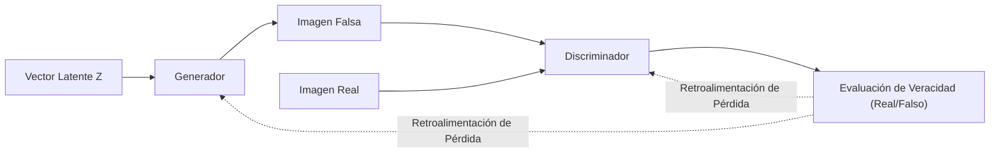
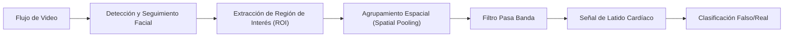
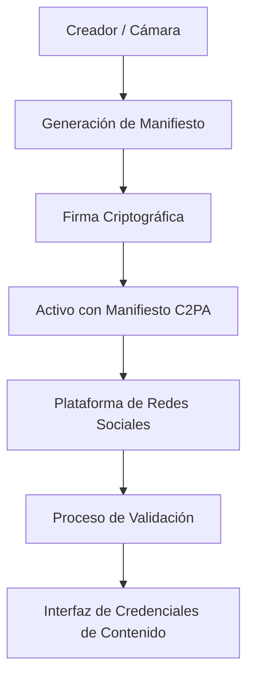

# Introducción: Una era en la que se disuelve la frontera entre la realidad y la ficción

Entrando en la década de 2020, la evolución de la IA generativa (Generative AI) avanza a una velocidad sin precedentes. Textos, audios, imágenes y hasta videos, con un nivel indistinguible de los creados por humanos, ahora se pueden generar en cuestión de segundos. Si bien este avance tecnológico aporta inmensos beneficios a los campos creativos, también ha creado una grave amenaza social: la proliferación de contenido falso y altamente sofisticado conocido como "deepfakes".

Los deepfakes amenazan a la sociedad de diversas formas: discursos falsos de políticos, estafas en las que se hacen pasar por CEOs de empresas (una evolución de las estafas BEC) o pornografía difamatoria de celebridades. Especialmente durante los períodos electorales, la propagación de noticias falsas mediante deepfakes ha escalado hasta el punto de sacudir los cimientos de la democracia.

En esta era, lo que se nos exige es una actualización de nuestra "alfabetización informacional". El sentido común de "creer en lo que ven mis propios ojos" ya no es válido. En este artículo, comenzando por el contexto técnico de cómo se generan los deepfakes, explicaremos a un nivel muy profundo, incorporando fórmulas matemáticas y código, los métodos de análisis forense digital más avanzados para detectarlos "tecnológicamente", así como los marcos (como C2PA) para que toda la sociedad contrarreste la información falsa.

---

# 1. El mecanismo de la IA generativa detrás de los deepfakes

Para entender los deepfakes, primero debemos conocer el funcionamiento de la IA generativa que los sustenta. Las dos arquitecturas principales utilizadas actualmente para generar imágenes y videos de alta definición son las "GAN" (Generative Adversarial Networks: Redes Generativas Antagónicas) y los "Diffusion Models" (Modelos de Difusión).

## 1.1 Redes Generativas Antagónicas (GAN)

Propuestas por Ian Goodfellow y sus colegas en 2014, las GAN fueron las precursoras de la tecnología deepfake. Las GAN utilizan dos redes neuronales que asumen los roles de "falsificador" y "policía", compitiendo entre sí (aprendizaje antagónico) para generar datos extremadamente realistas.

- **Generador (Generator, $G$)**: Toma un ruido aleatorio (variable latente $z$) como entrada y genera datos (como imágenes) que parecen reales.
- **Discriminador (Discriminator, $D$)**: Determina si los datos de entrada son "reales" (Real), provenientes del conjunto de datos auténtico, o "falsos" (Fake), creados por el generador.

Estas dos redes avanzan en su aprendizaje optimizando una función de pérdida formulada como el siguiente juego minimax (Minimax):

$$
\min_G \max_D V(D, G) = \mathbb{E}_{x \sim p_{data}(x)}[\log D(x)] + \mathbb{E}_{z \sim p_{z}(z)}[\log(1 - D(G(z)))]
$$

Aquí, $x$ representa los datos reales y $z$ la variable latente (ruido). El discriminador $D$ intenta maximizar esta ecuación (distinguir con precisión entre lo real y lo falso), mientras que el generador $G$ intenta minimizarla (engañar al discriminador). Cuando este aprendizaje alcanza un estado de equilibrio (equilibrio de Nash), el generador es capaz de producir datos indistinguibles de los reales.



## 1.2 Modelos de Difusión (Diffusion Models)

En los últimos años, presumiendo de una calidad de imagen y estabilidad que superan a las GAN, la tecnología subyacente de Midjourney y Stable Diffusion son los "Modelos de Difusión". Los modelos de difusión constan de un "proceso de difusión hacia adelante" (Forward Process) que añade ruido gradualmente a los datos, y un "proceso de difusión inversa" (Reverse Process) que restaura los datos originales a partir del ruido.

En el **proceso de difusión hacia adelante (Forward Process)**, se añade ruido gaussiano a una imagen limpia $x_0$ en cada paso de tiempo $t$. Este proceso se expresa como una cadena de Markov con la siguiente ecuación:

$$
q(x_t | x_{t-1}) = \mathcal{N}(x_t; \sqrt{1 - \beta_t} x_{t-1}, \beta_t \mathbf{I})
$$

Aquí, $\beta_t$ es el parámetro de programación que controla la varianza del ruido. Después de suficientes pasos $T$, $x_T$ se convierte en un ruido aleatorio completo.

En el **proceso de difusión inversa (Reverse Process)**, una red neuronal (generalmente una arquitectura U-Net) aprende a predecir el ruido a partir de la imagen ruidosa $x_t$ y a restaurar el paso anterior $x_{t-1}$. Al combinar este proceso con un condicionamiento (como un prompt de texto), es posible generar una imagen arbitraria desde cero (ruido).

---

# 2. Análisis forense digital: La técnica de buscar rastros en los productos generados

Por muy avanzados que sean los modelos generativos, los datos creados por IA siempre dejan "rastros matemáticos y estadísticos (artefactos)" imperceptibles para el ojo humano. Las tecnologías de detección (detectores de deepfakes) capturan estos rastros minúsculos a través de diversos enfoques.

## 2.1 Análisis en el dominio de la frecuencia y DCT (Transformada de Coseno Discreta)

El ojo humano es sensible a los cambios espaciales de color y brillo de una imagen (dominio espacial), pero es insensible a los cambios de frecuencia (dominio de la frecuencia). Las imágenes generadas por GAN o modelos de difusión pueden parecer perfectas a primera vista, pero durante el proceso de sobremuestreo (upsampling, de baja a alta resolución) producen patrones de frecuencia específicos (como el artefacto de tablero de ajedrez).

Para detectarlo, a menudo se utiliza la **Transformada de Coseno Discreta (Discrete Cosine Transform, DCT)**. La DCT representa una imagen como la suma de ondas coseno de diferentes frecuencias. La ecuación de la DCT bidimensional es la siguiente:

$$
X_{k_1, k_2} = \sum_{n_1=0}^{N_1-1} \sum_{n_2=0}^{N_2-1} x_{n_1, n_2} \cos\left[\frac{\pi}{N_1}\left(n_1 + \frac{1}{2}\right)k_1\right] \cos\left[\frac{\pi}{N_2}\left(n_2 + \frac{1}{2}\right)k_2\right]
$$

Las imágenes generadas tienden a tener una distribución de energía anormal en las **componentes de alta frecuencia (ruido fino y cambios bruscos en los bordes)** en comparación con las imágenes naturales. El siguiente código en Python es un ejemplo sencillo que utiliza la DCT para extraer la energía de los componentes de alta frecuencia de una imagen.

```python
import cv2
import numpy as np
import scipy.fftpack

def extract_high_frequency_features(image_path):
    # Carga de la imagen y conversión a escala de grises
    img = cv2.imread(image_path, cv2.IMREAD_GRAYSCALE)
    if img is None:
        raise ValueError("Image not found")
    
    # Aplicación de la Transformada de Coseno Discreta (DCT) bidimensional
    # Primero se aplica la DCT unidimensional a las filas, y luego a las columnas
    dct_result = scipy.fftpack.dct(scipy.fftpack.dct(img.T, norm='ortho').T, norm='ortho')
    
    # Extracción de componentes de alta frecuencia (enmascarando y poniendo a cero las bajas frecuencias arriba a la izquierda)
    rows, cols = dct_result.shape
    mask = np.ones((rows, cols))
    
    # Enmascarar la región de baja frecuencia (10% del total)
    mask[:int(rows*0.1), :int(cols*0.1)] = 0
    
    high_freq_features = dct_result * mask
    
    # Calcular la cantidad de energía en la región de alta frecuencia
    energy = np.sum(np.abs(high_freq_features))
    
    return energy

# Al comparar una imagen natural con una generada, suele haber una diferencia estadística significativa en el valor de "energy"
```

Esta falta de naturalidad en el dominio de la frecuencia ocurre porque, aunque la IA puede aprender la "coherencia local a nivel de píxel", le resulta difícil imitar por completo las "características de frecuencia globales de la imagen en su conjunto".

---

# 3. Detección de señales biológicas: Confirmando el "latido de la vida" mediante rPPG

Además de las tecnologías de detección de imágenes (imágenes fijas), un enfoque revolucionario para la detección de deepfakes en videos es la **extracción de señales biológicas (Biological Signals)**.

Mientras un humano esté vivo, la sangre circula por el cuerpo al ritmo de los latidos del corazón. Dado que la hemoglobina en la sangre absorbe fuertemente longitudes de onda específicas (especialmente la luz verde, de unos 530 nm), el color de la piel de la cara cambia de manera minúscula (a un nivel invisible para el ojo humano) en sincronía con el ritmo cardíaco. La tecnología que utiliza este principio para estimar la frecuencia cardíaca sin contacto a partir de un video de cámara RGB normal se denomina **rPPG (Fotopletismografía Remota, remote Photoplethysmography)**.

El modelo básico de rPPG, basado en la absorción y reflexión de la luz, se expresa según la ley de Beer-Lambert de la siguiente manera:

$$
I(t) = I_0(t) e^{-\left( \mu_{dc} + \mu_{ac}(t) \right) d}
$$

Aquí, $I(t)$ es la intensidad de la luz observada por la cámara, $I_0(t)$ es la intensidad de la fuente de luz, $\mu_{dc}$ es el coeficiente estático de absorción de la luz por los tejidos, $\mu_{ac}(t)$ es el coeficiente dinámico de absorción de la luz debido a la fluctuación del flujo sanguíneo (latido cardíaco), y $d$ es la longitud de la trayectoria de la luz.

Los videos deepfake (por ejemplo, el intercambio de rostros conocido como FaceSwap, o sincronizar el movimiento de los labios con un audio en Lip-sync) persiguen el realismo visual fotograma a fotograma, pero **no pueden reproducir los minúsculos cambios en el flujo sanguíneo (señal cardíaca) a lo largo del eje temporal.** Por lo tanto, si se intenta extraer una señal de rPPG de un video deepfake, se obtendrá una señal antinatural y llena de ruido, muy diferente de un ritmo cardíaco humano natural (que normalmente es un ciclo regular en el rango de 60 a 100 lpm).



A continuación se muestra un ejemplo de implementación conceptual en Python de una canalización (pipeline) para extraer señales rPPG de un video.

```python
import cv2
import numpy as np
from scipy import signal

def extract_rppg_signal(video_path):
    cap = cv2.VideoCapture(video_path)
    green_signals = []
    
    while cap.isOpened():
        ret, frame = cap.read()
        if not ret:
            break
            
        # 1. Detección facial y extracción del ROI (Región de Interés: por ejemplo, frente o mejilla)
        # roi = detect_face_and_extract_roi(frame)
        # Aquí, para simplificar, se toma la parte central del fotograma entero como ROI
        h, w = frame.shape[:2]
        roi = frame[int(h*0.3):int(h*0.6), int(w*0.4):int(w*0.6)]
        
        # 2. Extracción del canal Verde desde el espacio RGB
        # Porque la hemoglobina de la sangre es la que más absorbe la luz verde
        g_channel = roi[:, :, 1]
        
        # 3. Agrupamiento espacial (cálculo del valor medio)
        mean_g = np.mean(g_channel)
        green_signals.append(mean_g)
        
    cap.release()
    
    if len(green_signals) == 0:
        return None
        
    # 4. Eliminación de ruido mediante filtro pasa banda
    # Extracción de la banda de frecuencia del latido cardíaco humano (ej: 0.7Hz a 2.5Hz = 42 a 150 bpm)
    fps = 30.0 # Frecuencia de fotogramas (frame rate) hipotética
    nyquist = 0.5 * fps
    low = 0.7 / nyquist
    high = 2.5 / nyquist
    b, a = signal.butter(3, [low, high], btype='bandpass')
    filtered_signal = signal.filtfilt(b, a, green_signals)
    
    return filtered_signal

# Se analiza el espectro de frecuencia de la 'filtered_signal' extraída y,
# si no hay un pico claro (latido cardíaco), se determina que es muy probable que sea un deepfake.
```

---

# 4. El interminable juego del "gato y el ratón": Aprendizaje antagónico y técnicas de evasión

Como hemos presentado, existen tecnologías forenses avanzadas como el análisis de frecuencia y las señales biológicas (rPPG). Sin embargo, en el mundo de la IA, no existe una "barrera absoluta". Cuando se publica un artículo científico sobre una tecnología de detección, los atacantes (los creadores de deepfakes) mejoran inmediatamente sus modelos generativos para evadir ese detector.

Por ejemplo, supongamos que un detector descubre un deepfake identificando "anomalías en el dominio de la frecuencia". El atacante **incorporará ese mismo detector como un nuevo "Discriminador" de su GAN**, y volverá a entrenar el Generador. Entonces, el Generador evolucionará para generar imágenes que sean "indistinguibles de las imágenes naturales, incluso en el dominio de la frecuencia".

Además, ya se han reportado investigaciones (Anti-Forensics) que intentan engañar a los sistemas de detección basados en rPPG agregando intencionalmente "fluctuaciones microscópicas de color (señales cardíacas falsas)" artificiales al video durante el posprocesamiento.

La detección y la generación están literalmente envueltas en un interminable juego del gato y el ratón (Cat-and-Mouse Game) de "el escudo y la lanza". Por este motivo, se señala que un enfoque basado únicamente en analizar los datos de salida (imágenes o videos) a posteriori para determinar su autenticidad (detección pasiva) terminará llegando a su límite.

---

# 5. La medida fundamental: Certificación de procedencia y el marco C2PA

A medida que la detección a posteriori llega a su límite, lo que se está promoviendo rápidamente en todo el mundo es un enfoque defensivo activo que garantice criptográficamente el "origen (Provenance)" de los datos. La Coalición **C2PA (Coalition for Content Provenance and Authenticity)** es la encargada de construir el marco de referencia mundial para ello.

C2PA es un consorcio fundado por empresas líderes como Adobe, Microsoft, Intel, BBC y Sony, que ha desarrollado especificaciones técnicas para incrustar el historial de procedencia del contenido digital (quién, cuándo, con qué cámara se tomó y qué ediciones se han realizado) en el contenido mismo de una forma inalterable.

## 5.1 Cómo funciona C2PA

La tecnología central de C2PA es la firma digital mediante Infraestructura de Clave Pública (PKI) y el enlace (binding) de los hashes del contenido.

1. **Generación de metadatos (Manifest)**: En el momento en que se toma una foto con una cámara, o cuando se edita con software, se genera un metadato llamado "Manifiesto (Manifest)" que incluye el historial de esas acciones, la información del dispositivo y la información del creador.
2. **Firma criptográfica (Digital Signature)**: Se aplica una firma digital sobre el Manifiesto y sobre el valor hash de la propia imagen (un resumen de los datos de los píxeles), utilizando claves privadas de hardware o software.
3. **Incrustación en el activo (Asset)**: El manifiesto firmado (C2PA Credential) se incrusta en la información de la cabecera del formato del archivo, como JPEG o MP4.

Si un atacante altera parte de la imagen o intenta añadir metadatos falsos a una imagen generada por IA, el valor hash de la propia imagen cambiará, por lo que fallará la verificación de la firma digital y la manipulación se detectará al instante.



## 5.2 Visualización mediante el icono "Content Credentials"

En los sistemas que cumplen con el estándar C2PA, cuando los usuarios ven una imagen en redes sociales o sitios de noticias, aparecerá un icono "CR (Content Credentials)" en la esquina de la imagen. Al hacer clic en él, cualquier persona puede verificar de forma transparente el historial de la imagen: si "fue generada por IA", "fue tomada por una cámara real" o "si se ajustó el color en Photoshop".

Actualmente, los principales proveedores de IA, como OpenAI (DALL-E 3) y Google, han comenzado a adjuntar metadatos C2PA a las imágenes que generan, y fabricantes de cámaras como Leica y Sony también están avanzando en la implementación de funciones de firma C2PA a nivel de hardware. El paradigma de la sociedad está cambiando de "detectar lo falso" a "probar que es auténtico (enfoque de Zero-Trust)".

---

# 6. Alfabetización informacional de próxima generación: Lo que podemos hacer nosotros

Las medidas tecnológicas (detectores de deepfakes y la certificación de procedencia como C2PA) son solo una infraestructura para proteger a la sociedad. Quien finalmente decide si consumir o difundir la información es el cerebro humano.

En la era de la IA, la "alfabetización informacional" de próxima generación implica tener las siguientes actitudes:

1. **Evitar la difusión impulsiva (Stop and Think)**
   Cuando te encuentres con imágenes impactantes o contenidos que provoquen ira (información que apela a las emociones), debes detenerte un momento y evitar dar retuit o compartir inmediatamente. El objetivo principal de los creadores de deepfakes es "hackear" las emociones humanas para difundir información.
2. **Verificar el "origen" de la información (Verify the Source)**
   ¿La información proviene de un medio de comunicación confiable? ¿Se le ha adjuntado una prueba de procedencia como C2PA (Content Credentials)? Es importante cultivar el hábito de cotejar (cross-check) la fuente de la información.
3. **Escepticismo saludable de que "todo podría ser falso" (Healthy Skepticism)**
   No es necesario ser pesimista, pero debemos descartar el sentido común del pasado que decía "el video es igual a los hechos". Tenemos que consumir la información asumiendo que vivimos en una era en la que todo —audio, video y texto— puede falsificarse fácilmente.

# Conclusión

La evolución de la tecnología de IA ha abierto la caja de Pandora. Ya es imposible erradicar la tecnología en sí que genera los deepfakes.

Sin embargo, como se explicó en este artículo, los ingenieros están enfrentando la amenaza de las noticias falsas a través de diversos enfoques, como el análisis de frecuencia, la detección de señales biológicas y la certificación de procedencia basada en criptografía (C2PA). Al combinar este "escudo técnico (medidas defensivas)" con el "escudo social" que es la "alfabetización informacional" de cada uno de nosotros, deberíamos ser capaces de surfear la ola de ficciones que trae la IA y proteger el valor de la verdad.

Precisamente porque vivimos en una era en la que la línea entre la realidad y la ficción se desvanece, la "voluntad" humana de intentar discernir la verdad se vuelve más importante que nunca.

