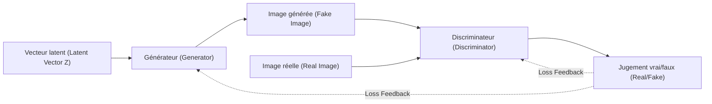
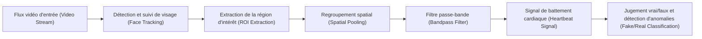
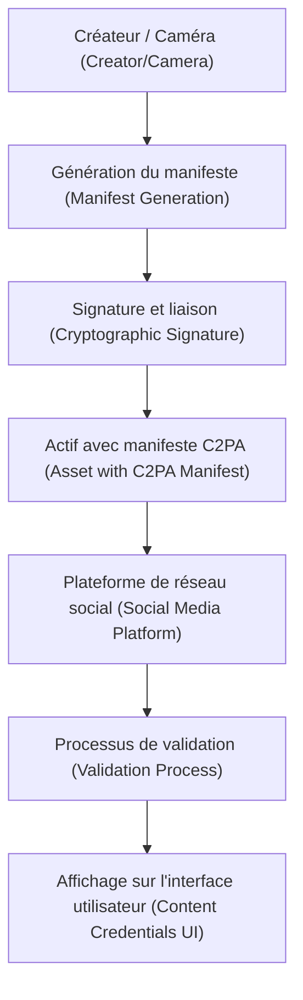

# Introduction : L'ère où la frontière entre réalité et fiction s'estompe

Dans les années 2020, l'évolution de l'IA générative (Generative AI) progresse à un rythme sans précédent. Qu'il s'agisse de textes, de voix, d'images ou même de vidéos, il est désormais possible de générer en quelques secondes du contenu indiscernable de celui créé par des humains. Si cette avancée technologique apporte d'immenses bénéfices dans les domaines créatifs, elle engendre également une menace sociale majeure : l'inondation de contenus falsifiés sophistiqués appelés "deepfakes" (Deepfake).

Les deepfakes menacent la société sous diverses formes, telles que de faux discours d'hommes politiques, des escroqueries se faisant passer pour des PDG d'entreprises (une évolution des arnaques au président BEC), ou de la pornographie diffamatoire envers des célébrités. En particulier lors des périodes électorales, la diffusion de fake news par le biais de deepfakes a évolué au point d'ébranler les fondements mêmes de la démocratie.

À notre époque, ce qui nous est demandé, c'est une mise à jour de notre "littératie de l'information". L'idée reçue selon laquelle "il faut croire ce que l'on voit de ses propres yeux" n'est plus valable. Dans cet article, en commençant par le contexte technique de la façon dont les deepfakes sont générés, nous expliquerons à un niveau extrêmement approfondi, en utilisant des formules mathématiques et du code, les méthodes de criminalistique numérique (digital forensics) de pointe pour les détecter "techniquement", ainsi que les cadres (comme la C2PA) pour lutter contre la désinformation à l'échelle de la société.

---

# 1. Les mécanismes de l'IA générative derrière les deepfakes

Pour comprendre les deepfakes, il faut d'abord connaître le fonctionnement de l'IA générative qui en est la base. Actuellement, les deux architectures représentatives utilisées pour la génération d'images et de vidéos en haute définition sont les "GAN" (Generative Adversarial Networks : Réseaux antagonistes génératifs) et les "Diffusion Models" (Modèles de diffusion).

## 1.1 Réseaux antagonistes génératifs (GAN)

Proposés par Ian Goodfellow et ses collègues en 2014, les GAN ont été les éléments déclencheurs de la technologie deepfake. Un GAN est constitué de deux réseaux de neurones jouant les rôles de "faussaire" et de "policier", qui s'affrontent (apprentissage antagoniste) pour générer des données extrêmement réalistes.

- **Générateur (Generator, $G$)** : Prend en entrée un bruit aléatoire (variable latente $z$) et génère des données ressemblant à de vraies (comme des images).
- **Discriminateur (Discriminator, $D$)** : Détermine si les données en entrée sont "réelles" (Real), provenant d'un jeu de données réel, ou "fausses" (Fake), créées par le générateur.

Ces deux réseaux s'entraînent en optimisant une fonction de perte (loss function) formulée comme le jeu minimax (Minimax) suivant.

$$
\min_G \max_D V(D, G) = \mathbb{E}_{x \sim p_{data}(x)}[\log D(x)] + \mathbb{E}_{z \sim p_{z}(z)}[\log(1 - D(G(z)))]
$$

Ici, $x$ correspond aux données réelles et $z$ à la variable latente (bruit). Le discriminateur $D$ cherche à maximiser cette équation (distinguer avec précision le vrai du faux), tandis que le générateur $G$ cherche à la minimiser (tromper le discriminateur). Lorsque cet apprentissage atteint un état d'équilibre (équilibre de Nash), le générateur est capable de produire des données indiscernables des vraies.



## 1.2 Modèles de diffusion (Diffusion Models)

Ces dernières années, surpassant les GAN en termes de qualité d'image et de stabilité, les "modèles de diffusion" sont devenus la technologie de base de Midjourney et Stable Diffusion. Les modèles de diffusion se composent d'un "processus de diffusion vers l'avant" ajoutant progressivement du bruit aux données, et d'un "processus de diffusion inverse" restaurant les données à partir du bruit.

Dans le **processus de diffusion vers l'avant (Forward Process)**, un bruit gaussien est ajouté à une image nette $x_0$ à chaque pas de temps $t$. Ce processus est représenté sous la forme d'une chaîne de Markov par l'équation suivante.

$$
q(x_t | x_{t-1}) = \mathcal{N}(x_t; \sqrt{1 - \beta_t} x_{t-1}, \beta_t \mathbf{I})
$$

Ici, $\beta_t$ est un paramètre de planification contrôlant la variance du bruit. Après un nombre suffisant d'étapes $T$, $x_T$ devient un bruit aléatoire complet.

Dans le **processus de diffusion inverse (Reverse Process)**, un réseau de neurones (généralement une architecture U-Net) apprend à prédire le bruit à partir de l'image bruitée $x_t$ et à restaurer l'étape précédente $x_{t-1}$. En combinant ce processus avec un conditionnement (comme une invite textuelle), il devient possible de générer n'importe quelle image à partir de zéro (du bruit).

---

# 2. Criminalistique numérique : Techniques pour trouver les traces des productions

Quelle que soit la sophistication des modèles génératifs, les données générées par l'IA conservent toujours des "traces mathématiques et statistiques (artefacts)" invisibles pour l'homme. Les technologies de détection (détecteurs de deepfakes) capturent ces traces infimes par diverses approches.

## 2.1 Analyse du domaine fréquentiel et DCT (Transformée en cosinus discrète)

L'œil humain est sensible aux changements spatiaux de couleur et de luminosité d'une image (domaine spatial), mais insensible aux changements de fréquences (domaine fréquentiel). Bien que les images générées par des GAN ou des modèles de diffusion puissent sembler parfaites au premier coup d'œil, le processus de suréchantillonnage (agrandissement de la basse à la haute résolution) produit des motifs fréquentiels spécifiques (comme l'artefact en damier).

Pour détecter cela, on utilise couramment la **Transformée en cosinus discrète (Discrete Cosine Transform, DCT)**. La DCT représente une image comme la somme d'ondes cosinusoïdales de différentes fréquences. L'équation de la DCT bidimensionnelle est la suivante.

$$
X_{k_1, k_2} = \sum_{n_1=0}^{N_1-1} \sum_{n_2=0}^{N_2-1} x_{n_1, n_2} \cos\left[\frac{\pi}{N_1}\left(n_1 + \frac{1}{2}\right)k_1\right] \cos\left[\frac{\pi}{N_2}\left(n_2 + \frac{1}{2}\right)k_2\right]
$$

Comparées aux images naturelles, les images générées ont tendance à présenter une distribution d'énergie anormale dans les **composantes à haute fréquence (bruit fin et changements brusques des contours)**. Le code Python suivant est un exemple simple utilisant la DCT pour extraire l'énergie des composantes à haute fréquence d'une image.

```python
import cv2
import numpy as np
import scipy.fftpack

def extract_high_frequency_features(image_path):
    # Chargement de l'image et conversion en niveaux de gris
    img = cv2.imread(image_path, cv2.IMREAD_GRAYSCALE)
    if img is None:
        raise ValueError("Image non trouvée")
    
    # Application de la transformée en cosinus discrète 2D (DCT)
    # On applique d'abord une DCT 1D sur les lignes, puis sur les colonnes
    dct_result = scipy.fftpack.dct(scipy.fftpack.dct(img.T, norm='ortho').T, norm='ortho')
    
    # Extraction des composantes à haute fréquence (masquage à zéro des basses fréquences en haut à gauche)
    rows, cols = dct_result.shape
    mask = np.ones((rows, cols))
    
    # Masquage de la région basse fréquence (10% de l'ensemble)
    mask[:int(rows*0.1), :int(cols*0.1)] = 0
    
    high_freq_features = dct_result * mask
    
    # Calcul de la quantité d'énergie de la région haute fréquence
    energy = np.sum(np.abs(high_freq_features))
    
    return energy

# En comparant des images naturelles et générées, une différence statistiquement significative de la valeur d'energy apparaît souvent
```

Ce manque de naturel dans le domaine fréquentiel survient car, bien que l'IA puisse apprendre la "cohérence locale au niveau des pixels", il lui est difficile de reproduire parfaitement les "caractéristiques fréquentielles globales de l'image entière".

---

# 3. Détection des signaux biométriques : Vérification du "battement de la vie" par rPPG

En plus des technologies de détection d'images (fixes), l'**extraction des signaux biométriques (Biological Signals)** constitue une approche révolutionnaire pour la détection de deepfakes dans les vidéos.

Tant qu'un être humain est en vie, son sang circule dans son corps au rythme des battements de son cœur. L'hémoglobine présente dans le sang absorbant bien certaines longueurs d'onde (notamment la lumière verte, environ 530 nm), la couleur de la peau du visage subit des changements minimes (invisibles à l'œil nu) synchronisés avec le rythme cardiaque. La technologie permettant d'estimer de manière non tactile la fréquence cardiaque à partir de la vidéo d'une caméra RGB ordinaire en utilisant ce principe est appelée **rPPG (Photopléthysmographie à distance, remote Photoplethysmography)**.

Le modèle de base de la rPPG, fondé sur l'absorption et la réflexion de la lumière, s'exprime selon la loi de Beer-Lambert de la manière suivante.

$$
I(t) = I_0(t) e^{-\left( \mu_{dc} + \mu_{ac}(t) \right) d}
$$

Ici, $I(t)$ est l'intensité lumineuse observée par la caméra, $I_0(t)$ l'intensité de la source lumineuse, $\mu_{dc}$ le coefficient d'absorption lumineuse des tissus statiques, $\mu_{ac}(t)$ le coefficient d'absorption dynamique dû aux variations du flux sanguin (battement cardiaque), et $d$ la longueur du trajet optique.

Les vidéos deepfake (comme le FaceSwap qui remplace les visages, ou le Lip-sync qui synchronise le mouvement des lèvres avec l'audio) recherchent le réalisme visuel image par image, mais **ne peuvent reproduire les infimes variations du flux sanguin (signaux cardiaques) le long de l'axe temporel**. Par conséquent, si l'on tente d'extraire un signal rPPG d'une vidéo deepfake, on obtient un signal non naturel et bruité, différent d'une fréquence cardiaque humaine normale (habituellement un cycle régulier dans la plage de 60 à 100 bpm).



Voici un exemple conceptuel d'implémentation d'un pipeline d'extraction de signaux rPPG à partir d'une vidéo en utilisant Python.

```python
import cv2
import numpy as np
from scipy import signal

def extract_rppg_signal(video_path):
    cap = cv2.VideoCapture(video_path)
    green_signals = []
    
    while cap.isOpened():
        ret, frame = cap.read()
        if not ret:
            break
            
        # 1. Détection de visage et extraction de la ROI (Région d'intérêt : par exemple le front ou les joues)
        # roi = detect_face_and_extract_roi(frame)
        # Ici, pour simplifier, la partie centrale de toute l'image est utilisée comme ROI
        h, w = frame.shape[:2]
        roi = frame[int(h*0.3):int(h*0.6), int(w*0.4):int(w*0.6)]
        
        # 2. Extraction du canal Vert (Green) de l'espace RGB
        # Car l'hémoglobine dans le sang absorbe le plus la lumière verte
        g_channel = roi[:, :, 1]
        
        # 3. Regroupement spatial (calcul de la valeur moyenne)
        mean_g = np.mean(g_channel)
        green_signals.append(mean_g)
        
    cap.release()
    
    if len(green_signals) == 0:
        return None
        
    # 4. Suppression du bruit avec un filtre passe-bande
    # Extraction de la bande de fréquence cardiaque humaine (ex: 0.7Hz à 2.5Hz = 42 à 150 bpm)
    fps = 30.0 # Fréquence d'images hypothétique
    nyquist = 0.5 * fps
    low = 0.7 / nyquist
    high = 2.5 / nyquist
    b, a = signal.butter(3, [low, high], btype='bandpass')
    filtered_signal = signal.filtfilt(b, a, green_signals)
    
    return filtered_signal

# Le spectre fréquentiel du filtered_signal extrait est analysé,
# en l'absence de pic clair (battement cardiaque), la probabilité de deepfake est jugée élevée.
```

---

# 4. Le jeu du chat et de la souris sans fin : Apprentissage antagoniste et techniques d'évasion

Comme présenté jusqu'ici, il existe des technologies de criminalistique avancées telles que l'analyse fréquentielle et les signaux biométriques (rPPG). Cependant, dans le monde de l'IA, il n'existe pas de "barrière absolue". Dès qu'une technologie de détection est publiée dans un article de recherche, les attaquants (créateurs de deepfakes) améliorent immédiatement leurs modèles génératifs pour contourner ce détecteur.

Par exemple, supposons qu'un détecteur identifie un deepfake en repérant une "anomalie dans le domaine fréquentiel". L'attaquant va alors **intégrer ce détecteur même comme nouveau "Discriminateur (Discriminator)" d'un GAN**, et réentraîner le Générateur (Generator). Le générateur va ainsi évoluer pour produire "des images indiscernables des images naturelles, même dans le domaine fréquentiel".

De plus, des études ont déjà rapporté des tentatives de tromper les systèmes de détection basés sur la rPPG (Anti-Forensics) en ajoutant intentionnellement de "minuscules fluctuations de couleur (faux signaux cardiaques)" en post-traitement à la vidéo.

La détection et la génération se livrent un jeu du chat et de la souris (Cat-and-Mouse Game) sans fin, tel "le bouclier et la lance". C'est pourquoi on souligne que l'approche consistant à juger de l'authenticité a posteriori en analysant uniquement les données produites (images ou vidéos) (détection passive) atteindra tôt ou tard ses limites.

---

# 5. La solution fondamentale : Preuve de provenance et le cadre de la C2PA

Face aux limites de la détection a posteriori, une approche de défense active garantissant cryptographiquement la "provenance (Provenance)" des données est actuellement promue rapidement à travers le monde. Le cadre de normalisation mondiale à cet effet est la **C2PA (Coalition for Content Provenance and Authenticity)**.

La C2PA est un consortium fondé avec la participation d'entreprises majeures telles qu'Adobe, Microsoft, Intel, la BBC et Sony. Elle élabore des spécifications techniques pour intégrer l'historique du contenu numérique (qui a filmé, quand, avec quelle caméra, et quelles modifications ont été apportées) directement dans le contenu, d'une manière impossible à falsifier.

## 5.1 Le fonctionnement de la C2PA

La technologie centrale de la C2PA repose sur des signatures numériques utilisant une infrastructure à clé publique (PKI) et sur la liaison (binding) de hachages de contenu.

1. **Génération de métadonnées (Manifest)** : Au moment où une photo est prise par un appareil, ou lorsqu'elle est modifiée par un logiciel, des métadonnées appelées "Manifeste (Manifest)" sont générées, contenant l'historique des opérations, les informations sur l'appareil et l'auteur.
2. **Signature cryptographique (Digital Signature)** : Le manifeste, ainsi que la valeur de hachage de l'image elle-même (résumé des données de pixels), se voient appliquer une signature numérique à l'aide des clés privées du matériel ou du logiciel.
3. **Intégration à l'actif (Asset)** : Le manifeste signé (C2PA Credential) est intégré dans les informations d'en-tête de formats de fichiers tels que JPEG ou MP4.

Si un attaquant tente de falsifier une partie de l'image ou d'ajouter de fausses métadonnées à une image générée par l'IA, la valeur de hachage de l'image elle-même change, la vérification de la signature numérique échoue, et la falsification est immédiatement découverte.



## 5.2 Visualisation avec l'icône "Content Credentials"

Dans les systèmes conformes à la norme C2PA, lorsqu'un utilisateur voit une image sur les réseaux sociaux ou des sites d'information, une icône "CR (Content Credentials)" s'affiche dans le coin de l'image. En cliquant dessus, chacun peut vérifier en toute transparence l'historique de l'image : si elle a été "générée par l'IA", "prise avec un véritable appareil photo", ou encore si ses "couleurs ont été corrigées avec Photoshop".

Actuellement, les principaux fournisseurs d'IA tels qu'OpenAI (DALL-E 3) et Google ont également commencé à ajouter les métadonnées C2PA aux images générées, et les fabricants d'appareils photo comme Leica et Sony procèdent à l'intégration de fonctions de signature C2PA au niveau matériel. Le paradigme sociétal est en train de passer de "détecter les faux" à "prouver l'authenticité (Approche Zero-Trust)".

---

# 6. La littératie de l'information de nouvelle génération : Ce que nous pouvons faire

Les mesures techniques (détecteurs de deepfakes et preuves de provenance comme la C2PA) ne sont finalement que des infrastructures destinées à protéger la société. En fin de compte, c'est notre cerveau humain qui décide de consommer et de diffuser, ou non, l'information.

La "littératie de l'information" de nouvelle génération à l'ère de l'IA consiste à adopter les attitudes suivantes :

1. **Éviter la diffusion par réflexe (Stop and Think)**
   Face à des images choquantes ou à des contenus incitant à la colère (informations jouant sur les émotions), il faut s'arrêter un instant et retenir son envie de reposter ou de partager. L'objectif principal des créateurs de deepfakes est de pirater les émotions humaines pour faire propager l'information.
2. **Vérifier la "source" de l'information (Verify the Source)**
   L'information provient-elle d'un média d'information fiable ? Dispose-t-elle d'une preuve de provenance comme la C2PA (Content Credentials) ? Il est essentiel de prendre l'habitude de croiser les sources d'information.
3. **Un scepticisme sain partant du principe que "tout pourrait être faux" (Healthy Skepticism)**
   Sans tomber dans le pessimisme, il faut abandonner la vieille certitude que "vidéo = fait". Nous devons consommer l'information en gardant à l'esprit que nous vivons à une époque où le son, la vidéo et le texte peuvent tous être facilement falsifiés.

# Conclusion

L'évolution de la technologie de l'IA a ouvert la boîte de Pandore. Il est désormais impossible d'effacer la technologie même qui permet de créer des deepfakes.

Cependant, comme expliqué dans cet article, les ingénieurs affrontent la menace des fake news avec diverses approches telles que l'analyse fréquentielle, la détection des signaux biométriques et la preuve de provenance utilisant la cryptographie (C2PA). En combinant ces boucliers techniques (mesures défensives) avec le bouclier social qu'est la "littératie de l'information" de chacun d'entre nous, nous devrions être capables de naviguer sur la vague de fiction apportée par l'IA et de préserver la valeur de la vérité.

C'est précisément parce que nous vivons à une époque où la frontière entre réalité et fiction s'estompe que la "volonté" humaine de discerner la vérité est plus importante que jamais.


