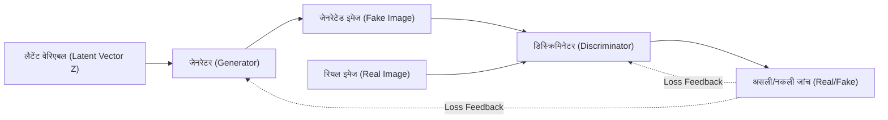
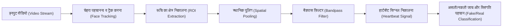
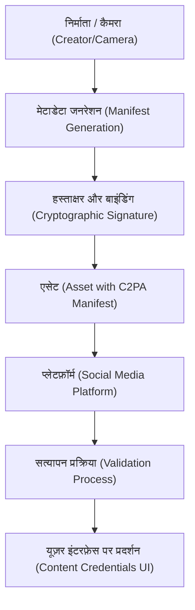

# प्रस्तावना: एक ऐसा युग जहाँ वास्तविकता और कल्पना के बीच की रेखा धुंधली हो रही है

2020 के दशक में प्रवेश करते ही, जनरेटिव एआई (Generative AI) का विकास अभूतपूर्व गति से आगे बढ़ रहा है। टेक्स्ट, ऑडियो, चित्र, और यहां तक कि वीडियो तक, ऐसे कंटेंट जो इंसानों द्वारा बनाए गए कंटेंट से अलग नहीं किए जा सकते, अब कुछ ही सेकंड में उत्पन्न किए जा सकते हैं। जबकि यह तकनीकी छलांग रचनात्मक क्षेत्रों में बहुत लाभ लाती है, इसने "डीपफेक (Deepfake)" नामक परिष्कृत नकली कंटेंट की बाढ़ जैसी गंभीर सामाजिक चुनौती भी पैदा कर दी है।

डीपफेक राजनेताओं के नकली भाषण, कंपनी के सीईओ के रूप में प्रतिरूपण करने वाले घोटाले (BEC घोटालों का विकसित रूप), या मशहूर हस्तियों को बदनाम करने वाली पोर्नोग्राफी जैसे विभिन्न रूपों में समाज के लिए खतरा बन रहा है। विशेष रूप से चुनाव अवधि के दौरान, डीपफेक के माध्यम से फेक न्यूज़ का प्रसार एक ऐसे बिंदु तक पहुंच गया है जहां यह लोकतंत्र की नींव को हिला देता है।

ऐसे युग में, हमसे जिस चीज़ की आवश्यकता है, वह है "सूचना साक्षरता (Information Literacy)" को अपडेट करना। "आप अपनी आँखों से जो देखते हैं उस पर विश्वास करें" वाला सामान्य ज्ञान अब लागू नहीं होता। इस लेख में, हम तकनीकी पृष्ठभूमि से शुरुआत करेंगे कि डीपफेक कैसे उत्पन्न होते हैं, फिर "तकनीकी रूप से" उनका पता लगाने के लिए अत्याधुनिक डिजिटल फोरेंसिक (digital forensics) विधियों पर चर्चा करेंगे, और पूरे समाज में गलत सूचनाओं का मुकाबला करने के लिए C2PA जैसे ढांचे के बारे में गणितीय सूत्रों और कोड का उपयोग करके बहुत गहराई से समझाएंगे।

---

# 1. डीपफेक का समर्थन करने वाले जनरेटिव एआई का तंत्र (Mechanisms of Generative AI behind Deepfakes)

डीपफेक को समझने के लिए, सबसे पहले उस जनरेटिव एआई की कार्यप्रणाली को जानना आवश्यक है जिस पर यह आधारित है। वर्तमान में, उच्च-रिज़ॉल्यूशन वाले चित्र और वीडियो उत्पन्न करने के लिए उपयोग किए जाने वाले दो विशिष्ट आर्किटेक्चर "GAN (Generative Adversarial Networks)" और "Diffusion Models" हैं।

## 1.1 जनरेटिव एडवरसैरियल नेटवर्क्स (GAN)

2014 में इयान गुडफेलो (Ian Goodfellow) और अन्य लोगों द्वारा प्रस्तावित GAN ने डीपफेक तकनीक की शुरुआत की। GAN में, दो न्यूरल नेटवर्क "जालसाज़" (नकली बनाने वाले) और "पुलिस अधिकारी" की भूमिका निभाते हैं, और एक-दूसरे के साथ प्रतिस्पर्धा (प्रतिकूल शिक्षा - adversarial learning) करके बहुत यथार्थवादी डेटा उत्पन्न करते हैं।

- **जेनरेटर (Generator, $G$)**: यह इनपुट के रूप में रैंडम नॉइज़ (लैटेंट वेरिएबल $z$) प्राप्त करता है और ऐसा डेटा (जैसे कि चित्र) उत्पन्न करता है जो बिल्कुल असली जैसा दिखता है।
- **डिस्क्रिमिनेटर (Discriminator, $D$)**: यह निर्धारित करता है कि इनपुट डेटा वास्तविक डेटासेट से आया "असली (Real)" डेटा है, या जेनरेटर द्वारा बनाया गया "नकली (Fake)" डेटा है।

ये दोनों नेटवर्क निम्नलिखित मिनिमैक्स (Minimax) गेम के रूप में तैयार किए गए लॉस फ़ंक्शन को अनुकूलित (optimize) करने के लिए सीखना जारी रखते हैं:

$$
\min_G \max_D V(D, G) = \mathbb{E}_{x \sim p_{data}(x)}[\log D(x)] + \mathbb{E}_{z \sim p_{z}(z)}[\log(1 - D(G(z)))]
$$

यहाँ, $x$ वास्तविक डेटा है और $z$ लैटेंट वेरिएबल (नॉइज़) है। डिस्क्रिमिनेटर $D$ इस सूत्र को अधिकतम करने की कोशिश करता है (असली और नकली के बीच सटीक अंतर बताने के लिए), जबकि जेनरेटर $G$ इसे न्यूनतम करने (डिस्क्रिमिनेटर को धोखा देने) की कोशिश करता है। जब यह सीखना संतुलन (नैश इक्विलिब्रियम - Nash Equilibrium) तक पहुंच जाता है, तो जेनरेटर ऐसा डेटा उत्पन्न करने में सक्षम हो जाता है जिसे असली डेटा से अलग नहीं किया जा सकता है।



## 1.2 डिफ्यूज़न मॉडल्स (Diffusion Models)

हाल के वर्षों में, "डिफ्यूज़न मॉडल्स" ने GAN को पछाड़ते हुए बेहतर छवि गुणवत्ता और स्थिरता का दावा किया है, और यह Midjourney और Stable Diffusion की मुख्य तकनीक बन गया है। डिफ्यूज़न मॉडल में एक "फॉरवर्ड डिफ्यूज़न प्रोसेस" होता है, जो धीरे-धीरे डेटा में नॉइज़ जोड़ता है, और एक "रिवर्स डिफ्यूज़न प्रोसेस" होता है, जो नॉइज़ से मूल डेटा को पुनर्प्राप्त करता है।

**फॉरवर्ड डिफ्यूज़न प्रोसेस (Forward Process)** में, प्रत्येक टाइम स्टेप $t$ के लिए एक साफ़ छवि $x_0$ में गाऊसी (Gaussian) नॉइज़ जोड़ा जाता है। इस प्रक्रिया को [मार्कोव चेन](https://kenji.blog/hi/p/markov-chain/) (Markov chain) के रूप में निम्नलिखित सूत्र द्वारा दर्शाया गया है:

$$
q(x_t | x_{t-1}) = \mathcal{N}(x_t; \sqrt{1 - \beta_t} x_{t-1}, \beta_t \mathbf{I})
$$

यहाँ $\beta_t$ एक शेड्यूल पैरामीटर है जो नॉइज़ के विचरण (variance) को नियंत्रित करता है। पर्याप्त स्टेप्स $T$ के बाद, $x_T$ पूरी तरह से रैंडम नॉइज़ बन जाता है।

**रिवर्स डिफ्यूज़न प्रोसेस (Reverse Process)** में, एक न्यूरल नेटवर्क (आमतौर पर U-Net आर्किटेक्चर) नॉइज़ वाली छवि $x_t$ से नॉइज़ की भविष्यवाणी करना और पिछले स्टेप $x_{t-1}$ को पुनर्प्राप्त करना सीखता है। इस प्रक्रिया को कंडीशनिंग (जैसे टेक्स्ट प्रॉम्प्ट) के साथ जोड़कर, शून्य (नॉइज़) से कोई भी छवि उत्पन्न करना संभव हो जाता है।

---

# 2. डिजिटल फोरेंसिक: जेनरेट किए गए कंटेंट में निशानों की खोज

भले ही जनरेटिव मॉडल कितने भी उन्नत हो जाएं, एआई-जनरेटेड डेटा हमेशा "गणितीय और सांख्यिकीय निशान (artifacts)" छोड़ते हैं जो इंसानों को दिखाई नहीं देते हैं। डिटेक्शन तकनीकें (डीपफेक डिटेक्टर) विभिन्न तरीकों का उपयोग करके इन सूक्ष्म निशानों को पकड़ती हैं।

## 2.1 फ्रीक्वेंसी डोमेन एनालिसिस और DCT (डिस्क्रीट कोसाइन ट्रांसफॉर्म)

मानव आँख छवियों के रंग और चमक (स्थानिक डोमेन - spatial domain) में स्थानिक परिवर्तनों के प्रति संवेदनशील होती है, लेकिन आवृत्तियों (आवृत्ति डोमेन - frequency domain) में परिवर्तनों के प्रति असंवेदनशील होती है। GAN और डिफ्यूज़न मॉडल द्वारा उत्पन्न छवियां, जो पहली नज़र में सही लग सकती हैं, अपसैंपलिंग (निम्न रिज़ॉल्यूशन से उच्च रिज़ॉल्यूशन में विस्तार) प्रक्रिया के दौरान विशिष्ट आवृत्ति पैटर्न (जैसे चेकरबोर्ड आर्टिफैक्ट्स) उत्पन्न करती हैं।

इसका पता लगाने के लिए अक्सर **डिस्क्रीट कोसाइन ट्रांसफॉर्म (Discrete Cosine Transform, DCT)** का उपयोग किया जाता है। DCT एक छवि को विभिन्न आवृत्तियों की कोसाइन तरंगों के योग के रूप में व्यक्त करता है। 2D DCT का सूत्र इस प्रकार है:

$$
X_{k_1, k_2} = \sum_{n_1=0}^{N_1-1} \sum_{n_2=0}^{N_2-1} x_{n_1, n_2} \cos\left[\frac{\pi}{N_1}\left(n_1 + \frac{1}{2}\right)k_1\right] \cos\left[\frac{\pi}{N_2}\left(n_2 + \frac{1}{2}\right)k_2\right]
$$

जेनरेट की गई छवियों में प्राकृतिक छवियों की तुलना में **उच्च-आवृत्ति घटकों (जैसे सूक्ष्म नॉइज़ और अचानक किनारे के बदलाव)** में असामान्य ऊर्जा वितरण की प्रवृत्ति होती है। नीचे दिया गया पायथन कोड छवि से DCT का उपयोग करके उच्च-आवृत्ति घटक ऊर्जा निकालने का एक सरल उदाहरण है।

```python
import cv2
import numpy as np
import scipy.fftpack

def extract_high_frequency_features(image_path):
    # छवि लोड करना और ग्रेस्केल में बदलना
    img = cv2.imread(image_path, cv2.IMREAD_GRAYSCALE)
    if img is None:
        raise ValueError("Image not found")
    
    # 2D डिस्क्रीट कोसाइन ट्रांसफॉर्म (DCT) लागू करना
    # पहले पंक्तियों पर 1D DCT लागू करें, फिर कॉलम पर 1D DCT लागू करें
    dct_result = scipy.fftpack.dct(scipy.fftpack.dct(img.T, norm='ortho').T, norm='ortho')
    
    # उच्च-आवृत्ति घटकों को निकालना (ऊपरी बाएँ निम्न-आवृत्ति घटकों को मास्क करके शून्य करना)
    rows, cols = dct_result.shape
    mask = np.ones((rows, cols))
    
    # निम्न-आवृत्ति क्षेत्र (कुल का 10%) को मास्क करना
    mask[:int(rows*0.1), :int(cols*0.1)] = 0
    
    high_freq_features = dct_result * mask
    
    # उच्च-आवृत्ति क्षेत्र की ऊर्जा की गणना करना
    energy = np.sum(np.abs(high_freq_features))
    
    return energy

# प्राकृतिक और जेनरेटेड छवियों की तुलना करने पर, energy मान में अक्सर सांख्यिकीय रूप से महत्वपूर्ण अंतर होता है
```

आवृत्ति डोमेन में यह अप्राकृतिकता इसलिए उत्पन्न होती है क्योंकि एआई "पिक्सेल-स्तर की स्थानीय स्थिरता" तो सीख सकता है, लेकिन "पूरी छवि की वैश्विक आवृत्ति विशेषताओं" की पूरी तरह से नकल करना मुश्किल है।

---

# 3. जैविक संकेतों का पता लगाना: rPPG के माध्यम से "जीवन की धड़कन" की पुष्टि

छवि (स्थिर चित्र) पहचान तकनीकों के अलावा, वीडियो में डीपफेक का पता लगाने के लिए एक क्रांतिकारी दृष्टिकोण **जैविक संकेतों (Biological [Signals](https://kenji.blog/hi/p/state-management-history-future/)) का निष्कर्षण** है।

जब तक मनुष्य जीवित है, रक्त हृदय की धड़कन के साथ शरीर में संचारित होता है। चूंकि रक्त में हीमोग्लोबिन विशिष्ट तरंग दैर्ध्य (विशेष रूप से हरी रोशनी, लगभग 530nm) को अच्छी तरह से अवशोषित करता है, चेहरे की त्वचा का रंग दिल की धड़कन के साथ थोड़ा (मानव आंखों के लिए अदृश्य स्तर पर) बदल जाता है। इस सिद्धांत का उपयोग करके एक सामान्य RGB कैमरे के वीडियो से गैर-संपर्क (non-contact) तरीके से हृदय गति का अनुमान लगाने की तकनीक को **rPPG (रिमोट फोटोप्लेथिस्मोग्राफी, remote Photoplethysmography)** कहा जाता है।

प्रकाश अवशोषण और प्रतिबिंब पर आधारित rPPG का मूल मॉडल बीयर-लैम्बर्ट नियम (Beer-Lambert law) द्वारा इस प्रकार व्यक्त किया गया है:

$$
I(t) = I_0(t) e^{-\left( \mu_{dc} + \mu_{ac}(t) \right) d}
$$

यहाँ, $I(t)$ कैमरे द्वारा देखा गया प्रकाश की तीव्रता है, $I_0(t)$ प्रकाश स्रोत की तीव्रता है, $\mu_{dc}$ स्थिर ऊतक (tissue) द्वारा प्रकाश अवशोषण गुणांक (coefficient) है, $\mu_{ac}(t)$ रक्त प्रवाह में उतार-चढ़ाव (दिल की धड़कन) के कारण गतिशील प्रकाश अवशोषण गुणांक है, और $d$ प्रकाश पथ की लंबाई है।

डीपफेक वीडियो (उदाहरण के लिए, फेसस्वैप जो चेहरे को बदलता है, या लिप-सिंक जो होंठों की हरकतों को ऑडियो से मिलाता है) फ्रेम दर फ्रेम दृश्य यथार्थवाद का प्रयास करते हैं, लेकिन **समय के साथ सूक्ष्म रक्त प्रवाह परिवर्तन (दिल की धड़कन संकेत) को पुन: उत्पन्न नहीं कर सकते।** इसलिए, यदि आप डीपफेक वीडियो से rPPG सिग्नल निकालने का प्रयास करते हैं, तो आपको प्राकृतिक मानव हृदय गति (आमतौर पर 60 से 100 बीट्स प्रति मिनट (bpm) के दायरे में नियमित चक्र) से भिन्न एक अप्राकृतिक, नॉइज़-भरा सिग्नल मिलता है।



नीचे पायथन का उपयोग करके वीडियो से rPPG सिग्नल निकालने के लिए एक वैचारिक पाइपलाइन कार्यान्वयन का उदाहरण दिया गया है।

```python
import cv2
import numpy as np
from scipy import signal

def extract_rppg_signal(video_path):
    cap = cv2.VideoCapture(video_path)
    green_signals = []
    
    while cap.isOpened():
        ret, frame = cap.read()
        if not ret:
            break
            
        # 1. चेहरा पहचानना और ROI (रूचि का क्षेत्र: उदाहरण के लिए माथा या गाल) निकालना
        # roi = detect_face_and_extract_roi(frame)
        # सरलता के लिए, हम पूरे फ्रेम के मध्य भाग को ROI मान रहे हैं
        h, w = frame.shape[:2]
        roi = frame[int(h*0.3):int(h*0.6), int(w*0.4):int(w*0.6)]
        
        # 2. RGB स्पेस से ग्रीन चैनल (Green channel) निकालना
        # रक्त में मौजूद हीमोग्लोबिन हरी रोशनी को सबसे ज्यादा अवशोषित करता है
        g_channel = roi[:, :, 1]
        
        # 3. स्थानिक पूलिंग (Spatial pooling - औसत की गणना करना)
        mean_g = np.mean(g_channel)
        green_signals.append(mean_g)
        
    cap.release()
    
    if len(green_signals) == 0:
        return None
        
    # 4. बैंडपास फ़िल्टर के साथ नॉइज़ कम करना
    # मानव हृदय गति आवृत्ति बैंड (उदाहरण: 0.7Hz से 2.5Hz = 42 से 150 bpm) निकालना
    fps = 30.0 # अनुमानित फ्रेम रेट
    nyquist = 0.5 * fps
    low = 0.7 / nyquist
    high = 2.5 / nyquist
    b, a = signal.butter(3, [low, high], btype='bandpass')
    filtered_signal = signal.filtfilt(b, a, green_signals)
    
    return filtered_signal

# निकाले गए filtered_signal के फ्रीक्वेंसी स्पेक्ट्रम का विश्लेषण करें,
# यदि कोई स्पष्ट पीक (हार्टबीट) नहीं है, तो डीपफेक होने की उच्च संभावना है।
```

---

# 4. अंतहीन "चूहे-बिल्ली का खेल": प्रतिकूल शिक्षा (Adversarial Learning) और बचाव तकनीकें

जैसा कि अब तक बताया गया है, आवृत्ति विश्लेषण (frequency analysis) और जैविक संकेतों (rPPG) जैसी उन्नत फोरेंसिक तकनीकें मौजूद हैं। हालाँकि, एआई की दुनिया में कोई "पूर्ण बाधा" (absolute barrier) नहीं है। जब कोई डिटेक्शन तकनीक शोध पत्र के रूप में प्रकाशित होती है, तो हमलावर (डीपफेक निर्माता) तुरंत उस डिटेक्टर से बचने के लिए जनरेटिव मॉडल में सुधार करते हैं।

उदाहरण के लिए, मान लें कि एक डिटेक्टर "आवृत्ति डोमेन में विसंगतियों" का पता लगाकर डीपफेक की पहचान करता है। हमलावर **इस डिटेक्टर को नए GAN के "डिस्क्रिमिनेटर (Discriminator)" के रूप में शामिल करेगा** और जेनरेटर को फिर से प्रशिक्षित करेगा। नतीजतन, जेनरेटर ऐसी छवियां उत्पन्न करने के लिए विकसित हो जाता है जो "आवृत्ति डोमेन में भी प्राकृतिक छवियों से अप्रभेद्य (indistinguishable) हैं"।

इसके अलावा, ऐसे शोध (एंटी-फोरेंसिक्स - Anti-Forensics) पहले ही सामने आ चुके हैं जो वीडियो में कृत्रिम रूप से "रंग के सूक्ष्म उतार-चढ़ाव (नकली दिल की धड़कन संकेत)" को जानबूझकर पोस्ट-प्रोसेसिंग के माध्यम से जोड़कर rPPG-आधारित डिटेक्शन सिस्टम को धोखा देने का प्रयास करते हैं।

पहचानना और उत्पन्न करना वास्तव में "ढाल और तलवार" का अंतहीन चूहे-बिल्ली का खेल (Cat-and-Mouse Game) है। इस कारण से, यह बताया गया है कि केवल आउटपुट डेटा (छवि या वीडियो) का बाद में विश्लेषण करके प्रामाणिकता निर्धारित करने के दृष्टिकोण (पैसिव डिटेक्शन) की अंततः अपनी सीमाएँ होंगी।

---

# 5. मूलभूत उपाय: स्रोत का प्रमाण और C2PA ढांचा (Provenance and C2PA Framework)

चूंकि तथ्यों के बाद (post-facto) का पता लगाना अपनी सीमा तक पहुंच रहा है, वर्तमान में दुनिया भर में एक सक्रिय रक्षा दृष्टिकोण तेजी से बढ़ावा पा रहा है, जो क्रिप्टोग्राफिक रूप से डेटा के "स्रोत (Provenance)" की गारंटी देता है। **C2PA (Coalition for Content Provenance and Authenticity)** इस वैश्विक मानक ढांचे का निर्माण कर रहा है।

C2PA एक कंसोर्टियम है जिसे Adobe, Microsoft, Intel, BBC, Sony और अन्य प्रमुख कंपनियों द्वारा स्थापित किया गया है। यह डिजिटल सामग्री के स्रोत (किसने, कब, किस कैमरे से इसे शूट किया, और किस प्रकार के संपादन किए गए) को स्वयं सामग्री में एक छेड़छाड़-प्रूफ तरीके से एम्बेड करने के लिए तकनीकी विनिर्देश (specifications) विकसित कर रहा है।

## 5.1 C2PA कैसे काम करता है

C2PA की मुख्य तकनीक पब्लिक की इंफ्रास्ट्रक्चर (PKI) का उपयोग करके डिजिटल हस्ताक्षर और सामग्री हैश (content hash) बाइंडिंग है।

1. **मेटाडेटा जनरेशन (Manifest)**: जिस क्षण कोई तस्वीर कैमरे से खींची जाती है या सॉफ़्टवेयर से संपादित की जाती है, तो "मैनिफेस्ट (Manifest)" नामक मेटाडेटा उत्पन्न होता है जिसमें ऑपरेशन इतिहास, डिवाइस की जानकारी और निर्माता की जानकारी शामिल होती है।
2. **क्रिप्टोग्राफ़िक हस्ताक्षर (Digital Signature)**: मैनिफेस्ट और छवि के हैश मान (पिक्सेल डेटा का सारांश) दोनों को हार्डवेयर या सॉफ़्टवेयर की निजी कुंजी (private key) का उपयोग करके डिजिटल रूप से हस्ताक्षरित किया जाता है।
3. **एसेट में एम्बेड करना**: हस्ताक्षरित मैनिफेस्ट (C2PA क्रेडेंशियल्स) को JPEG या MP4 जैसे फ़ाइल स्वरूपों की हेडर जानकारी में एम्बेड किया जाता है।

यदि कोई हमलावर छवि के हिस्से को बदलने या एआई-जनरेटेड छवि में फर्जी मेटाडेटा संलग्न करने का प्रयास करता है, तो छवि का हैश मान बदल जाएगा, जिससे डिजिटल हस्ताक्षर सत्यापन विफल हो जाएगा और छेड़छाड़ तुरंत उजागर हो जाएगी।



## 5.2 "कंटेंट क्रेडेंशियल्स (Content Credentials)" आइकन द्वारा विज़ुअलाइज़ेशन

C2PA-अनुपालक प्रणालियों में, जब उपयोगकर्ता सोशल मीडिया या समाचार साइटों पर कोई छवि देखते हैं, तो छवि के कोने में "CR (Content Credentials)" आइकन दिखाई देता है। इस पर क्लिक करने से किसी को भी यह पारदर्शी रूप से जांचने की अनुमति मिलती है कि छवि का इतिहास क्या है - क्या यह "एआई द्वारा जनरेट किया गया था," "वास्तविक कैमरे से लिया गया था," या "फोटोशॉप (Photoshop) में रंग सुधारा गया था।"

वर्तमान में, OpenAI (DALL-E 3) और Google जैसे प्रमुख एआई वेंडर जनरेटेड छवियों में C2PA मेटाडेटा जोड़ना शुरू कर रहे हैं, और Leica और Sony जैसे कैमरा निर्माता हार्डवेयर स्तर पर C2PA हस्ताक्षर सुविधाओं को लागू कर रहे हैं। समाज का प्रतिमान "नकली को पहचानने" से हटकर "यह साबित करने की ओर बढ़ रहा है कि यह प्रामाणिक है (ज़ीरो-ट्रस्ट अप्रोच)"।

---

# 6. अगली पीढ़ी की सूचना साक्षरता: हम क्या कर सकते हैं

तकनीकी उपाय (जैसे डीपफेक डिटेक्टर और C2PA जैसे स्रोत के प्रमाण) केवल समाज की रक्षा के लिए एक बुनियादी ढांचा हैं। अंततः, यह हमारा मानवीय मस्तिष्क है जो निर्णय लेता है कि जानकारी का उपभोग करना है या फैलाना है।

एआई युग में अगली पीढ़ी की "सूचना साक्षरता" का अर्थ निम्नलिखित दृष्टिकोण रखना है:

1. **रिफ्लेक्सिव प्रसार से बचें (Stop and Think)**
   विशेष रूप से तब जब आप चौंकाने वाले फुटेज या सामग्री (भावनात्मक रूप से उत्तेजक जानकारी) देखते हैं जो क्रोध को भड़काती है, तो रुकना और रीपोस्टिंग या साझा करना बंद करना महत्वपूर्ण है। डीपफेक निर्माताओं का मुख्य लक्ष्य जानकारी फैलाने के लिए मानवीय भावनाओं को हैक करना है।
2. **जानकारी के "स्रोत" की पुष्टि करें (Verify the Source)**
   क्या जानकारी किसी विश्वसनीय समाचार संगठन से आ रही है? क्या C2PA जैसे स्रोत के प्रमाण (Content Credentials) संलग्न हैं? जानकारी के स्रोतों की क्रॉस-चेक करने की आदत विकसित करना महत्वपूर्ण है।
3. **"सब कुछ नकली हो सकता है" वाला एक स्वस्थ संदेह (Healthy Skepticism)**
   निराशावादी होने की कोई आवश्यकता नहीं है, लेकिन हमें "वीडियो = तथ्य" के पिछले सामान्य ज्ञान को त्यागना होगा। हमें इस धारणा के साथ जानकारी का उपभोग करना होगा कि हम एक ऐसे युग में हैं जहां ऑडियो, वीडियो और टेक्स्ट सभी को आसानी से जाली बनाया जा सकता है।

# निष्कर्ष (Conclusion)

एआई तकनीक के विकास ने पेंडोरा का बॉक्स (Pandora's box) खोल दिया है। डीपफेक बनाने वाली तकनीक को ही खत्म करना अब असंभव है।

हालाँकि, जैसा कि इस लेख में बताया गया है, इंजीनियर कई तरह के तरीकों का उपयोग करके फेक न्यूज़ के खतरे का सामना कर रहे हैं, जैसे कि आवृत्ति विश्लेषण, जैविक संकेतों का पता लगाना, और क्रिप्टोग्राफी (C2PA) का उपयोग करके स्रोत का प्रमाण। इन तकनीकी ढालों (सुरक्षा उपायों) को हममें से प्रत्येक की "सूचना साक्षरता" की सामाजिक ढाल के साथ जोड़कर, हम एआई द्वारा लाए गए कल्पना की लहरों को पार करने और सच्चाई के मूल्य की रक्षा करने में सक्षम होंगे।

यही कारण है कि ऐसे युग में जहां वास्तविकता और कल्पना के बीच की रेखाएं धुंधली हो जाती हैं, सच्चाई को पहचानने की मानवीय "इच्छा (will)" पहले से कहीं अधिक महत्वपूर्ण हो गई है।


