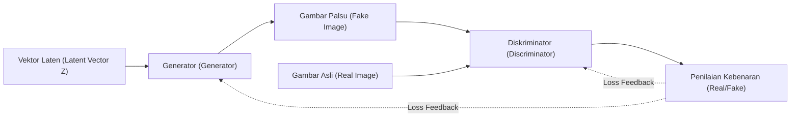
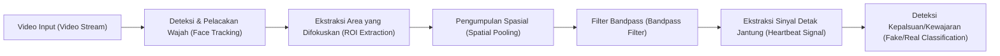
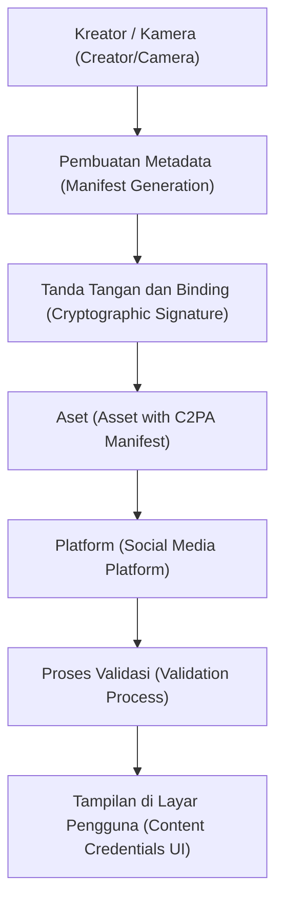

# Pendahuluan: Era di Mana Batas Antara Realitas dan Fiksi Memudar

Memasuki tahun 2020-an, evolusi AI Generatif (Generative AI) telah berkembang dengan kecepatan yang belum pernah terjadi sebelumnya. Mulai dari teks, suara, gambar, hingga video, konten dengan kualitas yang tidak dapat dibedakan dari buatan manusia kini dapat dihasilkan hanya dalam beberapa detik. Lompatan teknis ini membawa manfaat luar biasa bagi bidang kreatif, tetapi di sisi lain, hal ini juga menciptakan ancaman sosial yang serius berupa banjirnya konten palsu canggih yang disebut "Deepfake".

Deepfake mengancam masyarakat dalam berbagai bentuk, seperti pidato palsu dari politisi, penipuan yang menyamar sebagai CEO perusahaan (evolusi dari penipuan BEC), atau pornografi yang mencemarkan nama baik selebritas. Terutama selama masa pemilihan umum, penyebaran berita palsu melalui Deepfake telah berkembang menjadi situasi yang mengguncang fondasi demokrasi.

Di era seperti ini, hal yang dituntut dari kita adalah pembaruan pada "literasi informasi". Anggapan umum untuk "memercayai apa yang dilihat dengan mata kepala sendiri" tidak lagi berlaku. Artikel ini akan menjelaskan dari tingkat yang sangat mendalam dengan menyertakan rumus matematika dan kode. Dimulai dengan latar belakang teknis tentang bagaimana Deepfake dihasilkan, kemudian menuju metode forensik digital mutakhir untuk mendeteksinya secara "teknis", dan kerangka kerja (seperti C2PA) bagi seluruh masyarakat untuk melawan informasi palsu.

---

# 1. Mekanisme AI Generatif yang Mendukung Deepfake

Untuk memahami Deepfake, pertama-tama kita harus mengetahui mekanisme AI Generatif yang menjadi fondasinya. Saat ini, dua arsitektur representatif yang digunakan untuk menghasilkan gambar dan video definisi tinggi adalah "GAN (Generative Adversarial Networks)" dan "Diffusion Models (Model Difusi)".

## 1.1 Generative Adversarial Networks (GAN)

Diusulkan oleh Ian Goodfellow dan rekan-rekannya pada tahun 2014, GAN menjadi pemicu teknologi Deepfake. GAN menggunakan dua jaringan saraf yang masing-masing berperan layaknya "pemalsu" dan "polisi", saling bersaing (pembelajaran adversarial) untuk menghasilkan data yang sangat realistis.

- **Generator ($G$)**: Menerima gangguan acak (variabel laten $z$) sebagai input dan menghasilkan data (seperti gambar) yang terlihat persis seperti aslinya.
- **Diskriminator (Discriminator, $D$)**: Menentukan apakah data yang dimasukkan adalah "Asli (Real)" yang berasal dari dataset nyata, atau "Palsu (Fake)" yang dibuat oleh generator.

Kedua jaringan ini melanjutkan pembelajaran dengan mengoptimalkan fungsi kerugian (loss function) yang diformulasikan sebagai permainan minimax berikut:

$$
\min_G \max_D V(D, G) = \mathbb{E}_{x \sim p_{data}(x)}[\log D(x)] + \mathbb{E}_{z \sim p_{z}(z)}[\log(1 - D(G(z)))]
$$

Di sini, $x$ adalah data riil, dan $z$ adalah variabel laten (gangguan/noise). Diskriminator $D$ mencoba untuk memaksimalkan persamaan ini (membedakan dengan tepat antara asli dan palsu), sedangkan Generator $G$ mencoba untuk meminimalkannya (mengelabui diskriminator). Ketika pembelajaran ini mencapai keadaan ekuilibrium (Ekuilibrium Nash), generator menjadi mampu menghasilkan data yang tidak dapat dibedakan dengan yang asli.



## 1.2 Model Difusi (Diffusion Models)

Dalam beberapa tahun terakhir, "Model Difusi" telah melampaui GAN dalam hal kualitas dan stabilitas gambar, dan kini menjadi teknologi dasar bagi Midjourney maupun Stable Diffusion. Model Difusi terdiri dari "proses difusi maju" (forward diffusion process), yang secara bertahap menambahkan noise ke data, dan "proses difusi mundur" (reverse diffusion process), yang memulihkan data asli dari noise tersebut.

Dalam **Proses difusi maju (Forward Process)**, gaussian noise ditambahkan ke gambar bersih $x_0$ pada setiap langkah waktu $t$. Proses ini direpresentasikan sebagai rantai Markov dengan persamaan berikut:

$$
q(x_t | x_{t-1}) = \mathcal{N}(x_t; \sqrt{1 - \beta_t} x_{t-1}, \beta_t \mathbf{I})
$$

Di sini, $\beta_t$ adalah parameter jadwal yang mengontrol varians noise. Setelah melalui langkah $T$ yang cukup, $x_T$ menjadi noise acak yang sempurna.

Dalam **Proses difusi mundur (Reverse Process)**, jaringan saraf (biasanya arsitektur U-Net) dilatih untuk memprediksi noise dari gambar bernoise $x_t$ dan memulihkan langkah sebelumnya, yaitu $x_{t-1}$. Dengan menggabungkan proses ini bersama pengondisian (seperti prompt teks), kita bisa menghasilkan gambar acak dari nol (noise).

---

# 2. Forensik Digital: Teknologi Pencari Jejak Karya Generatif

Secara matematika dan statistik, seberapa canggih pun model generatif, akan selalu ada "jejak (artefak)" yang tertinggal dalam data yang dihasilkan oleh AI, yang tidak terlihat oleh mata manusia. Teknologi deteksi (Deepfake Detector) dapat menangkap jejak mikroskopis ini dengan menggunakan berbagai pendekatan.

## 2.1 Analisis Domain Frekuensi dan DCT (Discrete Cosine Transform)

Mata manusia sensitif terhadap perubahan spasial (domain spasial) dalam warna maupun kecerahan gambar, namun tidak terlalu peka terhadap perubahan frekuensi (domain frekuensi). Meskipun gambar yang dihasilkan oleh model GAN atau Difusi tampak sempurna pada pandangan pertama, proses upsampling (perluasan dari resolusi rendah ke resolusi tinggi) menghasilkan pola frekuensi tertentu (seperti artefak papan catur).

**Discrete Cosine Transform (DCT)** sering digunakan untuk mendeteksi hal tersebut. DCT merepresentasikan gambar sebagai penjumlahan gelombang kosinus dengan frekuensi berbeda-beda. Rumus matematika untuk DCT 2D adalah sebagai berikut:

$$
X_{k_1, k_2} = \sum_{n_1=0}^{N_1-1} \sum_{n_2=0}^{N_2-1} x_{n_1, n_2} \cos\left[\frac{\pi}{N_1}\left(n_1 + \frac{1}{2}\right)k_1\right] \cos\left[\frac{\pi}{N_2}\left(n_2 + \frac{1}{2}\right)k_2\right]
$$

Gambar hasil generasi buatan cenderung memiliki distribusi energi yang tidak normal di **komponen frekuensi tinggi (noise halus atau perubahan tepi mendadak)** dibandingkan dengan gambar alami. Kode Python berikut adalah contoh sederhana untuk mengekstrak energi dari komponen frekuensi tinggi dalam sebuah gambar menggunakan DCT.

```python
import cv2
import numpy as np
import scipy.fftpack

def extract_high_frequency_features(image_path):
    # Memuat gambar dan mengonversi ke grayscale
    img = cv2.imread(image_path, cv2.IMREAD_GRAYSCALE)
    if img is None:
        raise ValueError("Image not found")
    
    # Menerapkan 2D Discrete Cosine Transform (DCT)
    # Terapkan DCT 1D pada baris terlebih dahulu, kemudian DCT 1D pada kolom
    dct_result = scipy.fftpack.dct(scipy.fftpack.dct(img.T, norm='ortho').T, norm='ortho')
    
    # Mengekstrak komponen frekuensi tinggi (menyembunyikan/mask komponen frekuensi rendah di kiri atas menjadi nol)
    rows, cols = dct_result.shape
    mask = np.ones((rows, cols))
    
    # Masking area frekuensi rendah (10% dari total)
    mask[:int(rows*0.1), :int(cols*0.1)] = 0
    
    high_freq_features = dct_result * mask
    
    # Menghitung jumlah energi pada area frekuensi tinggi
    energy = np.sum(np.abs(high_freq_features))
    
    return energy

# Saat membandingkan gambar alami dengan gambar hasil generasi AI, 
# seringkali terdapat perbedaan nilai energy yang signifikan secara statistik.
```

Ketidakwajaran dalam domain frekuensi ini muncul karena meskipun AI dapat mempelajari "konsistensi lokal tingkat piksel", AI sangat sulit untuk sepenuhnya meniru "karakteristik frekuensi global dari gambar secara keseluruhan".

---

# 3. Deteksi Sinyal Biologis: Memeriksa "Denyut Kehidupan" melalui rPPG

Selain teknologi deteksi untuk gambar (gambar diam), pendekatan revolusioner lainnya untuk deteksi Deepfake dalam video adalah **ekstraksi sinyal biologis (Biological [Signals](https://kenji.blog/id/p/state-management-history-future/))**.

Selama seseorang masih hidup, darah akan beredar ke seluruh tubuhnya, berdetak seiring dengan jantung. Hemoglobin dalam darah menyerap panjang gelombang tertentu (khususnya cahaya hijau, sekitar 530nm), sehingga warna kulit wajah sedikit berubah (pada tingkat yang tak terlihat oleh mata manusia) setiap kali jantung berdenyut. Memanfaatkan prinsip ini, teknologi yang memperkirakan detak jantung dari rekaman kamera RGB konvensional tanpa kontak disebut **rPPG (remote Photoplethysmography)**.

Model rPPG dasar yang berbasis pada penyerapan dan pemantulan cahaya direpresentasikan berdasarkan hukum Beer-Lambert sebagai berikut:

$$
I(t) = I_0(t) e^{-\left( \mu_{dc} + \mu_{ac}(t) \right) d}
$$

Di sini, $I(t)$ adalah intensitas cahaya yang diamati oleh kamera, $I_0(t)$ adalah intensitas sumber cahaya, $\mu_{dc}$ adalah koefisien penyerapan cahaya statis jaringan, $\mu_{ac}(t)$ adalah koefisien penyerapan cahaya dinamis akibat fluktuasi aliran darah (detak jantung), dan $d$ adalah panjang jalur optik.

Video Deepfake (seperti FaceSwap yang menukar wajah, atau Lip-sync yang mencocokkan gerakan bibir dengan suara) berusaha mengejar realisme visual pada tingkat frame, namun **tidak dapat memproduksi kembali perubahan aliran darah yang sangat kecil (sinyal detak jantung) di sepanjang sumbu waktu**. Oleh karena itu, jika kita mencoba mengekstrak sinyal rPPG dari video Deepfake, kita akan memperoleh sinyal bernoise tak wajar yang berbeda dari detak jantung manusia alami (biasanya memiliki siklus teratur di kisaran 60-100 bpm).



Berikut ini adalah contoh konseptual implementasi pipeline (alur) menggunakan Python untuk mengekstrak sinyal rPPG dari video.

```python
import cv2
import numpy as np
from scipy import signal

def extract_rppg_signal(video_path):
    cap = cv2.VideoCapture(video_path)
    green_signals = []
    
    while cap.isOpened():
        ret, frame = cap.read()
        if not ret:
            break
            
        # 1. Deteksi wajah dan ekstraksi ROI (Region of Interest: misalnya dahi atau pipi)
        # roi = detect_face_and_extract_roi(frame)
        # Di sini, untuk penyederhanaan, kita anggap bagian tengah keseluruhan frame sebagai ROI
        h, w = frame.shape[:2]
        roi = frame[int(h*0.3):int(h*0.6), int(w*0.4):int(w*0.6)]
        
        # 2. Mengekstrak saluran Hijau (Green channel) dari ruang warna RGB
        # Karena hemoglobin darah menyerap paling banyak cahaya hijau
        g_channel = roi[:, :, 1]
        
        # 3. Pengumpulan spasial (Menghitung nilai rata-rata)
        mean_g = np.mean(g_channel)
        green_signals.append(mean_g)
        
    cap.release()
    
    if len(green_signals) == 0:
        return None
        
    # 4. Menghilangkan noise menggunakan Filter Bandpass
    # Mengekstrak pita frekuensi detak jantung manusia (contoh: 0.7Hz~2.5Hz = 42~150 bpm)
    fps = 30.0 # Anggap framerate adalah ini
    nyquist = 0.5 * fps
    low = 0.7 / nyquist
    high = 2.5 / nyquist
    b, a = signal.butter(3, [low, high], btype='bandpass')
    filtered_signal = signal.filtfilt(b, a, green_signals)
    
    return filtered_signal

# Apabila spektrum frekuensi filtered_signal yang diekstrak dianalisis dan
# tidak ada puncak yang jelas (detak jantung), maka kemungkinan besar itu adalah deepfake.
```

---

# 4. Kejar-kejaran Tanpa Henti: Pembelajaran Adversarial dan Teknik Penghindaran

Sebagaimana yang telah diuraikan sejauh ini, ada teknik forensik canggih seperti analisis frekuensi dan sinyal biologis (rPPG). Namun, di dalam dunia AI tidak ada "perisai absolut". Segera setelah teknik deteksi dipublikasikan sebagai makalah penelitian, para penyerang (pembuat Deepfake) langsung menyempurnakan model generatif agar dapat menghindari detektor tersebut.

Sebagai contoh, anggaplah suatu detektor mendeteksi anomali domain frekuensi dan menemukan adanya Deepfake. Penyerang akan **mengintegrasikan detektor tersebut sebagai "Diskriminator" pada GAN baru mereka**, lalu melatih ulang Generator. Akibatnya, Generator pun berevolusi untuk mengeluarkan "gambar yang tidak dapat dibedakan dari gambar alami, bahkan di dalam domain frekuensi sekalipun."

Selain itu, sudah ada pelaporan penelitian tentang trik untuk mengelabui sistem deteksi berbasis rPPG (Anti-Forensik) dengan menambahkan "fluktuasi warna mikroskopis (sinyal detak jantung palsu)" buatan pada pasca-pemrosesan video.

Singkatnya, pihak deteksi dan pembuat (Generasi) terus bermain "kucing-kucingan" (Cat-and-Mouse Game). Oleh karena itu, berbagai pihak telah mengingatkan bahwa pendekatan pendeteksian kepalsuan semata-mata dengan menganalisis hasil data di kemudian hari (deteksi pasif) suatu saat akan menemui jalan buntu.

---

# 5. Solusi Fundamental: Pembuktian Asal-usul dan Kerangka C2PA

Menjelang tercapainya titik batas deteksi retroaktif (pasif), pendekatan pertahanan aktif (Active Defense) yang menjamin keaslian data secara kriptografis sedang dipromosikan dengan pesat di seluruh dunia. Konsep standar global yang tengah dibangun dinamakan **C2PA (Coalition for Content Provenance and Authenticity)**.

C2PA adalah konsorsium yang didirikan oleh perusahaan-perusahaan besar seperti Adobe, Microsoft, Intel, BBC, dan Sony. Konsorsium ini sedang merumuskan spesifikasi teknis untuk menanamkan riwayat asal-usul konten digital (siapa, kapan, dengan kamera apa konten diambil, dan penyuntingan apa saja yang dilakukan) langsung ke dalam konten itu sendiri, dengan cara yang mustahil dipalsukan.

## 5.1 Mekanisme C2PA

Teknologi inti C2PA adalah tanda tangan digital menggunakan infrastruktur kunci publik (PKI) dan pengikatan (binding) hash konten.

1. **Pembuatan Metadata (Manifest)**: Pada saat sebuah foto diambil dengan kamera atau disunting menggunakan perangkat lunak, sebuah metadata yang disebut "Manifest" dihasilkan, berisikan rekam jejak operasi, informasi perangkat, dan informasi pembuat.
2. **Tanda Tangan Kriptografis (Digital Signature)**: Tanda tangan digital ditambahkan menggunakan perangkat keras ataupun kunci pribadi dari perangkat lunak pada manifest dan nilai hash gambar tersebut (ringkasan data piksel).
3. **Penyematan pada Aset**: Manifest yang ditandatangani (kredensial C2PA) disematkan di dalam informasi header format file seperti JPEG maupun MP4.

Apabila ada penyerang yang memodifikasi sebagian gambar atau mencoba membubuhi metadata palsu pada gambar yang dihasilkan AI, nilai hash gambar tersebut akan berubah, sehingga tanda tangan digital gagal divalidasi, dan pemalsuan dapat langsung diketahui.



## 5.2 Visibilitas melalui Ikon "Content Credentials"

Dalam sistem yang mematuhi standar C2PA, saat pengguna melihat gambar di media sosial atau situs berita, akan ada ikon bertuliskan "CR (Content Credentials)" di sudut gambar tersebut. Jika diklik, siapa pun dapat memeriksa rekam jejak dengan transparan untuk mengetahui apakah gambar tersebut "dihasilkan oleh AI", "diambil dengan kamera asli", atau "telah disesuaikan warnanya di Photoshop".

Saat ini, vendor AI besar seperti OpenAI (DALL-E 3) dan Google juga sudah mulai menambahkan metadata C2PA pada gambar yang mereka buat, dan produsen kamera seperti Leica maupun Sony juga sedang mengimplementasikan fitur tanda tangan C2PA pada tingkat perangkat keras. Secara perlahan, paradigma di masyarakat mulai bergeser dari "Mendeteksi yang palsu" menuju "Membuktikan yang asli (Pendekatan Zero-Trust)".

---

# 6. Literasi Informasi Generasi Berikutnya: Apa yang Bisa Kita Lakukan

Penanganan teknis (seperti detektor Deepfake atau pembuktian asal-usul seperti C2PA) pada akhirnya hanyalah infrastruktur untuk melindungi masyarakat. Pihak yang pada akhirnya meninjau dan menilai apakah akan mengkonsumsi lalu menyebarkan informasi tersebut adalah otak kita sebagai manusia.

Di era AI, "literasi informasi" generasi selanjutnya melibatkan sikap-sikap berikut:

1. **Hindari Penyebaran Reflektif (Stop and Think)**
   Justru ketika dihadapkan pada video yang mengejutkan atau konten yang membakar amarah (informasi yang mengaduk-aduk emosi), berhentilah sejenak, dan tahan keinginan untuk memposting ulang atau membagikan (share). Tujuan utama pembuat Deepfake adalah meretas emosi manusia demi membuat informasinya viral.
2. **Verifikasi Asal-usul Informasi (Verify the Source)**
   Apakah informasi tersebut berasal dari lembaga berita yang tepercaya? Apakah ada bukti asal-usul (Content Credentials) seperti C2PA yang melekat? Adalah penting untuk membiasakan diri mengecek silang (cross-check) sumber informasi.
3. **Sikap Skeptis yang Sehat Bahwa "Semuanya Mungkin Saja Palsu" (Healthy Skepticism)**
   Meski tidak perlu menjadi pesimis, pemikiran bahwa "video = fakta", yang lazim di masa lalu, harus kita buang. Penting untuk mengonsumsi informasi dengan asumsi bahwa segala sesuatu; suara, video, hingga teks; sangat mudah dipalsukan saat ini.

# Penutup

Evolusi teknologi AI telah membuka kotak Pandora. Kini mustahil untuk menghapus sepenuhnya teknologi pembuat Deepfake tersebut.

Meskipun demikian, sebagaimana yang telah dijelaskan dalam artikel ini, para insinyur terus berupaya menangkal ancaman berita palsu melalui berbagai pendekatan teknis seperti analisis frekuensi, deteksi sinyal biologis, dan pembuktian asal-usul (C2PA) yang menggunakan teknik kriptografi. Melalui perpaduan antara perlindungan teknis tersebut dengan perisai sosial berupa "literasi informasi" kita secara individu, seharusnya kita bisa mengatasi badai kepalsuan yang dibawa oleh AI sekaligus membela nilai dari kebenaran.

Tepat karena kita berada pada era di mana batas antara realitas dan fiksi memudar, "kehendak" manusia untuk mengenali kebenaran menjadi jauh lebih penting dari sebelumnya.


