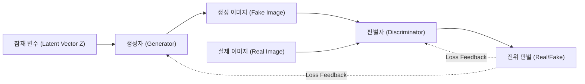
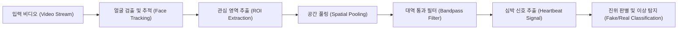
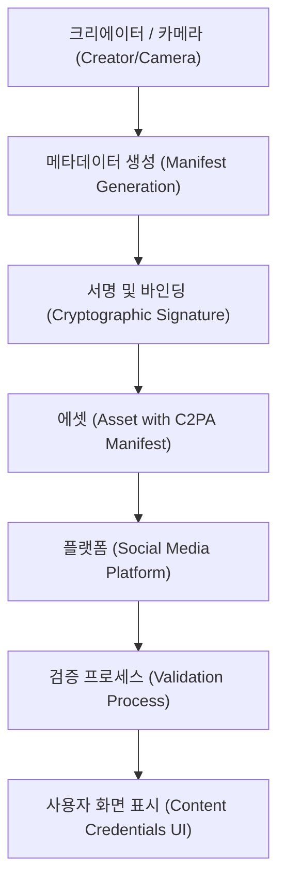

# 들어가며: 현실과 허구의 경계가 녹아내리는 시대

2020년대에 들어서며 생성형 AI(Generative AI)의 진화는 유례없는 속도로 진행되고 있습니다. 문장, 음성, 이미지, 그리고 동영상에 이르기까지 인간이 만든 것과 구별할 수 없는 수준의 콘텐츠를 단 몇 초 만에 생성할 수 있게 되었습니다. 이러한 기술적 도약은 크리에이티브 분야에 막대한 혜택을 가져다주는 한편, '딥페이크(Deepfake)'라 불리는 정교한 위조 콘텐츠의 범람이라는 심각한 사회적 위협을 낳고 있습니다.

딥페이크는 정치인의 가짜 연설, 기업의 CEO를 사칭하는 사기(BEC 사기의 진화형), 혹은 유명인의 명예를 훼손하는 포르노그래피 등 다양한 형태로 사회를 위협하고 있습니다. 특히 선거 기간 중에는 딥페이크를 통한 가짜 뉴스의 확산이 민주주의의 근간을 뒤흔드는 사태로까지 발전하고 있습니다.

이러한 시대에 우리에게 요구되는 것은 '정보 리터러시'의 업데이트입니다. 이제 '내 눈으로 본 것을 믿는다'는 상식은 통하지 않습니다. 본 기사에서는 딥페이크가 어떻게 생성되는지 그 기술적 배경부터 시작하여, 이를 '기술적으로' 간파하기 위한 최첨단 디지털 포렌식 기법, 그리고 사회 전체가 거짓 정보에 대항하기 위한 프레임워크(C2PA 등)에 대해 수식과 코드를 곁들여 매우 깊은 수준으로 해설합니다.

---

# 1. 딥페이크를 지탱하는 생성형 AI의 메커니즘

딥페이크를 이해하기 위해서는 먼저 그 기반이 되는 생성형 AI의 원리를 알아야 합니다. 현재 고화질 이미지나 동영상 생성에 사용되는 대표적인 아키텍처는 'GAN(Generative Adversarial Networks: 적대적 생성 신경망)'과 'Diffusion Models(확산 모델)' 두 가지입니다.

## 1.1 적대적 생성 신경망 (GAN)

2014년 Ian Goodfellow 등이 제안한 GAN은 딥페이크 기술의 기폭제가 되었습니다. GAN은 두 개의 신경망이 '위조자'와 '경찰관'과 같은 역할을 맡아 서로 경쟁(적대적 학습)함으로써 매우 사실적인 데이터를 생성합니다.

- **생성자(Generator, $G$)**: 무작위 노이즈(잠재 변수 $z$)를 입력으로 받아 진짜와 똑같은 데이터(이미지 등)를 생성합니다.
- **판별자(Discriminator, $D$)**: 입력된 데이터가 실제 데이터셋에서 온 '진짜(Real)'인지, 생성자가 만든 '가짜(Fake)'인지를 판별합니다.

이 두 신경망은 다음과 같은 미니맥스(Minimax) 게임으로 공식화되는 손실 함수를 최적화하도록 학습을 진행합니다.

$$
\min_G \max_D V(D, G) = \mathbb{E}_{x \sim p_{data}(x)}[\log D(x)] + \mathbb{E}_{z \sim p_{z}(z)}[\log(1 - D(G(z)))]
$$

여기서 $x$는 실제 데이터, $z$는 잠재 변수(노이즈)입니다. 판별자 $D$는 이 수식을 최대화(진짜와 가짜를 정확히 구별)하려고 하고, 생성자 $G$는 최소화(판별자를 속임)하려고 합니다. 이 학습이 균형 상태(내시 균형)에 도달했을 때, 생성자는 진짜와 구별할 수 없는 데이터를 생성할 수 있게 됩니다.



## 1.2 확산 모델 (Diffusion Models)

최근 GAN을 능가하는 화질과 안정성을 자랑하며 Midjourney나 Stable Diffusion의 기반 기술이 되고 있는 것이 '확산 모델'입니다. 확산 모델은 데이터에 점진적으로 노이즈를 더해가는 '전방 확산 과정'과 노이즈로부터 원래의 데이터를 복원하는 '역방향 확산 과정'으로 이루어져 있습니다.

**전방 확산 과정(Forward Process)** 에서는 깨끗한 이미지 $x_0$에 대해 시간 스텝 $t$마다 가우스 노이즈를 더해갑니다. 이 과정은 마르코프 연쇄로서 다음 수식으로 표현됩니다.

$$
q(x_t | x_{t-1}) = \mathcal{N}(x_t; \sqrt{1 - \beta_t} x_{t-1}, \beta_t \mathbf{I})
$$

여기서 $\beta_t$는 노이즈의 분산을 제어하는 스케줄 파라미터입니다. 충분한 스텝 $T$를 거치면 $x_T$는 완전한 무작위 노이즈가 됩니다.

**역방향 확산 과정(Reverse Process)** 에서는 신경망(일반적으로 U-Net 아키텍처)이 노이즈 이미지 $x_t$로부터 노이즈를 예측하고, 이전 스텝 $x_{t-1}$을 복원하도록 학습합니다. 이 과정을 조건부 부여(텍스트 프롬프트 등)와 결합함으로써 임의의 이미지를 제로(노이즈)에서 생성하는 것이 가능해집니다.

---

# 2. 디지털 포렌식: 생성물의 흔적을 찾는 기술

아무리 생성 모델이 고도화되어도, AI가 생성한 데이터에는 인간의 눈에는 보이지 않는 '수학적·통계적 흔적(아티팩트)'이 반드시 남습니다. 탐지 기술(딥페이크 디텍터)은 이러한 미세한 흔적을 다양한 접근 방식을 통해 포착합니다.

## 2.1 주파수 영역 해석과 DCT (이산 코사인 변환)

인간의 눈은 이미지의 색이나 밝기의 공간적인 변화(공간 영역)에는 민감하지만, 주파수의 변화(주파수 영역)에는 둔감합니다. GAN이나 확산 모델로 생성된 이미지는 언뜻 보면 완벽해 보이지만, 업샘플링(저해상도에서 고해상도로의 확대) 과정에서 특유의 주파수 패턴(체커보드 아티팩트 등)을 발생시킵니다.

이를 탐지하기 위해 자주 사용되는 것이 **이산 코사인 변환(Discrete Cosine Transform, DCT)** 입니다. DCT는 이미지를 서로 다른 주파수를 가진 코사인파의 합으로 표현합니다. 2차원 DCT의 수식은 다음과 같습니다.

$$
X_{k_1, k_2} = \sum_{n_1=0}^{N_1-1} \sum_{n_2=0}^{N_2-1} x_{n_1, n_2} \cos\left[\frac{\pi}{N_1}\left(n_1 + \frac{1}{2}\right)k_1\right] \cos\left[\frac{\pi}{N_2}\left(n_2 + \frac{1}{2}\right)k_2\right]
$$

생성 이미지는 자연 이미지에 비해 **고주파 성분(미세한 노이즈나 급격한 엣지 변화)** 에서 비정상적인 에너지 분포를 가지는 경향이 있습니다. 다음 Python 코드는 이미지에서 DCT를 사용하여 고주파 성분의 에너지를 추출하는 간단한 예입니다.

```python
import cv2
import numpy as np
import scipy.fftpack

def extract_high_frequency_features(image_path):
    # 이미지 불러오기 및 그레이스케일 변환
    img = cv2.imread(image_path, cv2.IMREAD_GRAYSCALE)
    if img is None:
        raise ValueError("Image not found")
    
    # 2차원 이산 코사인 변환(DCT) 적용
    # 먼저 행에 대해 1차원 DCT를 적용하고, 다음으로 열에 대해 1차원 DCT를 적용한다
    dct_result = scipy.fftpack.dct(scipy.fftpack.dct(img.T, norm='ortho').T, norm='ortho')
    
    # 고주파 성분 추출 (좌측 상단의 저주파 성분을 마스킹하여 0으로 만듦)
    rows, cols = dct_result.shape
    mask = np.ones((rows, cols))
    
    # 저주파 영역(전체의 10%)을 마스킹
    mask[:int(rows*0.1), :int(cols*0.1)] = 0
    
    high_freq_features = dct_result * mask
    
    # 고주파 영역의 에너지량을 계산
    energy = np.sum(np.abs(high_freq_features))
    
    return energy

# 자연 이미지와 생성 이미지를 비교하면 energy 값에 통계적으로 유의미한 차이가 발생하는 경우가 많다
```

이러한 주파수 영역에서의 부자연스러움은 AI가 '픽셀 단위에서의 국소적인 정합성'은 학습할 수 있어도, '이미지 전체의 글로벌한 주파수 특성'을 완벽하게 모방하는 것은 어렵기 때문에 발생합니다.

---

# 3. 생체 신호 탐지: rPPG를 통한 '생명의 고동' 확인

이미지(정지 화상) 탐지 기술에 더해, 동영상에서의 딥페이크 탐지로서 획기적인 접근법이 **생체 신호(Biological [Signals](https://kenji.blog/ko/p/state-management-history-future/)) 추출** 입니다.

인간이 살아있는 한, 심장의 고동에 맞춰 혈액이 체내를 순환하고 있습니다. 혈액 속의 헤모글로빈은 특정 파장(특히 녹색광, 약 530nm)을 잘 흡수하기 때문에, 심박에 맞춰 얼굴 피부의 색이 미세하게(인간의 눈에는 보이지 않는 수준으로) 변화합니다. 이 원리를 이용하여 일반적인 RGB 카메라 영상에서 심박수를 비접촉으로 추정하는 기술을 **rPPG(원격 광용적맥파, remote Photoplethysmography)** 라고 부릅니다.

빛의 흡수와 반사에 기반한 rPPG의 기본 모델은 램버트-비어 법칙(Lambert-Beer law)에 의해 다음과 같이 표현됩니다.

$$
I(t) = I_0(t) e^{-\left( \mu_{dc} + \mu_{ac}(t) \right) d}
$$

여기서 $I(t)$는 카메라로 관측되는 빛의 강도, $I_0(t)$는 광원의 강도, $\mu_{dc}$는 정적인 조직에 의한 광흡수 계수, $\mu_{ac}(t)$는 혈류 변동(심박)에 의한 동적인 광흡수 계수, $d$는 빛의 경로 길이입니다.

딥페이크 동영상(예를 들어 얼굴을 바꾸는 FaceSwap이나 입술의 움직임을 음성에 맞추는 Lip-sync)은 프레임 단위에서의 시각적인 리얼함은 추구하지만, **시간 축을 따른 미세한 혈류 변화(심박 신호)까지는 재현할 수 없습니다.** 따라서 딥페이크 동영상에서 rPPG 신호를 추출하려고 하면, 자연스러운 인간의 심박수(일반적으로 60~100 bpm 범위의 규칙적인 주기)와는 다른 노이즈 투성이의 부자연스러운 신호가 얻어집니다.



다음은 Python을 사용하여 영상에서 rPPG 신호를 추출하는 파이프라인의 개념적인 구현 예입니다.

```python
import cv2
import numpy as np
from scipy import signal

def extract_rppg_signal(video_path):
    cap = cv2.VideoCapture(video_path)
    green_signals = []
    
    while cap.isOpened():
        ret, frame = cap.read()
        if not ret:
            break
            
        # 1. 얼굴 검출과 ROI(관심 영역: 예로서 이마나 뺨) 추출
        # roi = detect_face_and_extract_roi(frame)
        # 여기서는 간략화를 위해 프레임 전체의 중앙 부분을 ROI로 한다
        h, w = frame.shape[:2]
        roi = frame[int(h*0.3):int(h*0.6), int(w*0.4):int(w*0.6)]
        
        # 2. RGB 공간에서 Green 채널을 추출
        # 혈액 속의 헤모글로빈은 녹색광을 가장 많이 흡수하기 때문
        g_channel = roi[:, :, 1]
        
        # 3. 공간 풀링 (평균값 산출)
        mean_g = np.mean(g_channel)
        green_signals.append(mean_g)
        
    cap.release()
    
    if len(green_signals) == 0:
        return None
        
    # 4. 대역 통과 필터에 의한 노이즈 제거
    # 인간의 심박 주파수 대역(예: 0.7Hz~2.5Hz = 42~150 bpm)을 추출
    fps = 30.0 # 임시 프레임 레이트
    nyquist = 0.5 * fps
    low = 0.7 / nyquist
    high = 2.5 / nyquist
    b, a = signal.butter(3, [low, high], btype='bandpass')
    filtered_signal = signal.filtfilt(b, a, green_signals)
    
    return filtered_signal

# 추출된 filtered_signal의 주파수 스펙트럼을 분석하여,
# 명확한 피크(심박)가 존재하지 않는 경우 딥페이크일 가능성이 높다고 판정한다.
```

---

# 4. 끝나지 않는 '쫓고 쫓기는 싸움': 적대적 학습과 우회 기술

지금까지 소개한 바와 같이, 주파수 해석이나 생체 신호(rPPG)와 같은 고도의 포렌식 기술이 존재합니다. 그러나 AI의 세계에서 '절대적인 방벽'은 존재하지 않습니다. 탐지 기술이 논문으로 발표되면 공격자(딥페이크 제작자)는 즉시 그 탐지기를 회피하도록 생성 모델을 개량합니다.

예를 들어 탐지기가 '주파수 영역의 이상'을 탐지하여 딥페이크를 간파한다고 합시다. 공격자는 이 **탐지기 자체를 새로운 GAN의 '판별자(Discriminator)'로 편입시켜** 생성자(Generator)를 재학습시킵니다. 그러면 생성자는 '주파수 영역에서도 자연 이미지와 구별할 수 없는 이미지'를 출력하도록 진화해 버리는 것입니다.

더 나아가, 동영상에 인위적인 '미세한 색상의 흔들림(가짜 심박 신호)'을 후처리로 의도적으로 부가함으로써 rPPG 기반의 탐지 시스템을 속이려는 연구(Anti-Forensics)도 이미 보고되고 있습니다.

탐지와 생성은 그야말로 '창과 방패'의 끝나지 않는 쫓고 쫓기는 싸움(Cat-and-Mouse Game)을 벌이고 있는 것입니다. 이 때문에 출력된 데이터(이미지나 동영상)만을 나중에 해석하여 진위 여부를 판정하는 접근법(수동적 탐지)에는 언젠가 한계가 올 것이라고 지적되고 있습니다.

---

# 5. 근본적인 대책: 출처 증명과 C2PA 프레임워크

사후적인 탐지가 한계를 맞이하는 가운데, 현재 전 세계적으로 빠르게 추진되고 있는 것이 데이터의 '출처(Provenance)'를 암호학적으로 보증하는 능동적인 방어 접근법입니다. 그 세계 표준 프레임워크를 구축하고 있는 것이 **C2PA(Coalition for Content Provenance and Authenticity)** 입니다.

C2PA는 Adobe, Microsoft, Intel, BBC, Sony 등 주요 기업들이 참여하여 설립된 컨소시엄으로, 디지털 콘텐츠의 출처(누가, 언제, 어떤 카메라로 촬영하고, 어떤 편집을 가했는지)를 위조 불가능한 형태로 콘텐츠 자체에 내장하는 기술 사양을 제정하고 있습니다.

## 5.1 C2PA의 원리

C2PA의 핵심 기술은 공개키 암호 기반(PKI)을 이용한 디지털 서명과 콘텐츠 해시의 바인딩입니다.

1. **메타데이터 생성(Manifest)**: 카메라로 사진을 촬영한 순간, 또는 소프트웨어로 편집했을 때, 그 조작 이력이나 기기 정보, 작성자 정보를 포함하는 '매니페스트(Manifest)'라 불리는 메타데이터가 생성됩니다.
2. **암호학적 서명(Digital Signature)**: 매니페스트와 이미지 자체의 해시값(픽셀 데이터의 요약)에 대해 하드웨어나 소프트웨어의 비밀키를 사용하여 디지털 서명이 부여됩니다.
3. **에셋에 내장**: 서명된 매니페스트(C2PA 크레덴셜)는 JPEG이나 MP4 등의 파일 형식 헤더 정보에 내장됩니다.

만약 공격자가 이미지의 일부를 변조하거나 AI로 생성한 이미지에 가짜 메타데이터를 부여하려고 해도, 이미지 자체의 해시값이 변하기 때문에 디지털 서명 검증에 실패하여 변조 사실이 즉시 발각됩니다.



## 5.2 'Content Credentials' 아이콘을 통한 시각화

C2PA 규격을 준수하는 시스템에서는 사용자가 SNS나 뉴스 사이트에서 이미지를 볼 때, 이미지 구석에 'CR(Content Credentials)'이라는 아이콘이 표시됩니다. 이를 클릭하면 해당 이미지가 'AI에 의해 생성된 것인지', '실제 카메라로 촬영된 것인지', 혹은 'Photoshop으로 색조 보정된 것인지' 등의 이력을 누구나 투명하게 확인할 수 있게 됩니다.

현재 OpenAI(DALL-E 3)나 Google 등의 주요 AI 벤더들도 생성 이미지에 C2PA 메타데이터 부여를 시작하고 있으며, 라이카(Leica)나 소니(Sony) 등의 카메라 제조사들도 하드웨어 레벨에서의 C2PA 서명 기능 구현을 진행하고 있습니다. '가짜를 간파하는' 것이 아니라 '진짜임을 증명하는(Zero-Trust 접근법)' 것으로 사회의 패러다임이 전환되고 있는 것입니다.

---

# 6. 차세대 정보 리터러시: 우리가 할 수 있는 일

기술적인 대책(딥페이크 탐지기나 C2PA 같은 출처 증명)은 어디까지나 사회를 보호하기 위한 인프라스트럭처에 불과합니다. 궁극적으로 정보를 소비하고 확산할지 여부를 판단하는 것은 우리 인간의 뇌입니다.

AI 시대의 차세대 '정보 리터러시'란 다음과 같은 자세를 가지는 것입니다.

1. **반사적인 확산을 피한다 (Stop and Think)**
   충격적인 영상이나 분노를 부추기는 콘텐츠(감정에 호소하는 정보)를 접했을 때일수록 잠시 멈춰 서서 리포스트나 공유를 멈추는 것. 딥페이크 제작자의 주요 목적은 인간의 감정을 해킹하여 정보를 확산시키는 것입니다.
2. **정보의 '출처'를 확인한다 (Verify the Source)**
   그 정보는 신뢰할 수 있는 언론 기관에서 발신되었는가? C2PA와 같은 출처 증명(Content Credentials)이 부여되어 있는가? 정보의 출처를 크로스체크하는 습관을 들이는 것이 중요합니다.
3. **'모든 것이 가짜일지도 모른다'는 건전한 회의주의 (Healthy Skepticism)**
   비관적이 될 필요는 없지만, '동영상 = 사실'이라는 과거의 상식은 버려야 합니다. 음성도, 영상도, 문장도 모두가 쉽게 위조될 수 있는 시대임을 전제로 정보를 수용할 필요가 있습니다.

# 마치며

AI 기술의 진화는 판도라의 상자를 열어버렸습니다. 이제 딥페이크를 만들어내는 기술 그 자체를 없애는 것은 불가능합니다.

하지만 본 기사에서 해설한 바와 같이, 기술자들은 주파수 해석, 생체 신호 탐지, 그리고 암호 기술을 이용한 출처 증명(C2PA)이라는 다양한 접근 방식으로 가짜 뉴스의 위협에 맞서고 있습니다. 이러한 기술적인 방패(방어책)와 우리 각자의 '정보 리터러시'라는 사회적 방패를 결합함으로써, 우리는 AI가 가져오는 허구의 파도를 극복하고 진실의 가치를 지켜낼 수 있을 것입니다.

현실과 허구의 경계가 녹아내리는 시대이기에, 진실을 파악하려는 인간의 '의지'가 그 어느 때보다도 중요해지고 있습니다.


