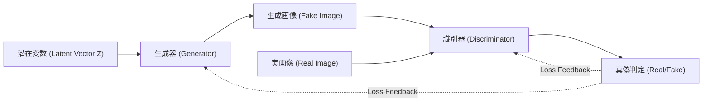
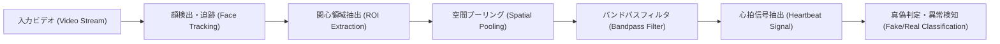
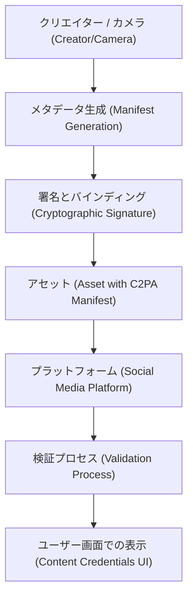

# はじめに：現実と虚構の境界線が溶ける時代

2020年代に入り、生成AI（Generative AI）の進化はかつてない速度で進んでいます。文章、音声、画像、そして動画に至るまで、人間が作成したものと区別がつかないレベルのコンテンツが、わずか数秒で生成できるようになりました。この技術的飛躍は、クリエイティブな分野に多大な恩恵をもたらす一方で、「ディープフェイク（Deepfake）」と呼ばれる精巧な偽造コンテンツの氾濫という、深刻な社会的脅威を生み出しています。

ディープフェイクは、政治家の偽演説、企業のCEOを騙る詐欺（BEC詐欺の進化系）、あるいは著名人の名誉を毀損するポルノグラフィなど、さまざまな形で社会を脅かしています。特に選挙期間中においては、ディープフェイクによるフェイクニュースの拡散が民主主義の根幹を揺るがす事態にまで発展しています。

このような時代において、私たちに求められるのは「情報リテラシー」のアップデートです。もはや「自分の目で見たものを信じる」という常識は通用しません。本記事では、ディープフェイクがどのように生成されるのかという技術的背景から始まり、それを「技術的に」見破るための最先端のデジタル・フォレンジック手法、そして社会全体で偽情報に対抗するための枠組み（C2PAなど）について、数式やコードを交えながら非常に深いレベルで解説していきます。

---

# 1. ディープフェイクを支える生成AIのメカニズム

ディープフェイクを理解するためには、まずその基盤となる生成AIの仕組みを知る必要があります。現在、高精細な画像や動画の生成に用いられている代表的なアーキテクチャは、「GAN（Generative Adversarial Networks：敵対的生成ネットワーク）」と「Diffusion Models（拡散モデル）」の2つです。

## 1.1 敵対的生成ネットワーク（GAN）

2014年にIan Goodfellowらによって提唱されたGANは、ディープフェイク技術の火付け役となりました。GANは、2つのニューラルネットワークが「偽造者」と「警察官」のような役割を担い、互いに競争（敵対的学習）することで、非常にリアルなデータを生成します。

- **生成器（Generator, $G$）** ：ランダムなノイズ（潜在変数 $z$）を入力として受け取り、本物そっくりのデータ（画像など）を生成します。
- **識別器（Discriminator, $D$）** ：入力されたデータが、実際のデータセットから来た「本物（Real）」なのか、生成器が作った「偽物（Fake）」なのかを判定します。

この2つのネットワークは、以下のミニマックス（Minimax）ゲームとして定式化される損失関数を最適化するように学習を進めます。

$$
\min_G \max_D V(D, G) = \mathbb{E}_{x \sim p_{data}(x)}[\log D(x)] + \mathbb{E}_{z \sim p_{z}(z)}[\log(1 - D(G(z)))]
$$

ここで、$x$ は実データ、$z$ は潜在変数（ノイズ）です。識別器 $D$ はこの数式を最大化（本物と偽物を正確に見分ける）しようとし、生成器 $G$ は最小化（識別器を騙す）しようとします。この学習が均衡状態（ナッシュ均衡）に達したとき、生成器は本物と見分けがつかないデータを生成できるようになります。



## 1.2 拡散モデル（Diffusion Models）

近年、GANを凌駕する画質と安定性を誇り、MidjourneyやStable Diffusionの基盤技術となっているのが「拡散モデル」です。拡散モデルは、データに徐々にノイズを加えていく「前向き拡散プロセス」と、ノイズから元のデータを復元する「逆拡散プロセス」から成り立っています。

**前向き拡散プロセス（Forward Process）** では、クリーンな画像 $x_0$ に対して、時間ステップ $t$ ごとに[ガウス](https://kenji.blog/p/gauss/)ノイズを加えていきます。この過程は[マルコフ連鎖](https://kenji.blog/p/markov-chain/)として以下の数式で表されます。

$$
q(x_t | x_{t-1}) = \mathcal{N}(x_t; \sqrt{1 - \beta_t} x_{t-1}, \beta_t \mathbf{I})
$$

ここで $\beta_t$ はノイズの分散を制御するスケジュールパラメータです。十分なステップ $T$ を経ると、$x_T$ は完全なランダムノイズになります。

**逆拡散プロセス（Reverse Process）** では、ニューラルネットワーク（通常はU-Netアーキテクチャ）が、ノイズ画像 $x_t$ からノイズを予測し、前のステップ $x_{t-1}$ を復元するように学習します。このプロセスを条件付け（テキストプロンプトなど）と組み合わせることで、任意の画像をゼロ（ノイズ）から生成することが可能になります。

---

# 2. デジタル・フォレンジック：生成物の痕跡を探る技術

いくら生成モデルが高度になっても、AIが生成したデータには、人間には見えない「数学的・統計的な痕跡（アーティファクト）」が必ず残ります。検知技術（ディープフェイク・ディテクター）は、これらの微細な痕跡を様々なアプローチで捉えます。

## 2.1 周波数領域解析とDCT（離散コサイン変換）

人間の目は画像の色や明るさの空間的な変化（空間領域）には敏感ですが、周波数の変化（周波数領域）には鈍感です。GANや拡散モデルで生成された画像は、一見すると完璧に見えても、アップサンプリング（低解像度から高解像度への拡大）の過程で特有の周波数パターン（チェッカーボード・アーティファクトなど）を生じさせます。

これを検出するためによく用いられるのが **離散コサイン変換（Discrete Cosine Transform, DCT）** です。DCTは、画像を異なる周波数のコサイン波の足し合わせとして表現します。2次元DCTの数式は以下の通りです。

$$
X_{k_1, k_2} = \sum_{n_1=0}^{N_1-1} \sum_{n_2=0}^{N_2-1} x_{n_1, n_2} \cos\left[\frac{\pi}{N_1}\left(n_1 + \frac{1}{2}\right)k_1\right] \cos\left[\frac{\pi}{N_2}\left(n_2 + \frac{1}{2}\right)k_2\right]
$$

生成画像は、自然画像に比べて **高周波成分（細かいノイズや急激なエッジの変化）** に異常なエネルギー分布を持つ傾向があります。以下のPythonコードは、画像からDCTを用いて高周波成分のエネルギーを抽出するシンプルな例です。

```python
import cv2
import numpy as np
import scipy.fftpack

def extract_high_frequency_features(image_path):
    # 画像の読み込みとグレースケール変換
    img = cv2.imread(image_path, cv2.IMREAD_GRAYSCALE)
    if img is None:
        raise ValueError("Image not found")
    
    # 2次元離散コサイン変換（DCT）の適用
    # まず行に対して1次元DCTを適用し、次に列に対して1次元DCTを適用する
    dct_result = scipy.fftpack.dct(scipy.fftpack.dct(img.T, norm='ortho').T, norm='ortho')
    
    # 高周波成分の抽出（左上の低周波成分をマスクしてゼロにする）
    rows, cols = dct_result.shape
    mask = np.ones((rows, cols))
    
    # 低周波領域（全体の10%）をマスク
    mask[:int(rows*0.1), :int(cols*0.1)] = 0
    
    high_freq_features = dct_result * mask
    
    # 高周波領域のエネルギー量を計算
    energy = np.sum(np.abs(high_freq_features))
    
    return energy

# 自然画像と生成画像を比較すると、energyの値に統計的な有意差が生じることが多い
```

この周波数領域での不自然さは、AIが「ピクセル単位での局所的な整合性」は学習できても、「画像全体のグローバルな周波数特性」を完全に模倣することが困難であるために生じます。

---

# 3. 生体信号の検知：rPPGによる「命の鼓動」の確認

画像（静止画）の検知技術に加え、動画におけるディープフェイク検知として画期的なアプローチが **生体信号（Biological [Signals](https://kenji.blog/p/state-management-history-future/)）の抽出** です。

人間が生きている限り、心臓の鼓動に合わせて血液が体内を循環しています。血液中のヘモグロビンは特定の波長（特に緑色光、約530nm）をよく吸収するため、心拍に合わせて顔の皮膚の色が微小に（人間の目には見えないレベルで）変化します。この原理を用いて、通常のRGBカメラの映像から心拍数を非接触で推定する技術を **rPPG（リモート・フォトプレチスモグラフィ, remote Photoplethysmography）** と呼びます。

光の吸収と反射に基づくrPPGの基本モデルは、ランベルト・ベールの法則により以下のように表されます。

$$
I(t) = I_0(t) e^{-\left( \mu_{dc} + \mu_{ac}(t) \right) d}
$$

ここで、$I(t)$ はカメラで観測される光の強度、$I_0(t)$ は光源の強度、$\mu_{dc}$ は静的な組織による光吸収係数、$\mu_{ac}(t)$ は血流変動（心拍）による動的な光吸収係数、$d$ は光の経路長です。

ディープフェイク動画（例えば顔のすげ替えを行うFaceSwapや、唇の動きを音声に合わせるLip-sync）は、フレーム単位での視覚的なリアルさを追求しますが、 **時間軸に沿った微細な血流変化（心拍信号）までは再現できません。** したがって、ディープフェイク動画からrPPG信号を抽出しようとすると、自然な人間の心拍数（通常60〜100 bpmの範囲の規則的な周期）とは異なる、ノイズだらけの不自然な信号が得られます。



以下は、Pythonを用いて映像からrPPG信号を抽出する[パイプライン](https://kenji.blog/p/cicd-pipeline-github-actions-best-practices/)の概念的な実装例です。

```python
import cv2
import numpy as np
from scipy import signal

def extract_rppg_signal(video_path):
    cap = cv2.VideoCapture(video_path)
    green_signals = []
    
    while cap.isOpened():
        ret, frame = cap.read()
        if not ret:
            break
            
        # 1. 顔検出とROI（関心領域：例として額や頬）の抽出
        # roi = detect_face_and_extract_roi(frame)
        # ここでは簡略化のため、フレーム全体の中央部分をROIとする
        h, w = frame.shape[:2]
        roi = frame[int(h*0.3):int(h*0.6), int(w*0.4):int(w*0.6)]
        
        # 2. RGB空間からGreenチャネルを抽出
        # 血液中のヘモグロビンは緑色光を最も吸収するため
        g_channel = roi[:, :, 1]
        
        # 3. 空間プーリング（平均値の算出）
        mean_g = np.mean(g_channel)
        green_signals.append(mean_g)
        
    cap.release()
    
    if len(green_signals) == 0:
        return None
        
    # 4. バンドパスフィルタによるノイズ除去
    # 人間の心拍周波数帯域（例：0.7Hz〜2.5Hz = 42〜150 bpm）を抽出
    fps = 30.0 # 仮のフレームレート
    nyquist = 0.5 * fps
    low = 0.7 / nyquist
    high = 2.5 / nyquist
    b, a = signal.butter(3, [low, high], btype='bandpass')
    filtered_signal = signal.filtfilt(b, a, green_signals)
    
    return filtered_signal

# 抽出されたfiltered_signalの周波数スペクトルを分析し、
# 明確なピーク（心拍）が存在しない場合、ディープフェイクの可能性が高いと判定する。
```

---

# 4. 終わりのない「イタチごっこ」：敵対的学習と回避技術

これまで紹介してきたように、周波数解析や生体信号（rPPG）といった高度なフォレンジック技術が存在します。しかし、AIの世界において「絶対的な防壁」は存在しません。検知技術が論文として発表されると、攻撃者（ディープフェイク作成者）はすぐにその検知器を回避するように生成モデルを改良します。

たとえば、検知器が「周波数領域の異常」を検知してディープフェイクを見破るとします。攻撃者は、この **検知器自体を新しいGANの「識別器（Discriminator）」として組み込み** 、生成器（Generator）を再学習させます。すると、生成器は「周波数領域においても自然画像と見分けがつかない画像」を出力するように進化してしまうのです。

さらには、動画に人為的な「微小な色の揺らぎ（フェイクの心拍信号）」を後処理で意図的に付加することで、rPPGベースの検知システムを騙そうとする研究（Anti-Forensics）もすでに報告されています。

検知と生成は、まさに「盾と矛」の終わりのないイタチごっこ（Cat-and-Mouse Game）を繰り広げているのです。このため、出力されたデータ（画像や動画）のみを後から解析して真贋を判定するアプローチ（パッシブ検知）には、いずれ限界が来ると指摘されています。

---

# 5. 根源的な対策：来歴証明とC2PAの枠組み

事後的な検知が限界を迎える中、現在世界中で急速に推進されているのが、データの「出どころ（Provenance）」を暗号学的に保証するアクティブな防御アプローチです。その世界標準の枠組みを構築しているのが **C2PA（Coalition for Content Provenance and Authenticity）** です。

C2PAは、Adobe、Microsoft、Intel、BBC、Sonyなどの主要企業が参画して設立されたコンソーシアムであり、デジタルコンテンツの来歴（誰が、いつ、どのカメラで撮影し、どのような編集を加えたか）を、改ざん不可能な形でコンテンツ自体に埋め込む技術仕様を策定しています。

## 5.1 C2PAの仕組み

C2PAのコア技術は、公開鍵暗号基盤（PKI）を用いたデジタル署名と、コンテンツハッシュのバインディングです。

1. **メタデータ生成（Manifest）** ：カメラで写真を撮影した瞬間、またはソフトウェアで編集した際、その操作履歴やデバイス情報、作成者情報を含む「マニフェスト（Manifest）」と呼ばれるメタデータが生成されます。
2. **暗号学的署名（Digital Signature）** ：マニフェストと、画像自体のハッシュ値（ピクセルデータの要約）に対して、ハードウェアやソフトウェアの秘密鍵を用いてデジタル署名が施されます。
3. **アセットへの埋め込み** ：署名されたマニフェスト（C2PAクレデンシャル）は、JPEGやMP4などのファイル形式のヘッダ情報に埋め込まれます。

もし攻撃者が画像の一部を改ざんしたり、AIで生成した画像に偽のメタデータを付与しようとしたりしても、画像自体のハッシュ値が変化するため、デジタル署名の検証に失敗し、改ざんが即座に発覚します。



## 5.2 「Content Credentials」アイコンによる可視化

C2PA規格に準拠したシステムでは、ユーザーがSNSやニュースサイトで画像を見た際、画像の隅に「CR（Content Credentials）」というアイコンが表示されます。これをクリックすると、その画像が「AIによって生成されたものか」「実際のカメラで撮影されたものか」、あるいは「Photoshopで色調補正されたものか」といった履歴を、誰もが透明性をもって確認できるようになります。

現在、OpenAI（DALL-E 3）やGoogleなどの主要なAIベンダーも生成画像へのC2PAメタデータ付与を開始しており、ライカやソニーなどのカメラメーカーもハードウェアレベルでのC2PA署名機能の実装を進めています。「偽物を見破る」のではなく、「本物であることを証明する（Zero-Trustアプローチ）」へと、社会のパラダイムがシフトしつつあるのです。

---

# 6. 次世代の情報リテラシー：私たちにできること

技術的な対策（ディープフェイク検知器やC2PAのような来歴証明）は、あくまで社会を守るためのインフラストラクチャに過ぎません。最終的に情報を消費し、拡散するかどうかを判断するのは、私たち人間の脳です。

AI時代における次世代の「情報リテラシー」とは、以下のような姿勢を持つことです。

1. **反射的な拡散を避ける（Stop and Think）**
   ショッキングな映像や怒りを煽るようなコンテンツ（感情に訴えかける情報）に触れたときこそ、いったん立ち止まり、リポストやシェアの手を止めること。ディープフェイク作成者の主な狙いは、人間の感情をハックして情報を拡散させることです。
2. **情報の「出どころ」を確認する（Verify the Source）**
   その情報は信頼できる報道機関から発信されているか？ C2PAのような来歴証明（Content Credentials）が付与されているか？ 情報のソースをクロスチェックする習慣をつけることが重要です。
3. **「すべてが偽物かもしれない」という健全な懐疑心（Healthy Skepticism）**
   悲観的になる必要はありませんが、「動画＝事実」という過去の常識は捨てなければなりません。音声も、映像も、文章も、すべてが容易に偽造できる時代であることを前提に情報を摂取する必要があります。

# おわりに

AI技術の進化は、パンドラの箱を開けてしまいました。もはやディープフェイクを生み出す技術そのものを消し去ることは不可能です。

しかし、本記事で解説したように、技術者たちは周波数解析、生体信号の検知、そして暗号技術を用いた来歴証明（C2PA）といった多様なアプローチで、フェイクニュースの脅威に立ち向かっています。これらの技術的な盾（防御策）と、私たち一人ひとりの「情報リテラシー」という社会的な盾を組み合わせることで、私たちはAIがもたらす虚構の波を乗りこなし、真実の価値を守り抜くことができるはずです。

現実と虚構の境界線が溶け合う時代だからこそ、真実を見極めようとする人間の「意志」が、これまで以上に重要になっているのです。


