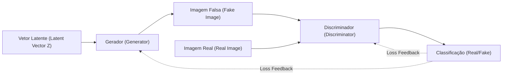
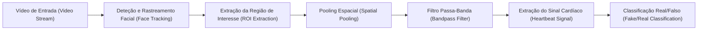
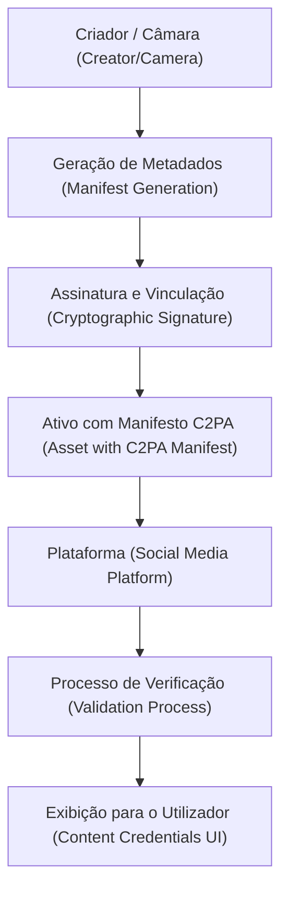

# Introdução: A Era em que as Fronteiras entre a Realidade e a Ficção se Dissolvem

Ao entrarmos na década de 2020, a evolução da IA generativa (Generative AI) avançou a um ritmo sem precedentes. Textos, áudios, imagens e até mesmo vídeos que são indistinguíveis dos conteúdos criados por humanos podem agora ser gerados em apenas alguns segundos. Embora este salto tecnológico traga enormes benefícios aos campos criativos, também cria uma séria ameaça social: a proliferação de conteúdos falsificados sofisticados conhecidos como "Deepfakes".

Os deepfakes ameaçam a sociedade de várias formas, incluindo falsos discursos de políticos, esquemas em que se fazem passar por CEOs de empresas (uma evolução das fraudes BEC) e pornografia difamatória visando celebridades. Especialmente durante os períodos eleitorais, a propagação de notícias falsas geradas por deepfakes escalou a ponto de abalar os próprios alicerces da democracia.

Numa era como esta, o que é exigido de nós é uma atualização na "literacia da informação". O senso comum de que "devemos acreditar no que vemos com os nossos próprios olhos" já não se aplica. Este artigo começará pelos fundamentos técnicos de como os deepfakes são gerados, para de seguida passar para as técnicas de ponta de perícia digital (digital forensics) que os conseguem detetar "tecnicamente", e finalmente discutirá a estrutura que permite à sociedade como um todo combater a desinformação (como a C2PA). Exploraremos esses tópicos num nível extremamente profundo, cruzando equações e códigos ao longo do caminho.

---

# 1. Os Mecanismos da IA Generativa que Sustentam os Deepfakes

Para compreender os deepfakes, precisamos primeiro de perceber como funcionam as IAs generativas fundamentais. Atualmente, as duas principais arquiteturas utilizadas na geração de imagens e vídeos de alta definição são as Redes Adversárias Generativas (GAN - Generative Adversarial Networks) e os Modelos de Difusão (Diffusion Models).

## 1.1 Redes Adversárias Generativas (GAN)

Propostas por Ian Goodfellow e os seus colegas em 2014, as GANs serviram como faísca para a tecnologia dos deepfakes. Numa GAN, duas redes neuronais assumem o papel de um "falsificador" e de um "polícia", competindo entre si (aprendizagem adversária) para gerar dados altamente realistas.

- **Gerador (Generator, $G$)**: Recebe um ruído aleatório (variável latente $z$) como entrada e produz dados muito semelhantes aos reais (como uma imagem).
- **Discriminador (Discriminator, $D$)**: Determina se os dados de entrada são "Reais (Real)", provenientes de um conjunto de dados autêntico, ou "Falsos (Fake)", criados pelo gerador.

Estas duas redes progridem no seu treino otimizando uma função de perda formulada como o seguinte jogo Minimax:

$$
\min_G \max_D V(D, G) = \mathbb{E}_{x \sim p_{data}(x)}[\log D(x)] + \mathbb{E}_{z \sim p_{z}(z)}[\log(1 - D(G(z)))]
$$

Aqui, $x$ representa dados reais, e $z$ é a variável latente (ruído). O discriminador $D$ tenta maximizar esta equação (distinguindo com precisão o real do falso), enquanto o gerador $G$ tenta minimizá-la (enganando o discriminador). Quando este treino atinge um estado de equilíbrio (Equilíbrio de Nash), o gerador consegue produzir dados indistinguíveis dos originais.



## 1.2 Modelos de Difusão (Diffusion Models)

Nos últimos anos, a tecnologia que ostenta qualidade e estabilidade de imagem superiores às GANs, e que serve como base para plataformas como o Midjourney e o Stable Diffusion, são os "Modelos de Difusão". Os modelos de difusão consistem num "processo de difusão direto", que gradualmente adiciona ruído aos dados, e num "processo de difusão reverso", que restaura os dados originais a partir do ruído.

No **processo de difusão direto (Forward Process)**, ruído Gaussiano é gradualmente adicionado a uma imagem limpa $x_0$ a cada passo de tempo $t$. Este processo é representado como uma cadeia de Markov através da seguinte fórmula:

$$
q(x_t | x_{t-1}) = \mathcal{N}(x_t; \sqrt{1 - \beta_t} x_{t-1}, \beta_t \mathbf{I})
$$

Aqui, $\beta_t$ é um parâmetro de agendamento que controla a variância do ruído. Após passos suficientes $T$, a imagem $x_T$ transforma-se em ruído aleatório completo.

No **processo de difusão reverso (Reverse Process)**, uma rede neuronal (geralmente com uma arquitetura U-Net) aprende a prever o ruído a partir da imagem ruidosa $x_t$ para restaurar o passo anterior $x_{t-1}$. Combinar este processo com o condicionamento (como um prompt de texto) torna possível gerar qualquer imagem a partir do zero (ruído).

---

# 2. Perícia Digital: Explorando as Marcas das Criações Generativas

Por mais avançados que os modelos generativos se tornem, os dados gerados pela IA deixam sempre "vestígios matemáticos e estatísticos" (artefactos) que são invisíveis ao olho humano. As tecnologias de deteção (detetores de deepfakes) utilizam diversas abordagens para captar estas marcas minúsculas.

## 2.1 Análise no Domínio da Frequência e DCT (Transformada Discreta de Cosseno)

O olho humano é sensível a alterações espaciais na cor ou no brilho de uma imagem (domínio espacial), mas é insensível a mudanças de frequência (domínio da frequência). Embora as imagens geradas por GANs ou modelos de difusão possam parecer perfeitas à primeira vista, o processo de upsampling (ampliar de baixa para alta resolução) cria padrões de frequência únicos (como artefactos em padrão de xadrez).

O método mais utilizado para detetar isto é a **Transformada Discreta de Cosseno (Discrete Cosine Transform, DCT)**. A DCT expressa uma imagem como a soma de ondas de cosseno com diferentes frequências. A equação para a DCT bidimensional é a seguinte:

$$
X_{k_1, k_2} = \sum_{n_1=0}^{N_1-1} \sum_{n_2=0}^{N_2-1} x_{n_1, n_2} \cos\left[\frac{\pi}{N_1}\left(n_1 + \frac{1}{2}\right)k_1\right] \cos\left[\frac{\pi}{N_2}\left(n_2 + \frac{1}{2}\right)k_2\right]
$$

As imagens geradas tendem a apresentar uma distribuição de energia invulgar nos seus **componentes de alta frequência (ruídos finos ou mudanças abruptas em bordas)** em comparação com imagens naturais. O código Python abaixo demonstra uma forma simples de utilizar a DCT para extrair a energia dos componentes de alta frequência de uma imagem.

```python
import cv2
import numpy as np
import scipy.fftpack

def extract_high_frequency_features(image_path):
    # Carregar a imagem e convertê-la para tons de cinza
    img = cv2.imread(image_path, cv2.IMREAD_GRAYSCALE)
    if img is None:
        raise ValueError("Image not found")
    
    # Aplicar a Transformada Discreta de Cosseno (DCT) 2D
    # Primeiro aplica-se a DCT 1D nas linhas e, em seguida, a DCT 1D nas colunas
    dct_result = scipy.fftpack.dct(scipy.fftpack.dct(img.T, norm='ortho').T, norm='ortho')
    
    # Extrair os componentes de alta frequência (mascarando a região de baixa frequência superior esquerda como zero)
    rows, cols = dct_result.shape
    mask = np.ones((rows, cols))
    
    # Mascarar a região de baixa frequência (10% de toda a área)
    mask[:int(rows*0.1), :int(cols*0.1)] = 0
    
    high_freq_features = dct_result * mask
    
    # Calcular a quantidade de energia na região de alta frequência
    energy = np.sum(np.abs(high_freq_features))
    
    return energy

# Ao comparar imagens naturais com imagens geradas, verifica-se frequentemente uma diferença estatística significativa no valor de energy
```

Esta irregularidade no domínio da frequência ocorre porque, embora a IA possa aprender a "consistência local ao nível dos píxeis", ela tem dificuldade em imitar perfeitamente as "características globais de frequência" de toda a imagem.

---

# 3. Deteção através de Sinais Biométricos: Verificando a "Pulsação da Vida" usando rPPG

Além das técnicas de deteção de imagens (estáticas), uma abordagem revolucionária para detetar deepfakes em vídeos é a **extração de sinais biométricos (Biological [Signals](https://kenji.blog/pt/p/state-management-history-future/))**.

Enquanto os seres humanos estão vivos, o sangue circula nos seus corpos em sincronia com as batidas do coração. Como a hemoglobina no sangue absorve muito bem certos comprimentos de onda de luz (especificamente a luz verde, em torno de 530 nm), a cor da pele facial muda ligeiramente (a um nível invisível aos olhos humanos) a cada batimento cardíaco. A tecnologia que utiliza este princípio para estimar a frequência cardíaca remotamente a partir de imagens normais de câmaras RGB é denominada **rPPG (Fotopletismografia Remota, do inglês remote Photoplethysmography)**.

O modelo fundamental da rPPG com base na absorção e reflexão da luz é expresso pela lei de Beer-Lambert da seguinte forma:

$$
I(t) = I_0(t) e^{-\left( \mu_{dc} + \mu_{ac}(t) \right) d}
$$

Aqui, $I(t)$ é a intensidade da luz captada pela câmara, $I_0(t)$ é a intensidade da fonte de luz, $\mu_{dc}$ é o coeficiente estático de absorção de luz dos tecidos, $\mu_{ac}(t)$ é o coeficiente dinâmico de absorção de luz resultante do fluxo sanguíneo (batimento cardíaco), e $d$ é a distância do trajeto da luz.

Os vídeos deepfake (como as trocas de rostos - FaceSwap - ou a sincronização labial num ficheiro de áudio - Lip-sync) privilegiam o realismo visual frame a frame, mas **não conseguem reproduzir as subtis flutuações do fluxo sanguíneo (sinal de batimento cardíaco) ao longo do tempo.** Por conseguinte, ao tentarmos extrair sinais rPPG de um vídeo deepfake, obtemos tipicamente um sinal anormal, cheio de ruído, desprovido do ciclo regular do ritmo cardíaco humano autêntico (geralmente entre as 60 e as 100 bpm).



Abaixo está um exemplo conceptual de um pipeline implementado em Python para a extração do sinal rPPG de um vídeo:

```python
import cv2
import numpy as np
from scipy import signal

def extract_rppg_signal(video_path):
    cap = cv2.VideoCapture(video_path)
    green_signals = []
    
    while cap.isOpened():
        ret, frame = cap.read()
        if not ret:
            break
            
        # 1. Deteção facial e extração da ROI (Região de Interesse, ex: testa ou bochechas)
        # roi = detect_face_and_extract_roi(frame)
        # Aqui, para simplificar, a parte central do frame será usada como ROI
        h, w = frame.shape[:2]
        roi = frame[int(h*0.3):int(h*0.6), int(w*0.4):int(w*0.6)]
        
        # 2. Extrair o canal Verde a partir do espaço RGB
        # A hemoglobina no sangue absorve mais fortemente a luz verde
        g_channel = roi[:, :, 1]
        
        # 3. Pooling espacial (cálculo do valor médio)
        mean_g = np.mean(g_channel)
        green_signals.append(mean_g)
        
    cap.release()
    
    if len(green_signals) == 0:
        return None
        
    # 4. Remoção de ruído usando um filtro passa-banda
    # Extrair a faixa de frequência da frequência cardíaca humana (ex: 0.7Hz a 2.5Hz = 42 a 150 bpm)
    fps = 30.0 # Framerate provisório
    nyquist = 0.5 * fps
    low = 0.7 / nyquist
    high = 2.5 / nyquist
    b, a = signal.butter(3, [low, high], btype='bandpass')
    filtered_signal = signal.filtfilt(b, a, green_signals)
    
    return filtered_signal

# Ao analisar o espetro de frequências do filtered_signal extraído,
# caso não exista um pico claro (batimento cardíaco), julga-se que a probabilidade
# de se tratar de um deepfake é bastante elevada.
```

---

# 4. O Infinito "Jogo do Gato e do Rato": Aprendizagem Adversária e Técnicas de Evasão

Como vimos, existem técnicas forenses avançadas como a análise no domínio da frequência e os sinais biométricos (rPPG). No entanto, não existem "barreiras intransponíveis" no mundo da Inteligência Artificial. Logo que uma nova técnica de deteção é publicada em formato de artigo científico, os atacantes (criadores de deepfakes) começam imediatamente a atualizar os seus modelos geradores para a contornar.

Por exemplo, considere que um detetor consegue descobrir um deepfake analisando "anomalias no domínio da frequência". O atacante **integrará o próprio detetor como o novo "Discriminador (Discriminator)"** da GAN e fará o Gerador (Generator) reaprender a tarefa. Consequentemente, o gerador evoluirá e começará a emitir imagens "que no domínio da frequência são indistinguíveis das imagens naturais".

Para além disso, já existem estudos de investigação (Anti-Forensics) que tentam enganar sistemas de deteção baseados em rPPG, adicionando deliberadamente "mudanças subtis de cor (um sinal de batimento cardíaco falso)" ao vídeo numa fase de pós-processamento.

A deteção e a geração estão a envolver-se num interminável "jogo do gato e do rato" (Cat-and-Mouse Game) - uma autêntica guerra entre o escudo e a lança. Por esta razão, os peritos alertam que a abordagem passiva, onde apenas os dados emitidos (imagens ou vídeos) são analisados posteriormente para determinar a sua autenticidade, acabará inevitavelmente por atingir os seus limites.

---

# 5. Contramedidas Fundamentais: Prova de Proveniência e a Estrutura C2PA

À medida que a deteção passiva se aproxima dos seus limites, uma abordagem de defesa ativa que garanta criptograficamente a origem (Provenance) dos dados está a ser rapidamente promovida a nível mundial. A infraestrutura internacional que está a regulamentar isto chama-se **C2PA (Coalition for Content Provenance and Authenticity)**.

A C2PA foi criada através de um consórcio com a participação de grandes corporações como a Adobe, Microsoft, Intel, BBC e Sony. A organização estabelece especificações técnicas para incorporar o histórico de criação do conteúdo (quem o produziu, quando, que câmara captou a imagem e quais edições sofreu) no próprio ficheiro, utilizando um formato à prova de falsificações.

## 5.1 O Mecanismo da C2PA

As tecnologias principais da C2PA são a assinatura digital por via de Infraestrutura de Chave Pública (PKI) e a vinculação através de hash criptográfico dos conteúdos.

1. **Geração de Metadados (Manifest)**: No exato momento em que uma fotografia é tirada por uma câmara, ou quando é alterada via software, um pacote de metadados denominado "Manifesto (Manifest)" é criado. Este pacote inclui o histórico das operações, a informação do dispositivo e as credenciais do criador.
2. **Assinatura Criptográfica ([Digital Signature](https://kenji.blog/pt/p/modern-cryptography-public-key-hash-signature/))**: É então aplicada uma assinatura digital ao manifesto (Manifest) com recurso às chaves privadas do hardware ou do software. Ao mesmo tempo, um processo semelhante ocorre sob a chave gerada através da síntese estruturada da própria imagem - o valor hash (o resumo fidedigno dos píxeis apresentados).
3. **Incorporação (Embedding) no Ativo**: O manifesto assinado (Credencial C2PA) é inserido nos cabeçalhos de ficheiros de formatos vulgares, como JPEG e MP4.

Se um atacante tentar manipular uma porção da imagem ou juntar metadados forjados a uma representação criada via IA, o hash primário subjacente à própria imagem revelará disparidades irreversíveis. Como tal, a verificação da assinatura digital irá falhar sistematicamente, evidenciando de modo transparente a adulteração instantes depois de ocorrer.



## 5.2 Transparência via Ícones "Content Credentials"

Num sistema compatível com o padrão C2PA, sempre que um utilizador vir uma imagem nas redes sociais ou num site de notícias, será exibido um ícone "CR" (Content Credentials) no canto da imagem. Ao clicar no ícone, qualquer pessoa pode verificar, de forma transparente, o histórico daquela imagem: se "foi gerada por uma IA", se "foi capturada por uma câmara fotográfica real", ou até se "as cores foram ajustadas utilizando o Photoshop".

Atualmente, infraestruturas tecnológicas dominantes (vendors de IA) como a OpenAI (DALL-E 3) e a Google estão ativamente a emitir imagens e conteúdos digitais onde a incorporação de metadados orientados pela arquitetura C2PA já consta das predefinições de origem. Produtores primários notáveis de equipamento fotográfico (as câmaras), encabeçados de forma visível por gigantes como a Leica e a Sony, acolheram esta progressão para garantirem funções de assinatura C2PA em conformidade já implementadas nos dispositivos (a nível de hardware). Não se trata de uma progressão reativa que tem como objetivo essencial "tentar decifrar ou identificar o falso", mas sim migrar em massa para um ecossistema com capacidade intrínseca de "comprovar sem ambiguidades o que é autêntico (Abordagem Zero-Trust)". Desta forma notória e global, é evidente que a visão dominante da nossa sociedade tem alterado os seus paradigmas para a transparência do futuro.

---

# 6. Literacia da Informação de Próxima Geração: O Que Podemos Fazer

As medidas técnicas (como os detetores de deepfakes ou a prova de proveniência através da C2PA) são meras infraestruturas para proteger a sociedade. Em última análise, quem decide se consome e difunde a informação é o nosso cérebro humano.

A "literacia da informação" de próxima geração na era da IA significa adotar a seguinte postura:

1. **Evitar a difusão por impulso (Stop and Think)**
   Especialmente quando se deparar com imagens chocantes ou conteúdos que incitam à raiva (informação que apela às emoções), deve parar e reter-se de republicar ou partilhar. O principal objetivo dos criadores de deepfakes é manipular as emoções humanas para espalhar informação.
2. **Confirmar a "fonte" da informação (Verify the Source)**
   A informação provém de uma organização de notícias fiável? Possui provas de proveniência (Content Credentials), como as estipuladas pela C2PA? É crucial criar o hábito de cruzar dados e verificar as fontes da informação.
3. **Um ceticismo saudável de que "tudo pode ser falso" (Healthy Skepticism)**
   Não há necessidade de ser pessimista, mas o velho senso comum de que "vídeo = facto" deve ser descartado. Precisamos de consumir informação partindo do princípio de que vivemos numa era onde áudio, vídeo e texto podem ser todos facilmente forjados.

# Conclusão

A evolução da tecnologia de IA abriu a caixa de Pandora. Já não é possível apagar a própria tecnologia que gera os deepfakes.

No entanto, como explicado neste artigo, os tecnólogos estão a combater a ameaça das notícias falsas com diversas abordagens: análise de frequência, deteção de sinais biométricos e prova de proveniência (C2PA) baseada em criptografia. Ao combinar este escudo tecnológico (medida defensiva) com o escudo social da "literacia da informação" de cada indivíduo, deveremos ser capazes de navegar pelas ondas da ficção criadas pela IA e proteger o valor da verdade.

É precisamente porque vivemos numa época em que as fronteiras entre realidade e ficção se dissolvem que a "vontade" humana de discernir a verdade tornou-se mais importante do que nunca.


